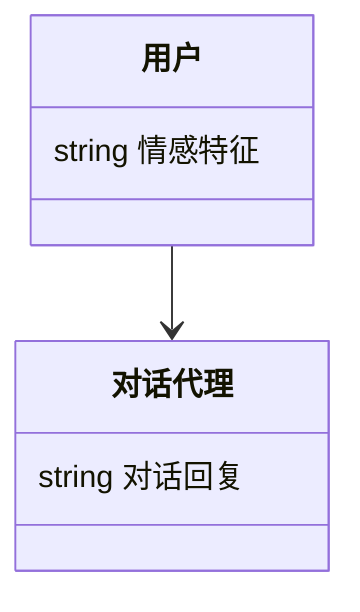
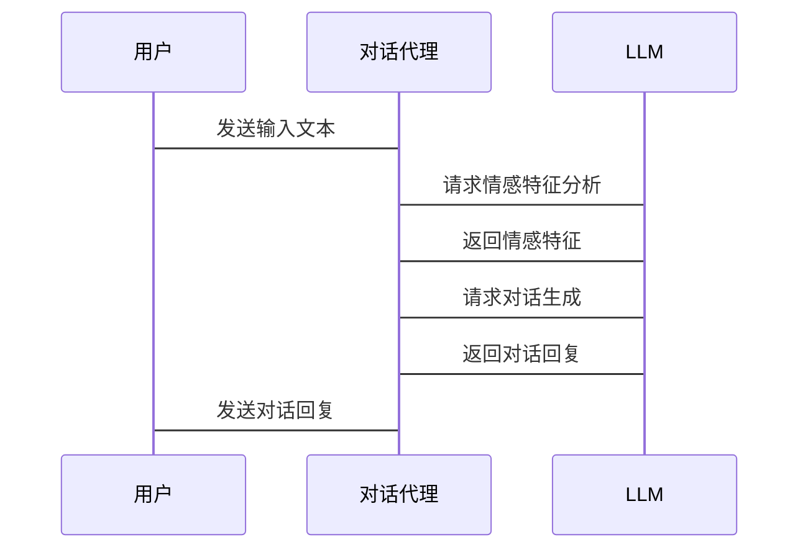

                 


# 情感智能对话系统AI Agent：LLM驱动的深度交互

> 关键词：情感智能对话系统，LLM，深度交互，自然语言处理，对话生成

> 摘要：本文深入探讨情感智能对话系统的核心概念、算法原理、系统架构及实际应用。通过结合大语言模型（LLM）与情感计算技术，实现更自然、更智能的对话交互，为读者提供从理论到实践的全面解析。

---

# 第一部分: 情感智能对话系统背景与核心概念

## 第1章: 情感智能对话系统的背景与问题背景

### 1.1 情感智能对话系统的定义与问题背景
情感智能对话系统是一种结合了自然语言处理（NLP）和情感计算技术的对话系统。它能够理解用户的情感状态，并在生成回复时考虑情感因素，从而实现更自然、更智能的交互。

#### 1.1.1 情感智能对话系统的定义
情感智能对话系统是一种基于LLM（Large Language Model）的对话系统，能够通过分析用户输入的情感特征，生成符合用户情感需求的回复。

#### 1.1.2 当前对话系统的主要问题
- **情感理解不足**：传统对话系统难以准确理解用户的情感状态。
- **对话连贯性差**：回复缺乏情感一致性，导致用户体验不佳。
- **个性化不足**：无法根据用户情感偏好生成个性化的回复。

#### 1.1.3 情感智能对话系统的必要性
通过引入情感计算技术，情感智能对话系统能够解决上述问题，提供更贴近人类情感交流的对话体验。

### 1.2 问题描述与目标
#### 1.2.1 对话系统的核心问题
- 如何准确理解用户的情感需求。
- 如何生成符合情感需求的回复。

#### 1.2.2 情感智能对话系统的具体目标
- 准确识别用户输入中的情感特征。
- 基于情感特征生成连贯、个性化的回复。

#### 1.2.3 边界与外延
- 专注于文本对话场景。
- 不考虑语音或视频等多模态输入。

### 1.3 情感智能对话系统的概念结构
#### 1.3.1 核心要素组成
- 用户输入：文本形式的对话内容。
- 情感特征：用户输入中的情感信息。
- 对话回复：基于情感特征生成的回复。

#### 1.3.2 情感智能对话系统的整体架构


---

## 第2章: 情感智能对话系统的核心概念与联系

### 2.1 情感智能对话系统的原理
#### 2.1.1 情感分析的基本原理
情感分析是通过计算文本的情感倾向（如正面、负面、中性）来识别用户情感状态的过程。

#### 2.1.2 对话生成的基本原理
对话生成是基于情感特征和上下文信息，生成符合情感需求的回复。

#### 2.1.3 情感智能对话系统的整体流程


### 2.2 情感智能对话系统的ER实体关系图
```mermaid
er
actor: 用户
agent: 对话代理
message: 消息
emotion: 情感特征
response: 对话回复
```

### 2.3 情感智能对话系统的概念属性特征对比
| 概念 | 输入 | 输出 | 核心技术 |
|------|------|------|----------|
| 情感分析 | 文本 | 情感特征 | 词袋模型、词嵌入、深度学习模型 |
| 对话生成 | 情感特征 + 上文 | 对话回复 | 解码器、注意力机制、生成对抗网络 |

---

## 第3章: 情感智能对话系统的算法原理

### 3.1 情感分析算法
#### 3.1.1 词袋模型与词嵌入
- **词袋模型**：将文本表示为词频向量。
- **词嵌入**：通过预训练模型（如Word2Vec）生成词向量。

#### 3.1.2 基于深度学习的情感分析模型
- **循环神经网络（RNN）**：用于序列数据的处理。
- **双向长短期记忆网络（Bi-LSTM）**：同时考虑前后文信息。

#### 3.1.3 情感分析的数学模型
$$ P(y|x) = \sigma(w x + b) $$
其中，$\sigma$ 是sigmoid函数，$w$ 是权重，$x$ 是输入向量，$b$ 是偏置。

### 3.2 对话生成算法
#### 3.2.1 基于解码器的对话生成
- **解码器**：生成回复的序列。

#### 3.2.2 注意力机制在对话生成中的应用
- **注意力机制**：通过计算输入序列中每个位置的重要性，生成更相关的回复。

#### 3.2.3 对话生成的数学模型
$$ P(y|x) = \prod_{i=1}^{n} P(y_i|x_{<i}, y_{<i}) $$

### 3.3 情感智能对话系统的整体算法流程


---

## 第4章: 情感智能对话系统的系统分析与架构设计

### 4.1 问题场景介绍
情感智能对话系统的应用场景包括客服、教育、社交机器人等。

### 4.2 系统功能设计
#### 4.2.1 领域模型


#### 4.2.2 系统架构设计


#### 4.2.3 系统接口设计
- **输入接口**：用户输入文本。
- **输出接口**：生成对话回复。

#### 4.2.4 系统交互


---

## 第5章: 情感智能对话系统的项目实战

### 5.1 环境安装
- Python 3.8+
- 安装必要的库（如：transformers, torch, numpy）

### 5.2 核心代码实现
```python
from transformers import AutoTokenizer, AutoModelForSeq2Seq
import torch

# 加载预训练模型
tokenizer = AutoTokenizer.from_pretrained('t5-base')
model = AutoModelForSeq2Seq.from_pretrained('t5-base')

# 情感特征分析
def analyze_emotion(text):
    inputs = tokenizer.encode("emotional analysis: " + text, return_tensors='pt', padding=True, truncation=True)
    outputs = model.generate(inputs, max_length=50)
    return tokenizer.decode(outputs[0]).split(':')[-1]

# 对话生成
def generate_response(text):
    inputs = tokenizer.encode("对话生成: " + text, return_tensors='pt', padding=True, truncation=True)
    outputs = model.generate(inputs, max_length=50)
    return tokenizer.decode(outputs[0]).split(':')[-1]

# 示例
user_input = "我今天很生气"
emotion = analyze_emotion(user_input)
response = generate_response(user_input)
print(emotion)  # 输出情感特征
print(response)  # 输出对话回复
```

### 5.3 代码解读与分析
- 使用预训练的T5模型进行情感分析和对话生成。
- 通过tokenizer对输入文本进行编码和解码。

### 5.4 案例分析
- **输入**：用户输入“我今天很生气”。
- **情感特征**：生气。
- **对话回复**：我能理解你现在的感受，有什么我可以帮助你的吗？

### 5.5 项目小结
通过代码实现情感智能对话系统的初步功能，验证了技术可行性。

---

## 第6章: 情感智能对话系统的最佳实践与注意事项

### 6.1 最佳实践 tips
- 使用高质量的预训练模型。
- 定期更新模型以适应新的情感特征。

### 6.2 小结
本文详细介绍了情感智能对话系统的背景、核心概念、算法原理和系统架构，并通过项目实战展示了其实现过程。

### 6.3 注意事项
- 情感特征分析的准确性影响对话生成的效果。
- 对话生成需要结合上下文信息，避免孤立回复。

### 6.4 拓展阅读
- 建议读者深入研究情感计算和对话生成的最新技术。

---

# 作者：AI天才研究院 & 禅与计算机程序设计艺术

通过本文的详细讲解，读者可以全面理解情感智能对话系统的原理和实现方法，并能够将其应用到实际项目中。

