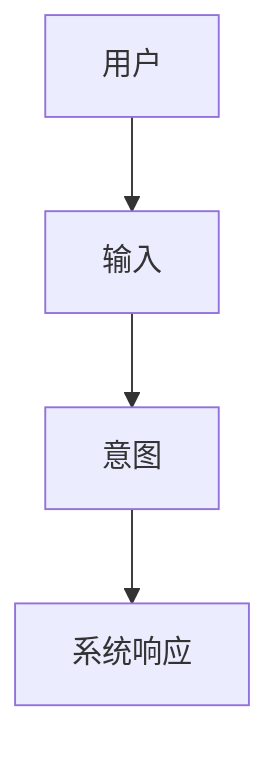
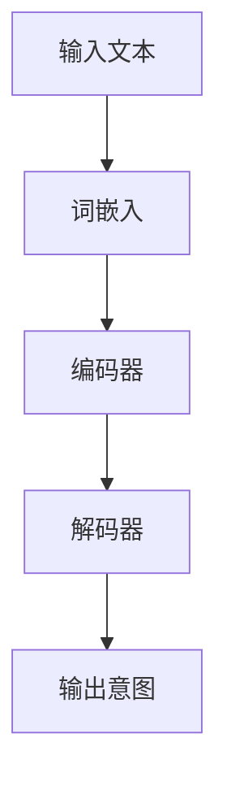

                 


# 意图识别：准确把握用户需求

## 关键词
- 意图识别
- 自然语言处理
- 深度学习
- 机器学习
- 模型训练
- 系统架构

## 摘要
意图识别是自然语言处理领域中的关键任务，旨在准确理解用户输入的文本背后的意图。本文详细探讨意图识别的核心概念、算法原理、系统架构及项目实战，结合Mermaid图表和数学公式，帮助读者全面掌握意图识别的技术要点。文章涵盖从理论到实践的各个环节，旨在为读者提供系统化的知识体系和实用的技术指导。

---

## 第一部分：意图识别背景与核心概念

### 第1章：意图识别问题背景

#### 1.1 问题背景与描述

- **用户需求理解的重要性**：在人机交互中，准确理解用户意图是实现有效沟通的基础。意图识别能够帮助系统准确解析用户的意图，从而提供更精准的服务。
- **意图识别的定义与目标**：意图识别是指通过分析用户输入的文本或语音，确定用户希望系统执行的操作或需求的过程。其目标是将用户的自然语言输入映射到预定义的意图类别上。
- **意图识别的应用场景**：广泛应用于智能助手、对话系统、电子商务推荐、客服系统等领域，帮助系统更好地满足用户需求。

#### 1.2 意图识别的解决方法

- **自然语言处理的作用**：NLP技术用于处理和理解用户输入的文本，提取关键信息和意图。
- **机器学习的应用**：利用监督学习、无监督学习等方法训练模型，识别用户意图。
- **深度学习的优势**：通过神经网络模型（如CNN、RNN、BERT等）提高意图识别的准确性和鲁棒性。

#### 1.3 意图识别的边界与外延

- **意图识别的适用范围**：适用于明确的用户需求场景，如命令式指令、问题解答等。
- **相关概念的区分**：与情感分析、实体识别的区别在于，意图识别关注用户希望系统执行的动作或需求，而情感分析关注用户情绪，实体识别关注文本中的具体对象。
- **意图识别的局限性**：在处理模糊表达、多意图混合等情况时可能存在挑战。

#### 1.4 意图识别的核心要素与概念结构

- **用户输入的类型与特征**：包括文本、语音等，特征包括关键词、句式结构等。
- **意图的分类与层次**：意图可以分为一级意图（如查询信息）和二级意图（如查询天气）。
- **意图识别系统的组成**：包括输入模块、处理模块、输出模块。

---

## 第二部分：意图识别的核心概念与联系

### 第2章：意图识别的核心概念原理

#### 2.1 意图识别的核心原理

- **基于规则的意图识别**：通过预定义的规则和关键词匹配用户的输入，适用于简单的意图识别场景。
- **基于统计的意图识别**：利用概率模型（如朴素贝叶斯）统计用户输入的特征，计算意图的概率。
- **基于深度学习的意图识别**：使用神经网络模型（如LSTM、Transformer）学习文本的深层特征，提高准确性。

#### 2.2 意图识别的核心要素对比

- **不同意愿识别方法的特征对比**：
  | 方法类型       | 优点                              | 缺点                              |
  |----------------|-----------------------------------|-----------------------------------|
  | 基于规则       | 实现简单，易于解释                | 需要大量手动规则，难以应对复杂场景 |
  | 基于统计       | 能处理部分复杂场景，性能较好       | 对特征工程依赖较高                |
  | 基于深度学习    | 高准确性，能处理复杂场景          | 实现复杂，需要大量数据和计算资源   |

- **各种模型的优缺点分析**：
  - 基于规则：适用于简单场景，但灵活性差。
  - 基于统计：性能稳定，但依赖特征工程。
  - 基于深度学习：准确性高，但需要大量数据和计算资源。

- **模型性能的评估指标**：
  - 准确率（Accuracy）
  - 召回率（Recall）
  - F1分数（F1 Score）

#### 2.3 意图识别的ER实体关系图



---

## 第三部分：意图识别的算法原理与数学模型

### 第3章：意图识别算法原理

#### 3.1 基于深度学习的意图识别流程



#### 3.2 意图识别的数学模型

- **词嵌入模型（如Word2Vec）**：
  - 将单词映射到低维向量空间。
  - 使用Skip-Gram或CBOW模型训练。

- **编码器-解码器结构**：
  - 编码器将输入文本转换为固定长度的向量。
  - 解码器根据编码结果生成输出意图。

- **注意力机制（如BERT）**：
  - 在编码过程中引入注意力机制，关注重要单词或词组。

#### 3.3 意图识别的损失函数与优化

- **交叉熵损失函数**：
  $$\text{损失函数} = -\sum_{i=1}^{n} y_i \log(p_i) + (1-y_i)\log(1-p_i)$$
- **梯度下降优化方法**：
  - 使用Adam优化器，调整学习率，优化模型参数。

---

## 第四部分：意图识别的系统分析与架构设计

### 第4章：意图识别系统分析

#### 4.1 问题场景介绍

- **用户需求分析**：用户希望系统能够准确理解其输入的意图，并执行相应的操作。
- **系统目标设定**：设计一个高效的意图识别系统，能够处理多种输入形式，并准确分类意图。

#### 4.2 系统功能设计

- **领域模型**：
  ```mermaid
  classDiagram
      class 用户 {
          输入文本
      }
      class 系统 {
          分析意图
          生成响应
      }
      用户 --> 系统: 提交请求
      系统 --> 用户: 返回结果
  ```

- **系统架构设计**：
  ```mermaid
  graph TD
      A[前端] --> B[后端API]
      B --> C[意图识别模型]
      C --> D[数据库]
  ```

- **系统接口设计**：
  - 用户输入接口：接收文本或语音输入。
  - 系统输出接口：返回意图分类结果或执行操作。

- **系统交互设计**：
  ```mermaid
  sequenceDiagram
      用户 -> 系统: 发送输入
      系统 -> 模型: 分析意图
      模型 -> 系统: 返回意图结果
      系统 -> 用户: 显示结果
  ```

---

## 第五部分：意图识别的项目实战

### 第5章：意图识别项目实战

#### 5.1 环境安装

- **安装Python环境**：推荐使用Anaconda或virtualenv管理环境。
- **安装相关库**：
  ```bash
  pip install numpy
  pip install pandas
  pip install scikit-learn
  pip install transformers
  ```

#### 5.2 核心代码实现

- **数据预处理**：
  ```python
  import numpy as np
  from sklearn.model_selection import train_test_split
  from sklearn.metrics import accuracy_score
  ```

- **模型训练**：
  ```python
  from sklearn.svm import SVC
  model = SVC()
  model.fit(X_train, y_train)
  ```

- **模型评估**：
  ```python
  y_pred = model.predict(X_test)
  print("准确率:", accuracy_score(y_test, y_pred))
  ```

#### 5.3 案例分析与解读

- **案例场景**：用户输入“今天北京天气怎么样？”
- **意图分类**：查询天气。
- **系统响应**：调用天气API，返回天气信息。

#### 5.4 项目小结

- **项目总结**：意图识别项目通过数据预处理、模型训练和评估，成功实现了意图分类。
- **经验分享**：数据质量、特征工程和模型调优对最终结果影响较大。

---

## 第六部分：意图识别的最佳实践与小结

### 第6章：最佳实践与小结

#### 6.1 最佳实践

- **数据处理**：确保数据多样化，避免过拟合。
- **模型选择**：根据任务需求选择合适的模型。
- **性能优化**：使用交叉验证、网格搜索等方法优化模型参数。

#### 6.2 小结

- 意图识别是自然语言处理中的重要任务，通过本文的学习，读者可以掌握意图识别的核心概念、算法原理和系统架构设计。
- 在实际项目中，需要结合具体场景选择合适的模型，并进行充分的测试和优化。

#### 6.3 注意事项

- 数据隐私：确保用户数据的安全和隐私。
- 模型鲁棒性：增强模型对噪声输入的处理能力。
- 可扩展性：设计可扩展的系统架构，方便后续功能扩展。

#### 6.4 拓展阅读

- 推荐书籍：《自然语言处理入门》、《深度学习入门》。
- 推荐论文：阅读最新的意图识别相关论文，了解前沿技术。

---

## 作者

作者：AI天才研究院 & 禅与计算机程序设计艺术

---

以上是《意图识别：准确把握用户需求》的完整目录和内容概要，涵盖了从理论到实践的各个方面，结合实际案例和最佳实践，帮助读者全面掌握意图识别技术。

