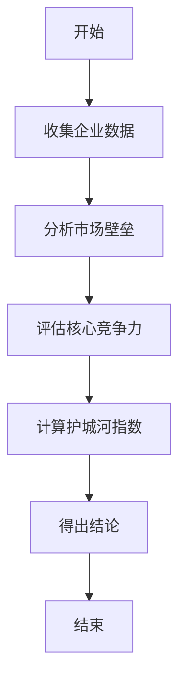
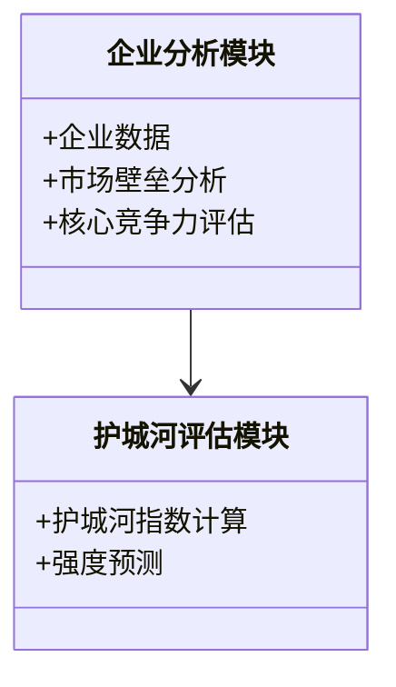
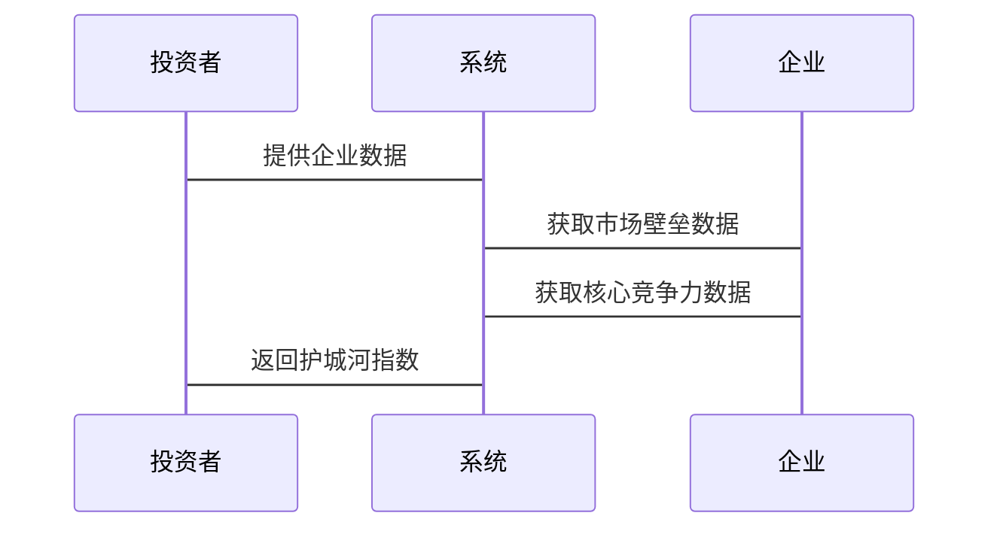

                 


# 《戴维·多德的护城河评估体系》

---

## 关键词：护城河评估，企业竞争优势，多德理论，投资分析，数学模型

---

## 摘要：  
护城河是企业在市场竞争中建立长期竞争优势的核心策略。本文深入探讨戴维·多德提出的护城河评估体系，从理论基础、数学模型、系统架构到实际应用，全面解析如何通过护城河评估识别企业价值，优化投资决策。文章结合实例和代码实现，帮助读者掌握护城河评估的全过程。

---

# 第1章: 护城河评估体系的背景与核心概念

## 1.1 护城河概念的提出

### 1.1.1 护城河概念的起源与演进  
护城河最初来源于军事防御概念，指围绕重要资源或战略点建立的屏障。在商业领域，护城河指企业通过资源、技术、品牌或市场准入壁垒，阻止竞争对手侵入市场的能力。戴维·多德将这一概念引入投资分析，提出了系统的护城河评估体系，为企业识别和量化竞争优势提供理论支持。

### 1.1.2 护城河在企业投资分析中的重要性  
护城河是企业长期价值的核心驱动因素。在投资决策中，护城河评估帮助投资者识别具备持续竞争优势的企业，从而做出更明智的投资选择。多德的体系强调企业护城河的深度、宽度和可持续性，为投资者提供了量化评估工具。

### 1.1.3 多德对护城河理论的贡献  
戴维·多德通过引入数学模型和系统评估方法，将护城河理论从定性分析提升到定量分析阶段。他提出了护城河指数（Moat Index）的概念，通过量化指标评估企业护城河的强度和可持续性。

---

## 1.2 问题背景与问题描述

### 1.2.1 企业竞争优势的核心要素  
企业在市场竞争中获胜的关键在于其独特优势，包括技术壁垒、品牌影响力、成本优势等。然而，这些优势并非一成不变，竞争对手可能通过创新或模仿削弱企业的护城河。

### 1.2.2 护城河在企业长期价值中的作用  
护城河决定了企业的市场地位和盈利能力。具备强大护城河的企业能够在市场中长期保持竞争优势，为股东创造持续价值。多德的护城河评估体系为企业和投资者提供了量化护城河强度的工具。

### 1.2.3 多德护城河评估体系的目标与边界  
多德的目标是通过量化分析，识别具备强大护城河的企业，帮助投资者做出更明智的投资决策。其边界包括企业核心竞争力分析、市场壁垒评估和护城河可持续性预测。

---

## 1.3 问题解决与护城河评估的意义

### 1.3.1 通过护城河评估识别企业竞争优势  
护城河评估帮助企业识别核心竞争优势，优化资源配置，提升市场竞争力。

### 1.3.2 护城河评估在投资决策中的应用  
投资者通过护城河评估，识别具备长期竞争优势的企业，降低投资风险。

### 1.3.3 护城河评估体系的局限性与适用场景  
护城河评估依赖于假设条件，可能存在模型偏差。其适用于企业生命周期的稳定阶段，需结合行业特点灵活应用。

---

# 第2章: 护城河评估体系的核心概念与联系

## 2.1 护城河的核心概念原理

### 2.1.1 护城河的定义与核心要素  
护城河指企业通过资源、技术、品牌或市场准入壁垒，阻止竞争对手侵入市场的能力。核心要素包括技术壁垒、品牌影响力、成本优势和市场准入壁垒。

### 2.1.2 护城河的分类与特征  
护城河可分为技术型、品牌型和资源型三种。技术型依赖技术创新，品牌型依赖品牌忠诚度，资源型依赖独特资源。

### 2.1.3 护城河与企业生命周期的关系  
护城河强度与企业生命周期密切相关。企业在成长期需要构建护城河，成熟期依赖护城河维持竞争优势。

---

## 2.2 核心概念属性对比表

### 表2.1 护城河核心要素属性对比  
| 要素 | 技术壁垒 | 品牌影响力 | 成本优势 | 市场准入壁垒 |
|------|----------|------------|----------|--------------|
| 描述 | 企业的技术优势和专利保护 | 品牌知名度和客户忠诚度 | 成本控制能力 | 市场准入限制 |

---

## 2.3 ER实体关系图架构

### 图2.1 护城河评估体系的ER实体关系图（Mermaid）

```mermaid
erd
    title 护城河评估体系ER图
    竞争企业 (id, 名称, 行业, 成立时间)
    市场壁垒 (id, 名称, 类型, 强度)
    核心竞争力 (id, 名称, 描述, 强度)
    竞争企业 --1..n-> 市场壁垒
    竞争企业 --1..n-> 核心竞争力
```

---

# 第3章: 护城河评估体系的算法原理

## 3.1 护城河评估算法概述

### 图3.1 护城河评估流程图（Mermaid）



---

## 3.2 护城河指数计算公式

### 公式3.1 护城河指数计算公式

$$
\text{护城河指数} = \frac{\text{市场壁垒强度} + \text{核心竞争力强度}}{2}
$$

---

## 3.3 护城河指数计算实例

### 代码实现：护城河指数计算

```python
def calculate_moat_index(b MarketBarrier, c Competitiveness):
    return (MarketBarrier + Competitiveness) / 2

MarketBarrier = 80
Competitiveness = 60
MoatIndex = calculate_moat_index(MarketBarrier, Competitiveness)
print(f"护城河指数为：{MoatIndex}%")
```

---

# 第4章: 护城河评估体系的数学模型与代码实现

## 4.1 护城河评估的数学模型

### 公式4.1 护城河强度预测模型

$$
\text{护城河强度} = \sum_{i=1}^{n} w_i \times x_i
$$

其中：
- $w_i$ 表示第i个要素的权重
- $x_i$ 表示第i个要素的强度

---

## 4.2 护城河评估的代码实现

### 代码实现：护城河强度预测

```python
def moat_strength_prediction(weights, strengths):
    return sum(w * s for w, s in zip(weights, strengths))

weights = [0.4, 0.3, 0.2, 0.1]
strengths = [0.8, 0.7, 0.6, 0.5]
moat_strength = moat_strength_prediction(weights, strengths)
print(f"护城河强度预测值为：{moat_strength}")
```

---

# 第5章: 护城河评估体系的系统分析与架构设计

## 5.1 系统分析

### 图5.1 系统功能设计（Mermaid类图）



---

## 5.2 系统架构设计

### 图5.2 系统架构设计（Mermaid架构图）

```mermaid
container 护城河评估系统 {
    技术壁垒分析模块
    品牌影响力评估模块
    成本优势评估模块
    市场准入壁垒评估模块
    护城河指数计算模块
}
```

---

# 第6章: 护城河评估体系的项目实战

## 6.1 项目介绍

### 6.1.1 项目背景  
以某科技公司为例，分析其技术壁垒、品牌影响力、成本优势和市场准入壁垒。

### 6.1.2 项目目标  
通过护城河评估体系，量化该公司护城河的强度，为投资决策提供依据。

---

## 6.2 核心代码实现

### 图6.1 序列图：护城河评估流程（Mermaid）



---

## 6.3 代码实现与应用解读

### 代码实现：护城河指数计算

```python
def calculate_moat_index(market_barrier, core_competitiveness):
    return (market_barrier + core_competitiveness) / 2

market_barrier = 80
core_competitiveness = 60
moat_index = calculate_moat_index(market_barrier, core_competitiveness)
print(f"护城河指数为：{moat_index}%")
```

---

## 6.4 案例分析与解读

### 6.4.1 案例分析  
以某科技公司为例，计算其护城河指数为80%，表明该公司具备较强的竞争优势。

### 6.4.2 解读与总结  
护城河指数为80%表明该公司具备较强的竞争优势，但需持续关注市场变化和技术进步。

---

# 第7章: 护城河评估体系的最佳实践与小结

## 7.1 最佳实践 tips

### 7.1.1 定期评估护城河强度  
企业应定期评估护城河强度，及时调整战略。

### 7.1.2 结合行业特点  
护城河评估需结合行业特点，灵活调整评估指标。

### 7.1.3 关注创新与变革  
企业应关注技术变革和市场趋势，持续增强护城河。

---

## 7.2 小结

本文全面解析戴维·多德的护城河评估体系，从理论基础到数学模型，再到实际应用，帮助读者掌握护城河评估的全过程。通过护城河评估，企业和投资者能够更好地识别竞争优势，优化决策。

---

## 7.3 注意事项

### 7.3.1 数据准确性  
护城河评估依赖于准确的数据，数据偏差可能影响评估结果。

### 7.3.2 模型局限性  
护城河评估模型可能存在局限性，需结合实际情况灵活应用。

---

## 7.4 拓展阅读

建议读者进一步阅读戴维·多德的原始论文《护城河评估体系的构建与应用》，深入了解护城河评估的更多细节。

---

## 作者信息

作者：AI天才研究院/AI Genius Institute & 禅与计算机程序设计艺术/Zen And The Art of Computer Programming

---

# 结语

戴维·多德的护城河评估体系为企业和投资者提供了强大的工具，帮助识别和量化竞争优势。通过本文的系统分析和实战案例，读者能够掌握护城河评估的核心方法，为企业决策提供有力支持。

