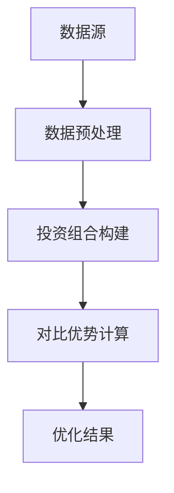

                 


# 戴维·德雷曼的对比优势投资法

## 关键词：对比优势投资法、戴维·德雷曼、投资学、投资组合优化、数学模型、算法实现

## 摘要：  
对比优势投资法是一种创新的投资策略，由著名投资学家戴维·德雷曼提出，旨在通过优化投资组合的对比优势来实现收益最大化和风险最小化。本文将从背景、核心概念、算法原理、数学模型、系统设计、项目实战和最佳实践等多个方面，全面解析对比优势投资法，帮助读者深入理解其理论基础和实际应用。

---

# 第一部分: 对比优势投资法的背景与核心概念

## 第1章: 对比优势投资法的起源与基础

### 1.1 投资学的基本概念

#### 1.1.1 投资学的定义与核心要素

投资学是一门研究如何通过合理配置资产以实现财富最大化和风险最小化的学科。其核心要素包括：

1. **资产配置**：如何将资金分配到不同资产类别（股票、债券、现金等）中以实现最优回报。
2. **风险与收益**：收益与风险是投资的两个核心维度，通常表现为收益与波动性的权衡。
3. **市场行为**：市场的波动性和参与者的行为对投资决策有重要影响。

#### 1.1.2 传统投资方法的局限性

传统的投资方法，如基于历史业绩的选股或基于市场趋势的预测，存在以下问题：

1. **信息过载**：市场数据繁杂，难以有效筛选。
2. **非理性决策**：投资者的非理性行为（如恐惧和贪婪）会影响决策。
3. **不可预测性**：市场的未来走势难以准确预测。

#### 1.1.3 对比优势投资法的提出背景

对比优势投资法的提出源于对传统投资方法的反思。德雷曼指出，传统的投资方法过于依赖历史数据和市场预测，忽视了资产配置和风险控制的重要性。对比优势投资法通过优化投资组合的对比优势，帮助投资者在不确定的市场中实现稳定收益。

---

### 1.2 对比优势投资法的核心概念

#### 1.2.1 对比优势的定义

对比优势（Comparative Advantage）是指在投资组合中，通过合理配置资产，使得单位风险下的收益最大化。具体来说，对比优势是指投资组合的收益与其风险的比值。

#### 1.2.2 对比优势与传统投资方法的区别

| 对比优势 | 传统投资方法 |
|----------|---------------|
| 基于资产配置优化 | 基于历史业绩或市场预测 |
| 以风险调整后收益为优化目标 | 以绝对收益为优化目标 |
| 考虑全局最优 | 考虑局部最优 |

#### 1.2.3 对比优势投资法的核心要素

1. **投资组合的构建**：根据资产的风险和收益特征，构建最优投资组合。
2. **风险控制**：通过分散投资降低风险。
3. **动态调整**：根据市场变化动态优化投资组合。

---

## 第2章: 对比优势投资法的数学模型

### 2.1 投资组合的收益与风险

#### 2.1.1 投资组合的收益

$$
\text{投资组合收益} = \sum_{i=1}^{n} w_i r_i
$$

其中，\( w_i \) 是第 \( i \) 个资产的权重，\( r_i \) 是第 \( i \) 个资产的预期收益。

#### 2.1.2 投资组合的风险

$$
\text{投资组合风险} = \sqrt{w^T \Sigma w}
$$

其中，\( \Sigma \) 是资产之间的协方差矩阵。

### 2.2 对比优势的数学表达

$$
\text{对比优势} = \frac{\sum_{i=1}^{n} w_i r_i}{\sqrt{w^T \Sigma w}}
$$

---

## 第3章: 对比优势投资法的算法原理

### 3.1 数据预处理

#### 3.1.1 数据来源

- 历史价格数据
- 财务报表数据
- 市场指数数据

#### 3.1.2 数据清洗

- 处理缺失值
- 异常值处理
- 标准化处理

### 3.2 投资组合优化

#### 3.2.1 优化目标

最大化对比优势：

$$
\max_{w} \frac{\sum_{i=1}^{n} w_i r_i}{\sqrt{w^T \Sigma w}}
$$

#### 3.2.2 优化约束

- 投资权重非负：\( w_i \geq 0 \)
- 投资权重和为1：\( \sum_{i=1}^{n} w_i = 1 \)

### 3.3 对比优势的计算与优化

#### 3.3.1 算法流程

1. 数据预处理
2. 构建协方差矩阵
3. 优化投资组合权重
4. 计算对比优势

#### 3.3.2 算法实现代码

```python
import numpy as np
from scipy.optimize import minimize

# 定义对比优势函数
def compare_advantage(weights, returns, cov_matrix):
    portfolio_return = np.sum(weights * returns)
    portfolio_variance = np.dot(weights.T, np.dot(cov_matrix, weights))
    return -portfolio_return / np.sqrt(portfolio_variance)

# 优化问题定义
def optimize_portfolio(returns, cov_matrix):
    n = len(returns)
    # 定义目标函数
    def objective(weights):
        return compare_advantage(weights, returns, cov_matrix)
    # 约束条件
    constraints = [{'type': 'eq', 'fun': lambda w: np.sum(w) - 1},
                   {'type': 'ineq', 'fun': lambda w: w[i] for i in range(n)}]
    # 初始权重
    initial_weights = np.array([1.0 / n] * n)
    # 使用 scipy.optimize.minimize 进行优化
    result = minimize(objective, initial_weights, method='SLSQP', constraints=constraints)
    return result.x

# 示例数据
returns = np.array([0.1, 0.12, 0.08])
cov_matrix = np.array([[0.04, 0.01, 0.02],
                       [0.01, 0.06, 0.01],
                       [0.02, 0.01, 0.03]])
# 优化投资组合
weights = optimize_portfolio(returns, cov_matrix)
print("最优权重:", weights)
```

---

## 第4章: 对比优势投资法的系统分析与架构设计

### 4.1 系统功能设计

#### 4.1.1 数据收集模块

- 从多个数据源收集历史价格、财务数据等。
- 数据清洗和预处理。

#### 4.1.2 投资组合构建模块

- 根据优化算法构建最优投资组合。
- 输出投资组合的权重和对比优势。

#### 4.1.3 对比优势计算模块

- 计算投资组合的对比优势。
- 对比不同投资组合的对比优势，选择最优组合。

### 4.2 系统架构设计



---

## 第5章: 对比优势投资法的项目实战

### 5.1 环境安装

- 安装必要的Python库：numpy、pandas、scipy、mermaid。

### 5.2 核心实现代码

```python
import numpy as np
from scipy.optimize import minimize

# 定义对比优势函数
def compare_advantage(weights, returns, cov_matrix):
    portfolio_return = np.sum(weights * returns)
    portfolio_variance = np.dot(weights.T, np.dot(cov_matrix, weights))
    return -portfolio_return / np.sqrt(portfolio_variance)

# 优化问题定义
def optimize_portfolio(returns, cov_matrix):
    n = len(returns)
    # 定义目标函数
    def objective(weights):
        return compare_advantage(weights, returns, cov_matrix)
    # 约束条件
    constraints = [{'type': 'eq', 'fun': lambda w: np.sum(w) - 1},
                   {'type': 'ineq', 'fun': lambda w: w[i] for i in range(n)}]
    # 初始权重
    initial_weights = np.array([1.0 / n] * n)
    # 使用 scipy.optimize.minimize 进行优化
    result = minimize(objective, initial_weights, method='SLSQP', constraints=constraints)
    return result.x

# 示例数据
returns = np.array([0.1, 0.12, 0.08])
cov_matrix = np.array([[0.04, 0.01, 0.02],
                       [0.01, 0.06, 0.01],
                       [0.02, 0.01, 0.03]])
# 优化投资组合
weights = optimize_portfolio(returns, cov_matrix)
print("最优权重:", weights)
```

### 5.3 案例分析

- 数据来源：某段时间内的股票价格和财务数据。
- 数据预处理：清洗和标准化处理。
- 投资组合构建：使用对比优势优化算法构建最优投资组合。
- 对比优势计算：计算投资组合的对比优势，选择最优组合。

---

## 第6章: 对比优势投资法的最佳实践与注意事项

### 6.1 最佳实践

1. **数据质量**：确保数据的准确性和完整性。
2. **模型选择**：根据实际情况选择合适的优化算法。
3. **风险控制**：定期调整投资组合，控制风险。

### 6.2 注意事项

1. **市场波动**：市场波动会影响对比优势的计算，需动态调整。
2. **数据偏差**：注意数据偏差对模型的影响。
3. **计算复杂度**：优化算法的计算复杂度较高，需合理配置计算资源。

---

## 第7章: 对比优势投资法的小结

对比优势投资法是一种创新的投资策略，通过优化投资组合的对比优势，实现收益最大化和风险最小化。本文从背景、核心概念、算法原理、数学模型、系统设计、项目实战和最佳实践等多个方面，全面解析了对比优势投资法。读者可以通过本文掌握对比优势投资法的理论基础和实际应用，为投资决策提供有力支持。

---

**作者：AI天才研究院/AI Genius Institute & 禅与计算机程序设计艺术 /Zen And The Art of Computer Programming**

