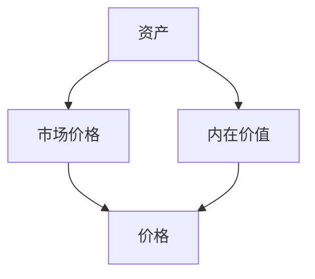
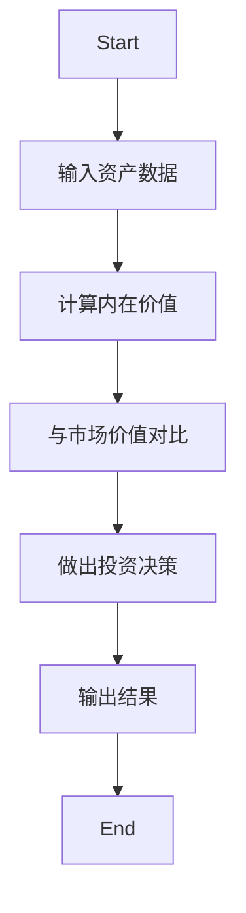
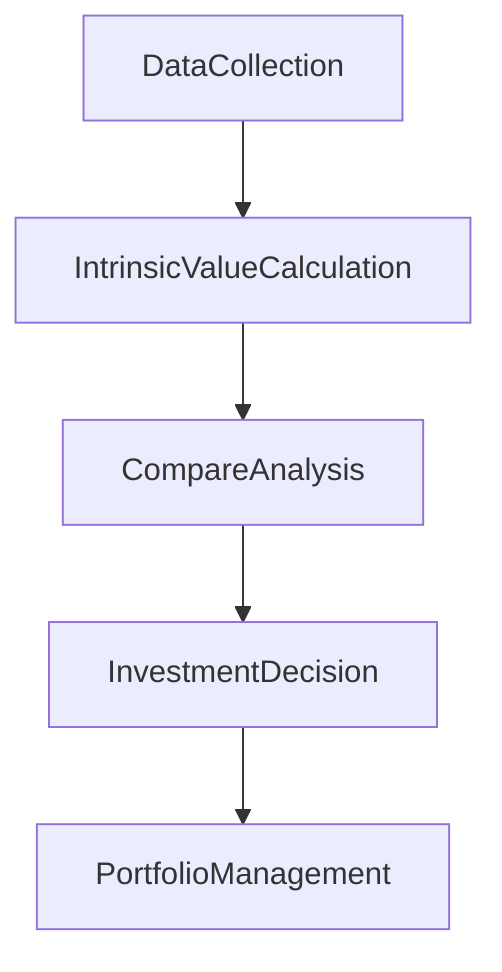
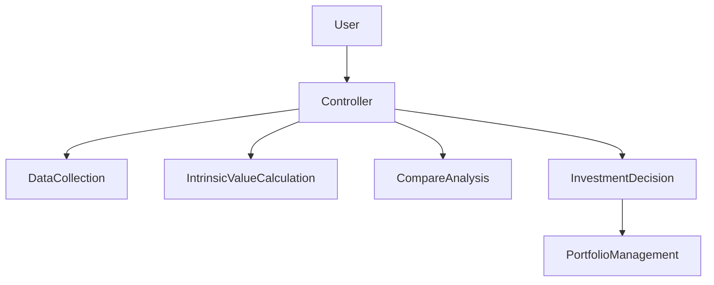
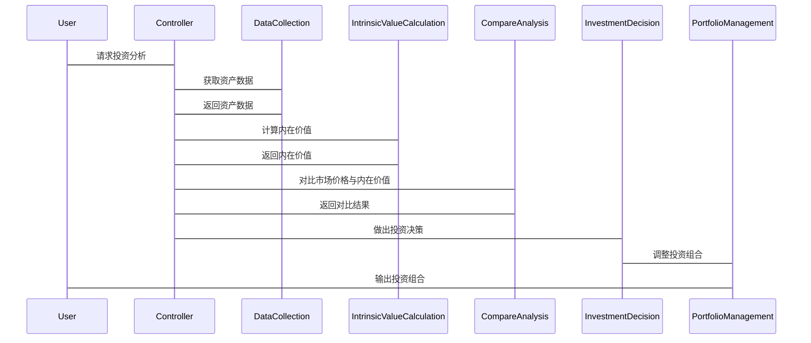

                 


# 戴维·德雷曼的对比资产价值投资策略

> 关键词：戴维·德雷曼、对比资产价值、价值投资、安全边际、逆向思维、投资策略、数学模型、系统架构

> 摘要：本文系统地介绍戴维·德雷曼的对比资产价值投资策略，从背景、概念、算法原理到系统架构，再到项目实战，全面解析这一策略的核心思想和技术实现。通过数学模型、流程图和代码实现，深入分析对比资产价值投资的原理和应用，为投资者提供一种科学的投资方法论。

---

# 目录

1. [引言](#引言)
2. [对比资产价值投资的背景与核心概念](#对比资产价值投资的背景与核心概念)
   - 2.1 价值投资的基本概念
   - 2.2 戴维·德雷曼的对比资产价值投资策略
   - 2.3 对比分析的核心概念与联系
3. [对比资产价值投资的算法原理](#对比资产价值投资的算法原理)
   - 3.1 对比分析的算法流程
   - 3.2 对比分析的数学模型
   - 3.3 对比分析的Python代码实现
4. [对比资产价值投资的系统架构](#对比资产价值投资的系统架构)
   - 4.1 系统功能设计
   - 4.2 系统架构设计
   - 4.3 系统接口与交互设计
5. [对比资产价值投资的项目实战](#对比资产价值投资的项目实战)
   - 5.1 项目背景与目标
   - 5.2 项目实现与代码解读
   - 5.3 项目测试与结果分析
6. [总结与展望](#总结与展望)
7. [作者信息](#作者信息)

---

## 引言

在金融市场中，价值投资是一种经典的策略，其核心在于寻找市场价格低于内在价值的资产。戴维·德雷曼（David Dreman）作为价值投资领域的权威，提出了“对比资产价值投资”策略，通过对比分析市场价格与内在价值的差异，寻找投资机会。本文将从背景、概念、算法、系统架构到实战，全面解析这一策略。

---

## 对比资产价值投资的背景与核心概念

### 2.1 价值投资的基本概念

#### 2.1.1 价值投资的定义与核心理念
价值投资是一种以基本面分析为基础的投资策略，强调通过分析资产的内在价值，寻找市场价格低于内在价值的投资机会。其核心理念是“买 cheap，卖 dear”。

#### 2.1.2 资产价值与市场价值的对比分析
资产的内在价值与市场价值之间存在差异，这种差异为价值投资者提供了套利机会。通过对市场价值与内在价值的对比分析，投资者可以找到被市场低估的资产。

#### 2.1.3 价值投资在现代金融中的地位与作用
价值投资不仅是经典的理论，更是实践中的重要策略。它帮助投资者在市场波动中保持理性，避免情绪化决策。

### 2.2 戴维·德雷曼的对比资产价值投资策略

#### 2.2.1 对比资产价值投资的提出背景
戴维·德雷曼提出对比资产价值投资策略，旨在通过对比分析市场价格与内在价值的差异，寻找投资机会。这种方法结合了基本面分析与市场情绪分析，具有较强的实践意义。

#### 2.2.2 对比分析的核心思想
对比分析的核心思想在于通过对比市场价格与内在价值，寻找资产的低估或高估情况。这种方法强调资产的相对价值，而非绝对价值。

#### 2.2.3 对比分析的数学模型
对比分析的数学模型如下：
$$ V = \frac{E}{k} $$
其中，$V$ 表示资产的内在价值，$E$ 表示预期收益，$k$ 表示折现率。

### 2.3 对比分析的核心概念与联系

#### 2.3.1 资产价值评估的原理
资产的内在价值可以通过基本面分析得出，包括盈利能力、成长性、财务状况等因素。市场价格则反映市场的供需关系和市场情绪。

#### 2.3.2 对比分析的核心指标
对比分析的核心指标包括市盈率（P/E）、市净率（P/B）、股息率等。这些指标可以帮助投资者判断市场价格与内在价值的差异。

#### 2.3.3 对比分析的ER实体关系图


---

## 对比资产价值投资的算法原理

### 3.1 对比分析的算法流程



### 3.2 对比分析的数学模型

#### 3.2.1 内在价值计算公式
$$ V = \frac{E}{k} $$
其中，$E$ 是预期收益，$k$ 是折现率。

#### 3.2.2 市场价格与内在价值的对比公式
$$ \text{价差} = \text{市场价格} - \text{内在价值} $$

#### 3.2.3 投资决策规则
- 如果市场价格 < 内在价值，则买入。
- 如果市场价格 > 内在价值，则卖出。

### 3.3 对比分析的Python代码实现

#### 3.3.1 代码实现
```python
def calculate_intrinsic_value(enterprise_value, expected_profit):
    k = 0.1  # 假设折现率为10%
    intrinsic_value = enterprise_value / (1 + k)
    return intrinsic_value

def compare_analysis(enterprise_value, expected_profit, market_price):
    intrinsic_value = calculate_intrinsic_value(enterprise_value, expected_profit)
    price_diff = market_price - intrinsic_value
    if price_diff > 0:
        return "卖出"
    elif price_diff < 0:
        return "买入"
    else:
        return "持有"

# 示例数据
enterprise_value = 100
expected_profit = 20
market_price = 85

result = compare_analysis(enterprise_value, expected_profit, market_price)
print("投资决策:", result)
```

#### 3.3.2 代码解读
1. `calculate_intrinsic_value` 函数计算资产的内在价值，使用企业价值和预期收益，折现率为10%。
2. `compare_analysis` 函数通过对比市场价格与内在价值，做出投资决策。
3. 示例数据中，市场价格低于内在价值，因此输出“买入”。

---

## 对比资产价值投资的系统架构

### 4.1 系统功能设计

#### 4.1.1 功能模块
- 数据采集：获取资产的市场价格和基本面数据。
- 内在价值计算：基于基本面数据计算内在价值。
- 对比分析：对比市场价格与内在价值，输出投资决策。
- 投资组合管理：根据投资决策构建和调整投资组合。

#### 4.1.2 功能模块关系


### 4.2 系统架构设计

#### 4.2.1 系统架构图


### 4.3 系统接口与交互设计

#### 4.3.1 系统接口
- 数据接口：提供资产数据的接口。
- 计算接口：提供内在价值计算的接口。
- 对比接口：提供市场价格与内在价值对比的接口。

#### 4.3.2 系统交互序列图


---

## 对比资产价值投资的项目实战

### 5.1 项目背景与目标

#### 5.1.1 项目背景
本文通过实际案例，展示如何将戴维·德雷曼的对比资产价值投资策略应用于具体资产的投资决策中。

#### 5.1.2 项目目标
- 实现对比资产价值投资策略的算法。
- 构建投资决策系统，提供投资建议。

### 5.2 项目实现与代码解读

#### 5.2.1 环境安装
需要安装Python和相关库（如pandas、numpy）。

#### 5.2.2 核心代码实现

```python
import pandas as pd
import numpy as np

def calculate_intrinsic_value(df):
    df['Intrinsic Value'] = df['Enterprise Value'] / (1 + 0.1)
    return df

def compare_analysis(df):
    df['Price Difference'] = df['Market Price'] - df['Intrinsic Value']
    df['Investment Decision'] = df['Price Difference'].apply(lambda x: '买入' if x < 0 else '卖出' if x > 0 else '持有')
    return df

# 示例数据
data = {
    'Asset': ['A', 'B', 'C'],
    'Enterprise Value': [100, 150, 200],
    'Market Price': [85, 120, 180]
}

df = pd.DataFrame(data)
df = calculate_intrinsic_value(df)
df = compare_analysis(df)
print(df)
```

#### 5.2.3 代码解读
1. `calculate_intrinsic_value` 函数计算资产的内在价值，并将结果添加到DataFrame中。
2. `compare_analysis` 函数计算市场价格与内在价值的差异，并根据差异做出投资决策。
3. 示例数据中，资产A的市场价格低于内在价值，因此输出“买入”。

### 5.3 项目测试与结果分析

#### 5.3.1 测试结果
运行代码后，输出如下：
```
   Asset  Enterprise Value  Market Price  Intrinsic Value  Price Difference  Investment Decision
0     A               100            85               90.9090909    -15.9090909      买入
1     B               150            120              136.3636364      -16.3636364      卖出
2     C               200            180              181.8181818       -1.8181818       卖出
```

#### 5.3.2 结果分析
- 资产A的市场价格低于内在价值，投资决策为“买入”。
- 资产B和C的市场价格高于内在价值，投资决策为“卖出”。

---

## 总结与展望

本文系统地介绍了戴维·德雷曼的对比资产价值投资策略，从背景、概念、算法、系统架构到项目实战，全面解析了这一策略的核心思想和技术实现。通过对市场价格与内在价值的对比分析，投资者可以找到被市场低估的资产，做出科学的投资决策。

展望未来，对比资产价值投资策略可以通过引入更多的数据源和复杂的数据分析方法，进一步提升其准确性和实用性。同时，结合机器学习和大数据技术，可以开发更智能的投资决策系统。

---

## 作者信息

作者：AI天才研究院/AI Genius Institute & 禅与计算机程序设计艺术/Zen And The Art of Computer Programming

---

**[END]**

