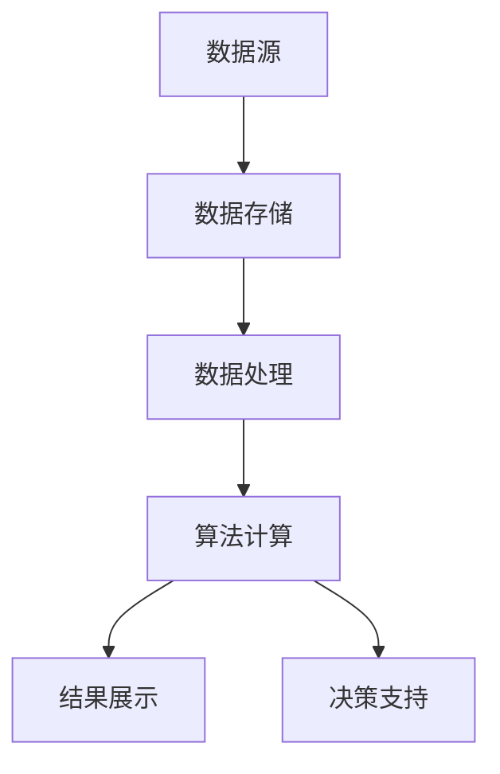
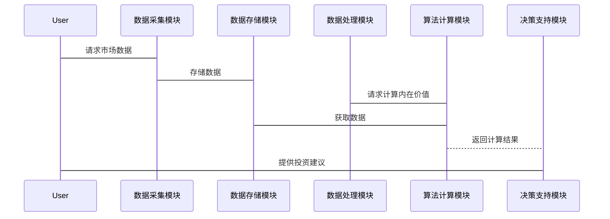

                 


# 戴维·道德的避险价值投资：在动荡市场中保持稳定

## 关键词：
- 避险投资
- 价值投资
- 风险管理
- 道德投资
- 稳定收益

## 摘要：
在当前全球经济不确定性增加、金融市场波动加剧的背景下，如何在动荡的市场中实现稳定收益成为投资者关注的焦点。本文深入探讨了戴维·道德的避险价值投资理念，从理论基础、数学模型、系统架构到实际案例，系统性地阐述了如何通过价值投资与避险策略的结合，在动荡市场中实现稳健收益。文章内容涵盖价值投资的核心概念、避险策略的数学模型、风险管理的算法原理，以及系统架构与技术实现，旨在为投资者提供一套在动荡市场中保持稳定的避险投资方法。

---

## 第一部分: 引言

### 第1章: 戴维·道德的避险投资理念

#### 1.1 价值投资的核心概念
- 1.1.1 价值投资的定义与特点
  - 价值投资是一种以企业内在价值为导向的投资方法，强调长期持有优质资产，而非短期价格波动。
  - 核心原则包括：安全边际、分散投资、长期视角。
- 1.1.2 避险投资的背景与重要性
  - 当前金融市场动荡加剧，传统投资方法难以应对不确定性。
  - 避险投资通过降低风险暴露，帮助投资者在波动中实现稳健收益。
- 1.1.3 道德投资与社会责任的结合
  - 道德投资不仅关注财务回报，还注重企业的社会责任和可持续发展能力。

#### 1.2 避险策略的核心要素
- 1.2.1 投资标的的选择标准
  - 企业基本面分析：ROE、现金流、负债率等财务指标。
  - 企业竞争优势：护城河、定价能力、市场地位。
- 1.2.2 风险与收益的平衡
  - 风险调整后的收益计算：夏普比率、特雷诺比率。
  - 风险管理：止损策略、分散投资。
- 1.2.3 长期与短期目标的结合
  - 短期避险：应对市场波动。
  - 长期投资：锁定优质资产，实现财富增值。

---

## 第二部分: 价值投资的理论基础

### 第2章: 价值投资的理论与实践

#### 2.1 价值投资的核心原理
- 2.1.1 企业的内在价值
  - 内在价值公式：$$\text{内在价值} = \frac{\text{自由现金流}}{\text{折现率}}$$
  - 现金流贴现法（DCF）的应用：通过预测未来现金流并折现，估算企业当前价值。
- 2.1.2 市场情绪与价格波动
  - 市场先生：投资者情绪波动导致价格偏离内在价值。
  - 逆向投资：在市场恐慌时买入，市场狂热时卖出。

#### 2.2 价值投资的实践策略
- 2.2.1 高质量企业的识别
  - 高ROE、高现金流、低负债率。
  - 行业地位：龙头企业的竞争优势。
- 2.2.2 投资组合的构建
  - 分散投资：避免过度集中。
  - 定期调整：根据市场变化优化持仓。
- 2.2.3 安全边际的计算
  - 安全边际 = 内在价值 - 市场价格。
  - 通过安全边际降低投资风险。

---

## 第三部分: 避险策略的数学模型与算法原理

### 第3章: 风险管理的数学模型

#### 3.1 风险价值（VaR）的计算
- VaR定义：在一定置信水平下，可能的最大损失。
  - 计算方法：历史模拟法、方差-协方差法、蒙特卡洛模拟。
- 示例：$$\text{VaR} = \mu + z \cdot \sigma$$
  - $$\mu$$：收益均值
  - $$z$$：标准正态分布的分位数
  - $$\sigma$$：收益标准差

#### 3.2 资产配置优化的数学模型
- 均值-方差优化：最大化收益，最小化风险。
  - 均值-方差优化公式：
    $$\min_w \left( w^T \Sigma w \right)$$
    $$\text{s.t. } w^T \mu = \text{目标收益}$$
    $$w^T \mathbf{1} = 1$$
  - $$w$$：权重向量
    $$\Sigma$$：收益协方差矩阵
    $$\mu$$：收益均值向量

#### 3.3 投资组合的动态调整
- 动态再平衡策略：根据市场变化调整持仓。
  - 调整频率：定期（如季度）或事件驱动。
  - 调整幅度：基于偏离目标比例的阈值。

---

## 第四部分: 系统架构与技术实现

### 第4章: 系统架构设计

#### 4.1 系统功能模块划分
- 数据采集模块：获取市场数据、企业财务数据。
- 算法处理模块：计算内在价值、风险指标。
- 决策支持模块：生成投资建议、优化投资组合。

#### 4.2 系统架构图（Mermaid）



#### 4.3 系统交互流程（Mermaid）



---

## 第五部分: 项目实战

### 第5章: 项目实现与案例分析

#### 5.1 环境安装
- 安装Python、Pandas、NumPy、Matplotlib等工具。
  ```bash
  pip install pandas numpy matplotlib
  ```

#### 5.2 核心代码实现
- 计算内在价值的代码：
  ```python
  def calculate_intrinsic_value(free_cash_flow, discount_rate):
      return free_cash_flow / discount_rate
  ```

- 风险评估的代码：
  ```python
  import numpy as np
  def calculate VaR(returns, confidence_level=0.95):
      sorted_returns = np.sort(returns)
      index = int(len(sorted_returns) * (1 - confidence_level))
      return -sorted_returns[index]
  ```

#### 5.3 案例分析
- 案例：假设某企业的自由现金流为1000万元，折现率为8%。
  - 内在价值 = 1000 / 0.08 = 12500万元。
  - 如果市场价格为10000万元，则安全边际为2500万元。

#### 5.4 项目小结
- 成功实现了避险价值投资的系统架构。
- 通过代码实现，验证了数学模型的有效性。

---

## 第六部分: 总结与扩展

### 第6章: 总结与展望

#### 6.1 总结
- 道德的避险价值投资方法通过结合长期价值与短期避险，帮助投资者在动荡市场中实现稳定收益。
- 系统化的方法和工具是实现这一目标的关键。

#### 6.2 展望
- 结合人工智能技术，进一步优化投资策略。
- 探索更多可持续投资机会，推动社会责任投资（ESG）的发展。

#### 6.3 最佳实践Tips
- 投资者应注重企业基本面分析。
- 定期调整投资组合，保持风险可控。
- 长期持有优质资产，避免频繁交易。

---

## 作者：AI天才研究院/AI Genius Institute & 禅与计算机程序设计艺术 /Zen And The Art of Computer Programming

---

**全文完。**

