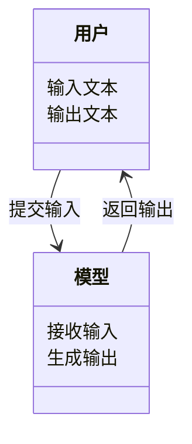
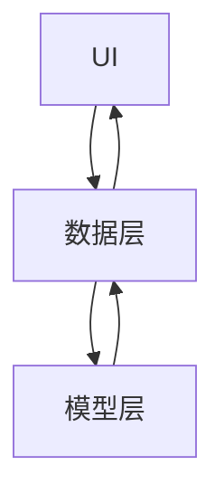
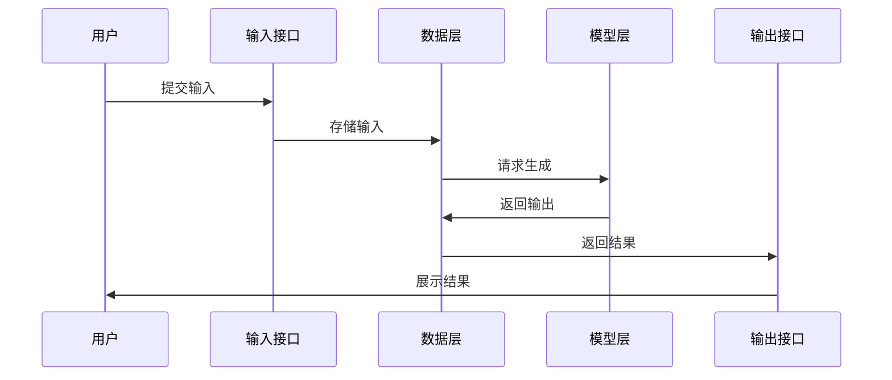

                 


# 打造个人助理 AI Agent：GPT 模型应用实战

> 关键词：AI Agent, GPT 模型, 个人助理, 自然语言处理, 人工智能, 机器学习

> 摘要：本文将详细介绍如何基于 GPT 模型打造一个功能强大的个人助理 AI Agent。从 AI Agent 的定义、核心概念、GPT 模型的工作原理，到系统架构设计、项目实战以及最佳实践，我们将全面解析如何将 GPT 模型应用于个人助理 AI 的构建中。通过本文的学习，读者将能够理解并掌握如何利用 GPT 模型构建一个智能化的个人助理系统。

---

## 第一部分：AI Agent 的背景与基础

### 第1章：AI Agent 的定义与背景

#### 1.1 AI Agent 的定义与核心概念

##### 1.1.1 什么是 AI Agent
AI Agent（人工智能代理）是指能够感知环境、自主决策并执行任务的智能实体。它能够通过与用户交互或环境的交互，理解用户需求并提供相应的服务。AI Agent 的核心目标是通过智能化的方式协助用户完成各种任务，提高效率。

##### 1.1.2 AI Agent 的核心特征
- **自主性**：AI Agent 能够自主决策，无需人工干预。
- **反应性**：能够实时感知环境并做出反应。
- **学习能力**：通过数据和交互不断优化自身能力。
- **适应性**：能够适应不同的用户需求和环境变化。

##### 1.1.3 个人助理 AI Agent 的应用场景
个人助理 AI Agent 的应用场景广泛，包括但不限于：
- **日程管理**：帮助用户安排和管理日程。
- **信息查询**：快速获取所需信息。
- **任务执行**：自动完成用户的指令，如发送邮件、预订机票等。
- **情感支持**：提供情感陪伴和建议。

#### 1.2 GPT 模型的发展与现状

##### 1.2.1 GPT 模型的演进历程
GPT（Generative Pre-trained Transformer）是由 OpenAI 开发的生成式预训练模型。从最初的 GPT 到 GPT-2，再到 GPT-3，每一次迭代都带来了性能和能力的显著提升。

##### 1.2.2 当前主流的 GPT 模型版本
- **GPT-3**：当前主流的版本，具备175亿参数，支持多种语言和任务。
- **GPT-4**：最新版本，具备更强的多模态能力和通用性。

##### 1.2.3 GPT 模型在个人助理中的应用潜力
GPT 模型的强大文本生成和理解能力使其成为构建个人助理 AI Agent 的理想选择。它能够通过自然语言处理技术，实现与用户的高效交互。

#### 1.3 为什么选择 GPT 模型作为 AI Agent 的基础

##### 1.3.1 GPT 模型的核心优势
- **强大的生成能力**：能够生成高质量的文本。
- **多任务处理能力**：支持多种任务，如对话生成、信息检索等。
- **可扩展性**：可以通过微调进一步适应特定任务需求。

##### 1.3.2 GPT 模型的局限性与解决方案
- **计算资源需求高**：需要大量的计算资源进行训练和推理。
- **生成内容的可控性**：需要通过后处理或限制模型参数来确保生成内容的安全性和准确性。

##### 1.3.3 GPT 模型在个人助理中的独特价值
GPT 模型的自然语言处理能力使其能够理解用户的意图，并生成符合用户需求的响应，从而为个人助理 AI Agent 提供强大的技术支持。

---

## 第二部分：AI Agent 的核心概念与联系

### 第2章：AI Agent 的工作原理

#### 2.1 AI Agent 的工作流程
AI Agent 的工作流程可以分为三个主要阶段：
1. **感知阶段**：通过输入（如文本、语音）理解用户的需求。
2. **决策阶段**：基于用户需求生成相应的行动计划。
3. **执行阶段**：执行行动计划并返回结果。

#### 2.2 GPT 模型在 AI Agent 中的角色

##### 2.2.1 GPT 模型的文本生成能力
GPT 模型通过生成式预训练技术，能够生成连贯且符合语境的文本。

##### 2.2.2 GPT 模型的对话理解能力
GPT 模型可以通过对话历史理解用户意图，提供更精准的响应。

##### 2.2.3 GPT 模型的持续学习能力
通过持续的微调和优化，GPT 模型能够不断提升其生成能力和理解能力。

---

## 第三部分：GPT 模型的算法原理

### 第3章：GPT 模型的核心算法

#### 3.1 GPT 模型的数学模型

##### 3.1.1 变换器架构
GPT 模型基于变换器（Transformer）架构，包括编码器和解码器两个部分。

##### 3.1.2 编码器与解码器的作用
- **编码器**：将输入文本转化为表示向量。
- **解码器**：基于编码器的输出生成目标文本。

#### 3.2 GPT 模型的训练过程

##### 3.2.1 输入与输出
输入为文本序列，输出为生成的文本序列。

##### 3.2.2 损失函数
交叉熵损失函数用于衡量生成结果与真实结果的差异。

##### 3.2.3 生成过程
通过贪心算法或采样方法生成文本。

---

## 第四部分：系统分析与架构设计

### 第4章：AI Agent 的系统架构

#### 4.1 项目背景与目标
构建一个基于 GPT 模型的个人助理 AI Agent，实现高效、智能的用户交互。

#### 4.2 系统功能设计

##### 4.2.1 领域模型设计
- **用户输入**：文本输入
- **模型处理**：文本生成
- **用户输出**：生成文本

##### 4.2.2 领域模型的 Mermaid 类图


#### 4.3 系统架构设计

##### 4.3.1 分层架构
- **数据层**：处理输入数据
- **业务逻辑层**：模型处理
- **用户交互层**：展示结果

##### 4.3.2 系统架构的 Mermaid 图


#### 4.4 接口设计与交互流程

##### 4.4.1 接口设计
- **输入接口**：接收用户输入
- **输出接口**：返回生成文本

##### 4.4.2 交互流程图


---

## 第五部分：项目实战

### 第5章：基于 GPT 模型的个人助理 AI Agent 实现

#### 5.1 环境安装与配置

##### 5.1.1 安装 Python 和必要的库
```bash
pip install python
pip install transformers
pip install torch
```

#### 5.2 系统核心实现

##### 5.2.1 模型加载与初始化
```python
from transformers import GPT2LMHeadModel, GPT2Tokenizer

model_name = "gpt2"
tokenizer = GPT2Tokenizer.from_pretrained(model_name)
model = GPT2LMHeadModel.from_pretrained(model_name)
```

##### 5.2.2 文本生成函数
```python
def generate_text(prompt):
    inputs = tokenizer.encode(prompt, return_tensors='pt')
    outputs = model.generate(inputs, max_length=50, num_beams=5, temperature=0.7)
    return tokenizer.decode(outputs[0], skip_special_tokens=True)
```

##### 5.2.3 用户交互界面
```python
def main():
    while True:
        prompt = input("请输入您的指令：")
        result = generate_text(prompt)
        print("生成结果：", result)

if __name__ == "__main__":
    main()
```

#### 5.3 代码解读与分析
- **模型加载**：使用 transformers 库加载 GPT 模型。
- **文本生成**：通过设置参数控制生成的长度和质量。
- **用户交互**：实现简单的命令行界面，用户输入指令，系统生成响应。

#### 5.4 实际案例分析
- **案例1**：用户输入“安排明天的会议”，系统生成“会议时间定为上午10点，地点在会议室A。”
- **案例2**：用户输入“查询天气”，系统生成“今天天气晴朗，温度在20-25摄氏度之间。”

#### 5.5 项目小结
通过以上步骤，我们实现了基于 GPT 模型的个人助理 AI Agent 的核心功能，包括文本生成和用户交互。

---

## 第六部分：最佳实践与注意事项

### 第6章：AI Agent 的最佳实践

#### 6.1 开发注意事项

##### 6.1.1 模型优化
- **参数调节**：调整温度、重复率等参数以优化生成效果。
- **模型微调**：针对特定任务进行微调，提升性能。

##### 6.1.2 安全性
- **内容过滤**：避免生成不当内容。
- **用户隐私保护**：确保用户数据的安全性。

#### 6.2 小结与展望
本文详细介绍了如何基于 GPT 模型打造个人助理 AI Agent，从理论到实践，帮助读者全面理解相关技术。未来，随着 AI 技术的不断发展，个人助理 AI Agent 的功能和性能将不断提升。

---

## 结语

通过本文的学习，读者将能够理解并掌握如何利用 GPT 模型构建一个智能化的个人助理系统。从模型原理到系统设计，再到项目实战，我们将全面解析打造个人助理 AI Agent 的关键步骤和技术要点。

---

作者：AI天才研究院/AI Genius Institute & 禅与计算机程序设计艺术 /Zen And The Art of Computer Programming

