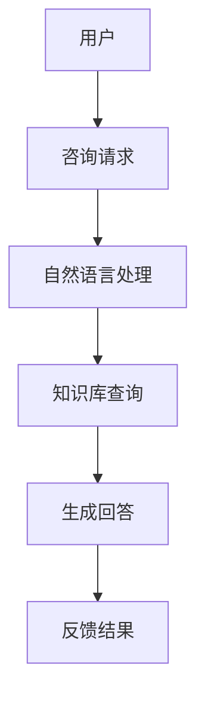
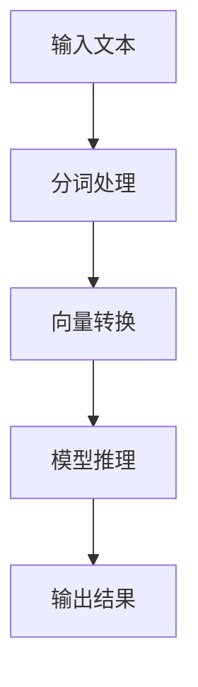
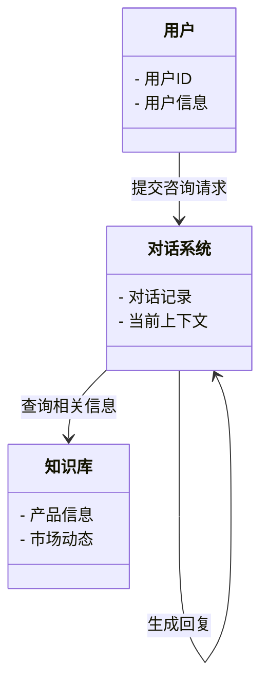
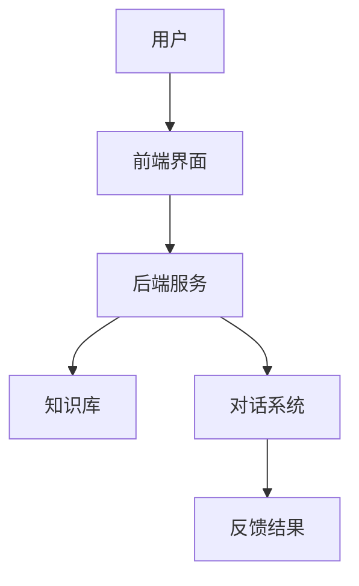

                 


# 打造智能化金融咨询聊天机器人

> 关键词：智能化、金融咨询、聊天机器人、自然语言处理、大模型

> 摘要：本文详细探讨了如何利用人工智能技术，特别是大模型和自然语言处理（NLP），来构建一个智能化的金融咨询聊天机器人。文章从背景分析到系统设计、算法实现，再到项目实战，全面阐述了实现这一目标的步骤和方法。通过深入分析和具体案例，展示了如何利用技术解决实际问题，为金融行业提供高效的智能化服务。

---

## 第一部分：背景介绍

### 第1章：问题背景与需求分析

#### 1.1 问题背景

金融咨询行业正面临着前所未有的挑战和机遇。传统的人工客服模式效率低下，难以满足日益增长的客户需求。客户咨询的问题种类繁多，从理财产品推荐到投资策略分析，人工客服难以快速响应和准确解答。此外，金融行业的复杂性和专业性要求客服具备深厚的知识储备，而培养这样的专业人才成本高昂。

与此同时，人工智能技术的快速发展为金融咨询行业带来了转机。自然语言处理（NLP）技术的进步使得机器能够理解和生成人类语言，这为构建智能化的金融咨询聊天机器人提供了可能。通过自动化解决客户咨询问题，不仅可以提高效率，还能降低运营成本。

#### 1.2 问题描述

金融咨询的核心问题是如何高效、准确地为客户提供个性化的金融服务。传统的客服模式依赖人工操作，存在响应速度慢、成本高、覆盖面有限等问题。而智能化的金融咨询聊天机器人可以通过自然语言处理技术，快速理解客户的需求，并提供准确的解答和建议。

问题解决的关键在于构建一个能够理解客户意图、准确回答问题，并且能够根据市场变化动态调整的智能系统。这需要结合金融领域的专业知识和先进的AI技术。

#### 1.3 问题解决

人工智能技术在金融咨询中的应用主要体现在以下几个方面：
1. **自然语言处理（NLP）**：用于理解和生成自然语言，帮助机器人准确理解客户的问题。
2. **知识库构建**：建立涵盖金融产品、市场动态、投资策略等多方面的知识库，为机器人提供专业支持。
3. **对话系统设计**：设计高效的对话流程，确保机器人能够引导客户完成咨询，并在必要时转接人工客服。

通过这些技术手段，金融咨询聊天机器人可以在一定程度上替代传统的人工客服，提供24小时不间断的服务，同时提高服务质量和效率。

#### 1.4 边界与外延

在设计金融咨询聊天机器人时，需要明确其能力边界，避免超出技术能力范围。例如，机器人可以处理基础的投资建议、理财产品推荐等问题，但对于复杂的金融分析和决策，仍然需要依赖人工专家。此外，还需要确保机器人的回答准确无误，避免因错误信息导致客户损失。

#### 1.5 核心要素组成

1. **数据驱动**：高质量的金融数据是机器学习的基础，包括市场动态、产品信息、客户咨询记录等。
2. **自然语言处理技术**：用于理解和生成自然语言，包括分词、实体识别、意图识别等任务。
3. **金融知识库**：构建专业的金融知识库，涵盖各类金融产品、市场动态、法规政策等内容。

---

## 第二部分：核心概念与联系

### 第2章：核心概念原理

#### 2.1 核心概念原理

1. **自然语言处理（NLP）的基本原理**：
   - NLP的目标是让计算机能够理解、处理和生成人类语言。
   - 常见的NLP任务包括分词、词性标注、句法分析、情感分析等。
   - 在金融咨询中，NLP主要用于意图识别和实体识别，例如识别客户是否在询问基金购买建议，或者询问市场趋势。

2. **金融知识库的构建方法**：
   - 知识库是机器人的“大脑”，包含了金融领域的专业知识。
   - 知识库的构建需要结合结构化数据（如产品信息）和非结构化数据（如新闻文章）。
   - 可以通过爬虫技术抓取公开信息，并结合人工整理的方式构建知识库。

3. **对话系统的实现逻辑**：
   - 对话系统负责接收用户的输入，并根据上下文生成合适的回答。
   - 常见的对话系统架构包括基于规则的系统和基于模型的系统。
   - 基于模型的系统（如基于BERT）能够更好地处理复杂的对话场景。

#### 2.2 实体关系图



---

## 第三部分：算法原理讲解

### 第3章：大模型算法原理

#### 3.1 大模型算法原理

1. **深度学习的基本原理**：
   - 深度学习是一种基于人工神经网络的机器学习方法，通过多层非线性变换提取数据特征。
   - 常见的深度学习模型包括CNN（卷积神经网络）、RNN（循环神经网络）和Transformer架构。

2. **大模型的变体模型**：
   - **BERT**：基于Transformer的预训练模型，擅长上下文理解。
   - **GPT**：生成式模型，擅长根据上下文生成合理的回复。
   - **BERT vs GPT**：BERT更擅长理解上下文，而GPT更擅长生成文本。

3. **大模型在NLP中的应用**：
   - **文本分类**：将文本归类到特定类别，如情感分析。
   - **序列标注**：识别文本中的实体，如人名、地名。
   - **对话生成**：根据上下文生成回复。

#### 3.2 算法流程图



#### 3.3 代码实现

```python
import tensorflow as tf
from tensorflow.keras import layers

# 定义模型
model = tf.keras.Sequential([
    layers.Embedding(input_dim=10000, output_dim=16),
    layers.SimpleRNN(units=16),
    layers.Dense(1, activation='sigmoid')
])

# 编译模型
model.compile(optimizer='adam', loss='binary_crossentropy', metrics=['accuracy'])

# 训练模型
model.fit(x_train, y_train, epochs=10, batch_size=32)
```

#### 3.4 数学公式

1. **交叉熵损失函数**：
   $$ L = -\frac{1}{N}\sum_{i=1}^{N} y_i \log(p_i) + (1 - y_i) \log(1 - p_i) $$

2. **Adam优化器**：
   $$ \theta_{t+1} = \theta_t - \eta \frac{m_t}{\sqrt{s_t + \epsilon}} $$

---

## 第四部分：系统分析与架构设计

### 第4章：系统分析与架构设计

#### 4.1 项目介绍

金融咨询聊天机器人旨在为客户提供个性化的金融咨询服务，包括产品推荐、市场分析、投资建议等。系统需要具备以下功能：
- **用户识别**：通过身份验证识别用户。
- **需求分析**：理解用户的具体需求。
- **知识库查询**：根据需求检索相关信息。
- **对话生成**：生成符合用户需求的回答。

#### 4.2 系统功能设计



#### 4.3 系统架构设计



---

## 第五部分：项目实战

### 第5章：项目实战

#### 5.1 环境安装

```bash
pip install tensorflow==2.0.0
pip install numpy==1.19.2
pip install pandas==1.2.5
pip install scikit-learn==0.24.1
```

#### 5.2 核心代码实现

```python
import tensorflow as tf
from tensorflow.keras import layers

# 定义模型
model = tf.keras.Sequential([
    layers.Embedding(input_dim=10000, output_dim=16),
    layers.SimpleRNN(units=16),
    layers.Dense(1, activation='sigmoid')
])

# 编译模型
model.compile(optimizer='adam', loss='binary_crossentropy', metrics=['accuracy'])

# 数据预处理
x_train = ...  # 输入文本数据
y_train = ...  # 标签数据

# 训练模型
model.fit(x_train, y_train, epochs=10, batch_size=32)
```

#### 5.3 案例分析

假设客户询问：“最近股市表现如何？”机器人需要从知识库中检索最近的市场数据，并生成相应的回答。这个过程包括自然语言理解、知识库查询和对话生成三个步骤。

---

## 第六部分：最佳实践与总结

### 第6章：总结

通过本文的详细讲解，我们了解了如何利用人工智能技术构建智能化的金融咨询聊天机器人。从背景分析到系统设计，再到算法实现和项目实战，每一步都需要精心设计和实现。未来，随着技术的不断进步，金融咨询聊天机器人将更加智能化，为客户提供更高效、更个性化的服务。

### 小结

- **数据驱动**：高质量的数据是模型的基础。
- **技术选型**：选择适合的NLP模型和框架。
- **系统架构**：设计合理的系统架构，确保系统的稳定性和可扩展性。
- **用户体验**：注重用户体验设计，确保机器人能够提供流畅、自然的对话体验。

### 注意事项

- **数据隐私**：确保客户数据的安全和隐私。
- **模型调优**：持续优化模型性能，提高回答的准确率。
- **人机协同**：在复杂问题上，机器人应能够及时转接人工客服。

### 拓展阅读

- 《深度学习入门：基于Python和Keras》
- 《自然语言处理实战：基于Python的自然语言处理快速入门》
- 《金融数据分析：从入门到精通》

---

作者：AI天才研究院 & 禅与计算机程序设计艺术

---

通过本文的详细讲解，读者可以系统地了解如何构建智能化的金融咨询聊天机器人，并将其应用于实际场景中。希望本文对您在金融AI领域的探索有所帮助。

