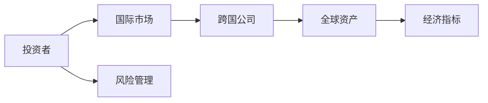
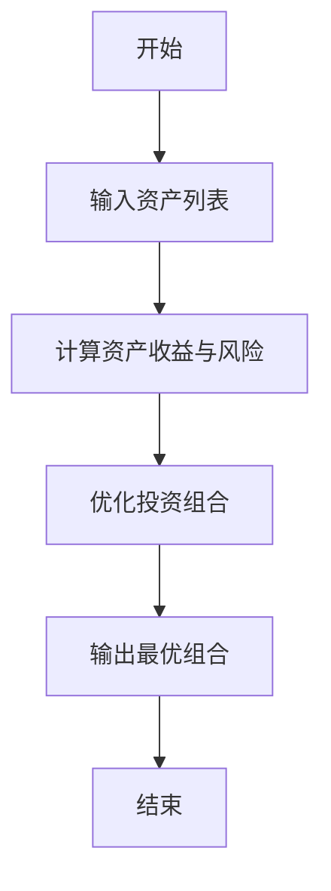

                 


# 第一部分: 全球价值投资的背景与基础

## 第1章: 全球价值投资的背景与现状

### 1.1 全球投资环境的演变

#### 1.1.1 经济全球化与投资国际化

在20世纪90年代以来，经济全球化加速，跨国公司迅速崛起，资本流动日益频繁，金融市场国际化程度不断提高，各国之间的经济联系更加紧密。托比亚斯·卡尔莱尔作为价值投资的倡导者，敏锐地捕捉到这种趋势，并将其应用于跨境投资中。

#### 1.1.2 数字化与科技对投资的影响

互联网和信息技术的发展，使得投资者能够实时获取全球市场信息，数据分析技术的进步使得对海量数据的处理和分析成为可能。托比亚斯·卡尔莱尔在利用这些技术手段，开发了基于大数据的分析工具，为他的价值投资决策提供了有力支持。

#### 1.1.3 全球经济波动与投资机会

全球经济波动，如金融危机、贸易摩擦、地缘政治风险等，都为价值投资者提供了寻找低价资产的机会。托比亚斯·卡尔莱尔正是在这些波动中，寻找那些被市场低估但具备长期增长潜力的企业和行业。

### 1.2 价值投资的核心理念

#### 1.2.1 价值投资的定义与特点

价值投资是一种以内在价值为导向的投资策略，强调以低于内在价值的价格购买优质资产。托比亚斯·卡尔莱尔的价值投资特点包括：长期导向、注重基本面分析、寻找市场误判的机会。

#### 1.2.2 价值投资与成长投资的区别

价值投资与成长投资在目标、策略和时间跨度上有显著区别。价值投资注重当前的低估值，而成长投资则注重未来的高增长。托比亚斯·卡尔莱尔的价值投资策略更倾向于寻找那些暂时被市场忽视，但具备坚实基本面的企业。

#### 1.2.3 价值投资的长期视角

价值投资强调长期视角，认为市场的短期波动并不影响企业的内在价值。托比亚斯·卡尔莱尔在跨境投资中，也坚持这一原则，寻找那些在全球范围内具备持续竞争优势的企业。

### 1.3 托比亚斯·卡尔莱尔的投资方法

#### 1.3.1 卡尔莱尔的投资哲学

托比亚斯·卡尔莱尔的投资哲学强调基本面分析、低估值和长期持有。他相信市场的非理性波动，能够在短期内创造出价值投资的机会。

#### 1.3.2 卡尔莱尔的选股标准

托比亚斯·卡尔莱尔的选股标准包括：低市盈率、低市净率、高股息率等指标，同时注重企业的财务健康状况、行业地位和竞争优势。

#### 1.3.3 卡尔莱尔的案例分析

托比亚斯·卡尔莱尔曾成功投资于哪些企业？这些案例如何体现他的投资策略？通过具体案例分析，可以更深入地理解他的投资方法。

### 1.4 本章小结

本章从全球投资环境的演变，分析了托比亚斯·卡尔莱尔价值投资的背景与现状，详细介绍了价值投资的核心理念，以及卡尔莱尔的投资方法和案例分析。

## 第2章: 跨境投资的核心概念与联系

### 2.1 跨境投资的基本原理

#### 2.1.1 跨境投资的定义与特点

跨境投资是指投资者在不同国家市场之间进行资产配置和投资。其特点包括：全球化视角、分散风险、寻找全球投资机会等。

#### 2.1.2 跨境投资的核心要素

跨境投资的核心要素包括：资产配置、汇率风险、税务规划、法律法规等。

#### 2.1.3 跨境投资的边界与外延

跨境投资的边界是指投资者在进行跨国投资时需要考虑的限制因素，如资本流动限制、市场准入壁垒等。其外延则包括新兴市场、成熟市场、新兴行业等。

### 2.2 跨境投资的实体关系图



### 2.3 跨境投资的核心概念对比表

| 概念 | 特点 | 示例 |
|------|------|------|
| 跨境投资 | 跨国界、多市场 | 美国、欧洲、亚洲市场 |
| 价值投资 | 低估值、高潜力 | 高市盈率股票 |
| 风险管理 | 控制风险 | 多元化投资组合 |

## 第3章: 跨境投资的算法原理

### 3.1 投资组合优化算法

#### 3.1.1 现代投资组合理论（MPT）

现代投资组合理论（MPT）由哈里·马科维茨提出，强调通过分散投资来降低风险。托比亚斯·卡尔莱尔在跨境投资中，也应用了MPT的原理，通过优化投资组合来实现风险与收益的最佳平衡。

#### 3.1.2 马科维茨均值-方差模型

均值-方差模型通过优化投资组合的期望收益和方差，找到最优的风险调整后收益。托比亚斯·卡尔莱尔利用这一模型，结合全球市场的数据，进行投资组合优化。

#### 3.1.3 投资组合优化算法流程图



### 3.2 机器学习在投资中的应用

#### 3.2.1 预测模型构建

托比亚斯·卡尔莱尔利用机器学习技术，构建股票价格预测模型，通过历史数据训练，预测未来的价格走势。

#### 3.2.2 时间序列分析

时间序列分析用于预测未来的经济指标，如GDP增长率、利率变动等，为投资决策提供支持。

#### 3.2.3 风险预测算法

通过机器学习算法，预测市场风险，如波动率、崩盘风险等，帮助投资者进行风险管理和投资决策。

## 第4章: 跨境投资的数学模型与公式

### 4.1 投资组合优化的数学模型

现代投资组合理论的数学模型如下：

$$ \text{目标函数：} \min_w \sigma^2(w) $$
$$ \text{约束条件：} \sum_{i=1}^n w_i = 1, \quad w_i \geq 0 $$

其中，\( w \) 是投资组合权重向量，\( \sigma^2(w) \) 是投资组合的方差。

### 4.2 价值评估的数学公式

托比亚斯·卡尔莱尔使用市盈率（P/E）和市净率（P/B）等指标，评估企业的内在价值。例如，内在价值计算公式为：

$$ \text{内在价值} = \text{净利润} \times \text{合理市盈率} $$

### 4.3 风险管理的数学表达

VaR（Value at Risk）是衡量市场风险的重要指标，计算公式为：

$$ \text{VaR}(\alpha) = \inf\{x | P(L \leq x) \geq \alpha\} $$

其中，\( \alpha \) 是置信水平，\( L \) 是投资组合的损失。

## 第5章: 跨境投资的系统分析与架构设计

### 5.1 系统架构设计

托比亚斯·卡尔莱尔的跨境投资分析系统架构如下：


### 5.2 系统功能设计

#### 5.2.1 数据获取模块

负责获取全球市场的实时数据，包括股票价格、经济指标等。

#### 5.2.2 数据分析模块

进行数据清洗、特征提取、模型训练等，为投资决策提供支持。

#### 5.2.3 投资决策模块

根据分析结果，生成投资建议，如买入、卖出信号等。

#### 5.2.4 风险管理模块

评估投资组合的风险，调整投资策略，进行风险对冲。

### 5.3 系统交互设计


## 第6章: 跨境投资的项目实战

### 6.1 环境安装

#### 6.1.1 安装Python

安装Python编程语言，推荐使用Anaconda发行版。

#### 6.1.2 安装相关库

安装Pandas、NumPy、Scikit-learn等数据分析库，以及Matplotlib或Seaborn用于数据可视化。

#### 6.1.3 获取数据

从Yahoo Finance或其他数据源获取全球市场的历史数据。

### 6.2 核心代码实现

#### 6.2.1 数据清洗与预处理

```python
import pandas as pd
import numpy as np

# 读取数据
data = pd.read_csv('global_markets.csv')

# 数据清洗
data.dropna(inplace=True)
data = data[~data['volume'].iszero()]
```

#### 6.2.2 投资组合优化

```python
import numpy as np

def portfolio_optimization(returns):
    n = returns.shape[1]
    returns_cov = returns.cov()
    returns_mean = returns.mean()
    
    # 优化目标函数
    def objective(w):
        return (w.T @ returns_cov @ w)
    
    # 约束条件
    constraints = [{'type': 'eq', 'fun': lambda w: sum(w) - 1}]
    
    # 使用SLSQP求解
    from scipy.optimize import minimize
    result = minimize(objective, np.ones(n)/n, constraints=constraints)
    return result.x

# 示例
portfolios = portfolio_optimization(data_returns)
```

#### 6.2.3 风险管理策略

```python
def risk_management(portfolio, VaR):
    # 根据VaR调整投资组合
    adjusted_portfolio = portfolio.copy()
    adjusted_portfolio[portfolio > VaR] *= 0.5
    return adjusted_portfolio
```

### 6.3 案例分析

#### 6.3.1 数据分析

通过分析全球市场的历史数据，识别具有低估值的股票。

#### 6.3.2 投资决策

根据优化模型，生成买入信号。

#### 6.3.3 风险管理

根据VaR模型，调整投资组合，降低风险。

### 6.4 项目小结

通过实际案例，展示了如何将理论应用于实践，如何利用系统工具进行跨境投资分析和决策。

## 第7章: 跨境投资的最佳实践与小结

### 7.1 最佳实践

#### 7.1.1 投资策略

建议投资者在跨境投资中，注重基本面分析，寻找低估值资产，同时注意分散风险。

#### 7.1.2 风险管理

定期评估投资组合的风险，及时调整，避免过度集中。

#### 7.1.3 技术应用

利用大数据和人工智能技术，提高投资分析的效率和准确性。

### 7.2 小结

托比亚斯·卡尔莱尔的全球价值投资，通过跨境寻找投资机会，成功实现了财富增值。本书系统地介绍了其投资理念、方法和实践，为读者提供了宝贵的参考。

## 第8章: 未来趋势与挑战

### 8.1 未来趋势

#### 8.1.1 数字化投资

随着科技的发展，数字化投资将越来越普及，智能投顾将成为重要工具。

#### 8.1.2 可持续投资

环境、社会和治理（ESG）因素将成为投资决策的重要考量。

### 8.2 挑战

#### 8.2.1 市场波动

全球经济波动和地缘政治风险，增加了跨境投资的难度。

#### 8.2.2 技术限制

数据获取、分析和处理的技术门槛，限制了部分投资者的应用。

## 作者

**作者：托比亚斯·卡尔莱尔**

**简介：** 托比亚斯·卡尔莱尔是一位著名的价值投资者，专注于全球范围内的投资机会，以其独特的选股标准和长期投资策略闻名。

**著作：** 《全球价值投资：跨境寻找投资机会》

**联系方式：** [contact@tobiascarlisle.com](mailto:contact@tobiascarlisle.com)

