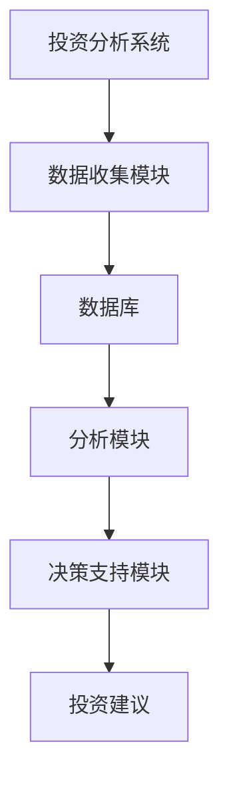

                 


# 托比亚斯·卡尔莱尔的新兴市场价值投资

## 关键词：新兴市场，价值投资，托比亚斯·卡尔莱尔，投资策略，风险管理，系统架构

## 摘要：本文深入探讨托比亚斯·卡尔莱尔在新兴市场中的价值投资策略，分析其理论基础、核心概念和实际应用。通过数学模型、系统架构和项目实战，详细讲解新兴市场投资的关键因素和风险管理方法，为投资者提供实用的策略和工具。

---

## 第一部分：新兴市场的定义与价值投资背景

### 第1章：新兴市场的定义与重要性

#### 1.1 新兴市场的概念
- 1.1.1 新兴市场的定义：新兴市场是介于发达国家和发展中国家之间的经济体，具有较高的增长潜力。
- 1.1.2 新兴市场的特点：高波动性、政策影响、行业多样性。
- 1.1.3 新兴市场的全球分布：主要分布在亚洲、拉丁美洲和东欧。

#### 1.2 新兴市场的投资重要性
- 1.2.1 新兴市场在全球经济中的地位：新兴市场是全球经济增长的主要驱动力。
- 1.2.2 新兴市场的增长潜力：高增长率为投资者提供了丰厚的回报机会。
- 1.2.3 新兴市场与成熟市场的对比：新兴市场的波动性和风险较高，但潜在回报也更大。

### 第2章：托比亚斯·卡尔莱尔的价值投资理论

#### 2.1 价值投资的核心理念
- 2.1.1 价值投资的定义：寻找市场价格低于内在价值的股票进行投资。
- 2.1.2 价值投资的基本原则：长期投资、注重基本面、安全边际。
- 2.1.3 价值投资与新兴市场的结合：在新兴市场中寻找被低估的资产。

#### 2.2 卡尔莱尔的投资策略
- 2.2.1 低市盈率策略：寻找市盈率低于行业平均水平的股票。
- 2.2.2 高股息率策略：投资于股息收益率高的公司。
- 2.2.3 偏好优质资产策略：选择行业龙头或具有强大竞争优势的公司。

### 第3章：新兴市场的特点与挑战

#### 3.1 新兴市场的经济结构
- 3.1.1 经济增长模式：新兴市场通常依赖出口和制造业驱动增长。
- 3.1.2 通货膨胀与货币政策：新兴市场面临较高的通胀压力和货币波动。
- 3.1.3 外汇管制与资本流动：新兴市场可能实施外汇管制，限制资本自由流动。

---

## 第二部分：价值投资的核心概念与数学模型

### 第4章：价值投资的核心概念

#### 4.1 核心概念的原理
- 4.1.1 内在价值的计算：通过现金流折现法（DCF）评估公司的内在价值。
- 4.1.2 市场价格与内在价值的关系：当市场价格低于内在价值时，投资机会出现。

#### 4.2 核心概念对比表格
| 概念             | 描述                               |
|------------------|------------------------------------|
| 内在价值         | 公司未来现金流的现值               |
| 市场价格         | 股票在市场上的交易价格             |
| 安全边际         | 内在价值与市场价格的差额，提供风险缓冲 |

### 第5章：数学模型与公式

#### 5.1 市盈率（P/E）计算
公式：
$$ P/E = \frac{Market\ Price}{Earnings\ Per\ Share} $$

#### 5.2 市净率（P/B）计算
公式：
$$ P/B = \frac{Market\ Price}{Book\ Value\ Per\ Share} $$

#### 5.3 现金流折现模型（DCF）
公式：
$$ Intrinsic\ Value = \sum_{t=1}^{n} \frac{CF_t}{(1+r)^t} + \frac{TV}{(1+r)^n} $$

---

## 第三部分：系统架构与项目实战

### 第6章：系统架构设计

#### 6.1 投资分析系统的功能设计
- 数据收集模块：获取新兴市场的股票数据、财务报表和宏观经济指标。
- 分析模块：计算市盈率、市净率等指标，识别低估资产。
- 决策支持模块：基于分析结果生成投资建议。

#### 6.2 系统架构图


### 第7章：项目实战

#### 7.1 环境安装
- 数据源：使用Yahoo Finance获取股票数据。
- 工具：Python编程语言，Pandas、NumPy数据处理库。

#### 7.2 核心实现代码
```python
import pandas as pd

# 数据收集
df = pd.read_csv('emerging_markets.csv')

# 计算市盈率和市净率
df['P/E'] = df['Market Price'] / df['EPS']
df['P/B'] = df['Market Price'] / df['BPS']

# 筛选低估资产
undervalued = df[df['P/E'] < df['P/E'].mean() & df['P/B'] < df['P/B'].mean()]
```

#### 7.3 实际案例分析
- 案例：分析某新兴市场国家的股票，计算其市盈率和市净率，判断是否低估。

---

## 第四部分：风险管理与最佳实践

### 第8章：风险管理

#### 8.1 风险管理策略
- 多样化投资：分散投资以降低风险。
- 设置止损点：避免重大损失。
- 监测宏观经济指标：关注通胀、利率等影响市场的因素。

### 第9章：最佳实践与总结

#### 9.1 投资策略总结
- 价值投资在新兴市场中的应用需要结合市场特点和风险因素。
- 通过数学模型和系统架构支持投资决策。

#### 9.2 注意事项
- 新兴市场波动性高，需谨慎评估风险。
- 定期复盘和调整投资组合。

---

## 作者：AI天才研究院 & 禅与计算机程序设计艺术

---

这篇文章通过系统化的分析和详细的实战案例，深入探讨了托比亚斯·卡尔莱尔的新兴市场价值投资策略，结合数学模型和系统架构，为投资者提供了实用的工具和方法。

