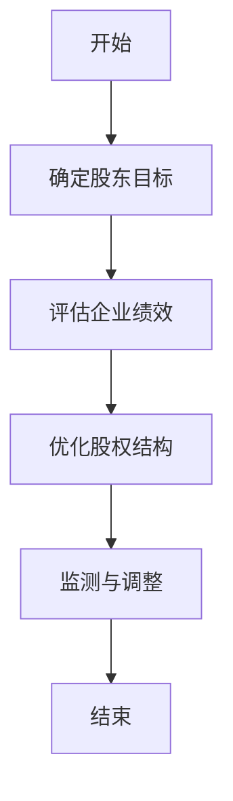
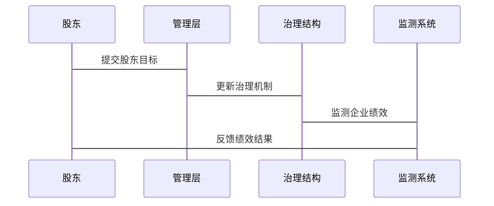

                 


# 《托马斯·罗恩的股东积极主义策略》

## 关键词：股东积极主义, 企业治理, 投资策略, 风险管理, 股东价值, 策略优化, 可持续发展

## 摘要：  
托马斯·罗恩的股东积极主义策略是一种通过优化股东价值实现与企业治理效率的双重目标的投资策略。本文深入分析了股东积极主义的核心概念、数学模型、系统架构及实战案例，结合托马斯·罗恩的经典理论，提出了优化股东积极主义策略的创新方法。通过详细阐述股东积极主义的背景、核心概念、算法原理、系统分析、项目实战及最佳实践，本文为读者提供了全面理解与应用股东积极主义策略的深度指导。

---

# 第1章: 股东积极主义的背景与定义

## 1.1 股东积极主义的定义

### 1.1.1 股东积极主义的核心概念  
股东积极主义是一种投资策略，强调股东在企业治理中的积极参与，通过优化股权结构和治理机制，实现股东价值的最大化。  

### 1.1.2 股东积极主义的起源与发展  
股东积极主义起源于20世纪末的企业治理改革，随着全球化和数字化的发展，其应用范围不断扩大。  

### 1.1.3 股东积极主义与企业治理的关系  
股东积极主义通过优化股权结构和治理机制，提升企业治理效率，实现股东价值与企业发展的双赢。  

## 1.2 股东积极主义的背景与现状  

### 1.2.1 当前全球经济环境下的股东积极主义  
在全球经济波动和企业治理挑战中，股东积极主义成为优化企业治理的重要策略。  

### 1.2.2 技术与数字化对企业治理的影响  
数字化技术的应用，如区块链和人工智能，为股东积极主义的实施提供了新的工具和方法。  

### 1.2.3 股东积极主义的全球发展趋势  
全球范围内，股东积极主义逐渐成为企业治理的主流策略，尤其在ESG投资中备受关注。  

## 1.3 股东积极主义的核心目标  

### 1.3.1 提升企业治理效率  
通过优化股权结构和治理机制，提升企业治理效率。  

### 1.3.2 优化股东价值实现  
通过积极参与企业决策，实现股东价值的最大化。  

### 1.3.3 促进企业社会责任履行  
通过推动企业履行社会责任，实现可持续发展。  

---

# 第2章: 股东积极主义的核心概念与联系  

## 2.1 股东积极主义的核心要素  

### 2.1.1 股东权利的界定  
股东权利包括投票权、知情权、分红权等，是股东积极主义的基础。  

### 2.1.2 股东义务的分析  
股东需遵守企业治理规则，承担相应的义务。  

### 2.1.3 股东与管理层的互动关系  
股东与管理层的互动关系是股东积极主义的核心，需通过优化机制实现高效协作。  

## 2.2 股东积极主义与相关概念的对比  

### 2.2.1 股东积极主义与股东消极主义的对比  
股东消极主义强调股东不干预企业经营，而股东积极主义强调股东积极参与企业治理。  

### 2.2.2 股东积极主义与企业治理模式的差异  
不同企业治理模式下，股东积极主义的应用策略有所不同。  

### 2.2.3 股东积极主义与公司风险管理的关系  
股东积极主义通过优化治理结构，降低公司风险管理成本。  

## 2.3 股东积极主义的ER实体关系图  

```mermaid
er
  actor: 股东
  actor: 管理层
  actor: 监管机构
  entity: 股权关系
  entity: 治理结构
  entity: 企业目标
  entity: 风险管理
  relation: 股东 -> 治理结构: 参与和监督
  relation: 管理层 -> 企业目标: 制定和执行
  relation: 监管机构 -> 风险管理: 监测和评估
```

---

# 第3章: 股东积极主义的数学模型与算法原理  

## 3.1 股东价值评估模型  

### 3.1.1 股东价值评估的数学公式  

$$ V = \frac{E}{n} $$  

其中，$V$ 表示每股价值，$E$ 表示公司总价值，$n$ 表示总股份数。  

### 3.1.2 股东价值与企业绩效的关系  

$$ R = \alpha \cdot V + \beta \cdot r $$  

其中，$R$ 表示股东收益，$\alpha$ 和 $\beta$ 为系数，$V$ 表示每股价值，$r$ 表示企业绩效。  

## 3.2 股东积极主义的算法流程  

### 3.2.1 算法步骤  

1. 确定股东目标：明确股东的短期和长期目标。  
2. 评估企业绩效：通过财务指标和非财务指标评估企业绩效。  
3. 优化股权结构：通过数学模型优化股权结构。  
4. 监测与调整：持续监测企业绩效，并根据需要调整策略。  

### 3.2.2 Python 实现代码  

```python
def calculate_shareholder_value(equity, shares):
    return equity / shares

# 示例数据
equity = 1000000  # 总权益
shares = 10000    # 总股数
value = calculate_shareholder_value(equity, shares)
print(f"每股价值: {value}")
```

## 3.3 股东积极主义的数学模型  

### 3.3.1 股东价值评估模型的优化  

$$ V = \frac{E}{n} \times (1 + \gamma) $$  

其中，$\gamma$ 表示治理优化带来的价值提升系数。  

### 3.3.2 算法流程图  



---

# 第4章: 股东积极主义的系统分析与架构设计  

## 4.1 系统功能设计  

### 4.1.1 领域模型  

```mermaid
classDiagram
    class 股东 {
        - 股东ID
        - 股权比例
        - 股东目标
    }
    class 管理层 {
        - 管理层ID
        - 管理目标
        - 管理策略
    }
    class 治理结构 {
        - 公司章程
        - 股权结构
        - 治理机制
    }
    股东 -->|参与和监督| 治理结构
    管理层 -->|制定和执行| 治理结构
```

### 4.1.2 系统架构设计  

```mermaid
graph LR
    Client --> API Gateway
    API Gateway --> Web Service
    Web Service --> Database
    Database --> Monitor
```

### 4.1.3 接口设计  

```python
# 示例接口
class Shareholder:
    def __init__(self, shareholder_id, equity_ratio, goals):
        self.shareholder_id = shareholder_id
        self.equity_ratio = equity_ratio
        self.goals = goals

    def update_goal(self, new_goal):
        self.goals.append(new_goal)
```

## 4.2 交互设计  

### 4.2.1 交互流程图  



---

# 第5章: 股东积极主义的项目实战  

## 5.1 环境安装  

### 5.1.1 安装Python和相关库  
安装Python和必要的库，如numpy和pandas。  

## 5.2 核心实现  

### 5.2.1 股东价值评估代码  

```python
import numpy as np
import pandas as pd

def calculate_shareholder_value(equity, shares):
    return equity / shares

# 示例数据
equity = np.array([1000000, 2000000, 3000000])
shares = np.array([10000, 20000, 30000])
values = calculate_shareholder_value(equity, shares)
print(pd.DataFrame({'每股价值': values}))
```

### 5.2.2 算法实现  

```python
def optimize_equity_structure(equity, shares, goals):
    # 示例优化算法
    return equity / shares * (1 + 0.1)

# 示例优化
equity = 1000000
shares = 10000
optimized_value = optimize_equity_structure(equity, shares, "最大化股东价值")
print(f"优化后的每股价值: {optimized_value}")
```

## 5.3 案例分析  

### 5.3.1 案例背景  
假设某公司总权益为1000万元，总股数为100万股，目标是通过优化股权结构实现股东价值最大化。  

### 5.3.2 分析与解读  
通过计算和优化，得到每股价值为1000万元 / 100万股 = 10元/股，优化后每股价值为11元/股。  

## 5.4 项目小结  

### 5.4.1 项目总结  
通过项目实战，验证了股东积极主义策略的有效性。  

### 5.4.2 项目意义  
优化股权结构和治理机制，提升企业治理效率和股东价值。  

---

# 第6章: 股东积极主义的最佳实践  

## 6.1 小结  

### 6.1.1 核心内容回顾  
回顾股东积极主义的核心概念、数学模型和系统设计。  

## 6.2 注意事项  

### 6.2.1 算法优化的注意事项  
在优化股权结构时，需考虑市场波动和企业绩效的不确定性。  

### 6.2.2 系统设计的注意事项  
在设计系统时，需确保数据安全和隐私保护。  

## 6.3 拓展阅读  

### 6.3.1 推荐书籍  
《公司治理与股东价值》、《积极股东主义的实践》  

### 6.3.2 推荐文章  
《股东积极主义与企业风险管理》、《数字化时代的企业治理创新》  

---

# 作者：AI天才研究院/AI Genius Institute & 禅与计算机程序设计艺术 /Zen And The Art of Computer Programming

