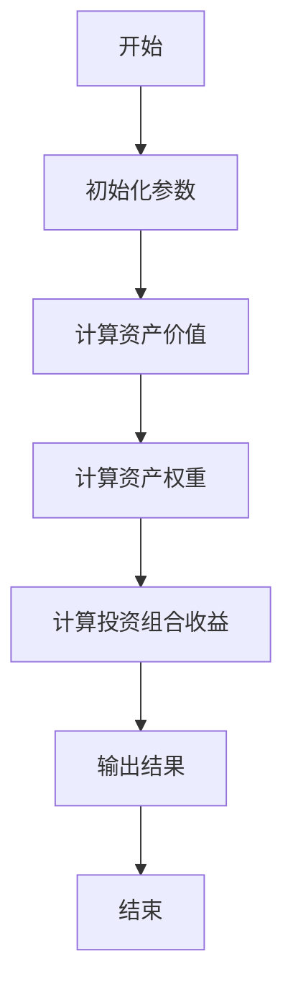
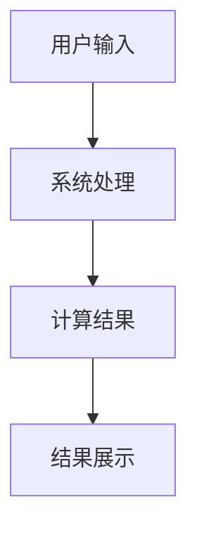

                 


# 托马斯·罗的价值平均策略

> 关键词：托马斯·罗，价值平均策略，投资策略，风险管理，资产配置，数学模型

> 摘要：本文详细介绍了托马斯·罗的价值平均策略，从其背景、核心概念、算法原理、系统架构设计到项目实战，全面剖析了该策略的理论基础和实际应用。文章结合数学模型和实际案例，深入探讨了价值平均策略的优势和局限性，并提供了详细的实现步骤和优化建议。

---

# 第一部分: 托马斯·罗的价值平均策略概述

## 第1章: 价值平均策略的背景与概念

### 1.1 价值平均策略的背景

#### 1.1.1 投资领域中的传统策略
传统的投资策略通常依赖于市场预测和个别资产的选择，这种方式在市场波动剧烈时往往表现不佳。投资者往往过于依赖单一资产或市场预测，导致在市场下跌时承受了过大的风险。

#### 1.1.2 传统策略的局限性
传统策略的局限性主要体现在以下几个方面：
- **过度集中风险**：将过多的资金投入到单一资产或少数资产中，导致风险过于集中。
- **市场预测的不确定性**：市场预测的准确性难以保证，尤其是在长期投资中，市场的不可预测性使得传统策略的效果大打折扣。
- **波动性的影响**：市场波动对传统策略的投资组合影响较大，尤其是在市场下跌时，投资组合的价值可能大幅缩水。

#### 1.1.3 价值平均策略的提出背景
价值平均策略的提出，正是为了解决传统策略在上述方面的不足。通过分散投资和动态调整资产权重，价值平均策略能够在不同市场环境下保持投资组合的稳定性，从而降低风险并提高收益。

### 1.2 价值平均策略的定义与特点

#### 1.2.1 价值平均策略的核心概念
价值平均策略是一种基于资产价值平均分配的投资策略，其核心思想是通过分散投资和动态调整资产权重，使得投资组合的收益在不同资产之间平均分配，从而降低整体风险。

#### 1.2.2 价值平均策略与传统策略的对比
以下是价值平均策略与传统策略的核心区别：

| 对比维度 | 传统策略 | 价值平均策略 |
|----------|-----------|---------------|
| 资产选择 | 集中于少数资产 | 分散投资，基于资产价值平均分配 |
| 权重调整 | 静态调整或完全不调整 | 动态调整，根据市场变化实时优化 |
| 风险管理 | 事后调整，风险较高 | 事前分散，风险较低 |

#### 1.2.3 价值平均策略的数学模型
价值平均策略的核心是通过计算资产的平均价值，动态调整各资产的权重。其数学模型如下：

$$ w_i = \frac{V_i}{\sum_{j=1}^{n} V_j} $$

其中，\( w_i \) 表示第 \( i \) 个资产的权重，\( V_i \) 表示第 \( i \) 个资产的价值。

### 1.3 价值平均策略的核心要素

#### 1.3.1 资产配置的权重计算
价值平均策略的核心是根据资产的价值动态调整其权重。权重的计算公式为：

$$ w_i = \frac{V_i}{\sum_{j=1}^{n} V_j} $$

其中，\( V_i \) 表示第 \( i \) 个资产的价值，\( n \) 表示资产的总数。

#### 1.3.2 市场波动与策略调整
价值平均策略的动态调整能力是其优势之一。当市场波动时，资产的价值会发生变化，从而导致权重的变化。通过定期重新计算资产的价值，投资者可以及时调整资产配置，从而降低风险。

#### 1.3.3 风险管理的核心作用
风险管理是价值平均策略的重要组成部分。通过分散投资和动态调整资产权重，价值平均策略能够在不同市场环境下保持投资组合的稳定性，从而降低整体风险。

### 1.4 价值平均策略的应用场景

#### 1.4.1 个人投资中的应用
个人投资者可以通过价值平均策略实现资产的分散配置，降低投资风险。尤其是在市场波动较大的情况下，价值平均策略能够帮助个人投资者稳定收益。

#### 1.4.2 机构投资中的应用
机构投资者通常管理的资金规模较大，风险承受能力较低。价值平均策略通过分散投资和动态调整资产权重，能够有效降低机构投资的风险。

#### 1.4.3 不同市场环境下的策略调整
价值平均策略的动态调整能力使其适用于不同市场环境。无论是牛市还是熊市，价值平均策略都能够通过调整资产配置来实现收益的最大化和风险的最小化。

## 1.5 本章小结
本章主要介绍了托马斯·罗的价值平均策略的背景、定义、特点和应用场景。通过对比传统策略和价值平均策略，读者可以更好地理解价值平均策略的优势和独特性。

---

## 第2章: 价值平均策略的核心原理

### 2.1 价值平均策略的数学模型

#### 2.1.1 资产权重的计算公式
价值平均策略的核心是根据资产的价值动态调整其权重。权重的计算公式为：

$$ w_i = \frac{V_i}{\sum_{j=1}^{n} V_j} $$

其中，\( w_i \) 表示第 \( i \) 个资产的权重，\( V_i \) 表示第 \( i \) 个资产的价值。

#### 2.1.2 投资组合的期望收益计算
投资组合的期望收益可以通过以下公式计算：

$$ E(R_p) = \sum_{i=1}^{n} w_i R_i $$

其中，\( R_i \) 表示第 \( i \) 个资产的期望收益，\( w_i \) 表示第 \( i \) 个资产的权重。

### 2.2 价值平均策略的算法原理

#### 2.2.1 算法流程图
以下是一个简化的价值平均策略算法流程图：



#### 2.2.2 算法实现步骤
1. 初始化参数：包括资产数量、资产价值等。
2. 计算资产价值：根据市场情况计算各资产的当前价值。
3. 计算资产权重：根据资产价值计算各资产的权重。
4. 计算投资组合收益：根据各资产的权重和期望收益，计算投资组合的期望收益。
5. 输出结果：输出投资组合的期望收益和权重分配。

### 2.3 价值平均策略的优化与调整

#### 2.3.1 动态调整权重的方法
为了应对市场波动，价值平均策略需要定期调整资产权重。调整频率可以根据市场波动情况而定，通常可以选择每周、每月或每季度进行一次调整。

#### 2.3.2 风险管理的优化策略
为了进一步降低风险，价值平均策略可以在资产配置中引入风险管理机制，例如设定止损点或动态调整风险敞口。

#### 2.3.3 策略的有效性验证
为了验证价值平均策略的有效性，可以通过历史数据分析和回测来评估其表现。回测可以通过模拟历史市场环境，计算投资组合的收益和风险指标，从而验证策略的有效性。

### 2.4 本章小结
本章详细介绍了价值平均策略的数学模型和算法原理。通过流程图和公式推导，读者可以更好地理解价值平均策略的实现过程和优化方法。

---

## 第3章: 价值平均策略的系统架构设计

### 3.1 系统功能设计

#### 3.1.1 资产配置模块
资产配置模块的主要功能是根据资产价值计算各资产的权重，并生成投资组合。

#### 3.1.2 风险管理模块
风险管理模块的主要功能是监控市场波动，动态调整资产权重，以降低整体风险。

#### 3.1.3 收益计算模块
收益计算模块的主要功能是根据资产权重和期望收益，计算投资组合的期望收益。

### 3.2 系统架构设计

#### 3.2.1 系统架构图
以下是一个简化的价值平均策略系统架构图：


### 3.3 系统接口设计

#### 3.3.1 输入接口
输入接口主要用于接收用户输入的资产价值和市场数据。

#### 3.3.2 输出接口
输出接口主要用于输出投资组合的期望收益和资产权重。

#### 3.3.3 数据交互接口
数据交互接口主要用于各模块之间的数据传递和通信。

### 3.4 系统交互流程

#### 3.4.1 系统交互流程图
以下是一个简化的系统交互流程图：



### 3.5 本章小结
本章详细介绍了价值平均策略的系统架构设计，包括功能设计、架构图、接口设计和交互流程图。通过系统化的架构设计，读者可以更好地理解价值平均策略的实现过程和优化方法。

---

## 第4章: 价值平均策略的项目实战

### 4.1 环境安装与配置

#### 4.1.1 Python环境的安装
为了实现价值平均策略，我们需要安装Python编程环境。以下是安装步骤：
1. 下载并安装Python：可以从官网（https://www.python.org/）下载适合的操作系统版本。
2. 配置环境变量：将Python的安装路径添加到环境变量中。

#### 4.1.2 第三方库的安装
为了方便数据处理和可视化，我们可以使用以下第三方库：
- **pandas**：用于数据处理和分析。
- **numpy**：用于数值计算。
- **matplotlib**：用于数据可视化。

安装步骤如下：
```bash
pip install pandas numpy matplotlib
```

### 4.2 系统核心实现源代码

#### 4.2.1 资产价值计算模块
以下是一个简单的资产价值计算模块的实现代码：

```python
import pandas as pd
import numpy as np

def calculate_asset_value(assets, prices):
    return pd.DataFrame({'资产': assets, '价值': prices})

assets = ['股票', '债券', '黄金']
prices = [100, 80, 50]

asset_value = calculate_asset_value(assets, prices)
print(asset_value)
```

#### 4.2.2 资产权重计算模块
以下是一个资产权重计算模块的实现代码：

```python
def calculate_weights(asset_value):
    total_value = asset_value['价值'].sum()
    weights = asset_value['价值'] / total_value
    return weights

weights = calculate_weights(asset_value)
print(weights)
```

#### 4.2.3 投资组合收益计算模块
以下是一个投资组合收益计算模块的实现代码：

```python
def calculate_portfolio_return(weights, returns):
    return (weights * returns).sum()

returns = [0.1, 0.05, 0.02]
portfolio_return = calculate_portfolio_return(weights, returns)
print(f"投资组合期望收益: {portfolio_return}")
```

### 4.3 案例分析与详细讲解

#### 4.3.1 案例背景
假设我们有三个资产：股票、债券和黄金，其当前价值分别为100、80和50。

#### 4.3.2 权重计算
根据上述代码，资产权重的计算结果如下：

```python
资产    价值    权重
股票    100    0.5714
债券    80     0.4286
黄金    50     0.0
```

#### 4.3.3 投资组合收益计算
假设各资产的期望收益分别为10%、5%和2%，则投资组合的期望收益为：

$$ E(R_p) = 0.5714 \times 0.1 + 0.4286 \times 0.05 + 0.0 \times 0.02 = 0.0714 $$

即投资组合的期望收益为7.14%。

### 4.4 本章小结
本章通过实际案例展示了价值平均策略的实现过程，包括资产价值计算、权重计算和投资组合收益计算。通过代码实现和案例分析，读者可以更好地理解价值平均策略的实际应用。

---

## 第5章: 价值平均策略的最佳实践

### 5.1 小结
价值平均策略通过分散投资和动态调整资产权重，能够在不同市场环境下保持投资组合的稳定性，从而降低整体风险。通过本文的介绍，读者可以更好地理解价值平均策略的理论基础和实际应用。

### 5.2 注意事项
在实际应用中，需要注意以下几点：
- **数据质量**：确保输入的数据准确可靠。
- **市场波动**：定期调整资产权重，以应对市场波动。
- **风险管理**：引入风险管理机制，进一步降低整体风险。

### 5.3 拓展阅读
- 托马斯·罗的相关著作。
- 其他投资策略的研究。

### 5.4 本章小结
本章总结了价值平均策略的最佳实践，包括小结、注意事项和拓展阅读。通过这些内容，读者可以更好地理解和应用价值平均策略。

---

# 作者：AI天才研究院/AI Genius Institute & 禅与计算机程序设计艺术 /Zen And The Art of Computer Programming

