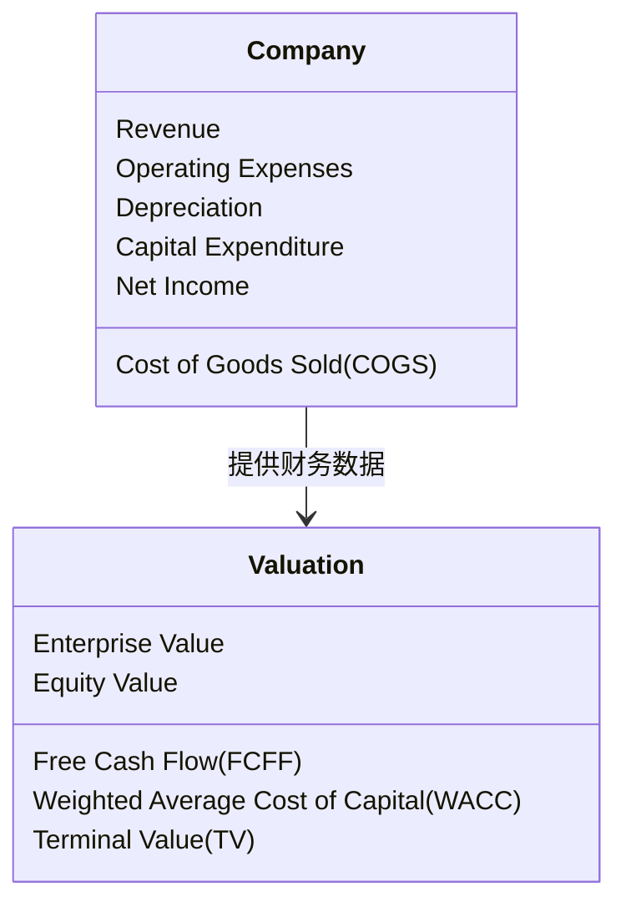
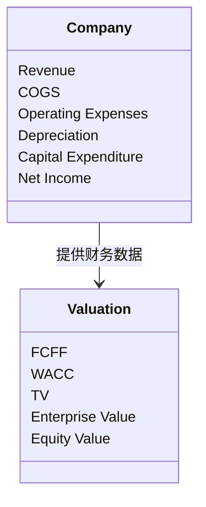

                 


# 托马斯罗的公司估值技巧

## 关键词
- 公司估值
- 现金流折现模型（DCF）
- 相对估值法
- 财务分析
- 企业价值评估
- 系统设计

## 摘要
托马斯罗的公司估值技巧是一套系统化的方法论，旨在帮助投资者和企业高管准确评估公司的内在价值。本文将从公司估值的背景与核心概念出发，详细讲解现金流折现模型（DCF）、相对估值法等核心方法，并通过实际案例分析和系统设计，帮助读者掌握公司估值的实战技巧。文章最后将总结最佳实践和注意事项，为读者提供实用的估值指南。

---

## 第1章：公司估值概述

### 1.1 什么是公司估值
公司估值是通过对公司财务数据、市场环境和管理团队等因素的综合分析，估算公司内在价值的过程。其目的是为投资决策、并购交易和企业融资提供参考依据。

#### 1.1.1 公司估值的定义与目的
- 定义：公司估值是通过对公司未来现金流的预测和折现，估算公司当前的市场价值。
- 目的：帮助投资者和企业高管做出更明智的决策。

#### 1.1.2 公司估值的常见方法
- 现金流折现模型（DCF）
- 相对估值法（基于可比公司）
- 股权自由现金流模型（FCFE）

#### 1.1.3 公司估值的应用场景
- 投资决策
- 并购交易
- 企业融资

### 1.2 公司估值的核心要素
#### 1.2.1 财务数据的重要性
- 利润表：净利润、营业收入、成本
- 资产负债表：资产、负债、股东权益
- 现金流量表：经营活动、投资活动、筹资活动的现金流

#### 1.2.2 市场环境的影响
- 行业周期
- 宏观经济环境
- 利率水平

#### 1.2.3 管理团队的作用
- 管理能力
- 战略规划
- 企业治理

---

## 第2章：现金流折现模型（DCF）

### 2.1 DCF模型的基本原理
DCF模型通过预测公司未来现金流，并将其折现为现值，以估算公司内在价值。其核心假设是：资金的时间价值和风险溢价。

#### 2.1.1 自由现金流的定义
- 自由现金流（FCFF）：公司扣除所有费用后的剩余现金流，可用于偿还债务和股东分红。
- 公式：$$FCFF = \text{净利润} + \text{折旧} + \text{摊销} - \text{资本支出}$$

#### 2.1.2 贴现率的计算方法
- 贴现率（WACC）：加权平均资本成本。
- 公式：$$WACC = w_d \times k_d + w_l \times k_l$$
  - \(w_d\)：债务权重
  - \(k_d\)：债务成本
  - \(w_l\)：股权权重
  - \(k_l\)：股权成本

#### 2.1.3 终值的估算
- 终值（TV）：假设公司以稳定增长率增长，永续年金的现值。
- 公式：$$TV = \frac{FCFF_{n+1}}{WACC - g}$$
  - \(g\)：增长率

### 2.2 DCF模型的步骤与应用

#### 2.2.1 项目介绍
- 项目目标：通过DCF模型估算某公司的内在价值。

#### 2.2.2 系统功能设计（领域模型Mermaid类图）


#### 2.2.3 系统架构设计（Mermaid架构图）


#### 2.2.4 系统接口设计与交互（Mermaid序列图）
```mermaid
sequenceDiagram
    用户 --> 系统：输入财务数据
    系统 --> 数据库：查询历史数据
    数据库 --> 系统：返回数据
    系统 --> 计算模块：计算DCF模型
    计算模块 --> 系统：返回估值结果
    系统 --> 用户：显示结果
```

---

## 第3章：相对估值法

### 3.1 相对估值法的原理
相对估值法通过比较可比公司或行业平均水平的估值指标，估算目标公司的价值。常用指标包括市盈率（P/E）、市净率（P/B）和市销率（P/S）。

#### 3.1.1 市盈率（P/E）分析
- 公式：$$P/E = \frac{\text{股价}}{\text{每股净利润}}$$
- 应用：衡量公司股价是否合理。

#### 3.1.2 市净率（P/B）分析
- 公式：$$P/B = \frac{\text{股价}}{\text{每股净资产}}$$
- 应用：适用于资产密集型行业。

#### 3.1.3 市销率（P/S）分析
- 公式：$$P/S = \frac{\text{股价}}{\text{每股收入}}$$
- 应用：适用于成长型企业。

### 3.2 行业分析与可比公司选择

#### 3.2.1 行业分析的步骤
1. 确定行业周期阶段。
2. 分析行业竞争格局。
3. 评估行业增长潜力。

#### 3.2.2 可比公司筛选标准
- 同行业
- 相似规模
- 相似业务模式

---

## 第4章：财务报表分析

### 4.1 财务报表基础

#### 4.1.1 资产负债表
- 资产：流动资产、非流动资产。
- 负债：流动负债、非流动负债。
- 股东权益：股本、资本公积、盈余公积、未分配利润。

#### 4.1.2 利润表
- 收入：营业收入、其他收入。
- 成本：COGS、运营费用、其他费用。
- 利润：净利润、息税前利润（EBIT）。

#### 4.1.3 现金流量表
- 经营活动现金流：净收入、支付的税费、支付的工资。
- 投资活动现金流：资本支出、投资收益。
- 筹资活动现金流：融资净额、偿还债务。

### 4.2 财务指标分析

#### 4.2.1 股东权益回报率（ROE）
- 公式：$$ROE = \frac{\text{净利润}}{\text{股东权益}}$$
- 应用：衡量公司盈利能力。

#### 4.2.2 净利润率（Net Profit Margin）
- 公式：$$\text{净利润率} = \frac{\text{净利润}}{\text{营业收入}}$$
- 应用：评估成本控制能力。

#### 4.2.3 资产周转率（Asset Turnover）
- 公式：$$\text{资产周转率} = \frac{\text{营业收入}}{\text{平均总资产}}$$
- 应用：衡量资产使用效率。

---

## 第5章：公司估值系统设计

### 5.1 系统功能设计

#### 5.1.1 领域模型Mermaid类图


#### 5.1.2 系统架构Mermaid架构图


#### 5.1.3 系统接口设计与交互Mermaid序列图
```mermaid
sequenceDiagram
    用户 --> 系统：输入公司名称
    系统 --> 数据库：查询公司数据
    数据库 --> 系统：返回数据
    系统 --> 计算模块：计算DCF模型
    计算模块 --> 系统：返回估值结果
    系统 --> 用户：显示结果
```

---

## 第6章：项目实战

### 6.1 环境安装与工具配置

#### 6.1.1 数据收集工具
- Python的pandas库：用于数据清洗和分析。
- Yahoo Finance API：获取股票数据。

#### 6.1.2 数据分析工具
- Python的numpy库：用于数值计算。
- Matplotlib：用于数据可视化。

#### 6.1.3 估值模型开发工具
- Python的scipy库：用于优化计算。

### 6.2 核心代码实现

#### 6.2.1 DCF模型代码实现
```python
import numpy as np

def calculate_wacc(revenue, cost_of_goods_sold, operating_expenses, depreciation, capital_expenditure, tax_rate, wacc):
    ebit = revenue - cost_of_goods_sold - operating_expenses
    ebitda = ebit + depreciation
    free_cash_flow = ebitda - capital_expenditure
    tax = ebit * tax_rate
    wacc = wacc / 100
    terminal_value = free_cash_flow / (wacc - growth_rate)
    enterprise_value = free_cash_flow * (1 + growth_rate) + terminal_value
    equity_value = enterprise_value - debt
    return equity_value

revenue = 100000000
cost_of_goods_sold = 60000000
operating_expenses = 20000000
depreciation = 10000000
capital_expenditure = 5000000
tax_rate = 0.2
wacc = 8
growth_rate = 0.02
debt = 100000000

equity_value = calculate_wacc(revenue, cost_of_goods_sold, operating_expenses, depreciation, capital_expenditure, tax_rate, wacc)
print("Equity Value:", equity_value)
```

---

## 第7章：最佳实践与注意事项

### 7.1 最佳实践
- 数据质量：确保财务数据的准确性和完整性。
- 模型假设：合理假设增长率和贴现率。
- 持续学习：关注行业动态和市场变化。

### 7.2 小结
公司估值是一项复杂但重要的任务，需要结合财务分析、市场环境和系统设计。通过DCF模型和相对估值法，投资者可以更准确地评估公司的内在价值。

### 7.3 注意事项
- 避免过度依赖单一估值方法。
- 考虑宏观经济环境的影响。
- 定期更新估值模型。

### 7.4 拓展阅读
- 《企业价值评估》
- 《投资学》
- 《财务报表分析》

---

## 作者
作者：AI天才研究院/AI Genius Institute  
联系：[禅与计算机程序设计艺术](https://github.com/AI-Genius-Institute)  
简介：专注于人工智能和计算机程序设计的研究与实践，致力于为技术爱好者提供高质量的技术内容。

