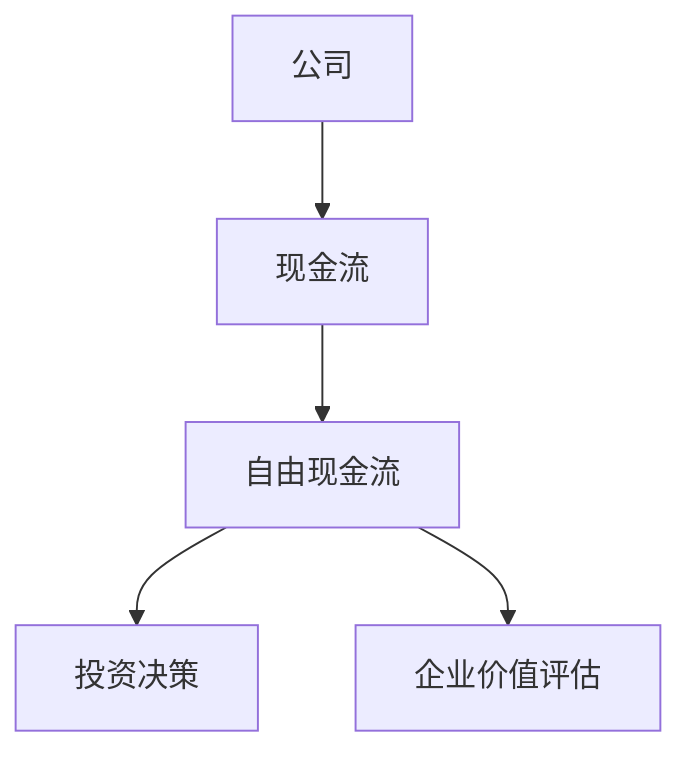
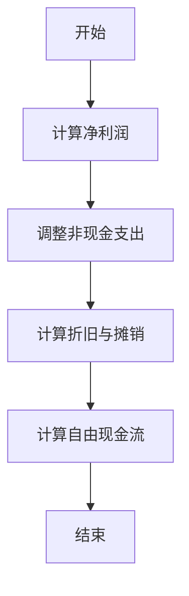
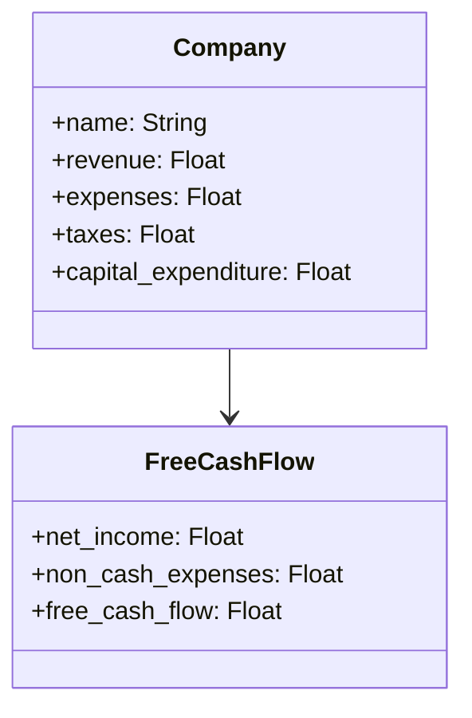

                 


# 托马斯罗的自由现金流分析

> 关键词：托马斯·罗，自由现金流，财务分析，投资决策，企业价值评估

> 摘要：本文详细探讨了托马斯·罗的自由现金流分析方法，从基本概念到高级应用，结合数学模型和实际案例，系统地讲解了如何利用自由现金流进行企业价值评估和投资决策。

---

## 第一部分: 托马斯·罗的自由现金流分析基础

### 第1章: 自由现金流分析概述

#### 1.1 自由现金流的基本概念

##### 1.1.1 自由现金流的定义
自由现金流（Free Cash Flow，简称FCF）是指企业在扣除所有必要的支出后，剩余的可用于偿还债务、投资于成长项目或回馈股东的资金。托马斯·罗的分析方法强调自由现金流的重要性，认为它是评估企业财务健康状况和投资价值的核心指标。

##### 1.1.2 自由现金流的重要性
自由现金流不仅反映了企业的盈利能力，还体现了其将利润转化为现金的能力。托马斯·罗指出，自由现金流是企业创造价值的核心，能够帮助投资者识别出那些能够持续产生超额收益的企业。

##### 1.1.3 托马斯·罗的分析方法
托马斯·罗的自由现金流分析方法结合了定量分析和定性判断，通过对企业未来现金流的预测和贴现，来评估企业的内在价值。这种方法强调对行业趋势、竞争优势和管理质量的深入分析。

---

#### 1.2 自由现金流分析的背景与应用

##### 1.2.1 自由现金流分析的历史背景
自由现金流分析起源于20世纪70年代，随着现代财务理论的发展，尤其是在巴菲特、彼得·林奇等投资大师的推动下，自由现金流逐渐成为评估企业价值的重要工具。

##### 1.2.2 自由现金流分析的现实意义
在当前全球经济环境下，企业面临复杂多变的市场环境，通过自由现金流分析可以帮助投资者识别出那些在经济低迷时期仍能保持稳健增长的企业。

##### 1.2.3 自由现金流在投资决策中的应用
托马斯·罗的分析方法广泛应用于股票投资、企业估值和并购决策中，特别是在评估科技企业和成长型企业时，自由现金流分析尤为重要。

---

#### 1.3 自由现金流分析的核心要素

##### 1.3.1 自由现金流的计算公式
$$\text{自由现金流} = \text{营业收入} - \text{运营成本} - \text{税费} - \text{资本支出}$$

##### 1.3.2 自由现金流的关键指标
| 指标名称      | 定义与作用                      |
|---------------|-------------------------------|
| FCFF          | �股权自由现金流，用于评估股东价值 |
| FCFE          | 权益自由现金流，用于评估企业整体价值 |
| FCFL          | 公司自由现金流，用于评估企业运营效率 |

##### 1.3.3 自由现金流与企业价值的关系
自由现金流是企业价值的核心驱动因素，托马斯·罗通过对企业未来自由现金流的预测和贴现，计算出企业的内在价值，从而为投资决策提供依据。

---

#### 1.4 自由现金流分析的边界与外延

##### 1.4.1 自由现金流分析的边界条件
托马斯·罗的分析方法依赖于对企业未来现金流的准确预测，因此需要考虑行业风险、政策变化和市场波动等外部因素。

##### 1.4.2 自由现金流分析的外延领域
自由现金流分析不仅适用于企业估值，还广泛应用于项目评估、资本预算和风险管理等领域。

##### 1.4.3 自由现金流与其他财务指标的关系
托马斯·罗强调，自由现金流与其他财务指标（如净利润、ROE等）的结合使用，能够更全面地评估企业的财务状况和经营效率。

---

#### 1.5 本章小结
本章从自由现金流的基本概念出发，详细介绍了托马斯·罗的分析方法及其应用背景。通过对比其他财务指标，揭示了自由现金流在企业价值评估中的核心地位。

---

## 第2章: 自由现金流的核心概念与联系

### 2.1 自由现金流的核心概念原理

#### 2.1.1 自由现金流的计算原理
托马斯·罗的自由现金流分析方法基于以下原理：
1. 企业的价值来源于其未来自由现金流的现值。
2. 自由现金流的计算需要考虑企业的实际运营情况和行业特点。

#### 2.1.2 自由现金流的属性特征
| 属性       | 描述                     |
|------------|--------------------------|
| 时间性      | 现金流的时间价值         |
| 大小        | 现金流的规模             |
| 可持续性     | 企业产生现金流的能力     |

#### 2.1.3 自由现金流的实体关系图


---

### 2.2 自由现金流与相关指标的对比

#### 2.2.1 自由现金流与净利润的对比
净利润是企业利润的总体现，但未考虑资金的时间价值和风险因素。托马斯·罗指出，仅关注净利润而不考虑现金流的企业容易陷入“利润陷阱”。

#### 2.2.2 自由现金流与经营活动现金流的对比
经营活动现金流反映企业日常运营中的现金流入和流出，而自由现金流更关注企业用于再投资和回报股东的现金。

#### 2.2.3 自由现金流与投资活动现金流的对比
投资活动现金流反映企业对外投资的现金流出，而自由现金流则关注企业通过投资活动所产生的现金流入。

---

### 2.3 自由现金流的ER实体关系图


---

### 2.4 本章小结
本章通过对比分析，揭示了自由现金流与净利润、经营活动现金流等指标的区别和联系，强调了自由现金流在企业价值评估中的独特作用。

---

## 第3章: 自由现金流分析的算法原理

### 3.1 自由现金流分析的算法流程



---

### 3.2 自由现金流分析的数学模型

#### 3.2.1 自由现金流公式
$$\text{FCFF} = \text{净利润} - \text{非现金支出}$$

#### 3.2.2 自由现金流与企业价值的关系
$$\text{企业价值} = \text{FCFF} \times \text{贴现率}$$

---

### 3.3 自由现金流分析的Python实现

```python
def calculate_fcff(net_income, non_cash_expenses):
    return net_income - non_cash_expenses
```

---

### 3.4 自由现金流分析的举例说明
假设某公司2023年的净利润为100万元，非现金支出为20万元，则其自由现金流为：
$$\text{FCFF} = 100 - 20 = 80 \text{万元}$$

---

### 3.5 本章小结
本章通过流程图和数学公式，详细讲解了自由现金流的计算方法，并通过实际案例进行了说明，帮助读者更好地理解和应用托马斯·罗的分析方法。

---

## 第4章: 自由现金流分析的系统架构设计

### 4.1 问题场景介绍
以某科技公司为例，我们需要通过自由现金流分析来评估其投资价值。

---

### 4.2 系统功能设计

#### 4.2.1 领域模型类图


#### 4.2.2 系统架构图


#### 4.2.3 系统接口设计
- 输入接口：企业财务数据
- 输出接口：自由现金流和企业价值评估结果

#### 4.2.4 系统交互序列图


---

### 4.3 本章小结
本章通过系统架构设计，详细描述了如何利用自由现金流分析来评估企业价值，帮助读者更好地理解托马斯·罗的分析方法在实际中的应用。

---

## 第5章: 自由现金流分析的项目实战

### 5.1 环境安装与配置
- 安装Python和相关数据分析库（如Pandas、NumPy）
- 安装Mermaid和PlantUML工具

---

### 5.2 核心算法实现

```python
def calculate_fcff(net_income, non_cash_expenses):
    return net_income - non_cash_expenses
```

---

### 5.3 代码实现与解读
```python
# 安装依赖
pip install pandas numpy

# 示例代码
import pandas as pd
import numpy as np

def calculate_fcff(net_income, non_cash_expenses):
    return net_income - non_cash_expenses

# 数据输入
data = {
    '公司': ['A', 'B', 'C'],
    '净利润': [100, 150, 200],
    '非现金支出': [20, 30, 40]
}

df = pd.DataFrame(data)
df['自由现金流'] = df.apply(lambda x: calculate_fcff(x['净利润'], x['非现金支出']), axis=1)

print(df)
```

---

### 5.4 实际案例分析
以某科技公司为例，分析其自由现金流，并评估其投资价值。

---

### 5.5 项目小结
本章通过项目实战，帮助读者掌握托马斯·罗自由现金流分析方法的实际应用，提升数据分析和编程能力。

---

## 第6章: 自由现金流分析的最佳实践

### 6.1 小结
托马斯·罗的自由现金流分析方法是评估企业价值的重要工具，通过准确预测未来现金流并合理贴现，可以帮助投资者识别出具有投资价值的企业。

---

### 6.2 注意事项
- 数据的准确性和完整性是关键
- 需要考虑行业特性和宏观环境
- 贴现率的选择会影响最终结果

---

### 6.3 拓展阅读
推荐阅读托马斯·罗的经典著作《自由现金流分析入门》和《投资的数学艺术》。

---

## 作者：AI天才研究院/AI Genius Institute & 禅与计算机程序设计艺术 /Zen And The Art of Computer Programming

---

以上是《托马斯罗的自由现金流分析》的技术博客文章目录和部分内容，希望对您有所帮助！

