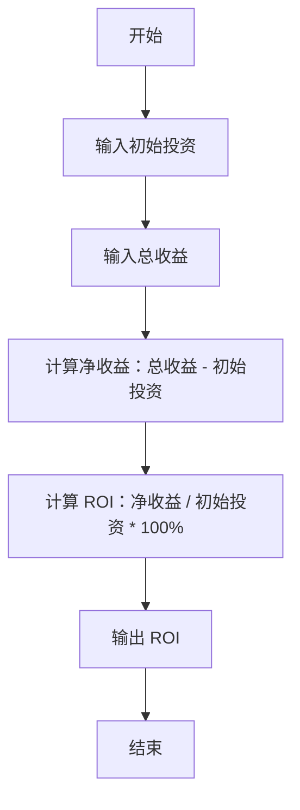
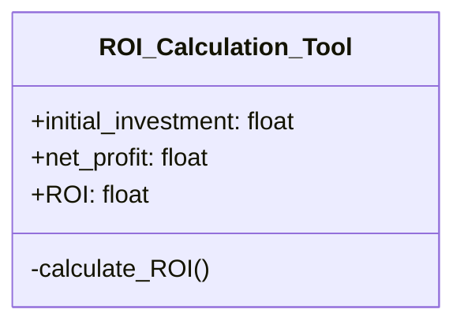
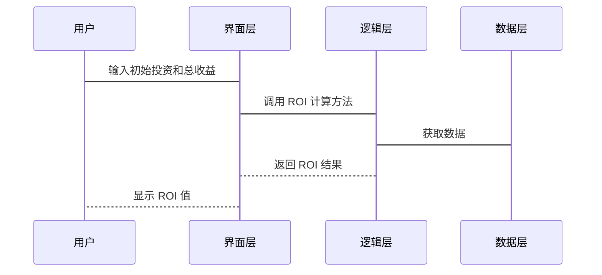

                 


# 投资回报率分析工具

> 关键词：投资回报率分析工具、投资回报率计算、项目评估、收益分析、投资决策支持

> 摘要：本文详细探讨了投资回报率分析工具的设计与实现，从核心概念、算法原理到系统架构，再到项目实战，全面解析了如何利用投资回报率分析工具进行高效的项目评估和投资决策支持。文章结合实际案例，深入浅出地展示了投资回报率分析工具在不同场景下的应用，并提供了具体的代码实现和系统架构设计。

---

# 第一部分：投资回报率分析工具的背景与概念

## 第1章：投资回报率分析工具的背景

### 1.1 投资回报率分析工具的背景

#### 1.1.1 投资回报率分析的必要性

在商业决策中，投资回报率（ROI）是一个关键指标，用于评估投资项目的价值和可行性。无论是企业还是个人投资者，都需要通过 ROI 分析来判断投资的收益与风险。然而，手动计算 ROI 的过程复杂且容易出错，尤其是在涉及多个项目或复杂财务数据时。因此，开发一个高效的投资回报率分析工具变得尤为重要。

#### 1.1.2 投资回报率分析工具的发展历程

投资回报率分析工具并非新技术，但随着计算机技术的飞速发展，尤其是大数据和人工智能的兴起，ROI 分析工具的功能和性能得到了显著提升。从早期的简单计算器到如今的智能化分析平台，ROI 分析工具经历了从单一功能到多功能集成的演变。

#### 1.1.3 当前市场对投资回报率分析工具的需求

随着全球经济的不确定性增加，投资者对 ROI 分析工具的需求也日益增长。无论是初创企业还是大型跨国公司，都需要依赖 ROI 分析工具来优化投资决策，降低风险，提高投资效率。

---

### 1.2 投资回报率分析工具的核心概念

#### 1.2.1 投资回报率（ROI）的定义

投资回报率（ROI）是衡量投资项目盈利能力的重要指标，其计算公式为：

$$ ROI = \frac{净收益}{初始投资} \times 100\% $$

其中，净收益 = 总收益 - 初始投资。

#### 1.2.2 投资回报率分析工具的功能特点

1. 自动化 ROI 计算。
2. 多项目对比分析。
3. 数据可视化。
4. 风险评估与预警。

#### 1.2.3 投资回报率分析工具的适用场景

1. 企业项目投资决策。
2. 个人投资理财规划。
3. 金融数据分析与建模。

---

### 1.3 本章小结

本章介绍了投资回报率分析工具的背景、核心概念及其在实际场景中的应用。通过理解 ROI 的基本概念和分析工具的功能特点，读者可以为后续的技术实现打下基础。

---

# 第二部分：投资回报率分析工具的核心概念与联系

## 第2章：投资回报率分析工具的核心概念

### 2.1 投资回报率分析工具的核心原理

#### 2.1.1 投资回报率计算公式

$$ ROI = \frac{净收益}{初始投资} \times 100\% $$

其中，净收益可以通过以下步骤计算：

1. 计算总收益。
2. 计算初始投资。
3. 净收益 = 总收益 - 初始投资。

#### 2.1.2 投资回报率与净现值的关系

净现值（NPV）是另一个常用的财务指标，与 ROI 有所不同。NPV 是将未来现金流按折扣率折现到现值，再减去初始投资。ROI 更注重相对回报，而 NPV 更注重绝对价值。

#### 2.1.3 投资回报率分析工具的数学模型

通过数学建模，我们可以将 ROI 计算过程抽象为一个函数：

$$ ROI = f(净收益, 初始投资) $$

其中，净收益和初始投资是输入参数，函数 f 表示 ROI 的计算逻辑。

### 2.2 投资回报率分析工具的核心要素对比

#### 2.2.1 核心要素属性特征对比表格

| 属性      | 初始投资 | 总收益 | 净收益 | ROI |
|-----------|----------|--------|--------|-----|
| 含义      | 投入资金 | 总收益 | 净收益 | ROI 值 |
| 示例值    | $10,000 | $15,000 | $5,000 | 50% |

#### 2.2.2 实体关系图（ER图）架构

```mermaid
erd
actor:Investor
actor:Analyst
entity:ROI_Calculation
actor:Investor --> entity:ROI_Calculation
actor:Analyst --> entity:ROI_Calculation
```

### 2.3 投资回报率分析工具的算法流程

#### 2.3.1 算法流程图（Mermaid图）



### 2.4 本章小结

本章通过数学建模和流程图的方式，详细解释了投资回报率分析工具的核心原理和算法流程，为后续的系统设计奠定了基础。

---

# 第三部分：投资回报率分析工具的算法原理

## 第3章：投资回报率分析工具的算法原理

### 3.1 投资回报率计算的数学模型

#### 3.1.1 投资回报率公式

$$ ROI = \frac{净收益}{初始投资} \times 100\% $$

其中，净收益的计算公式为：

$$ 净收益 = 总收益 - 初始投资 $$

#### 3.1.2 投资回报率分析工具的算法实现

以下是一个简单的 Python 实现示例：

```python
def calculate ROI(net_profit, initial_investment):
    return (net_profit / initial_investment) * 100
```

### 3.2 投资回报率分析工具的算法流程

#### 3.2.1 算法流程图（Mermaid图）


### 3.3 投资回报率分析工具的代码实现

#### 3.3.1 Python 代码示例

```python
def calculate ROI(net_profit, initial_investment):
    return (net_profit / initial_investment) * 100

# 示例用法
initial_investment = 10000
net_profit = 5000
print(f"ROI = {calculate ROI(net_profit, initial_investment)}%")
```

### 3.4 本章小结

本章通过数学公式和代码示例，详细讲解了投资回报率分析工具的算法原理，为后续的系统设计提供了技术支持。

---

# 第四部分：投资回报率分析工具的系统分析与架构设计

## 第4章：投资回报率分析工具的系统分析与架构设计

### 4.1 问题场景介绍

#### 4.1.1 投资回报率分析的典型场景

投资者需要快速计算多个项目的 ROI，以便进行决策。

#### 4.1.2 工具在实际项目中的应用

企业可以通过 ROI 分析工具优化投资决策，降低风险。

### 4.2 系统功能设计

#### 4.2.1 领域模型（Mermaid类图）



### 4.3 系统架构设计

#### 4.3.1 系统架构图（Mermaid图）


### 4.4 系统接口设计

#### 4.4.1 API 接口定义

```python
class ROIAnalyzer:
    def __init__(self, initial_investment, net_profit):
        self.initial_investment = initial_investment
        self.net_profit = net_profit

    def calculate ROI(self):
        return (self.net_profit / self.initial_investment) * 100
```

### 4.5 系统交互设计

#### 4.5.1 序列图（Mermaid图）



### 4.6 本章小结

本章通过系统架构设计和交互设计，展示了投资回报率分析工具的整体结构和功能实现。

---

# 第五部分：投资回报率分析工具的项目实战

## 第5章：投资回报率分析工具的项目实战

### 5.1 环境安装与配置

#### 5.1.1 开发环境搭建

建议使用 Python 3.8 或更高版本，安装必要的库如 `numpy` 和 `pandas`。

#### 5.1.2 必要软件安装

安装 Python 和必要的开发工具。

### 5.2 系统核心实现

#### 5.2.1 关键功能实现代码

```python
class ROIAnalyzer:
    def __init__(self, initial_investment, net_profit):
        self.initial_investment = initial_investment
        self.net_profit = net_profit

    def calculate ROI(self):
        return (self.net_profit / self.initial_investment) * 100

    def is_profitable(self, threshold=50):
        return self.calculate ROI() >= threshold
```

### 5.3 代码应用解读与分析

#### 5.3.1 代码功能说明

上述代码实现了 ROI 计算和盈利能力判断两个功能。`calculate ROI()` 方法返回 ROI 值，`is_profitable()` 方法判断 ROI 是否超过预设的阈值。

### 5.4 实际案例分析

#### 5.4.1 案例分析与解读

假设某项目初始投资为 $10,000，总收益为 $15,000，净收益为 $5,000。计算 ROI：

$$ ROI = \frac{5000}{10000} \times 100\% = 50\% $$

项目 ROI 为 50%，超过预设的阈值 50%，因此该项目是盈利的。

### 5.5 本章小结

本章通过实际案例分析，展示了投资回报率分析工具的应用场景和实现过程。

---

# 第六部分：投资回报率分析工具的最佳实践与小结

## 第6章：投资回报率分析工具的最佳实践

### 6.1 最佳实践 tips

1. 在进行 ROI 分析时，确保数据的准确性和完整性。
2. 结合其他财务指标（如 NPV）进行综合评估。
3. 定期更新和优化 ROI 分析工具的功能。

### 6.2 小结

投资回报率分析工具是一个强大的决策支持工具，能够帮助投资者快速、准确地评估投资项目的价值。通过本文的详细讲解，读者可以深入了解 ROI 的计算方法、工具的设计与实现，并能够将其应用到实际场景中。

### 6.3 注意事项

在使用 ROI 分析工具时，需注意以下几点：

1. ROI 仅适用于短期项目评估。
2. ROI 不考虑时间价值，需结合其他指标进行分析。
3. 数据输入需准确，避免计算错误。

### 6.4 拓展阅读

1. 《Financial Analysis and Decision Making》
2. 《Python for Finance: Mastering Data-Driven Finance》

---

# 作者：AI天才研究院/AI Genius Institute & 禅与计算机程序设计艺术 /Zen And The Art of Computer Programming

---

**全文完**

