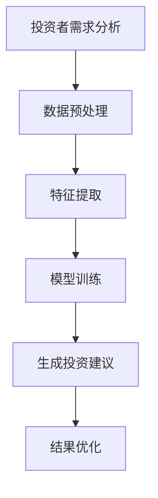

                 


# 投资建议生成与优化

> **关键词**：投资建议生成、优化策略、机器学习、大数据分析、算法原理  
>
> **摘要**：本文将详细探讨投资建议生成与优化的核心概念、算法原理、系统架构及项目实现。通过结合大数据分析与人工智能技术，本文将为您提供一套完整的投资建议生成与优化方案，帮助您更好地理解投资建议的生成过程及其优化策略。

---

## 第1章 投资建议生成与优化的背景介绍

### 1.1 投资建议生成的背景

#### 1.1.1 传统投资建议的局限性
传统投资建议主要依赖于人工分析和经验判断，这种方式不仅效率低下，还容易受到主观因素的影响。例如，分析师的主观判断可能受到情绪波动或市场趋势的影响，导致建议的准确性不足。

#### 1.1.2 AI驱动投资建议的兴起
随着人工智能技术的快速发展，投资建议生成逐渐从人工模式向自动化、智能化方向转变。通过机器学习算法，系统能够快速分析海量数据，生成个性化的投资建议，从而提高投资决策的效率和准确性。

#### 1.1.3 数字化投资建议的市场需求
近年来，数字化投资工具的市场需求持续增长。投资者希望通过智能化的系统获取实时、准确的投资建议，尤其是在市场波动剧烈的情况下，自动化投资建议系统能够提供及时的反馈和调整策略。

---

### 1.2 投资建议生成的核心问题

#### 1.2.1 投资者行为分析
投资者的行为受到多种因素的影响，包括风险偏好、市场认知、情绪波动等。理解投资者行为是生成个性化投资建议的基础。

#### 1.2.2 市场数据的实时性与多样性
市场数据具有高度的实时性和多样性，包括股票价格、经济指标、行业动态等。如何有效处理这些数据是投资建议生成系统的核心挑战之一。

#### 1.2.3 投资策略的个性化与动态调整
每个投资者的需求和风险承受能力不同，投资策略需要高度个性化。同时，市场环境的变化要求投资建议能够动态调整，以适应新的市场条件。

---

### 1.3 投资建议生成的边界与外延

#### 1.3.1 边界条件的定义
投资建议生成系统需要明确自身的边界条件，例如数据来源、目标用户群体、市场范围等。这些边界条件决定了系统的功能和性能。

#### 1.3.2 外延领域的拓展
投资建议生成系统的外延领域包括风险管理、投资教育、金融产品推荐等。通过拓展这些领域，可以进一步提升系统的价值和应用范围。

#### 1.3.3 核心要素与组成结构
投资建议生成系统的核心要素包括数据采集、模型构建、策略生成和用户交互。这些要素共同构成了系统的整体架构。

---

## 第2章 投资建议生成系统的核心概念

### 2.1 投资建议生成系统的核心要素

#### 2.1.1 数据源与特征提取
数据源是投资建议生成的基础，包括历史市场数据、实时行情、用户行为数据等。特征提取过程需要从这些数据中提取有价值的信息，例如波动率、收益率等。

#### 2.1.2 模型算法与优化策略
模型算法是投资建议生成的核心，包括机器学习算法、优化算法等。优化策略则是为了提高建议的准确性和可操作性，例如基于遗传算法的优化策略。

#### 2.1.3 交互界面与用户反馈
交互界面是用户与系统之间的桥梁，用户通过界面输入需求并接收建议。用户反馈是优化系统的重要依据，系统通过反馈不断改进自身的建议生成能力。

---

### 2.2 核心概念的属性特征对比

#### 2.2.1 数据源的特征对比表

| 数据源类型 | 描述 | 优点 | 缺点 |
|------------|------|------|------|
| 历史数据   | 过去的市场数据 | 可预测性高 | 无法反映当前市场情况 |
| 实时数据   | 当前的市场数据 | 实时性强 | 数据量大，处理复杂 |

#### 2.2.2 模型算法的性能对比
| 算法类型 | 描述 | 优点 | 缺点 |
|----------|------|------|------|
| 线性回归 | 基于线性关系的预测模型 | 简单易懂 | 预测精度有限 |
| 神经网络 | 基于深度学习的预测模型 | 预测精度高 | 计算复杂度高 |

#### 2.2.3 优化策略的优缺点分析
| 优化策略 | 优点 | 缺点 |
|----------|------|------|
| 遗传算法 | 具备全局搜索能力 | 计算时间较长 |
| 梯度下降 | 计算效率高 | 易陷入局部最优 |

---

### 2.3 投资建议生成系统的ER实体关系图

```mermaid
er
    actor:投资者
    model:投资建议生成模型
    data:市场数据
    feedback:用户反馈
    action:投资行为
    actor --> data
    actor --> model
    model --> feedback
    feedback --> model
    model --> action
```

---

## 第3章 投资建议生成算法的原理

### 3.1 基于机器学习的生成算法

#### 3.1.1 基于序列模型的生成方法
序列模型，如LSTM（长短期记忆网络），能够有效捕捉时间序列数据中的模式和趋势，适用于股票价格预测等任务。

#### 3.1.2 基于强化学习的生成策略
强化学习通过模拟投资行为，优化投资策略。例如，使用Q-Learning算法，根据市场反馈调整投资决策。

#### 3.1.3 基于图神经网络的生成模型
图神经网络能够处理复杂的市场关系，例如股票之间的相互影响，适用于生成复杂的投资组合建议。

---

### 3.2 投资建议生成算法的流程图



---

### 3.3 算法实现的Python代码示例

```python
import numpy as np
import pandas as pd
from sklearn.linear_model import LinearRegression

# 示例数据
data = pd.DataFrame({
    'price': [100, 105, 110, 115, 120],
    'volume': [1000, 900, 1200, 800, 1100]
})

# 特征提取
X = data[['volume']]
y = data['price']

# 模型训练
model = LinearRegression()
model.fit(X, y)

# 生成投资建议
new_volume = np.array([[1000]])
predicted_price = model.predict(new_volume)
print(f"预测价格为: {predicted_price[0]:.2f}")
```

---

## 第4章 投资建议生成与优化的系统架构

### 4.1 系统功能设计

#### 4.1.1 数据采集模块
数据采集模块负责从多种数据源获取市场数据，包括股票价格、经济指标等。

#### 4.1.2 数据处理模块
数据处理模块对采集到的数据进行清洗、转换和特征提取，为后续分析提供基础。

#### 4.1.3 模型构建模块
模型构建模块使用机器学习算法训练投资建议生成模型，例如LSTM网络。

#### 4.1.4 策略优化模块
策略优化模块通过优化算法（如遗传算法）对生成的投资建议进行优化，提高策略的收益和风险比。

#### 4.1.5 用户交互模块
用户交互模块提供友好的用户界面，用户可以通过界面输入需求并接收投资建议。

---

### 4.2 系统架构设计


---

## 第5章 投资建议生成与优化的项目实战

### 5.1 环境安装

#### 5.1.1 安装Python
```bash
python --version
```

#### 5.1.2 安装必要的库
```bash
pip install numpy pandas scikit-learn
```

---

### 5.2 核心代码实现

#### 5.2.1 数据预处理
```python
import pandas as pd
import numpy as np

# 加载数据
data = pd.read_csv('market_data.csv')

# 数据清洗
data.dropna(inplace=True)

# 特征提取
features = data[['volume', 'open', 'high', 'low']]
target = data['close']
```

#### 5.2.2 模型训练
```python
from sklearn.linear_model import LinearRegression
from sklearn.metrics import mean_squared_error

model = LinearRegression()
model.fit(features, target)

# 预测
predicted = model.predict(features)
print(f"预测误差: {mean_squared_error(target, predicted):.2f}")
```

---

### 5.3 实际案例分析

#### 5.3.1 案例背景
假设我们有一个股票的历史数据，希望通过投资建议生成系统生成买入或卖出的信号。

#### 5.3.2 数据分析
通过分析股票的历史价格和成交量，模型生成买入建议。

#### 5.3.3 策略优化
通过优化算法调整建议的执行时间和数量，以最大化收益并最小化风险。

---

## 第6章 总结与展望

### 6.1 本章小结
本文详细介绍了投资建议生成与优化的核心概念、算法原理和系统架构，并通过实际案例展示了项目的实现过程。通过结合机器学习和大数据分析技术，投资建议生成系统能够为投资者提供高效、个性化的投资建议。

### 6.2 最佳实践 Tips
- 确保数据的实时性和准确性
- 选择合适的算法和模型
- 定期优化和调整投资策略
- 提供清晰的用户反馈和交互界面

### 6.3 注意事项
- 风险提示：投资有风险，建议根据市场情况和自身风险承受能力进行决策
- 数据隐私：确保用户数据的安全和隐私

### 6.4 拓展阅读
- 《机器学习在金融领域的应用》
- 《基于深度学习的投资预测模型》

---

**作者：AI天才研究院/AI Genius Institute & 禅与计算机程序设计艺术/Zen And The Art of Computer Programming**

