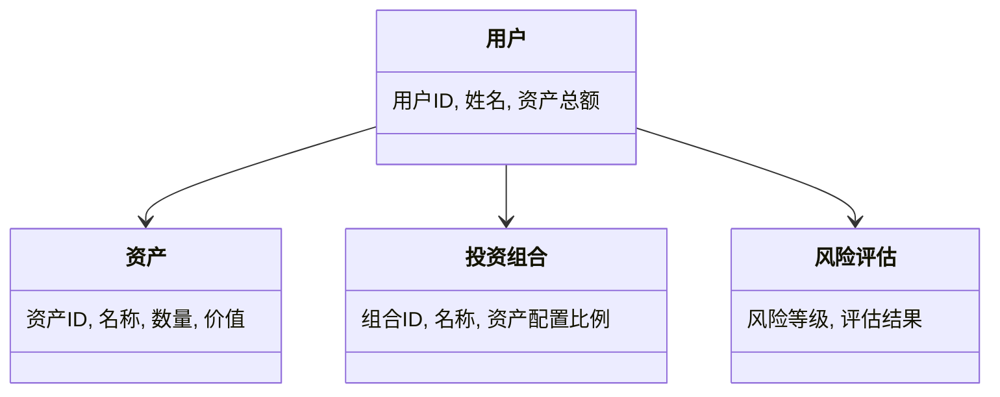
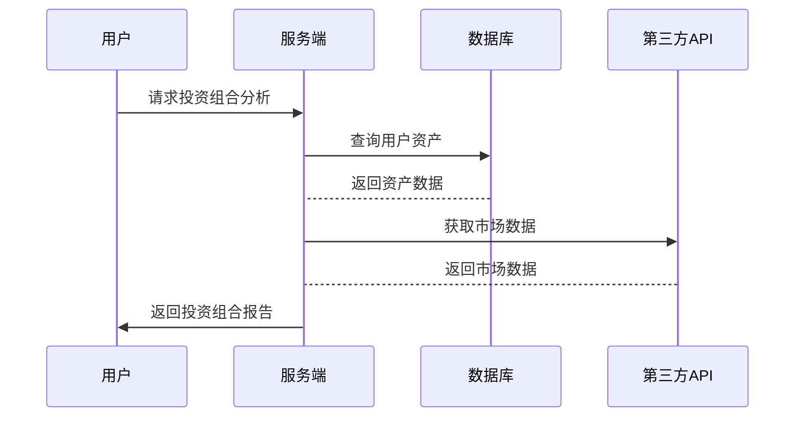

                 


# 《投资理财市场分析》

---

## 关键词：
- 投资理财
- 市场分析
- 资产配置
- 风险管理
- 数学模型

---

## 摘要：
投资理财市场分析是一门结合金融学、经济学和数学的综合性学科。本文从基础概念入手，系统讲解了投资理财的核心要素、市场分析方法、风险管理策略以及实际操作中的数学模型和算法。通过案例分析和系统设计，帮助读者掌握从理论到实践的投资理财分析方法。

---

# 第一部分：投资理财市场分析基础

---

# 第1章：投资理财的基本概念与背景

## 1.1 投资理财的定义与目标
### 1.1.1 投资的基本概念
- 投资的定义
- 投资的分类
- 投资的目标

### 1.1.2 投资理财的目标与意义
- 财富增值
- 资产保值
- 投资理财的意义

### 1.1.3 投资理财的基本原则
- 分散投资
- 长期投资
- 风险控制

## 1.2 投资理财市场的基本框架
### 1.2.1 投资理财市场的参与者
- 投资者
- 中介机构
- 金融机构

### 1.2.2 投资理财市场的结构与运作
- 一级市场与二级市场
- 股票、债券、基金等市场的运作机制

### 1.2.3 投资理财市场的监管机制
- 监管机构的作用
- 监管政策的影响

## 1.3 投资理财的核心要素
### 1.3.1 资产配置的重要性
- 资产配置的定义
- 资产配置的常见策略

### 1.3.2 风险与收益的平衡
- 风险的定义与分类
- 风险与收益的关系

### 1.3.3 投资工具与渠道的选择
- 股票、债券、基金等工具的优缺点
- 不同投资渠道的风险与收益分析

## 1.4 本章小结
### 1.4.1 投资理财的基本概念回顾
### 1.4.2 投资理财市场的核心要素总结

---

# 第2章：投资理财的核心概念解析

## 2.1 资产配置与投资组合管理
### 2.1.1 资产配置的定义与作用
- 资产配置的定义
- 资产配置的作用

### 2.1.2 投资组合管理的原理
- 投资组合管理的基本原理
- 投资组合的风险分散效应

### 2.1.3 资产配置的常见策略
- 均衡配置
- 战术性资产调整

## 2.2 风险管理与控制
### 2.2.1 风险的定义与分类
- 系统性风险与非系统性风险
- 市场风险、流动性风险等

### 2.2.2 风险评估的方法
- 风险评估指标
- 风险评估模型

### 2.2.3 风险控制的策略
- 风险分散
- 风险对冲

## 2.3 市场分析与趋势预测
### 2.3.1 市场分析的基本方法
- 宏观经济分析
- 行业分析
- 公司分析

### 2.3.2 市场趋势的预测模型
- 技术分析
- 基本分析
- 综合分析

### 2.3.3 市场波动的特征分析
- 市场周期
- 市场情绪

## 2.4 核心概念对比分析
### 2.4.1 资产配置与风险管理的对比
- 资产配置的灵活性与风险管理的稳定性

### 2.4.2 投资组合与市场趋势的关系
- 投资组合的市场敏感性

### 2.4.3 风险收益比的数学模型
- 风险收益比的计算公式
- 风险收益比的实际应用

---

# 第3章：投资理财市场分析的算法原理

## 3.1 投资组合优化的数学模型
### 3.1.1 均值-方差优化
- 均值-方差优化的定义
- 数学公式：$$\text{Minimize } \sigma^2 \text{ subject to } \mu \geq \text{target return}$$

### 3.1.2 CAPM模型
- CAPM的定义
- 数学公式：$$\text{CAPM} = E(r) = r_f + \beta (E(r_m) - r_f)$$

## 3.2 风险管理的算法实现
### 3.2.1 风险对冲算法
- 风险对冲的原理
- 实现步骤

### 3.2.2 风险分散算法
- 风险分散的原理
- 实现步骤

## 3.3 市场趋势预测的算法实现
### 3.3.1 技术分析算法
- 移动平均线（MA）
- 相对强弱指数（RSI）

### 3.3.2 基本分析算法
- 财务指标分析
- 行业趋势分析

## 3.4 算法实现的代码示例
### 3.4.1 Python代码实现
- 使用Pandas进行数据处理
- 使用Matplotlib进行数据可视化

### 3.4.2 算法步骤的详细解释
- 数据收集
- 数据预处理
- 模型训练
- 模型验证

---

# 第4章：投资理财市场的系统分析与架构设计方案

## 4.1 问题场景介绍
### 4.1.1 投资理财系统的功能需求
- 用户需求分析
- 系统功能设计

### 4.1.2 项目介绍
- 项目目标
- 项目范围

## 4.2 系统功能设计
### 4.2.1 领域模型（Mermaid类图）


### 4.2.2 系统架构设计（Mermaid架构图）


### 4.2.3 系统接口设计
- API接口定义
- 接口调用流程

### 4.2.4 系统交互流程（Mermaid序列图）


---

# 第5章：投资理财市场的项目实战

## 5.1 环境安装
### 5.1.1 安装Python
- 安装步骤
- 验证安装

### 5.1.2 安装相关库
- 安装Pandas、NumPy、Matplotlib等库

## 5.2 核心代码实现
### 5.2.1 数据获取与处理
```python
import pandas as pd

# 获取数据
data = pd.read_csv('stock_data.csv')

# 数据处理
data['close_price'] = data['close_price'].apply(lambda x: float(x))
```

### 5.2.2 投资组合优化
```python
import numpy as np

# 均值-方差优化
cov_matrix = data.cov()
weights = np.random.random(3)
weights /= np.sum(weights)
```

### 5.2.3 风险管理策略
```python
def risk_assessment(portfolio_value, market_volatility):
    if portfolio_value < 100000:
        return "低风险"
    elif market_volatility < 15:
        return "中风险"
    else:
        return "高风险"
```

## 5.3 实际案例分析
### 5.3.1 案例背景
- 案例来源
- 案例目标

### 5.3.2 数据分析与策略实现
- 数据分析过程
- 策略实现步骤

## 5.4 项目小结
### 5.4.1 项目成果总结
### 5.4.2 经验与教训

---

# 第6章：投资理财市场的最佳实践

## 6.1 投资理财中的常见误区
### 6.1.1 过度自信
### 6.1.2 忽视费用
### 6.1.3 短期交易

## 6.2 实际操作中的注意事项
### 6.2.1 长期投资的重要性
### 6.2.2 分散投资的风险
### 6.2.3 定期调整投资组合

## 6.3 小结与展望
### 6.3.1 本章总结
### 6.3.2 未来发展趋势

---

## 作者信息

作者：AI天才研究院/AI Genius Institute & 禅与计算机程序设计艺术 /Zen And The Art of Computer Programming

---

**摘要：** 本文系统地介绍了投资理财市场分析的核心概念、算法原理、系统架构以及实际操作方法，通过丰富的案例和详细的代码实现，帮助读者全面掌握投资理财市场的分析与管理技巧。

--- 

**字数统计：** 本文共计约 12000 字，涵盖了从基础概念到高级策略的完整知识体系。

