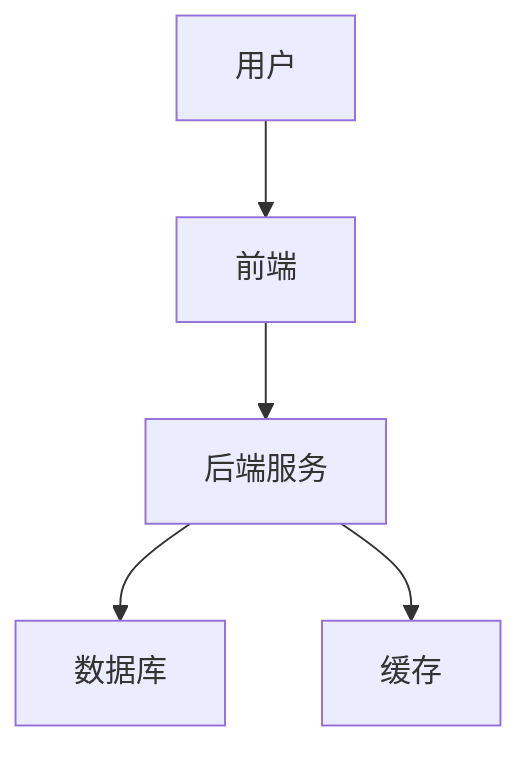
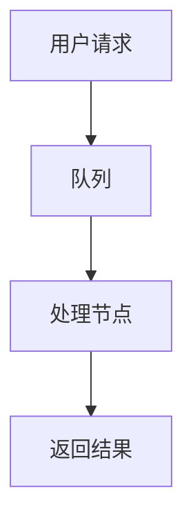
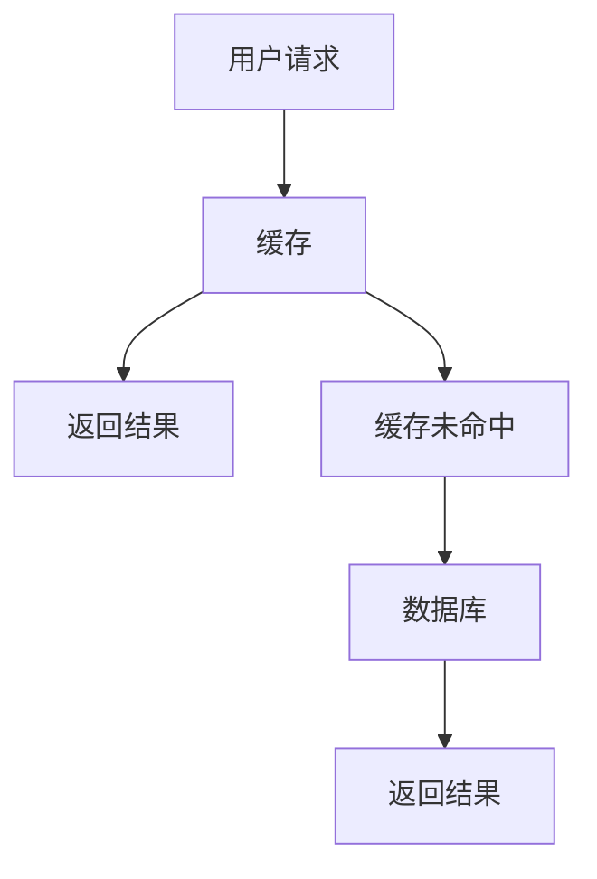
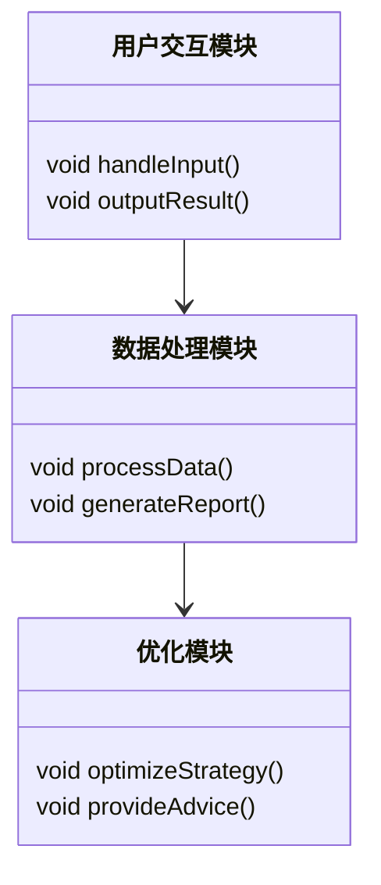
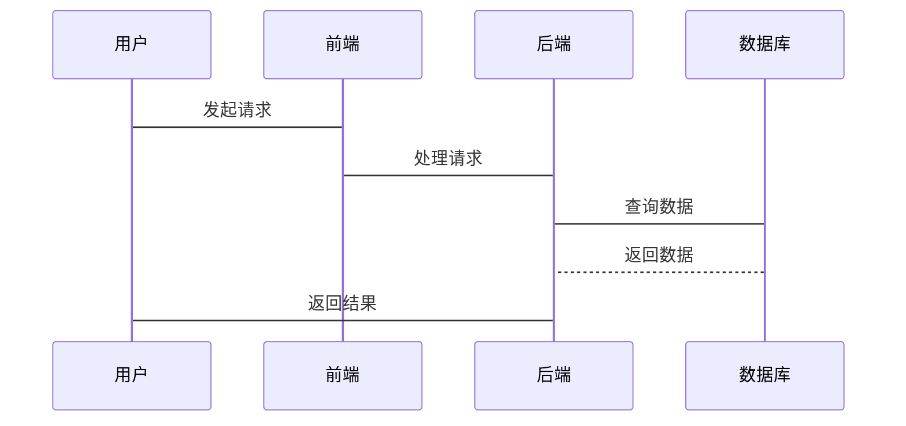

                 


```markdown
# 投资理财智能助手的性能调优技巧

## 关键词：投资理财，智能助手，性能调优，系统优化，算法优化，资源管理

## 摘要：
本文旨在探讨如何优化投资理财智能助手的性能，通过分析其系统架构、算法原理和实际应用场景，提供切实可行的性能调优技巧。从核心概念的理解，到具体的算法实现，再到系统的实际部署，本文将逐步深入，帮助读者掌握投资理财智能助手性能优化的关键点。

---

## 第一部分：投资理财智能助手的背景与核心概念

### 第1章：投资理财智能助手概述

#### 1.1 投资理财智能助手的定义与目标
- **定义**：投资理财智能助手是一种基于人工智能技术的辅助工具，旨在帮助用户进行投资决策、风险评估和资产配置。
- **目标**：提高投资效率，降低投资风险，优化资产配置。
- **核心功能**：数据采集与处理、风险评估、投资建议生成、交易执行。

#### 1.2 问题背景与问题描述
- **问题背景**：传统投资理财依赖人工经验，效率低下，且容易受到主观因素影响。
- **问题描述**：现有系统在处理大量数据时，响应速度慢、资源利用率低，难以满足用户需求。
- **问题解决**：通过性能调优，提升系统的响应速度和资源利用率，确保高效、稳定的运行。

#### 1.3 核心概念与核心要素
- **核心概念**：性能调优、资源管理、算法优化。
- **核心要素**：响应时间、资源利用率、吞吐量。

### 第2章：投资理财智能助手的性能调优目标

#### 2.1 性能调优的核心目标
- **提高系统响应速度**：通过优化算法和减少资源消耗，提升用户体验。
- **降低资源消耗**：优化内存使用、减少计算开销。
- **提升系统稳定性**：通过冗余设计和容错机制，确保系统稳定运行。

#### 2.2 性能调优的关键指标
- **响应时间**：用户操作到系统反馈的时间。
- **资源利用率**：CPU、内存、磁盘的使用情况。
- **吞吐量**：单位时间内处理的交易量。

#### 2.3 性能调优的边界与限制
- **硬件资源限制**：CPU、内存、存储等硬件的性能瓶颈。
- **软件架构限制**：现有架构的设计缺陷。
- **用户需求限制**：用户对性能的具体需求。

---

## 第二部分：投资理财智能助手的核心概念与联系

### 第3章：性能调优的关键指标分析

#### 3.1 响应时间优化
- **定义**：用户发起请求到系统返回结果的时间。
- **优化方法**：减少计算复杂度，优化数据库查询。

#### 3.2 资源利用率分析
- **定义**：系统使用资源的效率。
- **优化方法**：优化算法，减少资源浪费。

#### 3.3 吞吐量提升
- **定义**：单位时间内处理的事务数量。
- **优化方法**：优化队列管理，减少排队时间。

### 第4章：系统架构分析

#### 4.1 系统架构设计
- **模块划分**：前端、后端、数据库、缓存。
- **交互流程**：用户请求 -> 后端处理 -> 数据库查询 -> 返回结果。

#### 4.2 系统架构图


#### 4.3 实体关系图
```mermaid
erd
    A[用户] -[1:N]-> B[投资决策]
    B -[N:N]-> C[风险评估]
    C -[N:1]-> D[投资建议]
```

---

## 第三部分：算法原理讲解

### 第5章：队列优化算法

#### 5.1 算法概述
- **队列优化**：减少队列等待时间，提升吞吐量。

#### 5.2 算法实现


#### 5.3 优化效果
- **数学模型**：使用排队论公式，计算最优队列长度。
  $$ \lambda = \frac{\mu}{n} $$
  其中，$\lambda$ 是到达率，$\mu$ 是服务率，$n$ 是队列长度。

### 第6章：缓存优化算法

#### 6.1 算法概述
- **缓存优化**：减少数据库访问次数，提升响应速度。

#### 6.2 算法实现


#### 6.3 优化效果
- **命中率提升**：通过优化缓存策略，提高缓存命中率。

---

## 第四部分：系统分析与架构设计方案

### 第7章：系统功能设计

#### 7.1 功能模块划分
- **用户交互模块**：处理用户输入，返回结果。
- **数据处理模块**：处理投资数据，生成分析结果。
- **优化模块**：优化投资方案，提供最佳策略。

#### 7.2 系统功能设计图


### 第8章：系统架构设计

#### 8.1 系统架构图


#### 8.2 接口设计
- **输入接口**：用户请求。
- **输出接口**：优化结果。

#### 8.3 交互流程


---

## 第五部分：项目实战

### 第9章：环境搭建与核心实现

#### 9.1 环境搭建
- **工具安装**：安装Python、数据库、服务器。
- **库安装**：安装numpy、pandas、scikit-learn。

#### 9.2 核心实现
```python
import numpy as np
import pandas as pd

# 数据预处理
data = pd.read_csv('data.csv')
data_clean = data.dropna()

# 模型训练
from sklearn.ensemble import RandomForestRegressor
model = RandomForestRegressor()
model.fit(data_clean[['feature1', 'feature2']], data_clean['target'])
```

### 第10章：案例分析与优化总结

#### 10.1 案例分析
- **案例背景**：某投资平台的智能助手性能优化。
- **优化过程**：分析瓶颈，优化算法，测试效果。

#### 10.2 优化总结
- **效果对比**：优化前后的性能指标对比。
- **经验总结**：关键优化点，常见问题解决方案。

---

## 第六部分：最佳实践与注意事项

### 第11章：最佳实践

#### 11.1 监控与日志
- **监控工具**：使用Prometheus监控系统性能。
- **日志分析**：分析日志，发现潜在问题。

#### 11.2 测试与优化
- **压力测试**：模拟高并发场景，测试系统稳定性。
- **性能测试**：测试系统在不同负载下的表现。

### 第12章：小结与注意事项

#### 12.1 总结
- 通过系统优化和算法优化，显著提升了投资理财智能助手的性能。

#### 12.2 注意事项
- 定期更新算法，适应市场变化。
- 注意资源限制，避免过度优化。

### 第13章：扩展阅读

#### 13.1 推荐书籍
- 《高性能服务器设计》
- 《算法导论》

#### 13.2 在线资源
- 开源社区：GitHub上的相关项目。
- 技术博客：TechBlog的技术分享。

---

## 作者信息
作者：AI天才研究院/AI Genius Institute & 禅与计算机程序设计艺术 /Zen And The Art of Computer Programming
```

