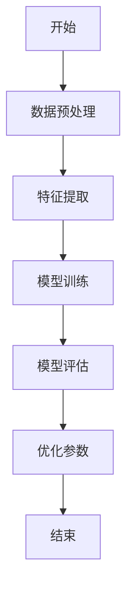
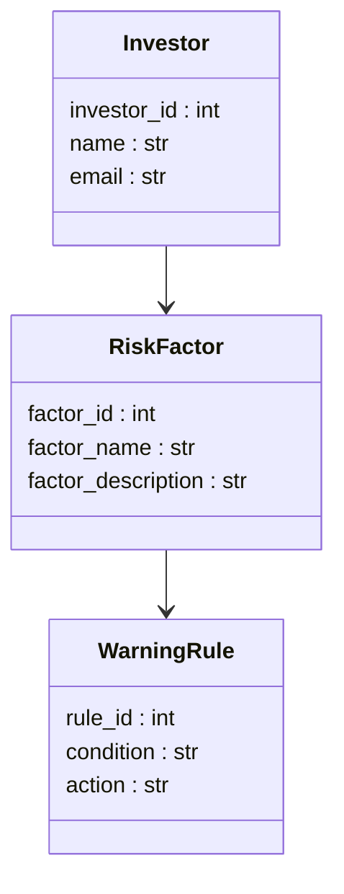
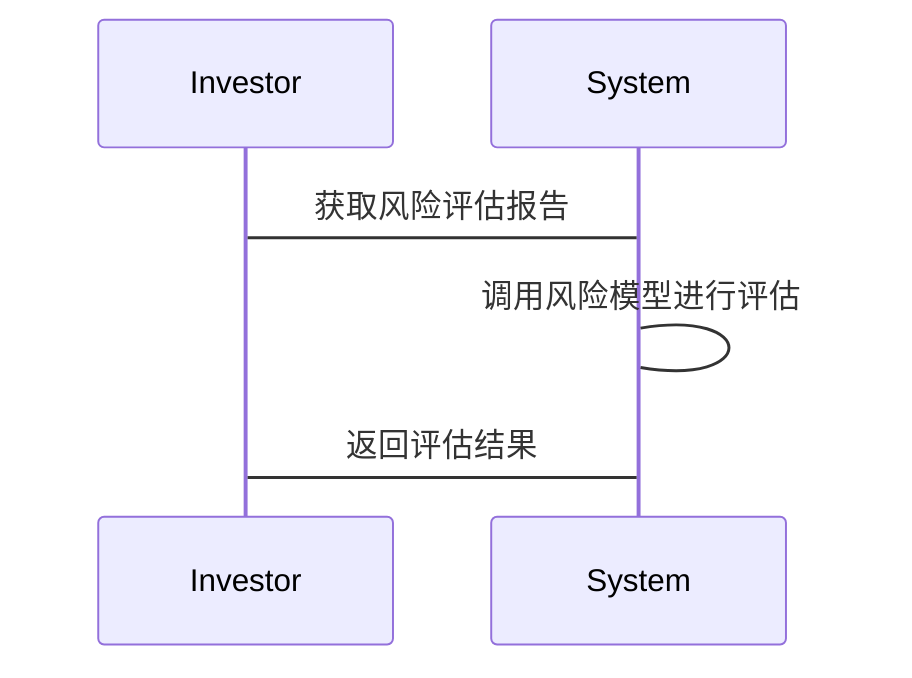

                 


# 投资风险提示系统

> 关键词：投资风险，风险提示，系统设计，机器学习，预警机制

> 摘要：本文详细探讨了投资风险提示系统的设计与实现，从核心概念到算法原理，从系统架构到项目实战，全面解析了投资风险提示系统的构建过程。文章通过具体案例分析和代码实现，深入浅出地展示了如何利用技术手段帮助投资者规避风险，提升投资决策的准确性。

---

## 第1章 投资风险提示系统背景介绍

### 1.1 投资风险提示系统概述

#### 1.1.1 系统定义
投资风险提示系统是一种通过分析市场数据、投资者行为和经济指标，提前识别潜在风险并发出预警的智能化系统。其核心目标是帮助投资者在面对市场波动时做出更明智的决策，避免重大损失。

#### 1.1.2 系统目标与功能
- **目标**：实时监控市场动态，识别潜在风险，提供及时的预警信息。
- **功能**：
  - 数据采集与处理
  - 风险评估与分析
  - 预警信息推送
  - 投资建议生成

#### 1.1.3 系统边界与外延
- **边界**：系统主要关注投资市场中的风险因素，不涉及具体的交易操作。
- **外延**：可扩展至宏观经济分析、行业风险评估等领域。

---

### 1.2 投资风险提示系统的核心概念

#### 1.2.1 数据采集与处理
- 数据来源：股票价格、市场指数、经济指标等。
- 处理方法：数据清洗、特征提取、数据增强。

#### 1.2.2 风险评估模型
- 基于机器学习的模型，如随机森林、XGBoost，用于预测市场波动风险。

#### 1.2.3 预警机制
- 通过设置阈值，当风险指数超过阈值时触发预警。

---

## 第2章 核心概念与联系

### 2.1 核心概念原理

#### 2.1.1 数据采集与处理
- 数据采集流程：从API获取实时数据，存储到数据库中。
- 数据清洗：处理缺失值、异常值。

#### 2.1.2 风险评估模型
- 算法选择：基于历史数据训练模型，评估当前市场的风险等级。

#### 2.1.3 预警机制
- 预警触发条件：模型预测的高风险概率。

### 2.2 核心概念属性特征对比表

| 概念       | 属性       | 特征描述                                                                 |
|------------|------------|--------------------------------------------------------------------------|
| 数据采集   | 实时性     | 需要实时获取市场数据                                                     |
| 风险模型   | 准确性     | 模型预测的准确性直接影响预警的可靠性                                     |
| 预警机制   | 及时性     | 需要在风险发生前及时触发预警                                           |

### 2.3 ER实体关系图

```mermaid
erDiagram
    investor(investor_id, name, email) {
        investor_id : KEY
    }
    risk_factor(factor_id, factor_name, factor_description) {
        factor_id : KEY
    }
    warning_rule(rule_id, condition, action) {
        rule_id : KEY
    }
    investor "1..*"
    risk_factor "1..*"
    warning_rule "1..*"
```

---

## 第3章 算法原理

### 3.1 算法流程图



### 3.2 算法代码实现

```python
import pandas as pd
from sklearn.ensemble import RandomForestClassifier

# 数据加载
data = pd.read_csv('market_data.csv')

# 特征提取
features = data[['price', 'volume', 'change']]
target = data['risk_label']

# 模型训练
model = RandomForestClassifier()
model.fit(features, target)

# 预测
new_data = pd.read_csv('new_market_data.csv')
new_features = new_data[['price', 'volume', 'change']]
predictions = model.predict(new_features)
```

### 3.3 数学模型

风险评估模型的损失函数：
$$
L = \sum_{i=1}^{n} (y_i - \hat{y}_i)^2
$$

---

## 第4章 系统分析与架构设计

### 4.1 系统功能模块

#### 4.1.1 领域模型类图



### 4.2 系统架构设计


### 4.3 接口设计

#### 4.3.1 数据接口

```json
{
    "endpoint": "/api/risk/factor",
    "method": "GET",
    "params": {
        "symbol": "AAPL"
    }
}
```

### 4.4 系统交互流程图



---

## 第5章 项目实战

### 5.1 环境搭建

#### 5.1.1 安装依赖

```bash
pip install pandas scikit-learn flask
```

### 5.2 核心代码实现

#### 5.2.1 数据处理

```python
import pandas as pd

# 加载数据
data = pd.read_csv('market_data.csv')

# 数据清洗
data.dropna(inplace=True)
data.to_csv('cleaned_data.csv', index=False)
```

#### 5.2.2 风险评估模型

```python
from sklearn.ensemble import RandomForestClassifier

# 模型训练
model = RandomForestClassifier()
model.fit(X_train, y_train)

# 模型评估
score = model.score(X_test, y_test)
print(f"模型准确率：{score}")
```

### 5.3 案例分析

#### 5.3.1 案例背景

假设我们要评估某股票的风险，数据包括过去30天的价格、成交量和波动率。

#### 5.3.2 分析过程

1. 数据预处理：清洗数据，提取相关特征。
2. 模型训练：使用随机森林模型进行训练。
3. 预测结果：模型预测该股票的高风险概率为85%。

### 5.4 项目小结

通过本项目，我们成功实现了投资风险提示系统的核心功能，验证了模型的有效性，并展示了系统的实际应用价值。

---

## 第6章 最佳实践

### 6.1 实用建议

1. 数据来源：确保数据的实时性和准确性。
2. 模型选择：根据实际情况选择合适的算法，定期更新模型。
3. 系统扩展：考虑未来的扩展性，如加入更多风险因子。

### 6.2 总结

投资风险提示系统通过技术手段帮助投资者降低风险，提升投资决策的科学性。本文详细介绍了系统的构建过程，为实际应用提供了参考。

### 6.3 注意事项

- 数据隐私：确保投资者数据的安全性。
- 模型优化：定期监控模型性能，避免过拟合。
- 系统维护：及时修复漏洞，确保系统稳定运行。

### 6.4 拓展阅读

- 《机器学习实战》
- 《投资学原理》
- 《系统设计指南》

---

## 作者

作者：AI天才研究院 & 禅与计算机程序设计艺术

