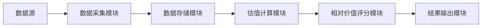
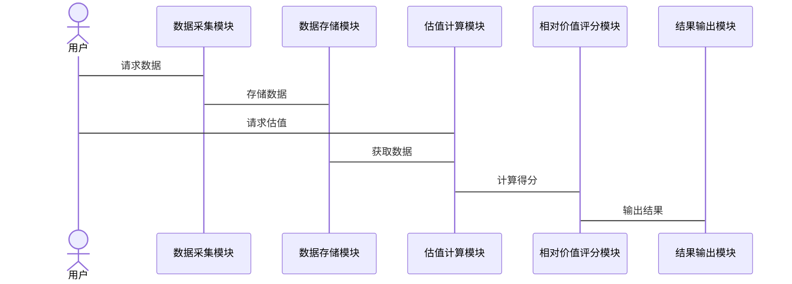

                 


# 目录大纲：《拉尔夫·旺格的相对价值投资：在同行中寻找最佳标的》

---

## 1. 相对价值投资的背景与基础

### 1.1 相对价值投资的定义与核心概念

#### 1.1.1 相对价值投资的定义

相对价值投资是一种通过比较同一行业内不同公司之间的估值指标，寻找被市场低估或高估的投资标的的方法。它不同于绝对价值投资，更注重相对估值而非绝对估值。

#### 1.1.2 相对价值投资的核心要素

- **行业比较**：在同一行业中，比较公司的估值指标（如市盈率、市净率等）。
- **相对估值**：通过相对估值指标（如EV/EBITDA、P/E等）寻找估值偏离合理的公司。
- **竞争优势**：分析公司的竞争优势，如成本优势、技术优势等。

#### 1.1.3 相对价值投资与绝对价值投资的区别

- **绝对价值投资**：基于公司基本面分析，估算其内在价值，判断其是否被市场低估或高估。
- **相对价值投资**：比较同一行业内的公司，寻找估值相对合理的标的。

---

## 2. 相对价值投资的核心概念与分析框架

### 2.1 相对价值投资的关键指标

#### 2.1.1 市盈率（P/E）分析

市盈率 = 股价 / 每股净利润

- **市盈率低**：可能意味着公司被低估。
- **市盈率高**：可能意味着公司被高估。

#### 2.1.2 市净率（P/B）分析

市净率 = 股价 / 每股净资产

- **市净率低**：可能意味着公司资产被低估。
- **市净率高**：可能意味着公司资产被高估。

#### 2.1.3 股息率与股息支付率分析

股息率 = 每股股息 / 股价

股息支付率 = 股息 / 净利润

- **股息率高**：可能意味着公司有稳定的分红能力。
- **股息支付率高**：可能意味着公司净利润不足以支撑股息支付。

---

### 2.2 行业比较与相对估值方法

#### 2.2.1 行业横向比较分析

- **横向比较**：在同一行业，比较公司的市盈率、市净率等指标，寻找估值较低的公司。

#### 2.2.2 行业纵向比较分析

- **纵向比较**：在同一行业，比较不同时间点的估值指标，寻找估值周期性低点。

#### 2.2.3 相对估值模型的构建与应用

- **构建相对估值模型**：基于行业平均市盈率、市净率等指标，构建相对估值模型。
- **应用相对估值模型**：通过模型判断公司是否被市场低估或高估。

---

### 2.3 相对价值投资的多因子分析

#### 2.3.1 多因子模型的构建

- **多因子模型**：结合多个因子（如市盈率、市净率、股息率等）构建多因子模型。
- **因子权重**：根据因子的重要性，赋予不同的权重。

#### 2.3.2 多因子模型在相对价值投资中的应用

- **应用步骤**：
  1. 收集行业内的公司数据。
  2. 计算各公司的多因子得分。
  3. 根据得分排序，寻找得分最高的公司。

#### 2.3.3 多因子模型的优缺点分析

- **优点**：
  - 考虑了多个因子，更加全面。
  - 减少了单一因子的波动性影响。
- **缺点**：
  - 计算复杂，需要大量的数据支持。
  - 因子选择和权重分配可能影响结果。

---

## 3. 相对价值投资的算法与数学模型

### 3.1 相对价值投资的算法流程

#### 3.1.1 数据收集与预处理

- **数据来源**：公司财务报表、行业数据、市场数据等。
- **数据清洗**：处理缺失值、异常值等。

#### 3.1.2 估值指标计算

- **计算步骤**：
  1. 计算市盈率、市净率等指标。
  2. 计算多因子得分。

#### 3.1.3 相对价值评分与排序

- **评分方法**：根据多因子模型计算得分。
- **排序方法**：根据得分排序，寻找得分最高的公司。

### 3.2 相对价值投资的优化算法

#### 3.2.1 线性回归模型在相对价值投资中的应用

- **线性回归模型**：用于预测公司估值。
- **应用步骤**：
  1. 收集数据。
  2. 构建线性回归模型。
  3. 预测公司估值。

#### 3.2.2 支持向量机（SVM）在相对价值投资中的应用

- **SVM模型**：用于分类和回归。
- **应用步骤**：
  1. 收集数据。
  2. 构建SVM模型。
  3. 分析公司估值。

#### 3.2.3 随机森林在相对价值投资中的应用

- **随机森林模型**：用于分类和回归。
- **应用步骤**：
  1. 收集数据。
  2. 构建随机森林模型。
  3. 分析公司估值。

### 3.3 相对价值投资的数学模型

#### 3.3.1 多因子模型的数学表达

$$ Score = \sum_{i=1}^{n} w_i \times Factor_i $$

其中，$w_i$ 是因子 $i$ 的权重，$Factor_i$ 是因子的值。

#### 3.3.2 线性回归模型的数学表达

$$ Y = \beta_0 + \beta_1 X_1 + \beta_2 X_2 + \ldots + \beta_k X_k + \epsilon $$

其中，$Y$ 是因变量，$X_i$ 是自变量，$\beta_i$ 是回归系数，$\epsilon$ 是误差项。

---

## 4. 相对价值投资的系统分析与架构设计

### 4.1 系统功能设计

#### 4.1.1 数据采集模块

- **功能**：收集公司财务数据、市场数据等。
- **工具**：API接口、数据库等。

#### 4.1.2 估值计算模块

- **功能**：计算市盈率、市净率等指标。
- **工具**：Python、Excel等。

#### 4.1.3 相对价值评分模块

- **功能**：根据多因子模型计算得分。
- **工具**：Python、机器学习算法等。

### 4.2 系统架构设计

#### 4.2.1 系统架构图



#### 4.2.2 系统交互流程图



---

## 5. 相对价值投资的项目实战

### 5.1 项目背景与目标

#### 5.1.1 项目背景

选择一个具体的行业（如科技行业），分析行业内公司。

#### 5.1.2 项目目标

通过相对价值投资方法，寻找行业内最佳标的。

### 5.2 项目实施步骤

#### 5.2.1 数据收集与预处理

- **数据来源**：公司财务报表、市场数据等。
- **数据清洗**：处理缺失值、异常值等。

#### 5.2.2 估值指标计算

- **计算步骤**：
  1. 计算市盈率、市净率等指标。
  2. 计算多因子得分。

#### 5.2.3 相对价值评分与排序

- **评分方法**：根据多因子模型计算得分。
- **排序方法**：根据得分排序，寻找得分最高的公司。

### 5.3 项目代码实现

#### 5.3.1 数据采集模块

```python
import pandas as pd
import requests

# 数据采集函数
def get_data(url):
    response = requests.get(url)
    data = response.json()
    df = pd.DataFrame(data)
    return df
```

#### 5.3.2 估值计算模块

```python
def calculate_valuationMetrics(df):
    df['PE'] = df['Price'] / df['EPS']
    df['PB'] = df['Price'] / df['BPS']
    return df
```

#### 5.3.3 相对价值评分模块

```python
def calculate_score(df, weights):
    factors = ['PE', 'PB', 'Dividend_Yield']
    score = 0
    for i in range(len(factors)):
        score += weights[i] * df[factors[i]]
    return score
```

---

## 6. 相对价值投资的案例分析与总结

### 6.1 案例分析

#### 6.1.1 案例背景

选择一个具体的行业和公司，进行案例分析。

#### 6.1.2 分析过程

- **数据收集**：收集行业内公司数据。
- **估值指标计算**：计算市盈率、市净率等指标。
- **相对价值评分**：根据多因子模型计算得分。

#### 6.1.3 结果分析

- **结果解读**：根据得分排序，寻找最佳标的。

### 6.2 总结与反思

#### 6.2.1 投资策略的总结

- **总结**：相对价值投资是一种有效的投资方法。
- **反思**：在实际操作中，需要注意市场变化和公司基本面。

#### 6.2.2 风险管理与投资纪律

- **风险管理**：设置止损点，控制仓位。
- **投资纪律**：坚持长期投资，避免短期波动影响。

---

## 7. 相对价值投资的最佳实践与拓展阅读

### 7.1 最佳实践 tips

- **持续学习**：关注行业动态，学习新的投资方法。
- **风险管理**：设置止损点，控制仓位。
- **长期投资**：坚持长期投资，避免短期波动影响。

### 7.2 拓展阅读

- **书籍推荐**：推荐几本相对价值投资相关的书籍。
- **学术论文**：推荐几篇相对价值投资相关的学术论文。

---

## 作者：AI天才研究院/AI Genius Institute & 禅与计算机程序设计艺术 /Zen And The Art of Computer Programming

---

**摘要**：  
相对价值投资是一种通过比较同一行业内不同公司之间的估值指标，寻找被市场低估或高估的投资标的的方法。本文系统地介绍了相对价值投资的核心概念、算法原理、系统架构设计和项目实战，通过具体的案例分析，展示了如何在同行中寻找最佳标的。同时，本文还总结了相对价值投资的最佳实践和注意事项，为投资者提供了实用的指导。

