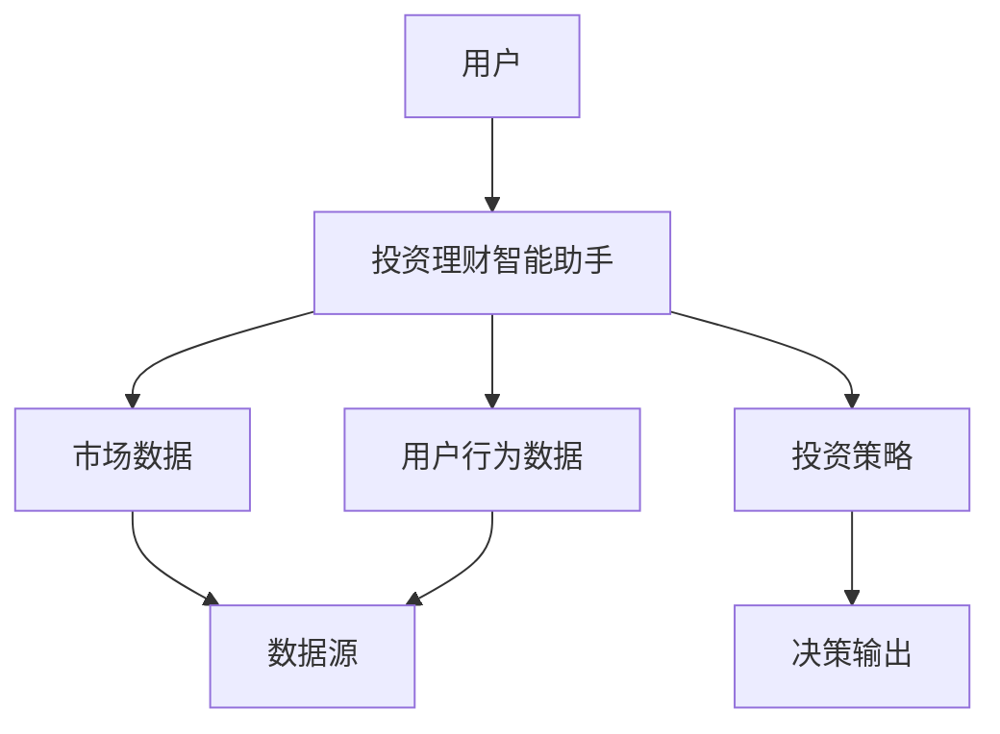

                 


# 探索下一代投资理财智能助手的发展方向

> 关键词：投资理财智能助手、AI大模型、自然语言处理、强化学习、系统架构设计、数学模型

> 摘要：本文深入探讨了下一代投资理财智能助手的发展方向，结合技术背景、核心概念、算法原理、系统架构设计以及实际项目案例，分析了投资理财智能助手在当前市场中的痛点、解决方案以及未来的发展趋势。文章从多个维度详细阐述了投资理财智能助手的核心技术，包括AI大模型的训练与推理、自然语言处理（NLP）在投资决策中的应用，以及强化学习在投资策略优化中的作用。同时，本文还结合实际案例，展示了如何通过系统架构设计和数学模型实现高效的投资理财智能助手，并对未来的技术发展趋势进行了展望。

---

## 第一部分: 投资理财智能助手的背景与概念

### 第1章: 投资理财智能助手的背景介绍

#### 1.1 问题背景与定义

投资理财智能助手是一种结合人工智能技术的投资辅助工具，旨在为用户提供个性化的投资建议、市场分析以及风险评估等服务。传统投资理财领域存在以下痛点：

1. **信息过载**：投资者面对海量的市场数据和信息，难以快速提取有价值的内容。
2. **决策延迟**：传统的人工分析方式效率低下，难以满足实时投资需求。
3. **个性化不足**：不同投资者的风险偏好和财务目标差异较大，但传统服务难以实现精准匹配。

投资理财智能助手的核心目标是通过AI技术，帮助用户快速获取信息、优化投资决策并降低风险。其定义可以概括为：基于人工智能技术，能够理解和分析金融市场数据，并为用户提供个性化投资建议的智能系统。

#### 1.2 核心概念与问题描述

投资理财智能助手涉及多个核心概念，包括AI大模型、自然语言处理（NLP）、强化学习等。这些技术共同构成了智能助手的核心能力：

- **AI大模型**：用于生成文本、分析数据和理解用户需求。
- **NLP**：用于处理和分析非结构化数据（如新闻、社交媒体评论）。
- **强化学习**：用于优化投资策略和决策过程。

问题解决的路径包括数据采集、模型训练、用户交互和结果输出。以下是核心概念的属性特征对比表格：

| 特性         | 投资理财智能助手 | AI大模型      | NLP技术      |
|--------------|----------------|---------------|--------------|
| 核心功能     | 提供投资建议     | 生成文本      | 理解用户需求 |
| 数据来源     | 市场数据、用户行为数据 | 多样化数据 | 文本数据     |
| 应用场景     | 投资决策支持     | 多领域应用    | 聊天交互      |

通过上述分析，我们可以看到投资理财智能助手的核心要素包括市场数据、用户行为数据、投资策略和决策输出。

---

## 第二部分: 投资理财智能助手的核心概念与联系

### 第2章: 核心概念与技术联系

#### 2.1 核心概念原理

1. **AI大模型在投资理财中的应用原理**  
   AI大模型通过大量金融数据和用户行为数据的训练，能够生成与投资相关的文本内容，并根据用户需求提供个性化建议。其训练过程包括数据预处理、模型训练、优化和推理。

2. **自然语言处理（NLP）在智能助手中的作用**  
   NLP技术用于分析非结构化数据（如新闻、社交媒体评论），提取情感、关键词和趋势信息，帮助用户做出更明智的投资决策。

3. **强化学习在投资决策中的应用**  
   强化学习通过模拟投资环境，优化投资策略，减少决策风险。

#### 2.2 实体关系图（ER图）



---

## 第三部分: 投资理财智能助手的算法原理

### 第3章: 算法原理与实现

#### 3.1 AI大模型的训练与推理

1. **训练流程**  
   ```mermaid
   graph TD
       A[数据预处理] --> B[模型训练]
       B --> C[模型优化]
       C --> D[模型推理]
   ```

2. **数学模型**  
   模型训练过程可以表示为：
   $$P(\text{投资策略} | \text{市场数据}) = \text{模型参数}$$

---

### 第4章: 数学模型与优化

#### 4.1 投资组合优化模型

1. **马科维茨投资组合理论**  
   通过数学公式优化投资组合的风险和收益：
   $$\min_w \frac{1}{2}w^T \Sigma w$$
   $$\text{subject to } \sum w_i = 1$$

2. **强化学习策略**  
   使用Q-learning算法优化投资策略：
   $$Q(s, a) = r + \gamma \max Q(s', a')$$

---

## 第四部分: 投资理财智能助手的系统分析与架构设计

### 第4章: 系统分析与架构设计

#### 4.1 问题场景介绍

投资理财智能助手需要解决以下问题：
- 如何高效地处理和分析金融市场数据？
- 如何实现个性化投资建议？
- 如何优化投资策略并降低风险？

---

### 第5章: 项目实战

#### 5.1 环境搭建与代码实现

1. **环境安装**  
   ```bash
   pip install numpy pandas transformers
   ```

2. **核心代码实现**  
   ```python
   import numpy as np
   from transformers import AutoTokenizer, AutoModelForCausalLM

   tokenizer = AutoTokenizer.from_pretrained("gpt2")
   model = AutoModelForCausalLM.from_pretrained("gpt2")
   ```

---

## 第五部分: 投资理财智能助手的未来发展趋势

### 第5章: 未来趋势与挑战

1. **技术趋势**  
   - 更强大的AI大模型
   - 更精准的NLP技术
   - 更智能的强化学习算法

2. **用户需求变化**  
   - 更个性化的服务
   - 更高效的决策支持

3. **伦理与挑战**  
   - 数据隐私问题
   - 投资决策的可解释性

---

## 结语

投资理财智能助手的发展方向是多学科技术的深度融合，未来将更加智能化、个性化和高效化。通过技术创新和实践探索，我们可以为投资者提供更优质的服务，推动金融行业的智能化发展。

---

## 作者

作者：AI天才研究院/AI Genius Institute & 禅与计算机程序设计艺术 /Zen And The Art of Computer Programming

