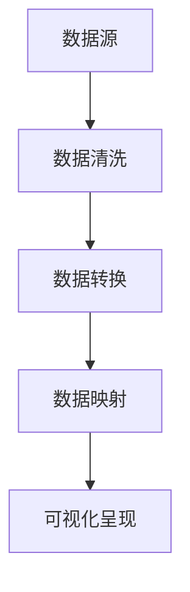
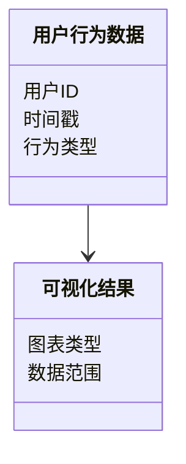

                 


# 数据可视化技术

> 关键词：数据可视化、数据清洗、特征工程、数据变换、数据映射

> 摘要：本文深入探讨了数据可视化技术的核心概念、算法原理、系统架构及项目实战。通过详细分析数据可视化的背景、核心要素、算法流程、系统设计和实际案例，帮助读者全面掌握数据可视化技术的精髓。

---

# 第一部分: 数据可视化技术基础

---

# 第1章: 数据可视化技术概述

## 1.1 数据可视化的基本概念

### 1.1.1 数据可视化的定义

数据可视化是将数据以图形、图表或交互式界面的形式展示的过程，旨在帮助人们更好地理解数据中的模式、趋势和关系。它是数据科学领域的重要组成部分，能够将复杂的数据转化为直观的视觉信息。

### 1.1.2 数据可视化的核心目标

1. **数据探索**：通过可视化发现数据中的潜在模式和趋势。
2. **数据理解**：帮助用户快速理解数据的分布和特征。
3. **数据洞察**：通过可视化揭示数据背后的关键信息，支持决策。
4. **数据沟通**：将复杂的数据信息以直观的方式传达给非技术人员。

### 1.1.3 数据可视化的重要场景

1. **商业分析**：帮助企业分析销售数据、用户行为等，辅助决策。
2. **科学研究**：用于复杂数据的分析和展示，如基因数据、气候数据等。
3. **教育领域**：通过可视化工具帮助学生更好地理解抽象概念。
4. **新闻报道**：用图表直观呈现新闻数据，增强报道的可读性。

### 1.1.4 数据可视化的核心要素

1. **数据源**：数据来源，包括结构化数据（如数据库）和非结构化数据（如文本、图像）。
2. **数据处理**：对数据进行清洗、转换和预处理，确保数据质量。
3. **可视化工具**：选择合适的工具，如Matplotlib、Tableau、Power BI等。
4. **可视化形式**：根据数据类型和目标选择图表类型，如柱状图、折线图、散点图等。
5. **用户交互**：通过交互式可视化提升用户体验，支持数据的动态探索。

## 1.2 数据可视化的历史与演变

### 1.2.1 数据可视化的起源

数据可视化的历史可以追溯到17世纪，当时的科学家开始尝试用图表展示科学数据。例如，Florence Nightingale在19世纪使用统计图表分析战争中的死亡率。

### 1.2.2 数据可视化技术的发展阶段

1. **早期阶段**：手绘图表，如地图、饼图等。
2. **计算机辅助阶段**：20世纪60年代，计算机开始用于生成简单的图表。
3. **现代阶段**：随着大数据和人工智能的发展，数据可视化工具和方法不断丰富，交互式可视化和动态分析成为主流。

### 1.2.3 当前数据可视化的趋势

1. **交互式可视化**：用户可以通过交互操作动态探索数据。
2. **大数据可视化**：处理和展示海量数据的能力。
3. **AI驱动的可视化**：利用机器学习算法自动生成最优的可视化方案。
4. **三维和空间可视化**：通过三维技术展示复杂的数据关系。

## 1.3 数据可视化的重要性

### 1.3.1 数据可视化的价值

1. **提高决策效率**：通过直观的可视化，决策者可以快速获取关键信息。
2. **提升数据理解**：帮助非技术人员理解复杂的数据。
3. **支持数据驱动的决策**：基于数据可视化的结果制定策略。

### 1.3.2 数据可视化在决策中的作用

数据可视化能够将复杂的数字信息转化为易于理解的视觉形式，从而帮助决策者快速识别问题、发现机会和制定策略。

### 1.3.3 数据可视化对数据科学家的意义

数据科学家可以通过数据可视化快速验证假设、探索数据分布、发现异常值，并在建模过程中监控模型性能。

## 1.4 数据可视化的核心要素

### 1.4.1 数据源的选择

选择合适的数据源是数据可视化的第一步。数据源可以是数据库、CSV文件、API接口等。

### 1.4.2 数据的处理与清洗

数据清洗是确保数据质量的关键步骤，包括处理缺失值、异常值、重复数据等。

### 1.4.3 数据的转换与预处理

数据转换包括数据格式转换、归一化、标准化等，以适应不同的可视化需求。

### 1.4.4 可视化工具的选择

根据项目需求选择合适的工具，如Matplotlib适合编程，Tableau适合非技术人员。

### 1.4.5 可视化结果的呈现方式

选择合适的图表类型，如柱状图、折线图、散点图等，以最佳方式呈现数据。

## 1.5 本章小结

本章介绍了数据可视化的基本概念、历史演变及其重要性。通过理解数据可视化的核心要素，读者可以更好地进行后续的数据处理和分析。

---

# 第2章: 数据可视化的核心概念与联系

## 2.1 数据可视化的核心概念

### 2.1.1 数据清洗

数据清洗是数据处理的第一步，旨在去除噪声数据、处理缺失值和异常值。

### 2.1.2 数据特征工程

特征工程是通过构造新特征或优化现有特征，提高模型性能的过程。

### 2.1.3 数据变换

数据变换是将数据从一种形式转换为另一种形式，以适应不同的分析需求。

### 2.1.4 数据映射

数据映射是将数据中的特征映射到可视化元素（如颜色、大小、位置等）的过程。

## 2.2 数据可视化的核心原理

### 2.2.1 数据可视化的原理概述

数据可视化通过将数据映射到视觉元素，利用人类的视觉感知能力，帮助用户快速理解数据。

### 2.2.2 数据可视化的核心流程

1. **数据获取**：从数据源获取原始数据。
2. **数据清洗**：处理缺失值、异常值等。
3. **数据转换**：对数据进行归一化、标准化等处理。
4. **数据映射**：将数据映射到可视化元素。
5. **可视化呈现**：生成图表或可视化界面。
6. **交互与分析**：用户通过交互动态探索数据。

### 2.2.3 数据可视化的核心挑战

1. **数据复杂性**：如何处理高维数据。
2. **用户认知**：如何设计符合用户认知习惯的可视化方式。
3. **性能优化**：如何在大数据量下保证可视化性能。

## 2.3 数据可视化的核心概念对比

### 2.3.1 数据清洗与数据转换的对比

| 对比维度 | 数据清洗 | 数据转换 |
|----------|----------|----------|
| 目的     | 去除噪声 | 改善数据分布 |
| 方法     | 删除异常值 | 标准化、归一化 |
| 工具     | Pandas   | Scikit-learn |

### 2.3.2 数据特征工程与数据映射的对比

| 对比维度 | 数据特征工程 | 数据映射 |
|----------|--------------|----------|
| 目的     | 构造特征     | 映射到视觉元素 |
| 方法     | PCA、特征选择 | 颜色、大小 |
| 工具     | Scikit-learn | Matplotlib |

## 2.4 数据可视化的实体关系图



---

# 第3章: 数据可视化算法原理

## 3.1 数据清洗算法

### 3.1.1 异常值检测算法

#### 3.1.1.1 基于统计的方法

使用Z-score或IQR方法检测异常值。

#### 3.1.1.2 基于聚类的方法

使用K-means算法将数据聚类，识别远离主群的数据点。

### 3.1.2 缺失值处理算法

#### 3.1.2.1 删除法

直接删除包含缺失值的样本或特征。

#### 3.1.2.2 填充法

使用均值、中位数或插值方法填充缺失值。

## 3.2 数据特征工程算法

### 3.2.1 特征选择算法

#### 3.2.1.1 基于统计的方法

使用卡方检验或相关系数选择重要特征。

#### 3.2.1.2 基于模型的方法

使用Lasso或Ridge回归进行特征选择。

### 3.2.2 特征降维算法

#### 3.2.2.1 主成分分析（PCA）

通过线性变换将高维数据降维到低维空间。

## 3.3 数据变换算法

### 3.3.1 标准化

将数据缩放到均值为0，方差为1的范围。

公式：$$ X_{ standardized} = \frac{X - \mu}{\sigma} $$

### 3.3.2 归一化

将数据缩放到0到1的范围。

公式：$$ X_{ normalized} = \frac{X - \min(X)}{\max(X) - \min(X)} $$

## 3.4 数据映射算法

### 3.4.1 颜色映射

将数值数据映射到颜色空间，常用的方法有梯度映射和分段映射。

### 3.4.2 大小映射

将数值数据映射到点的大小，通常使用线性变换。

---

# 第4章: 数据可视化数学模型

## 4.1 数据清洗的数学模型

### 4.1.1 异常值检测的数学模型

#### 4.1.1.1 基于Z-score的方法

公式：$$ Z = \frac{X - \mu}{\sigma} $$

异常值判断标准：$$ |Z| > 3 $$

#### 4.1.1.2 基于IQR的方法

公式：$$ IQR = Q3 - Q1 $$

异常值判断标准：$$ X < Q1 - 1.5IQR \quad 或 \quad X > Q3 + 1.5IQR $$

## 4.2 数据转换的数学模型

### 4.2.1 标准化

公式：$$ X_{ standardized} = \frac{X - \mu}{\sigma} $$

### 4.2.2 归一化

公式：$$ X_{ normalized} = \frac{X - \min(X)}{\max(X) - \min(X)} $$

## 4.3 数据映射的数学模型

### 4.3.1 颜色映射

将数值范围[Min, Max]映射到颜色空间，例如：

$$ color = f\left(\frac{X - Min}{Max - Min}\right) $$

### 4.3.2 大小映射

将数值范围映射到点的大小，例如：

$$ size = a \cdot X + b $$

---

# 第5章: 数据可视化系统架构

## 5.1 系统分析与设计

### 5.1.1 问题场景介绍

以电商用户行为分析为例，我们需要分析用户的行为数据，包括点击、浏览、下单等。

### 5.1.2 系统功能设计

#### 5.1.2.1 数据采集

从数据库中获取用户行为数据。

#### 5.1.2.2 数据处理

对数据进行清洗和转换，确保数据质量。

#### 5.1.2.3 数据分析

通过可视化工具分析用户行为，发现购买趋势。

#### 5.1.2.4 可视化呈现

生成交互式图表，帮助用户动态探索数据。

### 5.1.3 系统架构设计

#### 5.1.3.1 领域模型



#### 5.1.3.2 系统架构


---

# 第6章: 数据可视化项目实战

## 6.1 项目环境安装

### 6.1.1 安装Python

使用Anaconda安装Python 3.8及以上版本。

### 6.1.2 安装可视化工具

安装Matplotlib、Seaborn、Plotly等可视化库。

## 6.2 核心代码实现

### 6.2.1 数据清洗代码

```python
import pandas as pd

# 读取数据
data = pd.read_csv('user_behavior.csv')

# 删除缺失值
data.dropna(inplace=True)

# 处理异常值
z_scores = (data - data.mean()).abs() / data.std()
data = data[(z_scores < 3).all(axis=1)]
```

### 6.2.2 数据转换代码

```python
from sklearn.preprocessing import StandardScaler

# 标准化处理
scaler = StandardScaler()
data_scaled = scaler.fit_transform(data)
```

### 6.2.3 数据映射代码

```python
import matplotlib.pyplot as plt

# 颜色映射
colors = plt.cm.viridis(data['销售额'])
```

## 6.3 项目小结

通过本项目，我们掌握了数据清洗、数据转换和数据映射的实现方法，并通过可视化工具生成了交互式图表，帮助用户动态探索数据。

---

# 第7章: 数据可视化最佳实践

## 7.1 小结

数据可视化是数据科学中的重要工具，通过合理选择数据清洗、数据转换和数据映射的方法，可以更好地呈现数据信息。

## 7.2 注意事项

1. **数据质量**：确保数据清洗和预处理的准确性。
2. **用户需求**：根据用户需求选择合适的可视化形式。
3. **性能优化**：在处理大数据时，注意性能优化。

## 7.3 拓展阅读

1. 《可视化的数据科学》
2. 《数据可视化入门与实践》
3. 数据可视化工具的高级应用

---

# 作者：AI天才研究院/AI Genius Institute & 禅与计算机程序设计艺术 /Zen And The Art of Computer Programming

