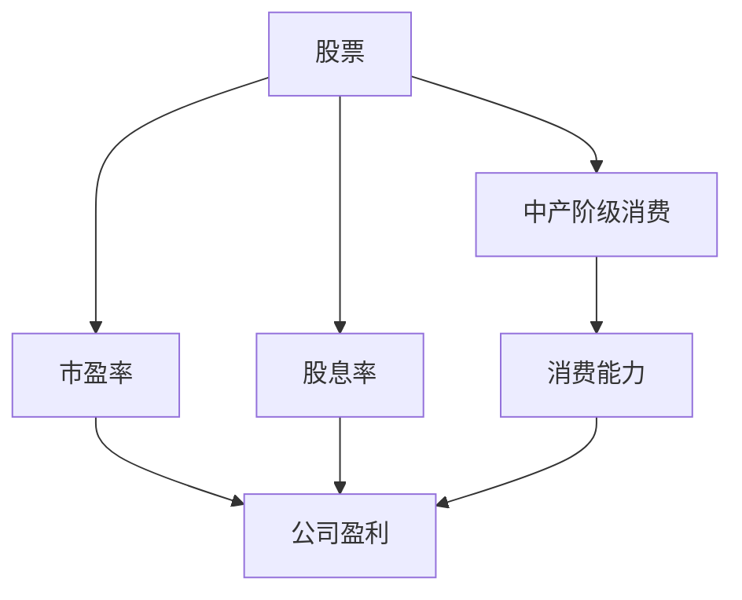
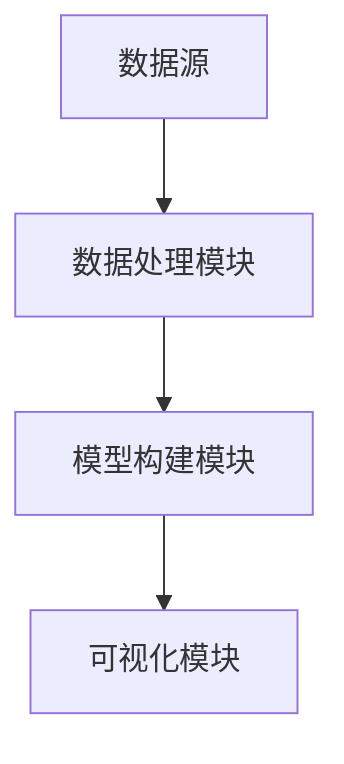

                 


# 新兴市场股市估值与中产阶级消费的关系

## 关键词：
- 新兴市场
- 股市估值
- 中产阶级
- 消费行为
- 经济周期
- 数据分析

## 摘要：
本文探讨新兴市场股市估值与中产阶级消费之间的关系。通过分析股市估值的核心指标（如市盈率、市净率等）与中产阶级消费行为（如消费能力、消费偏好等）之间的联系，构建数学模型并结合实际案例进行分析。文章从理论到实践，详细阐述了两者之间的相互影响，为投资者和政策制定者提供了有价值的参考。

---

## 第1章: 背景介绍与问题定义

### 1.1 新兴市场股市估值的定义与现状
#### 1.1.1 新兴市场的定义与特征
新兴市场是指那些经济快速发展、工业化程度较低但潜力巨大的国家，如中国、印度、巴西等。这些市场具有高增长性、高波动性和高复杂性等特点。

#### 1.1.2 股市估值的基本概念与方法
股市估值是通过对公司财务数据和市场环境的分析，评估股票的内在价值。常用的方法包括市盈率（P/E ratio）、市净率（P/B ratio）、股息率（Dividend Yield）等。

#### 1.1.3 新兴市场股市估值的独特性
新兴市场的股市估值受到政策、经济周期和外部环境的影响较大，且市场流动性波动性较高。

### 1.2 中产阶级消费的定义与现状
#### 1.2.1 中产阶级的定义与特征
中产阶级是指收入稳定、消费能力强的群体，通常位于社会收入分布的中高位置。

#### 1.2.2 消费行为的定义与影响因素
消费行为是指个人或家庭在购买商品或服务时的行为模式，受到收入、价格、偏好、信贷等因素的影响。

#### 1.2.3 新兴市场中产阶级消费的特点
新兴市场的中产阶级消费呈现多样化、品牌化和数字化的趋势，且对经济周期的敏感性较高。

### 1.3 问题背景与研究意义
#### 1.3.1 新兴市场股市与消费的关系的重要性
股市估值与中产阶级消费密切相关，股市的波动可能影响消费信心，而消费的变化也可能反过来影响股市表现。

#### 1.3.2 现有研究的不足
现有研究多关注单一市场的局部现象，缺乏对新兴市场股市与消费关系的系统性分析。

#### 1.3.3 本研究的目标与意义
本研究旨在通过构建数学模型，分析新兴市场股市估值与中产阶级消费之间的动态关系，为投资者和政策制定者提供参考。

---

## 第2章: 核心概念与联系

### 2.1 股市估值的核心要素
#### 2.1.1 市盈率（P/E ratio）
市盈率是股票价格与每股收益的比率，用于衡量股票的估值水平。公式为：
$$ P/E = \frac{股票价格}{每股收益} $$

#### 2.1.2 市净率（P/B ratio）
市净率是股票价格与每股净资产的比率，用于衡量股票的价值。公式为：
$$ P/B = \frac{股票价格}{每股净资产} $$

#### 2.1.3 股息率（Dividend Yield）
股息率是每股股息与股票价格的比率，用于衡量股票的收益能力。公式为：
$$ Dividend Yield = \frac{每股股息}{股票价格} \times 100\% $$

### 2.2 中产阶级消费的核心要素
#### 2.2.1 消费能力与收入水平
中产阶级的消费能力与其收入水平密切相关，收入越高，消费能力越强。

#### 2.2.2 消费偏好与行为模式
中产阶级的消费偏好受到品牌、价格、便利性等因素的影响，且具有较强的品牌忠诚度。

#### 2.2.3 消费结构与市场细分
中产阶级的消费结构呈现多样化，包括食品、服装、电子产品、旅游等，市场细分明显。

### 2.3 股市估值与消费关系的理论框架
#### 2.3.1 经济周期理论
经济周期理论认为，股市估值和消费行为会随着经济周期的变化而波动。在经济繁荣时期，股市估值和消费行为均会上升；在经济衰退时期，两者均会下降。

#### 2.3.2 消费者信心指数
消费者信心指数是衡量消费者对未来经济状况和消费能力的信心，直接影响消费行为和股市估值。

#### 2.3.3 股市与消费的双向影响
股市的波动会影响中产阶级的财富水平，从而影响其消费行为；同时，中产阶级的消费变化也会通过企业盈利影响股市估值。

---

## 第3章: 核心概念的对比分析

### 3.1 股市估值与消费的属性对比

| 属性 | 股市估值 | 中产阶级消费 |
|------|---------|--------------|
| 定义 | 股票的价格与公司基本面指标的比率 | 中产阶级的消费行为和能力 |
| 影响因素 | 公司盈利、市场情绪、政策环境 | 收入水平、价格、偏好 |
| 测量指标 | P/E、P/B、股息率 | 消费指数、品牌偏好、消费结构 |
| 时间维度 | 短期波动性高，长期趋势性明显 | 短期波动性低，长期趋势性明显 |

### 3.2 股市估值与消费的ER实体关系图



---

## 第4章: 数学模型与数据分析

### 4.1 股市估值与消费关系的数学模型
#### 4.1.1 理论模型
构建回归模型，分析股市估值与消费之间的关系。模型形式为：
$$ Consumption = \beta_0 + \beta_1 \times Stock\ Valuation + \epsilon $$

#### 4.1.2 数据来源与处理
使用新兴市场（如中国、印度）的股市数据和消费数据，进行清洗和标准化处理。

#### 4.1.3 回归分析
通过Python进行回归分析，计算回归系数和显著性检验。

### 4.2 Python代码实现
```python
import pandas as pd
import numpy as np
from sklearn.linear_model import LinearRegression
from sklearn.metrics import r2_score

# 数据加载与预处理
data = pd.read_csv('emerging_market_data.csv')
data.dropna(inplace=True)
data = data[['Stock_Valuation', 'Consumption']]

# 模型训练
model = LinearRegression()
model.fit(data[['Stock_Valuation']], data['Consumption'])

# 模型评估
predictions = model.predict(data[['Stock_Valuation']])
print("R²:", r2_score(data['Consumption'], predictions))
```

---

## 第5章: 系统分析与架构设计

### 5.1 问题场景介绍
新兴市场的股市估值与消费关系分析需要整合多源数据，构建分析模型，并进行可视化展示。

### 5.2 系统功能设计
- 数据采集与处理
- 模型构建与分析
- 可视化展示

### 5.3 系统架构设计


---

## 第6章: 项目实战与案例分析

### 6.1 环境安装与数据准备
安装Python、Pandas、Scikit-learn等工具，加载新兴市场数据。

### 6.2 核心代码实现
```python
import pandas as pd
import numpy as np
from sklearn.linear_model import LinearRegression
import matplotlib.pyplot as plt

# 数据加载
data = pd.read_csv('emerging_market_data.csv')

# 数据预处理
data.dropna(inplace=True)

# 模型构建
model = LinearRegression()
model.fit(data[['Stock_Valuation']], data['Consumption'])

# 可视化
plt.scatter(data['Stock_Valuation'], data['Consumption'])
plt.plot(data['Stock_Valuation'], model.predict(data[['Stock_Valuation']]), color='red')
plt.title('Stock Valuation vs Consumption')
plt.xlabel('Stock Valuation')
plt.ylabel('Consumption')
plt.show()
```

### 6.3 实际案例分析
以中国为例，分析股市估值与中产阶级消费之间的关系，解读回归结果。

---

## 第7章: 总结与展望

### 7.1 最佳实践与小结
通过构建回归模型，我们发现新兴市场股市估值与中产阶级消费之间存在显著的正相关关系，但受到经济周期和政策环境的影响。

### 7.2 注意事项
- 数据的准确性和完整性
- 模型的适用性和局限性
- 政策和市场环境的变化

### 7.3 拓展阅读
- 《新兴市场经济学》
- 《消费行为分析》
- 《股市估值与投资策略》

---

## 作者：AI天才研究院/AI Genius Institute & 禅与计算机程序设计艺术 /Zen And The Art of Computer Programming

