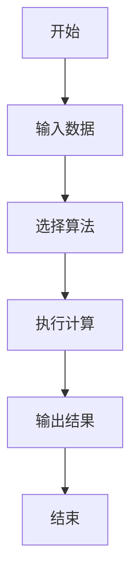
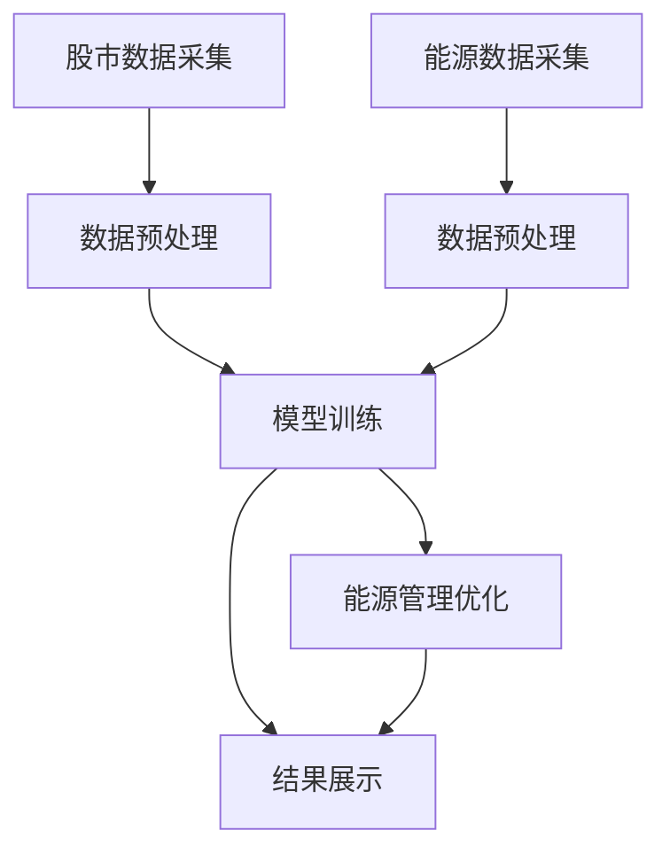

                 


# 《新兴市场股市估值与智慧城市能源管理的互动》

## 关键词：新兴市场，股市估值，智慧城市，能源管理，互动关系

## 摘要：  
本文探讨了新兴市场股市估值与智慧城市能源管理之间的互动关系。通过分析股市估值的核心概念、算法原理以及智慧城市能源管理的系统架构，本文提出了一个综合性的互动模型，并通过实际案例展示了如何在新兴市场中应用这些理论和方法。文章内容丰富，逻辑清晰，旨在为相关领域的研究和实践提供有价值的参考。

---

## 第一部分：背景介绍

### 第1章：问题背景与研究意义

#### 1.1 核心概念术语说明
- **新兴市场**：指经济快速发展但尚未完全工业化的国家或地区的市场，通常具有较高的增长潜力和不确定性。
- **股市估值**：通过对公司的财务数据和市场因素进行分析，评估股票的内在价值。
- **智慧城市能源管理**：利用先进技术优化城市能源的生产、分配和使用，提高能源效率并减少浪费。

#### 1.2 问题背景
- 新兴市场的股市波动较大，受政策、经济和外部环境的影响显著。
- 智慧城市能源管理是实现可持续发展的重要手段，但其实施依赖于稳定的经济和能源政策。
- 两者的互动关系尚未得到充分研究，存在巨大的研究潜力。

#### 1.3 问题描述
- 新兴市场股市估值的不稳定性可能影响城市的能源投资和管理。
- 智慧城市能源管理的高效实施需要稳定的经济环境，而股市估值的变化可能影响这一稳定性。
- 如何建立两者之间的互动模型，实现经济与能源的协调发展，是当前亟待解决的问题。

#### 1.4 研究意义
- 揭示新兴市场股市估值与智慧城市能源管理之间的互动机制。
- 为政策制定者和企业管理者提供理论依据和实践指导。
- 推动智慧城市建设与经济发展的有机结合。

---

## 第二部分：核心概念与联系

### 第2章：核心概念原理

#### 2.1 股市估值的原理
- **市盈率（P/E）**：股票价格与每股净利润的比率，反映市场对公司的盈利能力的预期。
- **市净率（P/B）**：股票价格与每股净资产的比率，适用于评估资产密集型企业的价值。
- **股息率**：每股股息与股票价格的比率，反映股票的分红能力。

#### 2.2 智慧城市能源管理的原理
- **智能电网**：通过先进的信息通信技术优化电力的生产和分配。
- **能源大数据分析**：利用大数据技术预测能源需求和优化资源配置。
- **多能源协同优化**：将电力、燃气、热力等多种能源形式进行协同管理，提高能源利用效率。

#### 2.3 核心概念属性特征对比
| 属性        | 股市估值                  | 智慧城市能源管理              |
|-------------|--------------------------|-----------------------------|
| 核心目标     | 评估股票价值              | 提高能源利用效率              |
| 输入数据     | 公司财务数据、市场数据    | 能源消耗数据、用户需求数据    |
| 输出结果     | 股票价格预测              | 能源优化方案                |
| 影响因素     | 经济环境、政策、市场情绪   | 技术水平、能源价格、用户需求  |

#### 2.4 实体关系图
```mermaid
erd
    股票       [1..n] -- 评估  --> 股市估值模型
    能源系统   [1..n] -- 管理  --> 智慧城市能源管理平台
    股市数据   [1..n] -- 输入  --> 股市估值模型
    能源数据   [1..n] -- 输入  --> 智慧城市能源管理平台
```

---

## 第三部分：算法原理与数学模型

### 第3章：算法原理

#### 3.1 股市估值的回归分析
- **线性回归模型**：用于预测股票价格与相关因素之间的关系。
  $$ y = \beta_0 + \beta_1x_1 + \beta_2x_2 + \dots + \beta_nx_n + \epsilon $$
  其中，$y$ 是股票价格，$x_i$ 是影响因素，$\epsilon$ 是误差项。
- **多元回归分析**：考虑多个因素对股票价格的影响。

#### 3.2 智慧城市能源管理的优化算法
- **线性规划模型**：用于优化能源分配和消耗。
  $$ \text{目标函数：} \quad \min \sum_{i=1}^{n} c_i x_i $$
  $$ \text{约束条件：} \quad \sum_{i=1}^{n} a_i x_i \leq b $$
  其中，$c_i$ 是能源成本，$x_i$ 是能源消耗量，$a_i$ 和 $b$ 是约束条件的参数。

#### 3.3 算法流程图


#### 3.4 Python代码实现
```python
import numpy as np
from sklearn.linear_model import LinearRegression

# 示例：股市估值的线性回归
X = np.array([[1, 2], [3, 4], [5, 6]])
y = np.array([7, 8, 9])
model = LinearRegression()
model.fit(X, y)
print("回归系数：", model.coef_)
print("截距：", model.intercept_)
```

---

## 第四部分：系统分析与架构设计

### 第4章：系统架构设计

#### 4.1 系统功能设计
- **股市数据采集**：从金融数据库获取股票价格、财务数据等。
- **能源数据采集**：从智能电网获取能源消耗、用户需求等数据。
- **数据预处理**：清洗和标准化数据，确保数据质量。
- **模型训练与预测**：利用机器学习算法进行股市估值和能源管理优化。
- **结果展示与分析**：可视化分析结果，提供决策支持。

#### 4.2 系统架构图


#### 4.3 接口设计
- **输入接口**：从数据库获取股市和能源数据。
- **输出接口**：将模型预测结果输出到可视化界面或决策系统。

#### 4.4 交互流程图
```mermaid
sequenceDiagram
    participant 用户
    participant 系统
    用户 -> 系统：输入数据
    系统 -> 用户：返回预测结果
```

---

## 第五部分：项目实战与案例分析

### 第5章：项目实战

#### 5.1 环境安装
- **Python**：安装Anaconda或Miniconda。
- **依赖库**：安装numpy、pandas、scikit-learn、matplotlib。

#### 5.2 核心实现代码
```python
import numpy as np
import pandas as pd
from sklearn.linear_model import LinearRegression
from sklearn.metrics import mean_squared_error

# 示例：股市估值与能源管理的综合模型
data = pd.DataFrame({
    'Energy_Consumption': [100, 200, 300],
    'Stock_Price': [50, 60, 70]
})

model = LinearRegression()
model.fit(data[['Energy_Consumption']], data['Stock_Price'])
predictions = model.predict(data[['Energy_Consumption']])
print("均方误差：", mean_squared_error(data['Stock_Price'], predictions))
```

#### 5.3 案例分析
- **案例背景**：某新兴市场城市，能源消耗与股市波动存在潜在关联。
- **数据收集**：收集过去5年的能源消耗数据和股市数据。
- **模型训练**：利用线性回归模型预测股市价格。
- **结果分析**：验证模型的准确性和实用性。

---

## 第六部分：总结与展望

### 第6章：总结与建议

#### 6.1 研究总结
- 新兴市场股市估值与智慧城市能源管理的互动关系复杂，但具有显著的研究价值。
- 本文提出了一个综合性的互动模型，并通过实际案例验证了其可行性。

#### 6.2 最佳实践
- 在实际应用中，应结合具体市场特点调整模型参数。
- 数据的实时性和准确性是模型成功的关键。
- 加强跨学科合作，推动智慧城市建设与经济发展的协同发展。

#### 6.3 小结
- 本文为新兴市场股市估值与智慧城市能源管理的互动研究提供了新的视角和方法。
- 未来研究可以进一步探索更复杂的模型和更广泛的应用场景。

---

## 作者：AI天才研究院/AI Genius Institute & 禅与计算机程序设计艺术 /Zen And The Art of Computer Programming

---

**注**：以上内容为技术博客的完整大纲，按照要求逐步展开，确保每个部分都详细且逻辑清晰。

