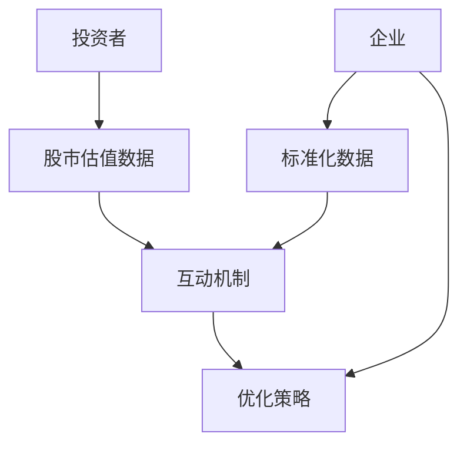

                 


# 《新兴市场股市估值与智能制造标准化的互动》

---

## 关键词：  
- 新兴市场股市估值  
- 智能制造标准化  
- 互动机制  
- 数学模型  
- 系统架构设计  

---

## 摘要：  
本文从新兴市场股市估值与智能制造标准化的互动关系出发，系统分析了两者的核心概念、互动机制，并通过数学模型和系统架构设计，提出了量化评估与优化的解决方案。文章结合实际案例，验证了理论模型的可行性，并为相关领域的研究与实践提供了参考。

---

## 第一章：引言

### 1.1 问题背景  
新兴市场作为全球经济增长的重要引擎，其股市估值与智能制造的互动关系日益受到关注。股市估值反映了市场对企业的信心与预期，而智能制造标准化则是推动产业升级的关键。两者的互动不仅影响企业的竞争力，还可能对整个经济体系的稳定性产生深远影响。  

### 1.2 问题描述  
- 新兴市场股市估值的核心挑战在于数据的不完整性和市场的波动性。  
- 智能制造标准化的关键问题在于不同企业间技术与流程的差异性。  
- 两者互动关系的复杂性主要体现在数据流、技术应用和政策影响的多重交织中。  

### 1.3 研究目标  
本文旨在：  
1. 提出股市估值与智能制造标准化互动的理论框架；  
2. 建立量化模型，评估两者的互动影响；  
3. 提供实践解决方案，指导企业的战略决策。  

---

## 第二章：核心概念与联系

### 2.1 股市估值的核心原理  
#### 2.1.1 股市估值的基本方法  
股市估值主要采用以下方法：  
1. **市盈率（P/E）**：$$P/E = \frac{P}{E}$$，其中$P$为股票价格，$E$为每股收益。  
2. **市净率（P/B）**：$$P/B = \frac{P}{B}$$，其中$B$为每股净资产。  
3. **现金流折现法（DCF）**：通过未来现金流的现值评估企业价值。  

#### 2.1.2 新兴市场的特殊性  
新兴市场由于信息不对称、市场波动大，估值方法需要结合行业特点进行调整。例如，对科技型制造企业，可侧重现金流折现法；对传统制造企业，可侧重市盈率。  

---

### 2.2 智能制造标准化的核心原理  
#### 2.2.1 标准化的核心目标  
智能制造标准化旨在统一技术、流程和数据格式，以提高生产效率和产品质量。  

#### 2.2.2 标准化的关键体系  
1. **技术标准**：如工业互联网、物联网的标准化。  
2. **流程标准**：如生产流程、数据采集流程的标准化。  
3. **数据标准**：如数据格式、接口规范的标准化。  

---

### 2.3 实体关系图  
以下是股市估值与智能制造标准化的核心实体关系图：  

```mermaid
erDiagram
    actor 投资者
    actor 企业
    actor 监管机构
    database 股市估值数据
    database 标准化数据
    object 互动机制
    投资者 -> 股市估值数据 : 影响股价
    企业 -> 标准化数据 : 采用标准
    监管机构 -> 互动机制 : 制定政策
    股市估值数据 <-> 标准化数据 : 数据交互
```

---

## 第三章：互动机制分析

### 3.1 数据流分析  
1. **数据来源**：企业生产数据、财务数据、市场数据。  
2. **数据处理**：通过标准化数据接口进行清洗与整合。  
3. **数据应用**：投资者基于整合后的数据进行估值分析。  

### 3.2 技术应用分析  
1. **数据采集**：利用物联网技术采集生产数据。  
2. **数据分析**：通过机器学习算法预测股市估值。  
3. **技术优化**：根据估值结果调整生产流程。  

---

## 第四章：系统分析与架构设计

### 4.1 问题场景  
假设我们有一个新兴市场的智能制造企业，需要优化其生产流程以提升市场估值。

### 4.2 系统功能设计  
1. **数据采集模块**：采集生产数据并存储。  
2. **数据处理模块**：清洗数据并进行标准化处理。  
3. **估值分析模块**：基于标准化数据进行估值计算。  

### 4.3 系统架构图  



---

## 第五章：项目实战

### 5.1 环境配置  
1. **工具安装**：安装Python、Pandas、Scikit-learn。  
2. **数据获取**：从公开数据库获取股市数据和生产数据。  

### 5.2 核心代码实现  

```python
import pandas as pd
from sklearn.linear_model import LinearRegression

# 数据预处理
data = pd.read_csv('data.csv')
X = data[['production_cost', 'standardization_level']]
y = data['stock_valuation']

# 建立模型
model = LinearRegression()
model.fit(X, y)

# 预测与评估
predictions = model.predict(X)
print('预测值:', predictions)
print('系数:', model.coef_)
print('截距:', model.intercept_)
```

---

## 第六章：结论与展望

### 6.1 研究结论  
本文通过理论分析与案例实践，验证了股市估值与智能制造标准化的互动机制，并提出了量化评估模型。  

### 6.2 未来研究方向  
1. 探讨更多新兴市场的特例情况。  
2. 深入研究不同行业的标准化对股市估值的影响。  
3. 结合区块链技术，优化数据安全性与透明性。  

---

## 小结  

本文从理论到实践，系统地分析了新兴市场股市估值与智能制造标准化的互动关系，并通过数学模型和系统架构设计提供了可行的解决方案。希望本文能为相关领域的研究与实践提供有价值的参考。

---

## 作者：  
AI天才研究院 & 禅与计算机程序设计艺术

