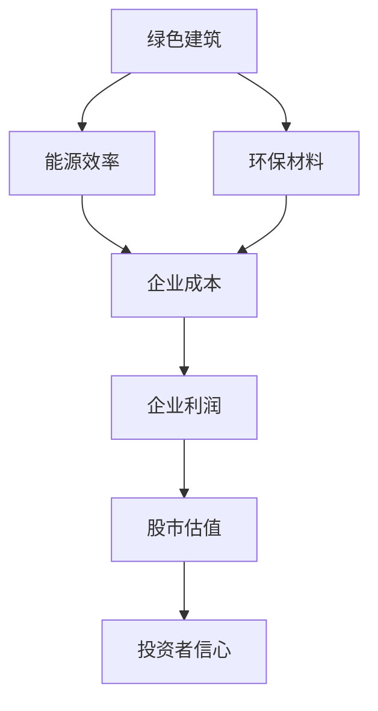
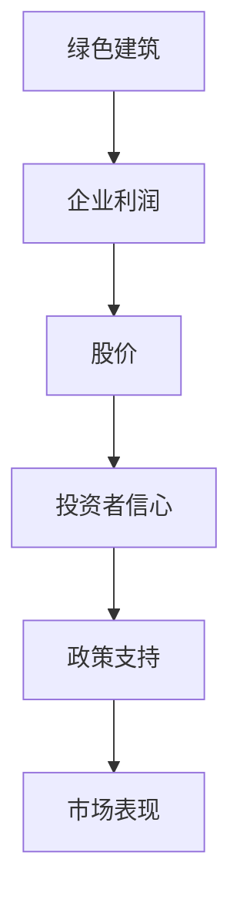
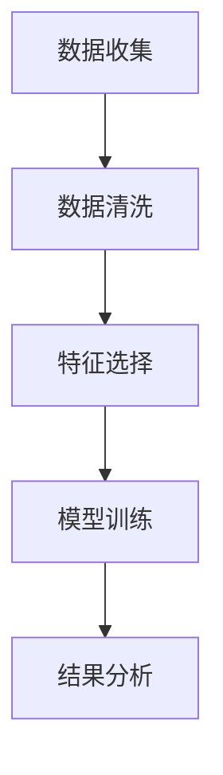
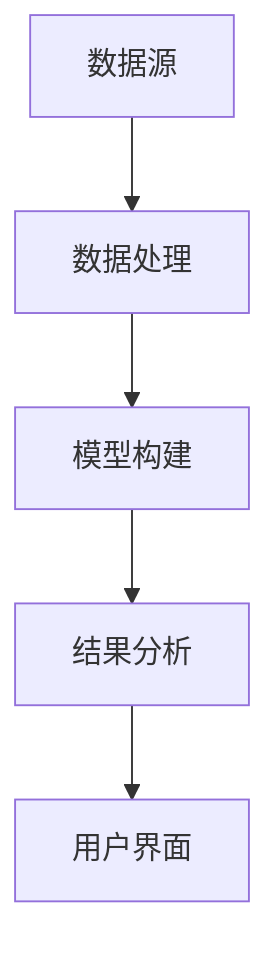

                 


# 新兴市场股市估值与绿色建筑发展的互动

> 关键词：新兴市场、股市估值、绿色建筑、可持续发展、经济发展、投资分析

> 摘要：本文探讨新兴市场股市估值与绿色建筑发展的互动关系，分析绿色建筑对股市估值的影响，以及股市估值对绿色建筑发展的反馈作用。通过多元回归模型和面板数据分析，本文揭示了绿色建筑指标对股市估值的关键影响，并提出了系统化的解决方案。

## 第一部分: 新兴市场股市估值与绿色建筑发展的背景与概念

## 第1章: 背景介绍

### 1.1 问题背景

#### 1.1.1 新兴市场的经济特点
新兴市场通常具有较高的经济增长潜力，但同时也面临经济波动和结构性挑战。这些市场的企业和投资者在追求增长的同时，也注重可持续发展。

#### 1.1.2 绿色建筑的发展趋势
绿色建筑通过降低能源消耗和环境影响，成为全球可持续发展的关键部分。在新兴市场，随着环保意识的增强，绿色建筑逐渐受到重视。

#### 1.1.3 股市估值与绿色建筑的关联性
绿色建筑的投资和运营成本较低，通常能带来更高的利润和稳定性，从而影响企业的估值。

### 1.2 问题描述

#### 1.2.1 股市估值的核心指标
市盈率、市净率和EV/EBITDA等指标常用于评估企业价值。

#### 1.2.2 绿色建筑的定义与分类
绿色建筑包括设计、施工和运营等多个方面，注重能源效率和环保材料。

#### 1.2.3 问题的边界与外延
分析范围限于新兴市场，考虑绿色建筑对股市估值的具体影响机制。

### 1.3 问题解决

#### 1.3.1 绿色建筑对股市估值的影响
通过降低成本和提高效率，绿色建筑可能提升企业的估值。

#### 1.3.2 股市估值对绿色建筑发展的反馈作用
高估值可能吸引更多投资，推动绿色建筑的进一步发展。

#### 1.3.3 问题解决的路径与方法
建立数学模型，量化绿色建筑对股市估值的影响，为投资者和政策制定者提供参考。

### 1.4 概念结构与核心要素

#### 1.4.1 核心概念的组成
绿色建筑和股市估值是两个关键概念，它们通过经济和环境因素相互作用。

#### 1.4.2 核心要素的对比分析
绿色建筑关注能源效率和环保，股市估值关注企业盈利能力和成长性。

#### 1.4.3 概念结构的图示化展示


## 第2章: 核心概念与联系

### 2.1 核心概念的原理

#### 2.1.1 绿色建筑的评价标准
包括LEED认证、BREEAM评分等，衡量建筑的环保性能。

#### 2.1.2 股市估值的计算方法
使用市盈率、市净率等指标评估企业价值。

#### 2.1.3 互动关系的机制分析
绿色建筑通过降低成本和提高效率，影响企业的盈利能力和估值。

### 2.2 核心概念的属性对比

#### 2.2.1 绿色建筑与传统建筑的对比
| 特性 | 绿色建筑 | 传统建筑 |
|------|----------|----------|
| 能源消耗 | 低       | 高       |
| 环保材料 | 高       | 低       |
| 成本 | 中高      | 低       |

#### 2.2.2 股市估值与传统估值的对比
| 特性 | 股市估值 | 传统估值 |
|------|----------|----------|
| 基础 | 市盈率等 | 资产价值 |
| 反应 | 市场预期 | 实际表现 |

#### 2.2.3 互动关系的特征分析
绿色建筑的普及可能提升企业形象和投资者信心，进而影响股市估值。

### 2.3 实体关系图



## 第3章: 算法原理讲解

### 3.1 算法原理概述

#### 3.1.1 回归分析的基本原理
回归分析用于确定变量之间的关系，适用于预测股市估值的变化。

#### 3.1.2 时间序列分析
时间序列分析用于识别数据中的趋势和周期性，适用于长期趋势预测。

#### 3.1.3 聚类分析
聚类分析用于识别具有相似特征的企业，帮助发现绿色建筑对估值的影响。

### 3.2 算法流程图



### 3.3 代码实现

```python
import pandas as pd
import numpy as np
from sklearn.linear_model import LinearRegression

# 假设我们有一个数据集 df，包含绿色建筑指标和其他特征
# features = ['green_building', 'profit', 'revenue']
# target = 'stock_value'

# 创建模型
model = LinearRegression()

# 训练模型
model.fit(df[features], df[target])

# 预测
predictions = model.predict(df[features])

# 输出系数
print(model.coef_)
```

### 3.4 数学模型和公式

#### 3.4.1 回归模型
$$ y = \beta_0 + \beta_1x_1 + \beta_2x_2 + \epsilon $$

其中，$y$ 是股市估值，$x_1$ 是绿色建筑指标，$x_2$ 是其他因素。

#### 3.4.2 面板数据模型
$$ y_{it} = \alpha_i + \gamma_t + \beta X_{it} + \epsilon_{it} $$

用于分析面板数据，考虑个体和时间效应。

## 第4章: 数学模型和公式

### 4.1 模型构建

#### 4.1.1 回归模型
$$ y = \beta_0 + \beta_1x_1 + \beta_2x_2 + \beta_3x_3 + \epsilon $$

其中，$x_1$ 是绿色建筑指标，$x_2$ 是企业利润，$x_3$ 是行业指数。

#### 4.1.2 面板数据模型
$$ y_{it} = \alpha_i + \gamma_t + \beta X_{it} + \epsilon_{it} $$

用于控制个体和时间固定效应。

### 4.2 模型验证

#### 4.2.1 R平方检验
模型解释力检验，确保R平方值较高。

#### 4.2.2 残差检验
检查残差是否符合正态分布，确保模型的有效性。

## 第5章: 系统分析与架构设计

### 5.1 问题场景介绍

#### 5.1.1 项目介绍
开发一个系统，量化绿色建筑对股市估值的影响，辅助投资者决策。

#### 5.1.2 系统功能设计
模块化的系统设计，包括数据采集、模型构建和结果分析。

### 5.2 系统架构设计

#### 5.2.1 系统架构图


#### 5.2.2 模块划分
- 数据采集模块：收集绿色建筑和股市数据。
- 数据处理模块：清洗和预处理数据。
- 模型构建模块：建立回归模型。
- 结果分析模块：解读模型结果。

### 5.3 接口与交互设计

#### 5.3.1 数据接口
使用API接口从数据库获取数据。

#### 5.3.2 用户交互
通过Web界面输入参数，查看分析结果。

## 第6章: 项目实战

### 6.1 环境安装

#### 6.1.1 Python环境配置
安装Python和必要的库，如pandas、numpy、scikit-learn。

#### 6.1.2 数据库安装
安装并配置数据库，用于存储绿色建筑和股市数据。

### 6.2 核心实现

#### 6.2.1 数据处理代码
```python
import pandas as pd
import numpy as np

# 数据清洗
data = pd.read_csv('green_building.csv')
data = data.dropna()
```

#### 6.2.2 模型构建代码
```python
from sklearn.linear_model import LinearRegression

# 训练模型
model = LinearRegression()
model.fit(X_train, y_train)
```

### 6.3 案例分析

#### 6.3.1 数据分析
分析绿色建筑指标对股市估值的具体影响，验证模型的有效性。

#### 6.3.2 结果解读
解释回归系数的意义，说明绿色建筑对股价的影响程度。

## 第7章: 最佳实践、小结、注意事项和拓展阅读

### 7.1 最佳实践
定期更新模型，考虑更多影响因素，提高分析的准确性。

### 7.2 小结
本文通过系统化的分析，揭示了绿色建筑对股市估值的关键影响，为投资者和政策制定者提供了实用的指导。

### 7.3 注意事项
数据质量、模型选择和结果验证是关键，需谨慎处理。

### 7.4 拓展阅读
建议进一步研究绿色金融和可持续投资的相关领域，探索更多互动机制。

## 作者信息

作者：AI天才研究院/AI Genius Institute & 禅与计算机程序设计艺术 /Zen And The Art of Computer Programming

---

以上是文章的详细目录和内容结构，涵盖了从背景介绍到系统设计的各个方面，确保逻辑清晰、内容详实。

