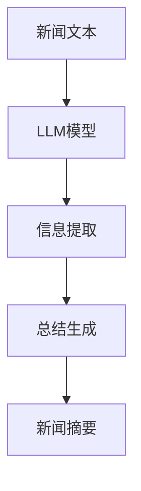
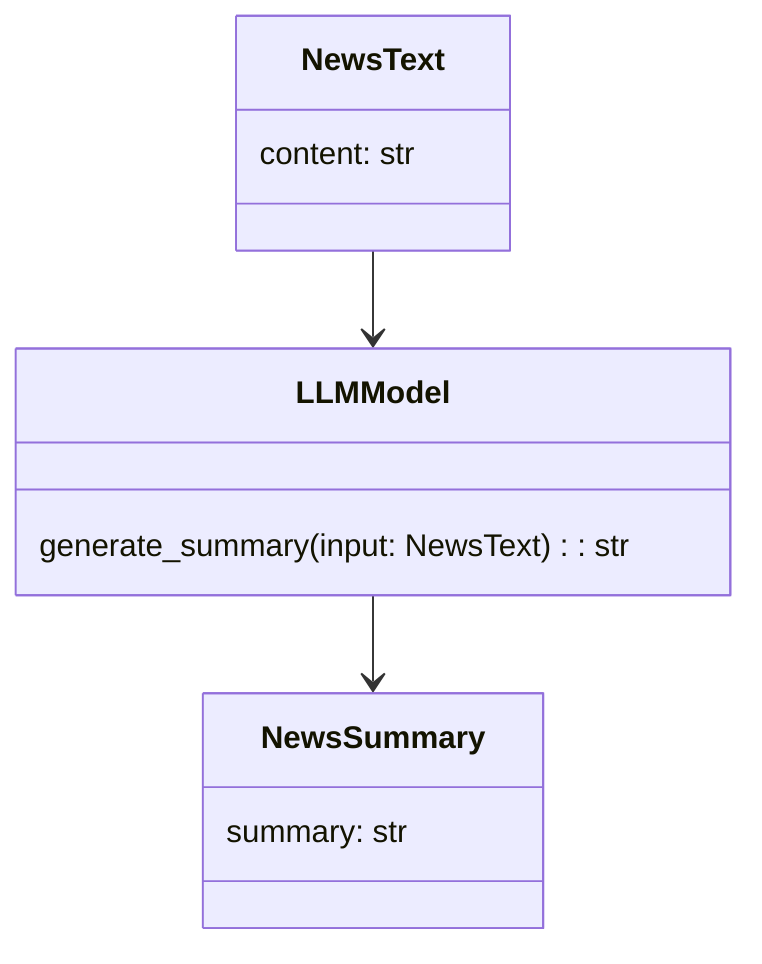
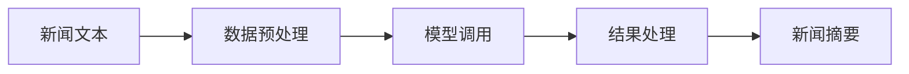
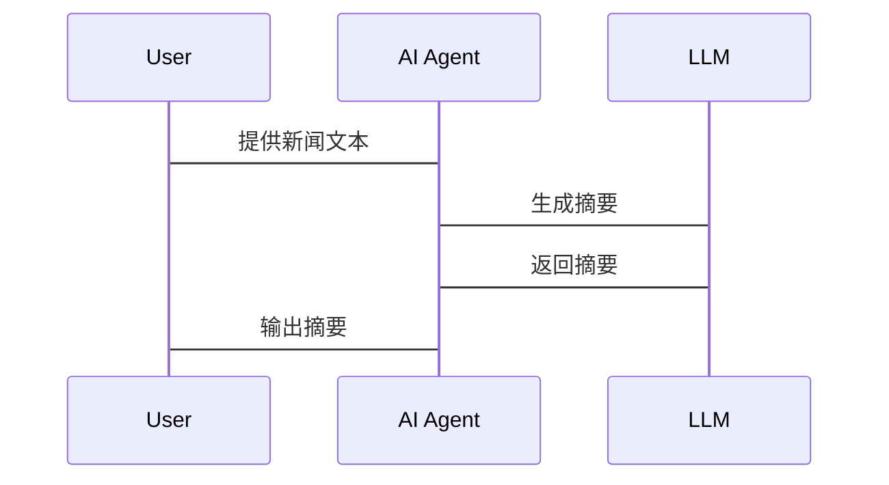

                 


# 《新闻摘要 AI Agent：LLM 驱动的信息提取与总结》

> 关键词：新闻摘要，AI Agent，LLM，信息提取，总结生成，大语言模型

> 摘要：本文系统阐述了基于大语言模型（LLM）的新闻摘要 AI Agent 的实现原理、算法设计、系统架构以及实际应用。通过分析新闻摘要的核心概念、LLM 的技术优势以及 AI Agent 的工作流程，本文深入探讨了如何利用 LLM 驱动信息提取与总结，最终实现高效、准确的新闻摘要生成。

---

# 第一部分: 新闻摘要 AI Agent 的背景与核心概念

## 第1章: 新闻摘要的定义与问题背景

### 1.1 新闻摘要的定义与特点
#### 1.1.1 新闻摘要的定义
新闻摘要是指从一篇新闻文本中提取关键信息并生成简短、准确的总结的过程。其目标是保留原文的核心内容，同时去除冗余信息，使读者能够快速获取新闻的核心要点。

#### 1.1.2 新闻摘要的特点
- **简洁性**：摘要应精炼，避免冗长。
- **准确性**：摘要必须忠实于原文，避免遗漏重要信息。
- **一致性**：摘要应保持逻辑连贯，语义清晰。

#### 1.1.3 新闻摘要的应用场景
- **新闻阅读**：帮助用户快速了解新闻内容。
- **信息检索**：用于搜索引擎的索引和排序。
- **数据处理**：用于新闻数据库的整理和分析。

### 1.2 问题背景与挑战
#### 1.2.1 传统新闻摘要方法的局限性
传统摘要方法主要依赖规则或统计方法，存在以下问题：
- 需要手动设计规则，难以应对复杂场景。
- 统计方法依赖关键词匹配，缺乏语义理解能力。

#### 1.2.2 人工摘要的效率问题
人工摘要效率低下，难以满足大规模数据处理的需求。

#### 1.2.3 大语言模型的引入与优势
大语言模型（LLM）的引入为新闻摘要提供了新的可能性，其优势包括：
- **强大的语义理解能力**：能够准确捕捉新闻文本的核心内容。
- **自动生成能力**：无需手动设计规则，可以自动完成摘要生成。

### 1.3 LLM驱动的新闻摘要目标
#### 1.3.1 信息提取的核心目标
从新闻文本中提取关键信息，包括主要事件、人物、时间和地点等。

#### 1.3.2 总结生成的关键任务
将提取的信息组织成连贯、简洁的摘要。

#### 1.3.3 边界与外延
新闻摘要的边界在于避免引入外部信息或主观判断，外延则包括多语言、多领域等扩展场景。

## 第2章: 大语言模型（LLM）与新闻摘要的关系

### 2.1 大语言模型的基本概念
#### 2.1.1 LLM的定义
大语言模型是一种基于深度学习的自然语言处理模型，具有强大的文本生成和理解能力。

#### 2.1.2 LLM的核心特点
- **大规模训练数据**：通常基于 billions 级别的文本数据进行训练。
- **多任务学习能力**：可以在多种任务上表现出色。
- **生成能力强**：能够生成自然流畅的文本。

#### 2.1.3 LLM与新闻摘要的结合
通过将新闻文本输入 LLM，可以利用其生成能力完成摘要任务。

### 2.2 LLM驱动的新闻摘要原理
#### 2.2.1 LLM在信息提取中的作用
- **上下文理解**：LLM能够理解新闻文本的上下文关系。
- **关键词识别**：通过生成摘要，间接实现关键词提取。

#### 2.2.2 LLM在总结生成中的应用
- **文本生成**：直接生成摘要文本。
- **多轮交互**：通过多次生成和优化，提高摘要质量。

#### 2.2.3 LLM驱动的新闻摘要流程
1. 输入新闻文本。
2. LLM生成初步摘要。
3. 根据生成结果优化摘要。

### 2.3 LLM驱动的新闻摘要的优势
#### 2.3.1 高效性
- LLM可以快速生成摘要，适合处理大量数据。
#### 2.3.2 准确性
- 通过大规模训练，LLM能够捕捉到文本中的核心信息。
#### 2.3.3 可扩展性
- LLM可以轻松扩展到多语言或多领域。

## 第3章: 新闻摘要 AI Agent 的核心概念

### 3.1 新闻摘要 AI Agent 的定义
#### 3.1.1 AI Agent 的定义
AI Agent 是一种能够感知环境并采取行动以实现目标的智能体。

#### 3.1.2 新闻摘要 AI Agent 的功能
- 信息提取
- 摘要生成
- 用户交互

#### 3.1.3 新闻摘要 AI Agent 的工作流程
1. 接收新闻文本输入。
2. 通过 LLM 进行信息提取。
3. 生成摘要并返回结果。

### 3.2 核心概念与联系
#### 3.2.1 LLM 与新闻摘要的关系
- LLM 是实现新闻摘要的核心技术。
- 新闻摘要 AI Agent 是 LLM 的具体应用之一。

#### 3.2.2 新闻摘要 AI Agent 的实体关系图


#### 3.2.3 核心概念的数学模型与公式
- **LLM 的概率生成模型**
$$ P(y|x) = \frac{P(x,y)}{P(x)} $$
- **新闻摘要的生成过程**
$$ P(\text{摘要} | \text{新闻}) $$

---

# 第二部分: LLM驱动的新闻摘要算法原理

## 第4章: LLM驱动的新闻摘要算法

### 4.1 算法工作流程
1. **输入处理**：将新闻文本输入 LLM。
2. **信息提取**：LLM提取文本中的关键信息。
3. **摘要生成**：生成简短的摘要文本。

### 4.2 信息提取与总结生成

#### 4.2.1 信息提取方法
- 基于LLM的生成式提取。
- 基于关键词的提取。

#### 4.2.2 总结生成方法
- 基于LLM的文本生成。
- 基于规则的优化。

### 4.3 算法实现细节
#### 4.3.1 LLM的参数设置
- 模型选择：如 GPT-3, GPT-4 等。
- 参数调优：如温度、重复率等。

#### 4.3.2 信息提取的实现
- 使用 LLM 的生成能力，输出关键信息。
- 通过多次生成，优化提取结果。

#### 4.3.3 总结生成的实现
- 将提取的信息组织成连贯的摘要。
- 使用语言模型优化语句流畅性。

---

# 第三部分: 系统分析与架构设计

## 第5章: 系统架构设计

### 5.1 系统功能设计
- 新闻文本输入
- 摘要生成
- 结果输出

### 5.2 领域模型类图


### 5.3 系统架构图


### 5.4 接口交互序列图


---

# 第四部分: 项目实战

## 第6章: 项目实战

### 6.1 环境安装
- Python 3.8+
- 安装依赖：transformers、torch

### 6.2 核心代码实现
```python
from transformers import pipeline

# 加载模型
summarizer = pipeline("summarization", model="facebook/bart-large-cnn")

# 处理新闻文本
def generate_summary(news_text):
    summary = summarizer(news_text, max_length=100, min_length=50, do_sample=False)
    return summary[0]['summary_text']

# 示例
news = "..."  # 输入新闻文本
result = generate_summary(news)
print(result)
```

### 6.3 代码解读与优化
- 使用 Bart 模型进行摘要生成。
- 参数设置：max_length 和 min_length 控制摘要长度。
- 优化技巧：调整温度和重复率以提升生成质量。

### 6.4 实际案例分析
- 输入新闻文本：例如一篇关于科技新闻的文章。
- 输出摘要结果：生成简洁的新闻摘要。

### 6.5 项目小结
- 通过代码实现新闻摘要 AI Agent。
- 展示了 LLM 在实际应用中的强大能力。

---

# 第五部分: 总结与展望

## 第7章: 总结与展望

### 7.1 核心要点回顾
- 新闻摘要的定义与目标。
- LLM 在摘要生成中的应用。
- AI Agent 的系统架构与实现。

### 7.2 未来展望
- 更多语言的支持。
- 更复杂的摘要任务。
- 更高效的模型优化。

### 7.3 最佳实践 tips
- 选择合适的 LLM 模型。
- 调整参数以优化摘要质量。
- 处理多语言和多领域任务时，注意模型的适用性。

### 7.4 注意事项
- 数据质量和模型调优对摘要结果影响重大。
- 需要处理文本的长度和复杂性。

### 7.5 拓展阅读
- 了解最新的 LLM 模型。
- 学习更多的自然语言处理技术。

---

# 作者：AI天才研究院/AI Genius Institute & 禅与计算机程序设计艺术 /Zen And The Art of Computer Programming

