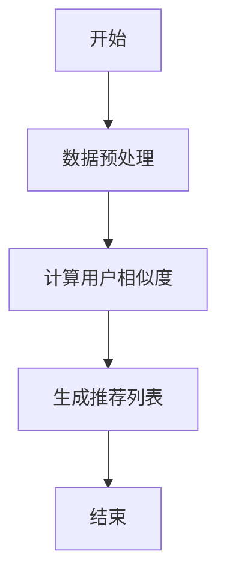
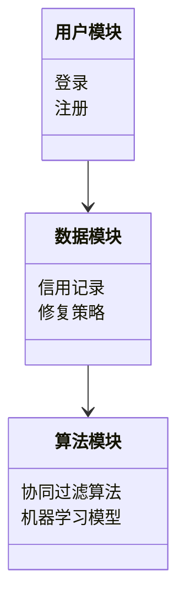
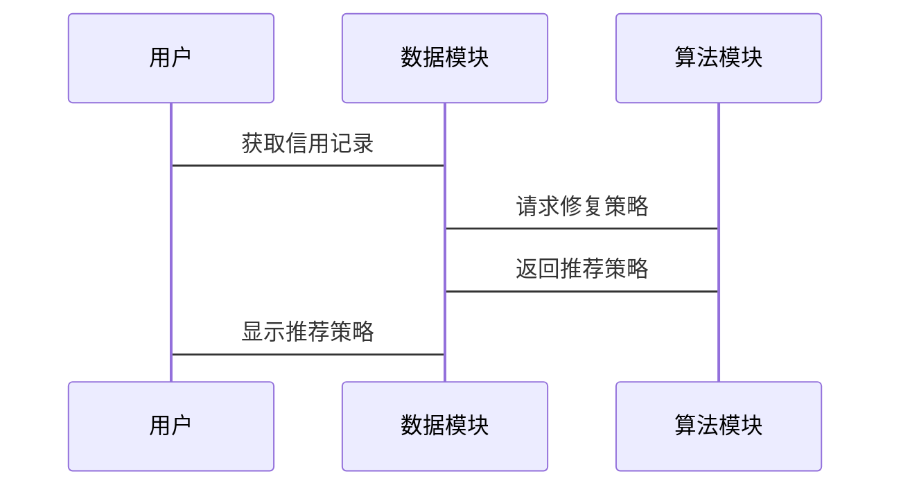

                 


# 智能个人信用修复策略推荐与执行系统

## 关键词：
智能信用修复，推荐算法，系统架构，机器学习，信用评估

## 摘要：
本文详细探讨智能个人信用修复策略推荐与执行系统的开发与应用。通过分析信用评估的核心问题，介绍修复策略推荐算法，并结合系统架构设计，展示如何构建一个高效的信用修复系统。文章涵盖背景介绍、核心概念、算法原理、系统架构、项目实战和最佳实践，提供从理论到实践的全面指导。

## 第一部分：背景介绍

### 第1章：智能个人信用修复概述

#### 1.1 问题背景
- **信用评估的重要性**：信用评分是个人在金融领域的关键指标，影响贷款、信用卡等信用产品的审批。
- **个人信用修复的必要性**：由于错误、欺诈或疏忽，个人信用记录可能出现负面信息，修复这些信息对个人财务健康至关重要。
- **智能修复的兴起**：传统修复方法效率低下，智能系统通过自动化和数据分析提高修复效率和精准度。

#### 1.2 核心概念与问题描述
- **信用修复的定义**：通过合法手段调整或更正负面信用记录，提升信用评分。
- **修复策略的分类**：包括 dispute（争议）、negotiation（协商）、legal action（法律行动）等策略。
- **系统的目标与范围**：系统旨在根据个人信用状况推荐最优修复策略，并监督执行过程。

#### 1.3 问题解决与边界
- **修复策略的核心问题**：选择最优策略，考虑修复时间、成本和效果。
- **系统的边界与外延**：系统不处理信用评分计算，仅提供修复建议和执行支持。
- **核心要素与组成**：数据采集、分析模型、推荐算法、执行系统和用户界面。

## 第二部分：核心概念与联系

### 第2章：核心概念原理

#### 2.1 信用评估模型
- **模型的定义与作用**：评估个人信用状况，预测违约风险。
- **常见模型对比**：FICO评分、Vantage评分，各有优劣，FICO更常用。

#### 2.2 修复策略推荐算法
- **算法的定义与类型**：基于规则和机器学习的推荐算法，协同过滤和分类器是常见选择。
- **算法的优缺点**：协同过滤需要大量数据，机器学习模型复杂但准确。

#### 2.3 执行系统架构
- **系统的组成与功能**：数据采集、分析、推荐、执行和监控模块。
- **架构的优劣分析**：模块化设计便于维护，但需要处理数据隐私问题。

### 第3章：概念关系与ER图

#### 3.1 核心概念属性对比
| 概念      | 属性              |
|-----------|-------------------|
| 信用评估模型 | 输入数据、评估方法、输出评分 |
| 修复策略推荐算法 | 数据类型、推荐策略、准确率 |
| 执行系统架构 | 模块组成、功能划分、接口设计 |

#### 3.2 ER实体关系图
```mermaid
erd
    title 实体关系图
    user [用户]
    credit_record [信用记录]
   修复策略 [修复策略]
    属于 [多对多关系]
    user --> 属于 --> 修复策略
    user --> 属于 --> credit_record
    credit_record --> 属于 --> 修复策略
```

## 第三部分：算法原理讲解

### 第4章：推荐算法原理

#### 4.1 算法选择与流程
- **协同过滤算法**：基于用户相似性推荐修复策略。
- **流程图展示**：数据预处理、用户相似度计算、策略推荐。



#### 4.2 算法实现
- **Python代码实现**：使用协同过滤推荐系统，代码示例：
  ```python
  import numpy as np
  from sklearn.metrics.pairwise import cosine_similarity

  # 示例数据
  user_matrix = np.array([[2, 3, 0], [4, 5, 0], [1, 1, 0]])

  # 计算余弦相似度
  similarity = cosine_similarity(user_matrix)
  print(similarity)
  ```

- **代码功能解释**：计算用户间相似度，生成推荐策略列表。

#### 4.3 数学模型与公式
- **评分预测公式**：$$\hat{r}_{ui} = \mu + b_u + b_i + \sum \lambda (a_j r_{uj} - c_j)$$
- **公式解释**：$\mu$是全局平均分，$b_u$和$b_i$是用户和项目的偏置，$\lambda$是正则化参数。

## 第四部分：系统分析与架构设计

### 第5章：系统分析

#### 5.1 问题场景
- **用户登录**：验证用户身份，获取信用数据。
- **信用评估**：分析信用记录，生成评估报告。
- **策略推荐**：基于模型推荐修复策略。
- **执行跟踪**：监控修复进展，提供反馈。

#### 5.2 功能模块设计


#### 5.3 系统架构设计
- **分层架构**：数据层、业务逻辑层、用户界面层。
- **架构图展示**：


#### 5.4 接口设计与交互流程
- **序列图展示**：


## 第五部分：项目实战

### 第6章：系统实现

#### 6.1 环境安装
- 安装Python、Pandas、Scikit-learn等库：
  ```bash
  pip install numpy pandas scikit-learn
  ```

#### 6.2 核心代码实现
- **数据预处理代码**：
  ```python
  import pandas as pd
  data = pd.read_csv('credit_data.csv')
  ```

- **模型训练代码**：
  ```python
  from sklearn.model_selection import train_test_split
  X_train, X_test, y_train, y_test = train_test_split(data.drop('target', axis=1), data['target'])
  ```

- **推荐系统实现**：
  ```python
  from sklearn.neighbors import NearestNeighbors
  model = NearestNeighbors(n_neighbors=5).fit(X_train)
  ```

#### 6.3 案例分析与讲解
- **案例数据**：展示部分数据，分析修复策略。
- **系统运行**：步骤说明，从数据输入到结果输出。

### 第7章：案例分析与讲解
- **详细讲解**：结合实际数据，展示系统如何推荐修复策略，并解释结果。

## 第六部分：最佳实践

### 第8章：最佳实践与小结

#### 8.1 小结
- 总结文章内容，强调智能信用修复系统的重要性。

#### 8.2 注意事项
- 数据隐私保护：避免敏感信息泄露。
- 模型调优：定期更新模型，保持推荐准确性。
- 系统维护：监控系统性能，及时修复问题。

#### 8.3 拓展阅读
- 推荐书籍和论文，如《集体智慧编程》和相关机器学习论文。

## 结论

智能个人信用修复策略推荐与执行系统结合了先进的数据分析和机器学习技术，能够有效提高信用修复的效率和准确性。通过本文的详细讲解，读者可以全面理解系统的构建过程，并在实际应用中加以改进和优化。

## 作者信息

作者：AI天才研究院/AI Genius Institute & 禅与计算机程序设计艺术/Zen And The Art of Computer Programming

---

以上是《智能个人信用修复策略推荐与执行系统》的完整目录和内容概览。接下来，我可以根据这个大纲逐步展开每一部分，撰写详细的技术博客文章。

