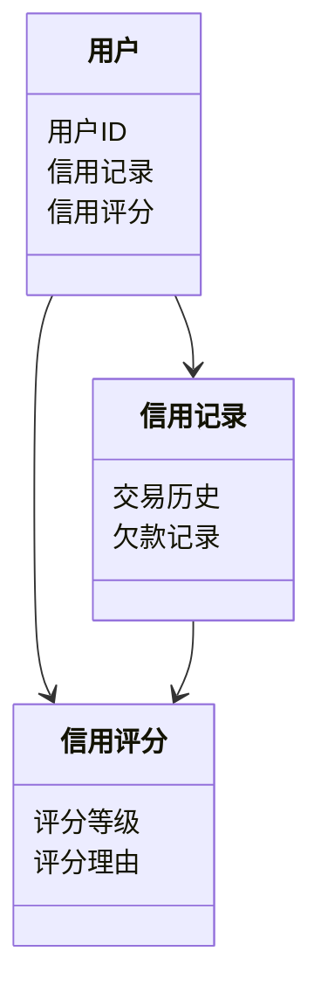
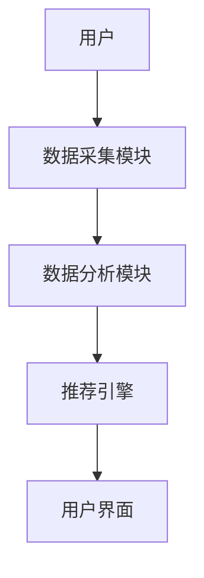
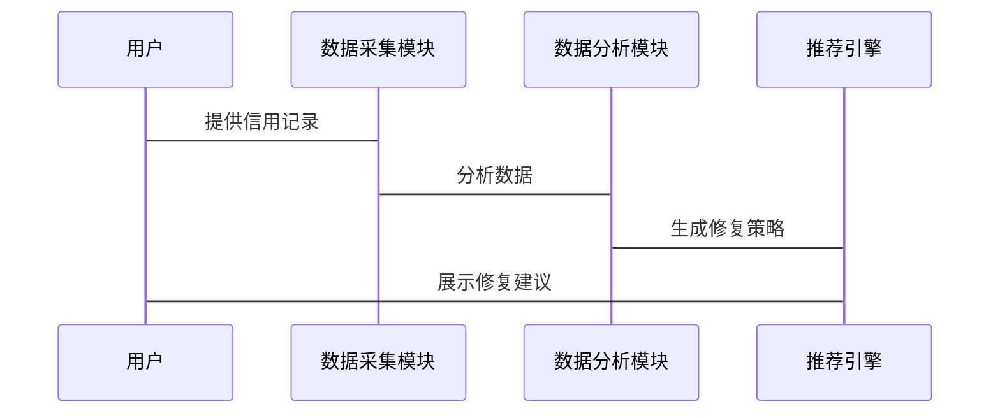

                 


# 智能个人信用修复策略推荐系统

**关键词：** 智能信用修复、推荐系统、协同过滤、信用评分、数据隐私

**摘要：** 本文探讨了智能个人信用修复策略推荐系统的构建与应用，详细分析了信用修复的背景、推荐系统的算法原理、系统架构设计以及项目实战。通过协同过滤和基于内容的推荐算法，结合实际案例，展示了如何利用智能系统提高信用修复效率和准确性。文章最后提出了最佳实践建议，强调数据隐私和算法可解释性的重要性。

---

# 第一部分：智能个人信用修复策略推荐系统的背景与核心概念

## 第1章：个人信用修复的背景与问题描述

### 1.1 信用修复的背景与意义

#### 1.1.1 信用修复的概念与定义

信用修复是指通过调整个人的信用行为，改善信用记录，提升信用评分的过程。良好的信用记录对个人的贷款申请、就业机会等有着重要影响。

#### 1.1.2 个人信用修复的重要性

随着信用评分在金融领域的广泛应用，个人信用修复的重要性日益凸显。及时修复信用问题可以避免因信用不良导致的经济损失和社交障碍。

#### 1.1.3 信用修复的法律与政策框架

各国和地区都制定了相关法律法规，明确了信用修复的条件和程序。例如，欧盟的《通用数据保护条例》（GDPR）赋予个人请求删除负面信用信息的权利。

### 1.2 信用修复中的问题与挑战

#### 1.2.1 个人信用信息的复杂性

信用信息可能涉及多个金融机构，数据分散且格式多样，增加了修复的难度。

#### 1.2.2 信用修复中的数据隐私问题

修复过程中需处理敏感的个人数据，如何保护隐私是关键挑战。

#### 1.2.3 传统信用修复方法的局限性

传统方法依赖人工分析，效率低且成本高，难以满足大规模需求。

### 1.3 智能信用修复策略推荐系统的目标与价值

#### 1.3.1 智能信用修复的目标

通过智能化技术，快速识别信用问题，提供个性化修复建议。

#### 1.3.2 智能信用修复的价值与应用场景

- 提高信用修复效率，降低成本。
- 个性化修复策略，提升成功率。
- 广泛应用于金融、教育等领域。

#### 1.3.3 信用修复推荐系统的边界与外延

系统主要针对个人信用修复，不涉及企业信用，且不处理刑事犯罪记录。

### 1.4 核心概念与要素

#### 1.4.1 信用修复的核心要素

- 用户信用记录：包括贷款、信用卡等历史数据。
- 信用评分：反映信用状况的综合指标。
- 修复策略：具体修复步骤和建议。

#### 1.4.2 信用修复推荐系统的组成

- 数据采集模块：收集用户信用信息。
- 数据分析模块：处理和分析数据。
- 推荐引擎：生成修复策略。
- 用户界面：展示修复建议。

#### 1.4.3 系统的核心功能与属性

- 数据清洗：处理缺失或错误数据。
- 模型训练：建立推荐算法。
- 策略生成：输出修复建议。
- 可视化：直观展示修复进展。

## 1.5 本章小结

本章介绍了信用修复的背景、问题及智能推荐系统的必要性。通过定义核心概念和系统组成，为后续章节奠定了基础。

---

# 第二部分：智能信用修复策略推荐系统的算法原理与核心概念

## 第2章：推荐系统的核心概念与原理

### 2.1 推荐系统的定义与分类

#### 2.1.1 推荐系统的定义

推荐系统是根据用户历史行为和偏好，预测其可能感兴趣的内容或服务的技术。

#### 2.1.2 基于协同过滤的推荐系统

协同过滤通过分析用户行为相似性，推荐相似用户的偏好内容。

#### 2.1.3 基于内容的推荐系统

内容推荐系统依赖于商品或内容本身的属性，而非用户行为。

### 2.2 推荐算法的核心原理

#### 2.2.1 协同过滤算法

协同过滤分为基于用户的协同过滤和基于物品的协同过滤。

#### 2.2.2 基于内容的推荐算法

分析商品描述或内容特征，生成推荐。

#### 2.2.3 混合推荐算法

结合协同过滤和内容推荐的优势，提升推荐准确性。

### 2.3 信用修复推荐系统的算法选择

#### 2.3.1 信用修复推荐系统的特殊性

需要考虑信用评分的敏感性和数据隐私问题。

#### 2.3.2 基于协同过滤的信用修复推荐

通过分析相似用户的信用行为，推荐修复策略。

#### 2.3.3 基于内容的信用修复推荐

分析信用记录的具体内容，提供针对性修复建议。

### 2.4 信用修复推荐系统的实体关系图


### 2.5 本章小结

本章介绍了推荐系统的分类和核心原理，分析了信用修复推荐系统的特殊性和算法选择，通过ER图展示了系统的实体关系。

---

# 第三部分：智能信用修复策略推荐系统的算法实现与数学模型

## 第3章：推荐算法的数学模型与实现

### 3.1 协同过滤算法的数学模型

#### 3.1.1 协同过滤的基本公式

相似度计算公式：

$$\text{相似度} = \frac{\sum_{i=1}^{n}(r_{u,i} - \bar{r}_u)(r_{v,i} - \bar{r}_v)}{\sqrt{\sum_{i=1}^{n}(r_{u,i} - \bar{r}_u)^2} \sqrt{\sum_{i=1}^{n}(r_{v,i} - \bar{r}_v)^2}}$$

其中，$r_{u,i}$和$r_{v,i}$分别表示用户u和v对项目i的评分，$\bar{r}_u$和$\bar{r}_v$是用户u和v的平均评分。

#### 3.1.2 协同过滤的实现步骤

1. 收集用户评分数据。
2. 计算用户相似度矩阵。
3. 生成推荐列表。

#### 3.1.3 协同过滤的Python实现示例

```python
import numpy as np

def cosine_similarity(user_ratings):
    user_avg = np.mean(user_ratings, axis=1).reshape(-1,1)
    centered_ratings = user_ratings - user_avg
    dot_product = centered_ratings.dot(centered_ratings.T)
    magnitude = np.sqrt(np.sum(centered_ratings**2, axis=1)).reshape(-1,1)
    similarity_matrix = dot_product / magnitude
    return similarity_matrix
```

### 3.2 基于内容的推荐算法实现

#### 3.2.1 基于内容的推荐公式

推荐分数计算：

$$\text{score} = \sum_{i=1}^{n} w_i \cdot f_i$$

其中，$w_i$是特征的重要性权重，$f_i$是特征的值。

#### 3.2.2 基于内容的推荐实现步骤

1. 提取信用记录特征。
2. 计算特征权重。
3. 生成推荐策略。

### 3.3 智能信用修复推荐系统的算法优化

#### 3.3.1 算法优化策略

- 增加正则化项，防止过拟合。
- 使用分布式计算，提升处理效率。

#### 3.3.2 优化后的算法效果

- 提高推荐准确性。
- 减少计算时间。

### 3.4 本章小结

本章详细讲解了协同过滤和基于内容的推荐算法，通过Python代码示例展示了实现过程，并提出了优化建议。

---

# 第四部分：智能信用修复策略推荐系统的系统分析与架构设计

## 第4章：系统分析与架构设计

### 4.1 问题场景介绍

用户希望通过系统快速获取信用修复建议，改善信用评分。

### 4.2 系统功能设计

#### 4.2.1 领域模型类图



### 4.3 系统架构设计

#### 4.3.1 系统架构图



#### 4.3.2 系统接口设计

- 数据接口：与金融机构对接，获取信用数据。
- 用户接口：提供修复建议和进度查询。

### 4.4 系统交互序列图



### 4.5 本章小结

本章通过系统架构设计和交互图，展示了智能信用修复推荐系统的整体结构和工作流程。

---

# 第五部分：智能信用修复策略推荐系统的项目实战

## 第5章：项目实战

### 5.1 环境安装与配置

- 安装Python和相关库（如Pandas、Scikit-learn）。
- 安装Jupyter Notebook用于开发和测试。

### 5.2 核心代码实现

#### 5.2.1 数据清洗代码

```python
import pandas as pd

# 读取信用数据
df = pd.read_csv('credit_data.csv')

# 处理缺失值
df.dropna(inplace=True)

# 删除重复记录
df.drop_duplicates(inplace=True)

# 标准化处理
from sklearn.preprocessing import StandardScaler

scaler = StandardScaler()
df_scaled = pd.DataFrame(scaler.fit_transform(df), columns=df.columns)
```

#### 5.2.2 模型训练代码

```python
from sklearn.metrics.pairwise import cosine_similarity

# 计算相似度矩阵
similarity_matrix = cosine_similarity(df_scaled)

# 选择相似用户
similar_users = np.argsort(similarity_matrix, axis=0)[-5:]
```

#### 5.2.3 推荐策略生成代码

```python
def generate_recommendation(user_id, similar_users, df):
    # 获取相似用户的信用评分
    similar_scores = similarity_matrix[user_id, similar_users]
    
    # 确定修复策略
    strategies = []
    for user in similar_users:
        if df.loc[user, '信用评分'] > 600:
            strategies.append('优化现有信用行为')
        else:
            strategies.append('申请小额贷款并按时还款')
    
    return strategies

# 示例输出
strategies = generate_recommendation(0, similar_users, df)
print("推荐修复策略:", strategies)
```

### 5.3 代码解读与分析

- 数据清洗：处理缺失值和重复记录，确保数据质量。
- 模型训练：使用协同过滤算法计算用户相似度。
- 推荐生成：根据相似用户的信用评分，制定修复策略。

### 5.4 案例分析与详细讲解

假设用户A的信用评分为550分，相似用户中有3位评分为620分，2位评分为580分。系统会推荐用户A申请小额信用贷款并按时还款，以提升信用评分。

### 5.5 项目小结

通过实际案例分析，展示了系统在信用修复中的应用价值和效果。

---

# 第六部分：智能信用修复策略推荐系统的最佳实践

## 第6章：最佳实践与小结

### 6.1 小结

智能信用修复策略推荐系统通过协同过滤和基于内容的推荐算法，帮助用户快速制定修复计划，提升信用评分。

### 6.2 注意事项

- 数据隐私保护：确保用户数据的安全性。
- 算法可解释性：推荐结果应易于理解和调整。
- 持续优化：根据反馈更新模型，提升推荐准确率。

### 6.3 拓展阅读

- 《推荐系统导论》
- 《数据隐私与保护》
- 《信用评分模型与应用》

---

# 作者

**作者：AI天才研究院/AI Genius Institute & 禅与计算机程序设计艺术 /Zen And The Art of Computer Programming**

---

这篇文章详细探讨了智能个人信用修复策略推荐系统的各个方面，从背景分析到算法实现，再到系统设计和项目实战，为读者提供了全面的技术解读和实际应用指导。通过清晰的结构和丰富的案例，帮助读者理解如何利用智能技术优化信用修复过程，提升个人信用管理效率。

