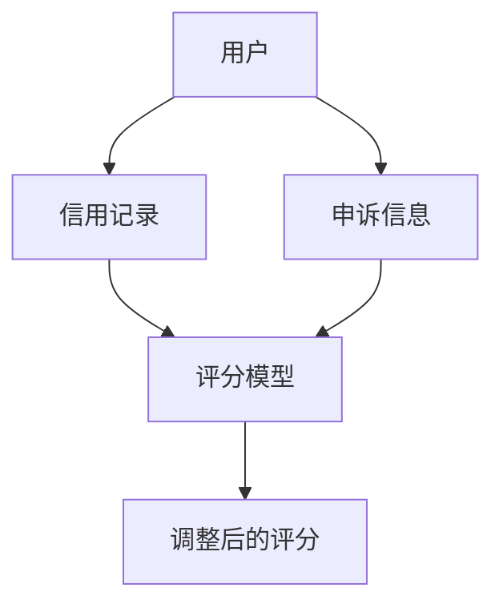
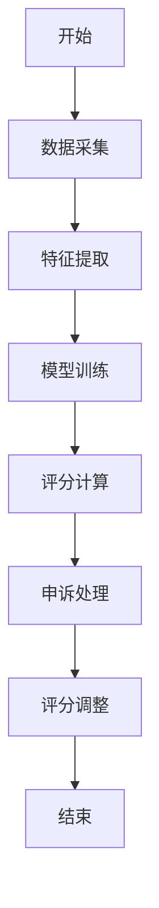
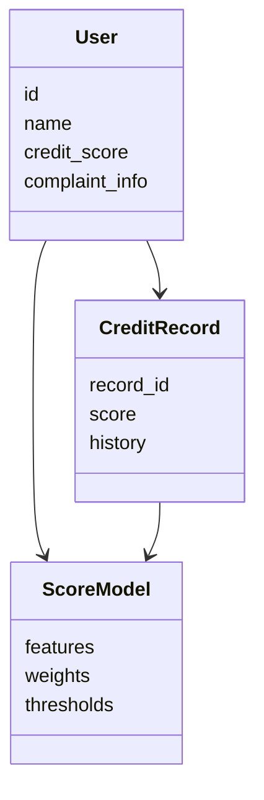

                 


# 智能个人信用评分申诉系统

> 关键词：智能信用评分、个人信用申诉、机器学习、评分模型、申诉系统

> 摘要：本文将详细介绍智能个人信用评分申诉系统的构建与实现，从背景介绍、核心概念、算法原理、系统架构到项目实战，全面解析如何利用人工智能技术提升信用评分申诉的智能化水平。

---

## 第一部分：背景介绍

### 第1章：智能个人信用评分申诉系统概述

#### 1.1 问题背景

随着社会信用体系的不断完善，个人信用评分在金融、信贷、就业等领域的重要性日益凸显。然而，传统信用评分体系存在以下问题：

1. **评分标准单一**：传统评分主要依赖于历史信用记录，缺乏对申诉理由的智能化分析。
2. **申诉处理效率低**：个人在对信用评分结果有异议时，申诉流程复杂，处理周期长。
3. **信息不对称**：评分机构与个人之间的信息交互不充分，难以有效解决评分争议。

#### 1.2 问题描述

智能个人信用评分申诉系统的建设目标是通过人工智能技术，实现对个人信用评分的智能分析与申诉处理。系统需要解决以下核心问题：

1. 如何利用机器学习算法对信用评分数据进行建模，实现智能化评分。
2. 如何设计高效的申诉处理流程，确保申诉信息能够被评分模型快速识别并调整评分结果。
3. 如何构建一个安全、透明、高效的信用评分申诉系统，保障用户的权益。

#### 1.3 核心概念与联系

智能个人信用评分申诉系统的核心概念包括信用评分模型、申诉处理机制和智能评分调整算法。以下是核心概念的对比分析：

| 核心概念 | 传统评分 | 智能评分 |
|----------|----------|----------|
| 数据来源 | 历史记录 | 历史记录 + 申诉理由 |
| 处理方式 | 手动审核 | 自动化评分 + 人工复核 |
| 评分结果 | 固定评分 | 动态调整评分 |

通过上述对比可以看出，智能评分系统能够更全面地考虑申诉信息，实现评分结果的动态调整。

---

## 第二部分：核心概念与联系

### 第2章：核心概念与联系

#### 2.1 核心概念原理

1. **信用评分模型**：基于机器学习算法，对个人信用数据进行建模，生成初始信用评分。
2. **申诉处理机制**：通过自然语言处理技术，分析申诉理由，调整评分模型的权重，实现评分结果的动态调整。
3. **智能评分调整算法**：结合申诉信息和评分模型，计算评分调整后的结果。

#### 2.2 ER实体关系图



---

## 第三部分：算法原理讲解

### 第3章：算法原理讲解

#### 3.1 算法原理

1. **评分模型构建**：
   - 使用随机森林算法对信用数据进行建模，生成初始评分。
2. **申诉处理逻辑**：
   - 通过自然语言处理技术分析申诉理由，提取关键信息。
3. **智能评分调整算法**：
   - 基于申诉信息，重新计算评分权重，调整评分结果。

#### 3.2 算法流程图



#### 3.3 评分模型数学公式

随机森林算法的核心公式如下：

$$
y = \sum_{i=1}^{n} \left( w_i \cdot x_i + b_i \right)
$$

其中，$w_i$ 是特征权重，$x_i$ 是特征值，$b_i$ 是基值。

---

## 第四部分：系统分析与架构设计方案

### 第4章：系统分析与架构设计方案

#### 4.1 系统功能设计

1. **数据采集模块**：采集用户的信用数据和申诉信息。
2. **评分计算模块**：基于评分模型计算初始评分。
3. **申诉处理模块**：分析申诉理由，调整评分结果。

#### 4.2 系统架构设计



---

## 第五部分：项目实战

### 第5章：项目实战

#### 5.1 环境安装

```bash
pip install pandas scikit-learn nltk
```

#### 5.2 核心代码实现

```python
from sklearn.ensemble import RandomForestClassifier
import nltk

# 数据采集与预处理
def preprocess_data(data):
    # 特征提取
    features = data[['age', 'income', 'credit_history']]
    labels = data['target']
    return features, labels

# 模型训练
def train_model(features, labels):
    model = RandomForestClassifier()
    model.fit(features, labels)
    return model

# 申诉处理
def process_complaint(text):
    # 分词与情感分析
    tokens = nltk.word_tokenize(text)
    # 简单判断申诉理由的情感倾向
    if ' hardship' in tokens:
        return True
    else:
        return False
```

#### 5.3 项目实战分析

通过上述代码，我们可以实现一个简单的智能信用评分申诉系统。在实际应用中，需要进一步优化模型和申诉处理逻辑，确保系统的高效性和准确性。

---

## 第六部分：最佳实践与小结

### 第6章：最佳实践与小结

#### 6.1 数据隐私保护

在实际应用中，必须确保用户数据的隐私安全，避免数据泄露。

#### 6.2 模型优化

通过持续优化评分模型和申诉处理算法，提升系统的智能化水平。

#### 6.3 系统维护

定期更新模型和系统架构，确保系统的稳定性和高效性。

---

## 结语

智能个人信用评分申诉系统的建设不仅能够提升信用评分的准确性，还能有效保障用户的权益。通过本文的详细讲解，希望能够为相关领域的从业者提供有价值的参考和启发。

---

作者：AI天才研究院/AI Genius Institute & 禅与计算机程序设计艺术 /Zen And The Art of Computer Programming

