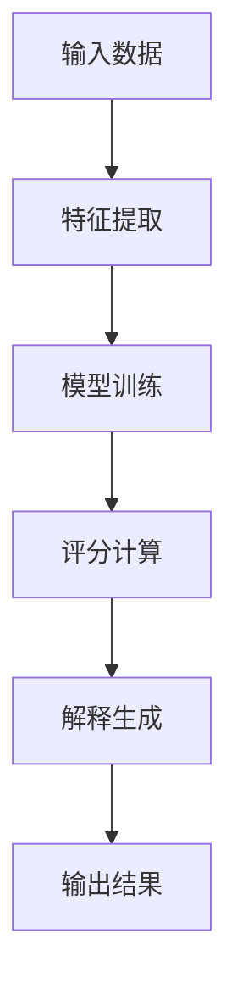
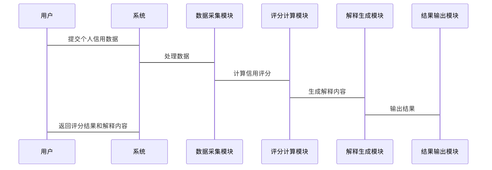

                 


# 智能个人信用评分解释器

> 关键词：智能个人信用评分解释器，人工智能，机器学习，信用评分，可解释性，评分模型

> 摘要：本文探讨智能个人信用评分解释器的设计与实现，从背景、核心概念到算法原理、系统架构，再到项目实战，全面解析如何利用人工智能技术构建高效、可解释的个人信用评分系统。

---

## 第一部分：智能个人信用评分解释器的背景与核心概念

### 第1章：背景介绍

#### 1.1 问题背景
- **传统信用评分的局限性**：传统信用评分模型（如线性回归、逻辑回归）虽然在某些场景下表现良好，但存在可解释性差、难以处理复杂特征等问题。
- **智能解释器的需求与目标**：随着人工智能技术的发展，用户对评分结果的可解释性要求日益提高，智能个人信用评分解释器应运而生，旨在提供更透明、更直观的评分解释。
- **问题解决的意义与价值**：通过智能解释器，用户可以更好地理解评分结果背后的原因，增强信任感，同时帮助金融机构优化风控策略。

#### 1.2 问题描述
- **信用评分的核心问题**：如何准确、高效地对个人信用进行评分，并提供可理解的解释。
- **智能解释器的功能需求**：实时计算信用评分，生成直观的解释内容，支持多种输出格式（如文本、图表）。
- **边界与外延**：仅针对个人信用评分，不涉及企业或团体信用评分。

#### 1.3 核心概念与组成
- **智能个人信用评分解释器的定义**：一种基于人工智能技术的系统，能够实时计算个人信用评分，并以用户易懂的方式解释评分结果。
- **核心要素与组成结构**：
  1. 数据采集模块：收集个人信用相关数据。
  2. 评分模型：基于机器学习算法计算信用评分。
  3. 解释算法：将评分结果转化为可理解的解释内容。
  4. 可视化模块：以文本、图表等形式展示解释内容。
- **概念的属性特征对比**：
  | 属性 | 传统评分解释器 | 智能评分解释器 |
  |------|----------------|----------------|
  | 解释性 | 低 | 高 |
  | 实时性 | 低 | 高 |
  | 可定制性 | 低 | 高 |

### 第2章：核心概念与联系

#### 2.1 核心概念原理
- **评分模型的原理**：基于机器学习算法（如梯度提升树、神经网络）构建评分模型，输入个人信用数据，输出信用评分。
- **解释算法的机制**：通过特征重要性分析、反向传播等方法，提取评分结果的关键影响因素，并生成解释内容。
- **可视化方法的实现**：将解释内容以文本、图表等形式展示，帮助用户快速理解评分结果。

#### 2.2 概念属性对比
- **智能解释器与传统解释器的对比**：智能解释器在解释性、实时性和可定制性方面具有显著优势。
- **不同评分模型的特征分析**：线性回归模型解释性较好，但对非线性关系的处理能力较弱；梯度提升树模型解释性较差，但对复杂关系的处理能力较强。
- **解释器的性能指标对比**：
  | 指标 | 解释准确性 | 解释简洁性 | 解释实时性 |
  |------|------------|------------|------------|
  | 传统解释器 | 中 | 高 | 低 |
  | 智能解释器 | 高 | 中 | 高 |

#### 2.3 ER实体关系图
```mermaid
er
    entity 个人信用信息 {
        key: 个人ID
        attribute: 姓名, 身份证号, 信用评分
    }
    entity 评分模型 {
        key: 模型ID
        attribute: 模型名称, 模型版本
    }
    entity 解释结果 {
        key: 解释ID
        attribute: 解释内容, 解释时间
    }
    relationship 个人信用信息 --o> 解释结果: 生成解释
    relationship 个人信用信息 --o> 评分模型: 使用模型
```

---

## 第二部分：算法原理讲解

### 第3章：算法原理讲解

#### 3.1 算法流程图


#### 3.2 核心算法实现
- **特征提取**：从原始数据中提取影响信用评分的关键特征，例如还款记录、信用历史、消费行为等。
- **模型训练**：使用机器学习算法（如XGBoost、LightGBM）训练评分模型。
- **评分计算**：基于训练好的模型，对目标个体进行信用评分计算。
- **解释生成**：通过特征重要性分析或反向传播方法，提取评分结果的关键影响因素，并生成解释内容。

#### 3.3 数学公式与模型
- **线性回归模型**：
  $$ \text{评分} = \beta_0 + \beta_1x_1 + \beta_2x_2 + \ldots + \beta_nx_n $$
  其中，$$ x_i $$ 是特征，$$ \beta_i $$ 是对应特征的系数。
- **梯度提升树模型**：
  使用XGBoost或LightGBM算法，通过特征重要性排序提取关键影响因素。

---

## 第三部分：系统分析与架构设计方案

### 第4章：系统分析与架构设计方案

#### 4.1 问题场景介绍
- **问题场景**：用户输入个人信用数据，系统实时计算信用评分，并生成可理解的解释内容。

#### 4.2 系统功能设计
- **数据采集模块**：采集个人信用数据，包括还款记录、消费行为、信用历史等。
- **评分计算模块**：基于机器学习模型计算信用评分。
- **解释生成模块**：通过特征重要性分析生成解释内容。
- **结果输出模块**：以文本、图表等形式输出评分结果和解释内容。

#### 4.3 系统架构设计


#### 4.4 接口设计与交互流程
- **接口设计**：
  - 数据输入接口：接收个人信用数据。
  - 数据输出接口：输出评分结果和解释内容。
- **交互流程图**：


---

## 第四部分：项目实战

### 第5章：项目实战

#### 5.1 环境安装
- **安装Python**：确保安装Python 3.8及以上版本。
- **安装依赖库**：使用pip安装必要的库，如`scikit-learn`, `xgboost`, `lightgbm`, `matplotlib`。

#### 5.2 核心代码实现
```python
# 示例代码：基于XGBoost的评分解释器
import xgboost as xgb
from sklearn.datasets import make_classification
from sklearn.model_selection import train_test_split

# 生成数据
X, y = make_classification(n_samples=1000, n_features=10, random_state=42)
X_train, X_test, y_train, y_test = train_test_split(X, y, test_size=0.2, random_state=42)

# 训练模型
model = xgb.XGBClassifier()
model.fit(X_train, y_train)

# 预测评分
y_pred = model.predict(X_test)
y_proba = model.predict_proba(X_test)[:, 1]

# 特征重要性分析
importances = model.feature_importances_
```

#### 5.3 代码解读与分析
- **特征重要性分析**：通过模型的`feature_importances_`属性提取特征重要性，找出对评分影响最大的特征。
- **解释生成**：基于特征重要性，生成评分结果的解释内容，例如“您的信用评分主要受还款记录和消费行为的影响”。

#### 5.4 实际案例分析
- **案例1**：用户A的信用评分主要受还款记录影响，解释内容为“您的信用评分较低主要是因为有多次逾期还款记录。”

#### 5.5 项目小结
- **项目总结**：通过代码实现了一个简单的智能个人信用评分解释器，能够基于XGBoost模型计算评分，并生成可理解的解释内容。
- **经验与教训**：特征选择和模型调优对评分结果的准确性有重要影响，未来可以进一步优化解释生成模块，使其更贴近用户需求。

---

## 第五部分：最佳实践、小结、注意事项与拓展阅读

### 第6章：最佳实践

#### 6.1 小结
- **总结**：智能个人信用评分解释器是一种结合人工智能技术的创新解决方案，能够实时计算信用评分，并提供直观的解释内容，帮助用户更好地理解评分结果。
- **经验分享**：在实际应用中，需要根据具体场景选择合适的模型和算法，并通过不断优化特征选择和模型调优来提升评分结果的准确性和解释性。

#### 6.2 注意事项
- **数据隐私**：在实际应用中，需要严格遵守数据隐私保护法规，确保用户数据的安全性。
- **模型解释性**：在选择模型时，需综合考虑模型的准确性和解释性，避免选择过于复杂的模型导致解释困难。
- **用户需求**：在设计解释内容时，需充分考虑用户需求，生成符合用户习惯的解释内容。

#### 6.3 拓展阅读
- **推荐书籍**：
  1. 《机器学习实战》
  2. 《深入浅出机器学习》
  3. 《XGBoost官方文档》
- **推荐博客**：
  1. Medium上的机器学习技术分享
  2. Towards Data Science的技术博客

---

## 作者信息

作者：AI天才研究院/AI Genius Institute & 禅与计算机程序设计艺术 /Zen And The Art of Computer Programming

---

以上是《智能个人信用评分解释器》的完整目录大纲和文章内容。

