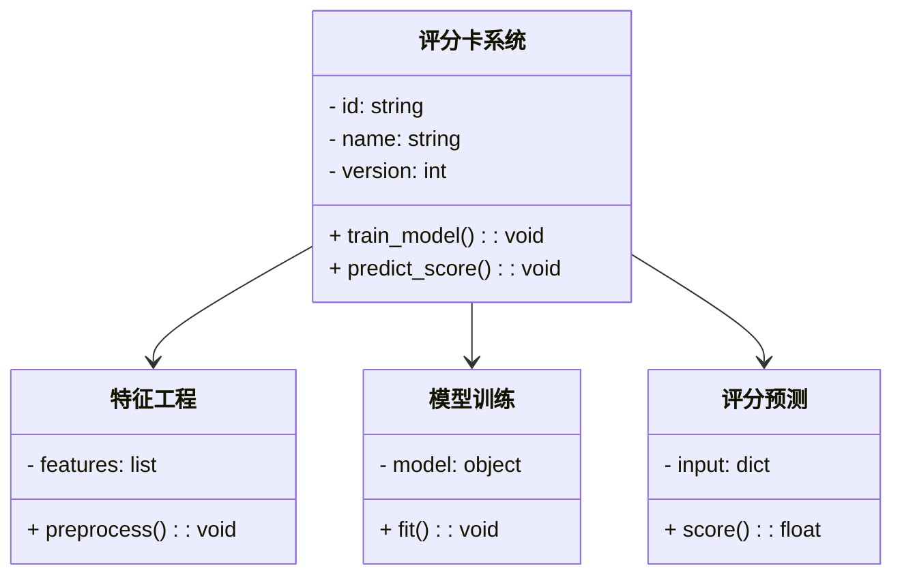

                 


# 智能个人信贷评分卡优化

> 关键词：智能评分卡、机器学习、信贷风险、优化算法、数学模型

> 摘要：智能个人信贷评分卡优化是利用机器学习算法和数学模型对传统信贷评分卡进行改进，以提高评分准确性和效率。本文从评分卡的核心概念出发，详细探讨了优化算法的原理与实现，结合实际案例分析，给出了系统的优化方案。

---

# 第一部分: 引言

## 第1章: 智能个人信贷评分卡的背景与意义

### 1.1 背景介绍

#### 1.1.1 信贷评分卡的基本概念
信贷评分卡是一种用于评估个人信用风险的工具，通过分析借款人的历史行为、收入状况、资产情况等信息，预测其还款能力和意愿。传统的评分卡通常基于简单的线性回归模型或经验规则，存在评分不够精准、难以应对复杂信用场景等问题。

#### 1.1.2 问题背景
随着金融业务的复杂化和多样化，传统评分卡的局限性日益显现：
- **数据维度单一**：无法充分挖掘多维数据特征。
- **模型泛化能力差**：难以应对不同场景下的信用评估需求。
- **计算效率低**：传统评分卡的计算过程复杂，难以支持实时决策。

#### 1.1.3 智能优化的必要性
智能评分卡通过引入机器学习算法和大数据技术，能够更好地解决传统评分卡的痛点，实现更精准的信用评估和更高效的决策支持。

---

## 第2章: 智能个人信贷评分卡的核心概念与联系

### 2.1 核心概念原理

#### 2.1.1 评分卡的数学模型
评分卡的数学模型是将借款人特征转化为一个综合评分的过程。传统评分卡通常采用线性回归模型：
$$ score = w_1x_1 + w_2x_2 + ... + w_nx_n + b $$
其中，$x_i$ 是特征变量，$w_i$ 是对应的权重，$b$ 是偏置项。

#### 2.1.2 智能优化算法的特征
智能评分卡的优化算法具有以下特点：
1. **非线性建模**：能够捕捉复杂的特征关系。
2. **高维数据处理**：支持海量数据特征的分析。
3. **实时计算能力**：能够快速响应评分需求。

#### 2.1.3 核心概念的属性对比表
| 比较维度 | 传统评分卡 | 智能评分卡 |
|----------|------------|------------|
| 模型类型 | 线性回归    | 非线性模型  |
| 数据维度 | 低维       | 高维       |
| 泛化能力 | 差          | 强          |
| 计算效率 | 低          | 高          |

### 2.2 ER实体关系图

```mermaid
er
    entity 评分卡 (id, name, version, description)
    entity 特征 (feature_id, feature_name, feature_type)
    entity 模型 (model_id, model_name, model_type)
    entity 评分结果 (score_id, score_value, decision)
    relationship 评分卡拥有特征
    relationship 评分卡使用模型
    relationship 模型生成评分结果
```

---

# 第二部分: 智能评分卡优化的算法原理

## 第3章: 常用优化算法及其原理

### 3.1 逻辑回归算法

#### 3.1.1 逻辑回归模型的数学表达
逻辑回归是一种常用的分类算法，其核心思想是通过sigmoid函数将线性回归的输出映射到概率空间：
$$ P(y=1|x) = \frac{1}{1 + e^{-\beta x}} $$

#### 3.1.2 模型优化的损失函数
逻辑回归的损失函数为对数损失函数：
$$ L = -\sum_{i=1}^{n} [y_i \ln(p_i) + (1 - y_i)\ln(1 - p_i)] $$

#### 3.1.3 算法优化流程
1. **数据预处理**：特征标准化、缺失值填充。
2. **模型训练**：使用梯度下降或牛顿法优化损失函数。
3. **模型评估**：通过ROC-AUC曲线评估模型性能。

### 3.2 决策树与随机森林

#### 3.2.1 决策树的构建过程
决策树是一种基于特征分裂的树状结构，其核心思想是通过信息增益或基尼指数选择最优分裂特征。

#### 3.2.2 随机森林的集成方法
随机森林通过构建多棵决策树并取平均值的方式提高模型的泛化能力。

#### 3.2.3 算法优缺点对比
| 算法 | 优点                          | 缺点                          |
|------|------------------------------|-------------------------------|
| 决策树 | 易解释，适合非线性关系       | 易过拟合，稳定性较差           |
| 随机森林 | 高泛化能力，抗过拟合         | 计算复杂度高                   |

---

## 第4章: 基于机器学习的评分卡优化

### 4.1 XGBoost与LightGBM

#### 4.1.1 XGBoost的提升机制
XGBoost通过正则化和惩罚项优化传统Boosting算法，具有较高的模型精度和计算效率。

#### 4.1.2 LightGBM的特征重要性分析
LightGBM基于直方图的特征划分方法，能够高效处理高维数据。

#### 4.1.3 两种算法的对比
| 参数 | XGBoost                          | LightGBM                        |
|------|----------------------------------|---------------------------------|
| 核心思想 | 垂直提升，正则化优化            | 水平提升，直方图划分            |
| 速度 | 较慢                              | 较快                             |

---

## 第5章: 智能评分卡优化的数学模型

### 5.1 评分函数的构建

#### 5.1.1 评分函数
智能评分卡的评分函数可以表示为：
$$ score = \sum_{i=1}^{n} w_i x_i + b $$
其中，$w_i$ 是特征权重，$x_i$ 是特征值，$b$ 是偏置项。

#### 5.1.2 损失函数
评分卡的损失函数通常采用均方误差或交叉熵损失：
$$ L = \frac{1}{m} \sum_{i=1}^{m} (y_i - \hat{y}_i)^2 $$
其中，$y_i$ 是真实标签，$\hat{y}_i$ 是模型预测值。

---

# 第三部分: 智能评分卡优化的系统架构与实现

## 第6章: 系统架构设计方案

### 6.1 系统功能设计

#### 6.1.1 领域模型


### 6.2 系统架构设计


---

## 第7章: 项目实战与案例分析

### 7.1 环境安装与配置

```bash
# 安装依赖
pip install xgboost lightgbm scikit-learn
```

### 7.2 核心代码实现

#### 7.2.1 特征工程

```python
def preprocess(data):
    # 特征填充
    data.fillna(data.mean(), inplace=True)
    # 标准化处理
    from sklearn.preprocessing import StandardScaler
    scaler = StandardScaler()
    data = scaler.fit_transform(data)
    return data
```

#### 7.2.2 模型训练

```python
from xgboost import XGBClassifier

def train_model(X, y):
    model = XGBClassifier(n_estimators=100, learning_rate=0.1)
    model.fit(X, y)
    return model
```

---

## 第8章: 总结与展望

### 8.1 小结
智能个人信贷评分卡优化通过引入机器学习算法和大数据技术，显著提高了评分的准确性和效率。本文从核心概念、算法原理、系统架构到项目实战，全面探讨了智能评分卡优化的关键技术。

### 8.2 注意事项
- 数据隐私保护是评分卡优化的重要前提。
- 模型调优需要结合实际业务需求。

### 8.3 拓展阅读
- 《机器学习实战》
- 《深入浅出XGBoost》

---

作者：AI天才研究院 & 禅与计算机程序设计艺术

