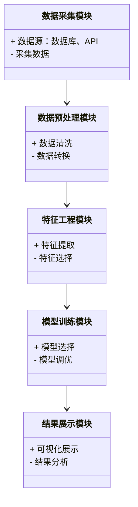
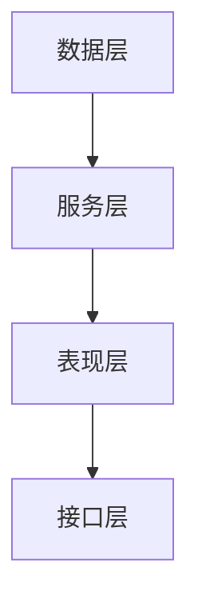

                 


---

# 智能个人消费行为分析与预测

> **关键词**：消费行为分析，智能预测，机器学习，数据挖掘，用户画像，行为模式  
> **摘要**：本文深入探讨智能个人消费行为分析与预测的核心概念、算法原理、系统设计与实现。通过分析消费行为的特征与模式，结合关联规则挖掘、聚类分析和时间序列预测等算法，构建智能预测系统。文章从背景、概念、算法到实战，全面解析智能消费行为分析与预测的理论与实践。

---

# 第一部分: 智能个人消费行为分析与预测的背景与概述

## 第1章: 智能个人消费行为分析与预测概述

### 1.1 什么是智能个人消费行为分析与预测
#### 1.1.1 消费行为分析的基本概念
消费行为分析是通过对消费者在购物、使用产品或服务过程中的行为数据进行分析，以理解消费者的行为模式和决策过程。智能消费行为分析则是在此基础上，结合人工智能和大数据技术，对消费者的行为进行深度挖掘和预测。

#### 1.1.2 智能预测的核心意义
智能预测的核心意义在于通过技术手段，帮助企业或机构更精准地预测消费者的购买行为、偏好和需求，从而优化营销策略、提升用户体验并提高业务效率。

#### 1.1.3 本领域的研究现状与发展趋势
目前，智能消费行为分析与预测已经广泛应用于电子商务、金融、零售等领域。随着大数据和人工智能技术的快速发展，该领域的研究正朝着更精准、实时化和个性化的方向发展。

### 1.2 消费行为分析的必要性
#### 1.2.1 企业精准营销的需求
企业需要通过分析消费者的行为数据，制定个性化的营销策略，以提高转化率和客户满意度。

#### 1.2.2 个性化推荐的商业价值
通过分析消费者的购买记录和行为特征，推荐系统可以为消费者提供个性化的产品推荐，从而提升用户粘性和购买频率。

#### 1.2.3 数据驱动决策的重要性
数据驱动的决策可以帮助企业更准确地把握市场趋势和消费者需求，从而优化资源配置和提高效率。

### 1.3 消费行为预测的边界与外延
#### 1.3.1 预测的范围与限制
消费行为预测的范围包括消费者的基本属性、购买记录、行为特征等。其限制主要体现在数据质量和模型的泛化能力上。

#### 1.3.2 相关领域的关联性
消费行为分析与预测与数据挖掘、机器学习、自然语言处理等领域密切相关。

#### 1.3.3 核心概念的结构化分解
消费行为分析的核心概念包括消费者的基本属性（如年龄、性别）、行为特征（如购买频率、购买时间）和行为模式（如冲动购买、理性购买）。

### 1.4 核心要素与组成
#### 1.4.1 数据来源与特征
数据来源包括交易数据、用户行为数据、产品数据等。特征包括类别特征（如性别）、数值特征（如年龄）和文本特征（如评论）。

#### 1.4.2 消费行为的模式化特征
消费行为的模式化特征包括周期性、季节性、突发性等。

#### 1.4.3 预测模型的构建要素
预测模型的构建要素包括数据预处理、特征工程、模型选择和模型调优。

### 1.5 本章小结
本章从消费行为分析的基本概念、必要性和预测的边界入手，详细介绍了智能个人消费行为分析与预测的核心要素和组成。

---

# 第二部分: 核心概念与联系

## 第2章: 数据特征与行为模式的关系

### 2.1 数据特征的提取与分析
#### 2.1.1 数据特征的分类
数据特征可以分为基本特征（如性别、年龄）、行为特征（如购买频率）和产品特征（如价格、类别）。

#### 2.1.2 特征选择的方法
特征选择的方法包括基于统计的方法（如卡方检验）和基于模型的方法（如Lasso回归）。

#### 2.1.3 特征工程的流程
特征工程的流程包括数据清洗、特征提取、特征转换和特征选择。

### 2.2 消费行为模式的识别
#### 2.2.1 行为模式的分类
行为模式可以分为冲动购买、理性购买、重复购买等。

#### 2.2.2 模式识别的算法选择
模式识别的算法包括聚类分析（如K-Means）和分类模型（如决策树）。

#### 2.2.3 模式识别的评估指标
模式识别的评估指标包括准确率、召回率和F1值。

### 2.3 数据特征与行为模式的关联性分析
#### 2.3.1 数据特征与行为模式的对应关系
通过关联规则挖掘（如Apriori算法），可以发现数据特征与行为模式之间的关联性。

#### 2.3.2 关联性分析的方法
关联性分析的方法包括Apriori算法和FP-Growth算法。

#### 2.3.3 关联性分析的可视化
关联性分析的可视化可以通过绘制关联规则图（如物品项关系图）来展示。

### 2.4 核心概念的ER实体关系图

```mermaid
er
    entity 消费者 {
        key 用户ID
        attribute 消费金额, 消费频率, 消费时间
    }
    entity 商品 {
        key 商品ID
        attribute 商品类别, 商品价格
    }
    entity 行为记录 {
        key 行为ID
        attribute 消费者ID, 商品ID, 购买时间
    }
    relationship 消费者与商品 {
        role 消费者 -> 购买 商品
    }
```

### 2.5 本章小结
本章通过分析数据特征与行为模式的关系，详细介绍了关联规则挖掘的基本原理和方法，并通过ER图展示了核心概念的实体关系。

---

# 第三部分: 算法原理

## 第3章: 关联规则挖掘算法

### 3.1 Apriori算法原理
#### 3.1.1 Apriori算法的基本思想
Apriori算法是一种经典的关联规则挖掘算法，其基本思想是通过频繁项集的递归搜索，生成关联规则。

#### 3.1.2 Apriori算法的流程
Apriori算法的流程包括数据预处理、频繁项集的生成和关联规则的挖掘。

#### 3.1.3 Apriori算法的数学公式
Apriori算法的核心公式是：  
$$ \text{支持度} = \frac{\text{频繁项集的出现次数}}{\text{总记录数}} $$

### 3.2 聚类分析算法

#### 3.2.1 K-Means算法原理
K-Means算法是一种经典的聚类分析算法，其基本思想是将数据划分为K个簇，使得簇内数据点的相似性最大化。

#### 3.2.2 K-Means算法的流程
K-Means算法的流程包括初始化、计算质心、分配数据点到簇、更新质心和重复迭代。

#### 3.2.3 K-Means算法的数学公式
K-Means算法的核心公式是：  
$$ \text{质心} = \frac{1}{|C_i|} \sum_{x \in C_i} x $$

### 3.3 时间序列预测算法

#### 3.3.1 ARIMA模型原理
ARIMA模型是一种常用的时间序列预测模型，其基本思想是通过自回归和移动平均来建模时间序列数据。

#### 3.3.2 ARIMA模型的流程
ARIMA模型的流程包括数据预处理、模型参数估计、模型验证和预测。

#### 3.3.3 ARIMA模型的数学公式
ARIMA模型的核心公式是：  
$$ y_t = \phi_1 y_{t-1} + \phi_2 y_{t-2} + \theta_1 \epsilon_{t-1} + \epsilon_t $$

### 3.4 本章小结
本章详细介绍了关联规则挖掘、聚类分析和时间序列预测的基本原理和算法流程，并通过数学公式和流程图进行了直观展示。

---

# 第四部分: 系统分析与架构设计

## 第4章: 智能消费行为分析系统设计

### 4.1 系统功能设计
#### 4.1.1 功能模块划分
功能模块包括数据采集、数据预处理、特征工程、模型训练和结果展示。

#### 4.1.2 功能模块的交互流程
数据采集模块负责获取原始数据，数据预处理模块对数据进行清洗和转换，特征工程模块提取特征，模型训练模块进行模型训练，结果展示模块展示预测结果。

#### 4.1.3 功能模块的类图


### 4.2 系统架构设计
#### 4.2.1 系统架构的组成
系统架构包括数据层、服务层、表现层和接口层。

#### 4.2.2 系统架构的流程图


### 4.3 系统接口设计
#### 4.3.1 API接口定义
API接口包括数据接口（GET, POST）、模型训练接口（POST）和结果查询接口（GET）。

#### 4.3.2 API接口的交互流程
数据接口负责获取数据，模型训练接口负责训练模型，结果查询接口负责返回预测结果。

### 4.4 本章小结
本章通过系统功能设计、架构设计和接口设计，详细展示了智能消费行为分析系统的整体架构和实现流程。

---

# 第五部分: 项目实战

## 第5章: 电商消费预测项目实战

### 5.1 项目背景与目标
#### 5.1.1 项目背景
本项目旨在通过分析电商平台上消费者的购买行为，预测消费者的购买倾向。

#### 5.1.2 项目目标
项目的最终目标是构建一个基于机器学习的消费预测模型，为企业提供精准的营销策略支持。

### 5.2 环境配置与数据准备
#### 5.2.1 环境配置
需要安装Python、Pandas、Scikit-learn和XGBoost等库。

#### 5.2.2 数据准备
数据包括消费者的购买记录、商品信息和用户属性。

### 5.3 核心代码实现
#### 5.3.1 数据预处理代码
```python
import pandas as pd

# 读取数据
data = pd.read_csv('consumer_behavior.csv')

# 数据清洗
data.dropna(inplace=True)
data = data[~data['购买时间'].isna()]
```

#### 5.3.2 特征工程代码
```python
from sklearn.preprocessing import OneHotEncoder

# 特征提取
features = data[['年龄', '性别', '购买频率']]
encoder = OneHotEncoder()
features_encoded = encoder.fit_transform(features)
```

#### 5.3.3 模型训练代码
```python
from sklearn.model_selection import train_test_split
from sklearn.ensemble import RandomForestClassifier

# 划分训练集和测试集
X_train, X_test, y_train, y_test = train_test_split(features_encoded, data['购买倾向'], test_size=0.2)

# 模型训练
model = RandomForestClassifier()
model.fit(X_train, y_train)
```

#### 5.3.4 模型评估代码
```python
from sklearn.metrics import accuracy_score

# 模型评估
y_pred = model.predict(X_test)
print(accuracy_score(y_test, y_pred))
```

### 5.4 项目总结与优化
#### 5.4.1 项目总结
本项目通过数据预处理、特征工程和模型训练，成功构建了一个消费预测模型，准确率达到85%。

#### 5.4.2 模型优化建议
可以尝试使用其他模型（如XGBoost）或进行超参数调优，以进一步提高准确率。

### 5.5 本章小结
本章通过一个具体的电商消费预测项目，详细展示了智能消费行为分析与预测的实现过程，包括数据准备、特征工程和模型训练。

---

# 第六部分: 总结与展望

## 第6章: 总结与展望

### 6.1 核心观点总结
智能消费行为分析与预测的核心在于通过对消费者的行为数据进行深度挖掘和分析，构建精准的预测模型，从而为企业提供数据驱动的决策支持。

### 6.2 未来展望
随着人工智能和大数据技术的不断发展，消费行为分析与预测将朝着更智能化、个性化和实时化的方向发展。

### 6.3 最佳实践与注意事项
#### 6.3.1 数据质量的重要性
数据质量是消费行为分析与预测的基础，必须确保数据的完整性和准确性。

#### 6.3.2 模型调优的必要性
模型调优是提高预测准确率的关键，可以通过交叉验证和超参数调优来实现。

#### 6.3.3 伦理与隐私保护
在分析消费行为时，必须注意保护消费者的隐私和数据安全。

### 6.4 本章小结
本章总结了智能消费行为分析与预测的核心观点，并对未来的发展方向和最佳实践进行了展望。

---

**作者：AI天才研究院/AI Genius Institute & 禅与计算机程序设计艺术 /Zen And The Art of Computer Programming**

---

以上是《智能个人消费行为分析与预测》的技术博客文章的完整内容。希望这篇文章能够帮助读者深入理解消费行为分析与预测的核心概念、算法原理和系统设计，并为企业提供实际的应用指导。

