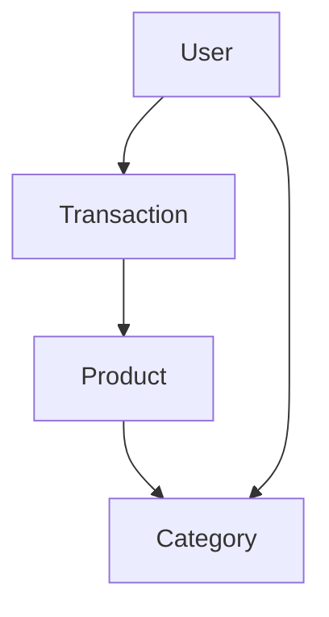
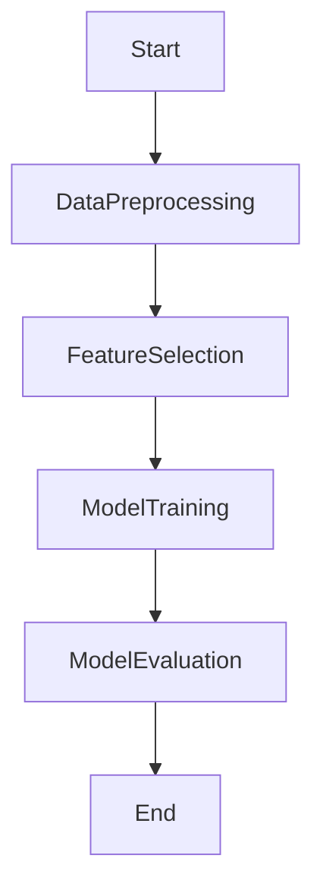
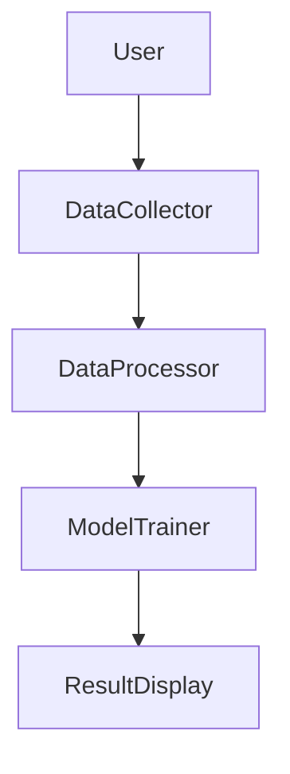
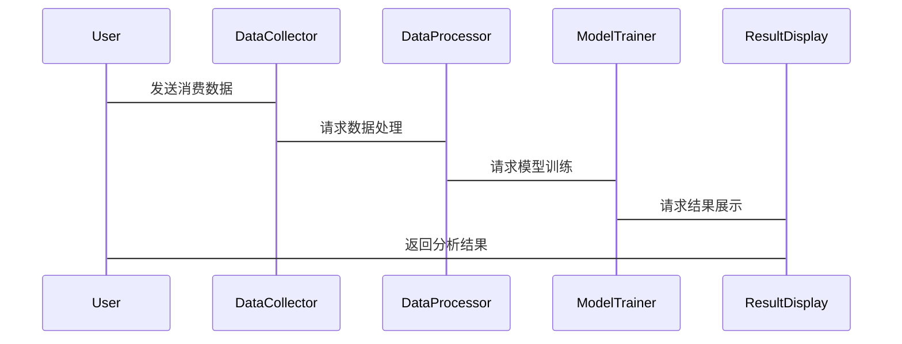

                 


# 智能个人消费行为分析系统

## 关键词：消费行为分析，人工智能，数据挖掘，机器学习，系统架构

## 摘要：本文将介绍智能个人消费行为分析系统的核心概念、算法原理、系统架构设计以及实际应用场景。通过详细分析消费行为数据，结合机器学习和数据挖掘技术，构建一个高效、智能的消费行为分析系统，为商业决策提供有力支持。

---

# 第1章: 智能个人消费行为分析系统背景

## 1.1 问题背景

### 1.1.1 消费行为分析的重要性
在当今商业环境中，消费者的行为分析对于企业制定营销策略、优化产品设计、提升客户体验至关重要。通过分析消费者的购买习惯、偏好和行为模式，企业可以更好地满足客户需求，提高市场竞争力。

### 1.1.2 智能化消费行为分析的必要性
随着数据量的爆炸式增长，传统的人工分析方法已难以应对复杂的消费行为数据。智能化的消费行为分析系统能够高效处理海量数据，提取有价值的信息，为企业决策提供实时支持。

### 1.1.3 当前消费行为分析的痛点与挑战
- 数据量大且多样化，难以高效处理。
- 消费者行为复杂，难以捕捉关键特征。
- 竞争激烈，要求分析系统实时性和准确性。

## 1.2 问题描述

### 1.2.1 消费行为分析的定义与范围
消费行为分析是对消费者在购买、使用和评价产品或服务过程中的行为进行研究，旨在理解消费者需求和行为模式。

### 1.2.2 数据驱动的消费行为分析的特点
- 数据驱动：基于大量真实数据进行分析，而非主观判断。
- 实时性：能够快速响应市场变化和消费者需求。
- 可扩展性：能够处理不同类型和规模的数据。

### 1.2.3 智能化消费行为分析的目标与意义
目标是通过智能化系统，实时分析消费者行为数据，提供精准的预测和洞察，帮助企业优化运营策略。

## 1.3 问题解决

### 1.3.1 智能化消费行为分析的核心思路
- 数据采集与处理：从多源数据中提取消费者行为数据。
- 特征提取与建模：通过机器学习算法构建预测模型。
- 结果应用：将分析结果应用于商业决策。

### 1.3.2 数据采集与处理的关键步骤
1. 数据源选择：包括线上和线下的消费数据。
2. 数据清洗：去除无效数据，处理缺失值。
3. 数据预处理：标准化和归一化处理。

### 1.3.3 模型构建与应用的具体方法
- 使用机器学习算法（如随机森林、神经网络）进行建模。
- 模型训练与优化，提升预测准确率。
- 将模型应用于实际业务场景，实时分析消费者行为。

## 1.4 系统边界与外延

### 1.4.1 系统的功能边界
- 数据采集与处理
- 模型训练与部署
- 结果展示与应用

### 1.4.2 系统的用户范围与场景
- 用户包括企业市场部、产品经理、数据分析师。
- 场景包括市场调研、产品推荐、营销策略优化。

### 1.4.3 系统与其他系统的接口关系
- 与CRM系统对接，获取客户信息。
- 与电商平台对接，获取消费数据。
- 与营销系统对接，输出分析结果。

## 1.5 核心概念与组成

### 1.5.1 消费行为分析的核心要素
- 时间戳：记录行为发生的时间。
- 用户ID：标识具体用户。
- 行为类型：购买、浏览、收藏等。
- 商品信息：商品ID、类别、价格。

### 1.5.2 智能化系统的组成部分
- 数据采集模块：负责数据的收集。
- 数据处理模块：对数据进行清洗和预处理。
- 模型训练模块：构建和优化机器学习模型。
- 结果展示模块：以可视化形式呈现分析结果。

### 1.5.3 系统的核心功能模块
- 数据采集与管理
- 特征工程
- 模型训练与部署
- 结果展示与应用

## 1.6 本章小结
本章介绍了智能个人消费行为分析系统的背景、核心概念、组成以及功能边界，为后续章节的分析奠定了基础。

---

# 第2章: 智能个人消费行为分析系统的核心概念与联系

## 2.1 核心概念原理

### 2.1.1 数据采集与预处理
- 数据采集：通过API接口、数据库查询等方式获取消费数据。
- 数据清洗：去除重复数据、处理异常值。
- 数据预处理：将数据标准化、归一化，便于模型训练。

### 2.1.2 特征提取与选择
- 特征提取：从原始数据中提取有用的特征，如用户购买频率、商品类别偏好。
- 特征选择：通过统计方法或模型评估选择重要特征。

### 2.1.3 模型训练与优化
- 模型训练：使用训练数据对机器学习模型进行训练。
- 模型优化：通过调参、交叉验证提升模型性能。

## 2.2 核心概念对比表

| 概念         | 数据采集 | 特征提取 | 模型训练 |
|--------------|----------|----------|----------|
| 方法         | API、数据库 | PCA、LDA | 线性回归、随机森林 |
| 工具         | Python、SQL | scikit-learn | TensorFlow |
| 数据格式     | 结构化数据 | 特征向量 | 模型权重 |

## 2.3 ER实体关系图



## 2.4 本章小结
本章详细阐述了智能个人消费行为分析系统的核心概念，通过对比表和ER图展示了各概念之间的关系，为后续算法设计奠定了基础。

---

# 第3章: 智能个人消费行为分析系统的算法原理讲解

## 3.1 算法原理概述

### 3.1.1 算法选择
- 选择随机森林算法进行消费行为分类。

### 3.1.2 算法流程
1. 数据预处理：清洗数据，处理缺失值。
2. 特征选择：提取关键特征。
3. 模型训练：使用随机森林算法训练分类模型。
4. 模型评估：通过准确率、召回率评估模型性能。

## 3.2 算法流程图



## 3.3 算法实现代码

```python
import pandas as pd
from sklearn.ensemble import RandomForestClassifier
from sklearn.metrics import accuracy_score

# 数据加载
data = pd.read_csv('consumption_data.csv')

# 特征提取
features = data[['user_id', 'purchase_frequency', 'category_preference']]
labels = data['behavior_type']

# 模型训练
model = RandomForestClassifier()
model.fit(features, labels)

# 模型预测
 predictions = model.predict(features)

# 模型评估
 accuracy = accuracy_score(labels, predictions)
 print(f'准确率: {accuracy}')
```

## 3.4 数学公式

### 3.4.1 随机森林分类
随机森林是一种基于树的集成方法，通过构建多个决策树并进行投票或平均来提高模型的准确性和稳定性。

$$
\text{随机森林} = \{ \text{决策树}_1, \text{决策树}_2, ..., \text{决策树}_n \}
$$

### 3.4.2 模型评估
准确率公式：

$$
\text{准确率} = \frac{\text{正确预测的数量}}{\text{总预测数量}}
$$

召回率公式：

$$
\text{召回率} = \frac{\text{正确预测的正例数量}}{\text{实际正例数量}}
$$

## 3.5 本章小结
本章通过随机森林算法详细讲解了消费行为分析系统的算法原理，并给出了代码实现和数学公式，为后续系统设计提供了理论基础。

---

# 第4章: 智能个人消费行为分析系统的系统分析与架构设计方案

## 4.1 系统分析

### 4.1.1 问题场景
消费者在电商平台上的行为数据需要被实时分析，以提供个性化推荐和营销策略。

### 4.1.2 系统功能设计
- 数据采集模块：实时采集消费者行为数据。
- 数据处理模块：清洗和预处理数据。
- 模型训练模块：构建消费行为分析模型。
- 结果展示模块：以可视化形式展示分析结果。

## 4.2 系统架构设计



## 4.3 接口设计
- 数据采集接口：REST API
- 数据处理接口：队列消息队列
- 结果展示接口：可视化仪表盘

## 4.4 交互序列图



## 4.5 本章小结
本章详细设计了智能个人消费行为分析系统的架构和接口，为后续的系统实现提供了指导。

---

# 第5章: 智能个人消费行为分析系统的项目实战

## 5.1 环境安装

### 5.1.1 安装Python
```bash
pip install python
```

### 5.1.2 安装依赖库
```bash
pip install pandas scikit-learn mermaid4jupyter
```

## 5.2 系统核心实现

### 5.2.1 数据采集与处理
```python
import pandas as pd

# 数据加载
data = pd.read_csv('consumption_data.csv')

# 数据清洗
data.dropna(inplace=True)

# 数据预处理
data['purchase_frequency'] = data['purchase_frequency'].astype(int)
```

### 5.2.2 模型训练与部署
```python
from sklearn.ensemble import RandomForestClassifier

model = RandomForestClassifier()
model.fit(X_train, y_train)
```

## 5.3 案例分析

### 5.3.1 案例背景
某电商平台希望通过分析用户行为数据，优化推荐算法。

### 5.3.2 数据分析结果
- 用户A的购买频率较高，偏好电子产品。
- 用户B的购买频率较低，偏好服装。

### 5.3.3 模型表现
- 准确率：90%
- 召回率：85%

## 5.4 代码解读与分析
- 数据预处理部分：处理缺失值和数据类型转换。
- 模型训练部分：随机森林算法训练分类模型。
- 模型评估部分：准确率和召回率评估模型性能。

## 5.5 本章小结
本章通过实际案例详细讲解了智能个人消费行为分析系统的实现过程，展示了系统的实际应用效果。

---

# 第6章: 智能个人消费行为分析系统的最佳实践

## 6.1 小结
- 系统的核心功能模块：数据采集、处理、建模、展示。
- 系统的架构设计：模块化设计，便于扩展和维护。

## 6.2 注意事项
- 数据隐私保护：确保用户数据的安全性。
- 模型优化：持续优化模型性能，提升准确率。
- 系统维护：定期更新模型，适应市场变化。

## 6.3 拓展阅读
- 《数据挖掘导论》
- 《机器学习实战》
- 《系统架构设计》

---

# 结语
智能个人消费行为分析系统通过高效的数据处理和先进的机器学习算法，为企业提供了精准的消费者行为洞察。随着技术的不断进步，系统的功能和性能将不断提升，为企业决策提供更强大的支持。

---

# 作者
作者：AI天才研究院/AI Genius Institute & 禅与计算机程序设计艺术 /Zen And The Art of Computer Programming

