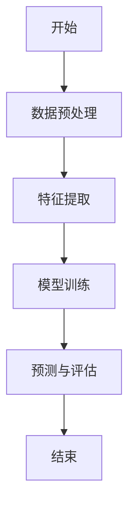
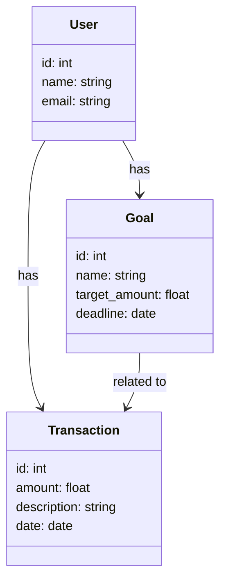
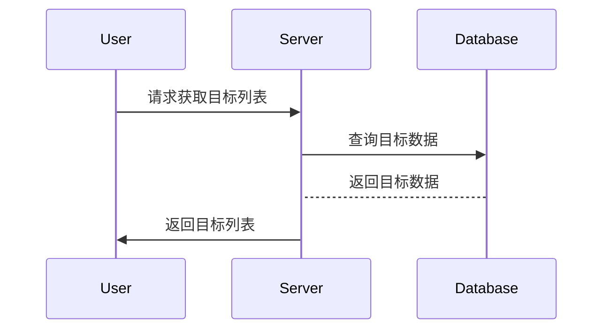

                 


```markdown
# 智能个人理财目标追踪器

## 关键词：智能理财，目标追踪，数据挖掘，机器学习，系统架构

## 摘要：智能个人理财目标追踪器是一种结合人工智能和大数据分析的工具，旨在帮助用户有效管理个人财务目标。本文详细介绍了该系统的核心概念、算法原理、系统架构以及实际应用，通过案例分析和代码实现，展示了其在智能理财中的重要性。

---

# 第1章: 问题背景与目标

## 1.1 问题背景

### 1.1.1 个人理财的重要性
个人理财是管理个人财务的重要手段，帮助用户实现财务自由和目标。然而，传统的理财工具依赖手动记录和简单分析，难以应对复杂多变的财务状况。

### 1.1.2 现有理财工具的局限性
现有工具通常功能单一，缺乏智能化和个性化，无法满足用户多样化的理财需求。用户需要一个能够实时追踪和智能分析的工具。

### 1.1.3 智能化理财的需求
随着人工智能的发展，智能化理财工具能够通过数据分析和预测，为用户提供精准的建议，帮助用户优化投资组合和财务管理。

## 1.2 问题描述

### 1.2.1 理财目标的多样性
用户可能有不同的理财目标，如储蓄、投资、债务管理等，需要一个系统能够同时追踪多个目标。

### 1.2.2 数据收集与处理的挑战
用户需要从多种来源收集财务数据，如银行账户、股票投资、消费记录等，并进行清洗和转换。

### 1.2.3 用户行为分析的复杂性
用户的行为受到多种因素影响，需要系统能够实时分析用户的消费习惯和投资偏好，提供个性化的建议。

## 1.3 问题解决

### 1.3.1 智能追踪器的核心功能
智能理财目标追踪器应具备数据采集、分析和预测、用户交互等功能，帮助用户实时监控财务状况。

### 1.3.2 数据分析与预测的实现
通过机器学习算法，系统可以预测用户的财务趋势，并提供投资建议，帮助用户优化资产配置。

### 1.3.3 用户交互的优化
系统需要提供友好的用户界面，让用户能够方便地设置目标、查看分析结果，并与系统进行交互。

## 1.4 边界与外延

### 1.4.1 系统的边界定义
系统仅关注用户的个人财务数据，不涉及企业或机构的财务信息。

### 1.4.2 外延功能的扩展
未来可以扩展至团队理财或家族理财，提供更复杂的财务管理和分析。

### 1.4.3 与其他系统的集成
系统可以与银行、证券公司等第三方服务集成，实现数据的自动同步和分析。

## 1.5 核心要素组成

### 1.5.1 数据采集模块
负责从多种数据源采集用户的财务数据，如银行账户、支付宝、股票账户等。

### 1.5.2 数据分析模块
对采集的数据进行处理、分析和预测，帮助用户制定理财策略。

### 1.5.3 用户交互模块
提供友好的用户界面，让用户能够方便地设置目标、查看分析结果，并进行交互。

---

# 第2章: 核心概念与联系

## 2.1 核心概念原理

### 2.1.1 数据流的处理流程
数据从各个来源采集后，经过清洗、转换、存储，最后被分析和预测。

### 2.1.2 用户行为分析的算法
使用机器学习算法，如随机森林和K均值聚类，分析用户的消费习惯和投资偏好。

### 2.1.3 目标管理的逻辑结构
系统将用户的理财目标分解为可执行的任务，并根据数据分析结果进行优先级排序。

## 2.2 概念属性特征对比表

| 概念       | 属性       | 特征                                   |
|------------|------------|----------------------------------------|
| 数据采集   | 来源       | 用户输入、第三方接口                   |
|            | 方法       | API调用、数据库查询                   |
| 数据分析   | 方法       | 机器学习、统计分析                   |
|            | 工具       | Python、TensorFlow、Pandas           |
| 用户交互   | 方式       | 图形界面、语音交互                   |

## 2.3 ER实体关系图

```mermaid
erd
  user
  goal
  transaction
  user --1..n> goal: has
  user --1..n> transaction: has
  goal --1..n> transaction: related to
```

---

# 第3章: 算法原理讲解

## 3.1 算法流程



## 3.2 Python实现

```python
# 示例代码：数据预处理
import pandas as pd

data = pd.read_csv('finance_data.csv')
data_clean = data.dropna()
data_clean['amount'] = data_clean['amount'].astype('float')
```

## 3.3 数学模型与公式

### 3.3.1 线性回归模型
$$ y = \beta_0 + \beta_1x + \epsilon $$

### 3.3.2 逻辑回归模型
$$ P(Y=1|X) = \frac{e^{\beta_0 + \beta_1x}}{1 + e^{\beta_0 + \beta_1x}} $$

---

# 第4章: 系统分析与架构设计

## 4.1 系统功能设计

### 4.1.1 领域模型类图



### 4.1.2 系统架构设计

```mermaid
docker
    client
    server
    client --> server: HTTP请求
    server --> database: 查询数据
    server --> AI_engine: 分析数据
    server <-- database: 返回数据
    server <-- AI_engine: 返回分析结果
```

### 4.1.3 系统接口设计

| 接口名称 | 输入参数 | 输出参数 |
|----------|-----------|-----------|
| GetGoals  | userId    | List[Goal] |
| AddTransaction | transaction | void |

### 4.1.4 系统交互序列图



---

# 第5章: 项目实战

## 5.1 环境安装

### 5.1.1 安装Python和依赖库
```bash
pip install numpy pandas scikit-learn
```

## 5.2 核心功能实现

### 5.2.1 数据采集模块

```python
import requests
import json

url = 'https://api.example.com/transactions'
headers = {'Authorization': 'Bearer token'}
response = requests.get(url, headers=headers)
transactions = json.loads(response.text)
```

### 5.2.2 数据分析模块

```python
from sklearn.linear_model import LinearRegression

model = LinearRegression()
model.fit(X_train, y_train)
predictions = model.predict(X_test)
```

## 5.3 案例分析

### 5.3.1 案例背景
用户A希望在一年内储蓄10万元，当前每月收入5000元，支出3000元。系统分析后建议用户每月储蓄2000元，并投资于股票市场。

### 5.3.2 分析结果
通过分析用户的消费记录和投资偏好，系统预测用户能够在9个月内实现储蓄目标，并提供优化的投资组合建议。

---

# 第6章: 最佳实践

## 6.1 小结
智能个人理财目标追踪器通过数据分析和机器学习算法，帮助用户优化理财策略，实现财务目标。

## 6.2 注意事项
- 数据隐私保护：确保用户数据的安全性和隐私性。
- 算法优化：根据用户反馈不断优化算法模型，提高预测准确性。

## 6.3 拓展阅读
- 《机器学习实战》
- 《Python数据分析 cookbook》
- 《系统架构设计指南》

---

作者：AI天才研究院/AI Genius Institute & 禅与计算机程序设计艺术/Zen And The Art of Computer Programming
```

