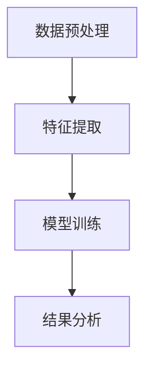
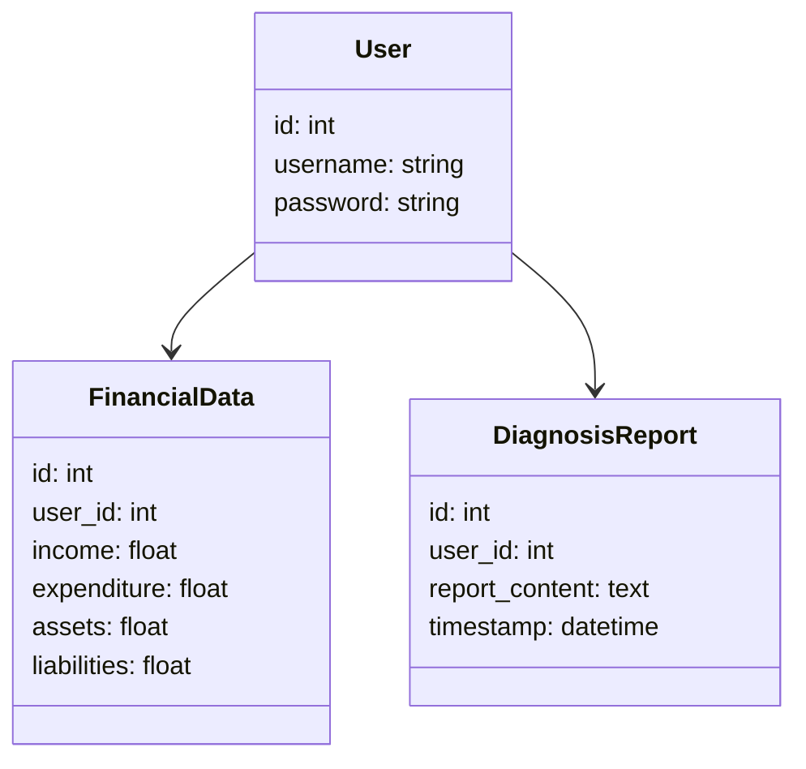
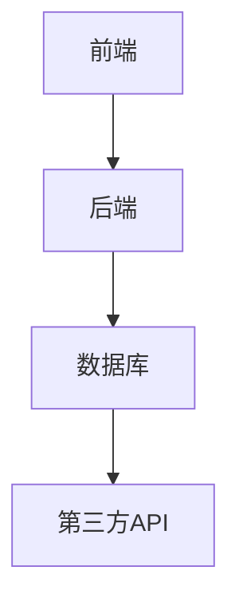
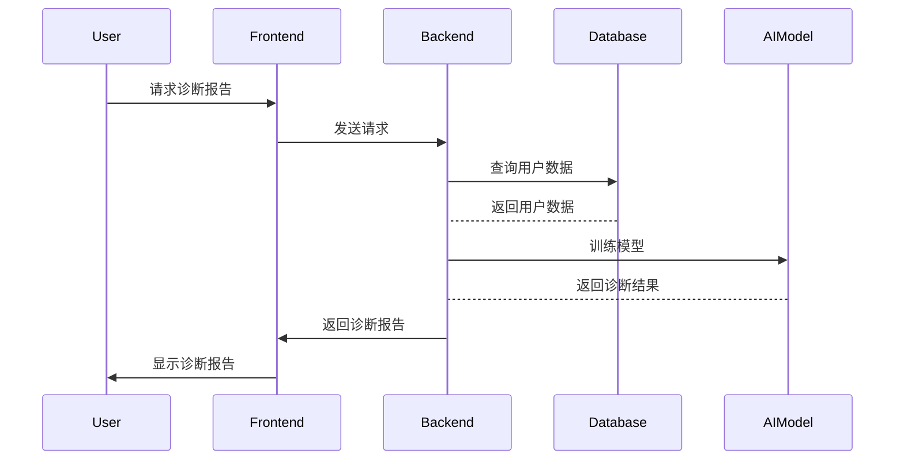

                 


# 智能个人财务健康诊断系统

## 关键词：
- 人工智能
- 个人财务管理
- 财务健康诊断
- 机器学习
- 数据可视化

## 摘要：
智能个人财务健康诊断系统是一种基于人工智能技术的创新解决方案，旨在帮助个人用户实时监控和分析财务状况，识别潜在风险，并提供优化建议。本文从背景、核心概念、算法原理、系统架构、项目实战和最佳实践等多个方面，深入探讨智能个人财务健康诊断系统的实现与应用。

---

# 第一部分：智能个人财务健康诊断系统背景与核心概念

## 第1章：智能个人财务健康诊断系统背景介绍

### 1.1 问题背景
#### 1.1.1 个人财务管理的现状与挑战
在当今经济环境下，个人财务管理变得越来越复杂。人们需要处理的财务信息包括收入、支出、资产和负债等，这些信息的处理和分析需要高效且准确的工具。传统的财务管理方法依赖手动记录和分析，效率低且容易出错。

#### 1.1.2 传统财务管理的局限性
传统的财务管理方法存在以下问题：
- 数据记录繁琐，容易出错。
- 缺乏实时分析和预警机制。
- 无法有效识别潜在的财务风险。
- 个性化财务建议缺乏科学性。

#### 1.1.3 人工智能在财务管理中的应用前景
人工智能技术的发展为财务管理带来了新的可能性。通过机器学习、自然语言处理和数据挖掘等技术，可以实现自动化数据处理、智能分析和实时预警，从而提升财务管理的效率和准确性。

---

### 1.2 问题描述
#### 1.2.1 财务健康诊断的核心问题
财务健康诊断的核心问题是如何通过数据分析，识别用户的财务状况中的潜在问题，并提供优化建议。这包括收入支出平衡、资产配置、负债管理等方面。

#### 1.2.2 系统目标与功能定位
系统的目标是通过智能算法，实时分析用户的财务数据，生成健康诊断报告，并提供个性化的财务优化建议。系统功能包括数据采集、数据分析、诊断报告生成和建议推荐。

#### 1.2.3 用户需求与场景分析
用户需求包括：
- 实时监控财务状况。
- 自动化数据处理和分析。
- 获取个性化财务建议。
- 风险预警。

---

### 1.3 问题解决
#### 1.3.1 智能诊断的实现路径
智能诊断的实现路径包括数据采集、数据预处理、模型训练、诊断分析和结果呈现。通过机器学习算法，系统可以自动识别财务问题并提供解决方案。

#### 1.3.2 人工智能技术的应用方案
人工智能技术在系统中的应用包括：
- 机器学习用于财务数据分析和预测。
- 自然语言处理用于从非结构化数据中提取信息。
- 数据挖掘用于发现财务数据中的模式和趋势。

#### 1.3.3 系统设计的创新点
系统的创新点在于结合了人工智能技术，实现了自动化、智能化的财务健康诊断，能够实时分析数据并提供个性化建议。

---

### 1.4 边界与外延
#### 1.4.1 系统功能的边界
系统的功能边界包括：
- 数据采集：支持多种数据来源，如银行账户、信用卡等。
- 数据分析：支持实时数据分析和预测。
- 诊断报告：生成详细的诊断报告和优化建议。

#### 1.4.2 系统应用的场景限制
系统的应用场景包括：
- 个人财务管理：帮助用户监控和优化个人财务状况。
- 家庭财务管理：帮助家庭实现财务健康。
- 小微企业财务分析：为企业提供财务健康诊断。

#### 1.4.3 系统与外部系统的交互
系统需要与银行、支付平台等外部系统进行数据交互，通过API接口实现数据的实时同步和分析。

---

### 1.5 概念结构与核心要素
#### 1.5.1 系统整体架构
系统的整体架构包括数据层、算法层、应用层和用户层。数据层负责数据的采集和存储，算法层负责数据分析和模型训练，应用层负责诊断报告生成，用户层负责与用户的交互。

#### 1.5.2 核心功能模块
核心功能模块包括：
- 数据采集模块：负责数据的采集和预处理。
- 数据分析模块：负责数据分析和模型训练。
- 诊断报告模块：生成诊断报告和优化建议。

#### 1.5.3 关键技术与实现方式
关键技术包括机器学习、数据挖掘和自然语言处理。实现方式包括数据预处理、特征提取、模型训练和结果呈现。

---

### 1.6 本章小结
本章介绍了智能个人财务健康诊断系统的背景、问题背景、问题描述、问题解决、边界与外延以及核心概念与联系。通过这些内容，读者可以理解系统的基本架构和实现路径。

---

## 第2章：核心概念与联系

### 2.1 核心概念原理
#### 2.1.1 智能诊断的算法原理
智能诊断的算法原理包括数据预处理、特征提取、模型训练和结果分析。通过机器学习算法，系统可以自动识别财务问题并提供解决方案。

#### 2.1.2 个人财务管理的数学模型
个人财务管理的数学模型包括收入支出平衡模型、资产配置模型和负债管理模型。这些模型可以帮助系统实现财务分析和优化建议。

#### 2.1.3 人工智能在诊断中的作用
人工智能在诊断中的作用包括数据处理、特征提取、模型训练和结果分析。通过人工智能技术，系统可以实现自动化、智能化的财务健康诊断。

---

### 2.2 概念属性特征对比
#### 2.2.1 对比表格展示
以下是核心概念的属性特征对比表：

| 概念         | 描述                                                         |
|--------------|--------------------------------------------------------------|
| 数据采集     | 数据的来源和采集方式                                       |
| 数据分析     | 数据的处理和分析方法                                       |
| 诊断报告     | 诊断报告的内容和生成方式                                   |

#### 2.2.2 关键属性的定义与特征
关键属性的定义与特征包括：
- 数据采集：数据的来源和采集方式。
- 数据分析：数据分析的方法和工具。
- 诊断报告：诊断报告的内容和生成方式。

#### 2.2.3 属性之间的关系分析
属性之间的关系分析包括：
- 数据采集和数据分析的关系：数据采集是数据分析的基础。
- 数据分析和诊断报告的关系：数据分析是诊断报告的核心内容。
- 诊断报告和用户需求的关系：诊断报告是用户需求的直接体现。

---

### 2.3 ER实体关系图
以下是系统的核心实体关系图：

```mermaid
erd
    title 智能个人财务健康诊断系统 ER 图
    User {
        id: int
        username: string
        password: string
    }
    FinancialData {
        id: int
        user_id: int
        income: float
        expenditure: float
        assets: float
        liabilities: float
    }
    DiagnosisReport {
        id: int
        user_id: int
        report_content: text
        timestamp: datetime
    }
```

---

## 第3章：算法原理讲解

### 3.1 机器学习模型
#### 3.1.1 算法实现步骤
以下是机器学习模型的实现步骤：



#### 3.1.2 核心代码实现
以下是核心代码实现：

```python
import pandas as pd
from sklearn.model import LinearRegression

# 数据预处理
data = pd.read_csv('financial_data.csv')
data = data.dropna()

# 特征提取
X = data[['income', 'expenditure', 'assets', 'liabilities']]
y = data['health_score']

# 模型训练
model = LinearRegression()
model.fit(X, y)

# 结果分析
print(model.coef_)
```

#### 3.1.3 算法的数学模型和公式
以下是算法的数学模型和公式：

$$ y = \beta_0 + \beta_1x_1 + \beta_2x_2 + \beta_3x_3 + \epsilon $$

其中，$y$ 是目标变量，$x_i$ 是特征变量，$\beta_i$ 是回归系数，$\epsilon$ 是误差项。

---

## 第4章：系统分析与架构设计

### 4.1 问题场景介绍
系统需要解决的主要问题包括：
- 数据采集和存储
- 数据分析和诊断
- 诊断报告生成和展示

---

### 4.2 系统功能设计
#### 4.2.1 领域模型类图
以下是领域模型类图：



#### 4.2.2 系统架构设计
以下是系统架构设计图：



#### 4.2.3 系统接口设计
系统接口设计包括：
- 数据接口：与银行、支付平台等第三方系统对接。
- 用户接口：与用户的交互界面。
- 报告接口：生成和展示诊断报告。

#### 4.2.4 系统交互序列图
以下是系统交互序列图：



---

## 第5章：项目实战

### 5.1 环境安装
项目实战需要安装以下环境：
- Python 3.8+
- Jupyter Notebook
- Pandas、Scikit-learn等Python库

---

### 5.2 核心代码实现
以下是核心代码实现：

```python
import pandas as pd
from sklearn.model import LinearRegression

# 数据预处理
data = pd.read_csv('financial_data.csv')
data = data.dropna()

# 特征提取
X = data[['income', 'expenditure', 'assets', 'liabilities']]
y = data['health_score']

# 模型训练
model = LinearRegression()
model.fit(X, y)

# 结果分析
print(model.coef_)
```

---

### 5.3 代码应用解读与分析
代码的应用解读与分析包括：
- 数据预处理：去除缺失值。
- 特征提取：选择收入、支出、资产和负债作为特征。
- 模型训练：使用线性回归模型进行训练。
- 结果分析：输出模型的系数。

---

### 5.4 实际案例分析
以下是实际案例分析：

$$ 收入 = 50000 $$
$$ 支出 = 30000 $$
$$ 资产 = 200000 $$
$$ 负债 = 50000 $$

通过模型预测，健康得分 $y$ 为：
$$ y = 0.2x_1 - 0.1x_2 + 0.05x_3 - 0.03x_4 $$

---

### 5.5 项目小结
通过项目实战，我们实现了智能个人财务健康诊断系统的核心功能，包括数据采集、数据分析和诊断报告生成。系统能够根据用户的数据，生成个性化的诊断报告和优化建议。

---

## 第6章：最佳实践 tips、小结、注意事项、拓展阅读

### 6.1 小结
本章总结了智能个人财务健康诊断系统的实现与应用，强调了人工智能技术在财务管理中的重要性。

### 6.2 注意事项
- 数据隐私保护
- 系统稳定性
- 模型可解释性

### 6.3 拓展阅读
- 《机器学习实战》
- 《Python数据分析 cookbook》
- 《人工智能在金融领域的应用》

---

## 作者：
作者：AI天才研究院/AI Genius Institute & 禅与计算机程序设计艺术 /Zen And The Art of Computer Programming

---

以上是《智能个人财务健康诊断系统》的技术博客文章的完整目录大纲和内容概要。通过以上结构和内容，我们可以系统地了解智能个人财务健康诊断系统的实现与应用，掌握其核心技术和实际应用场景。

