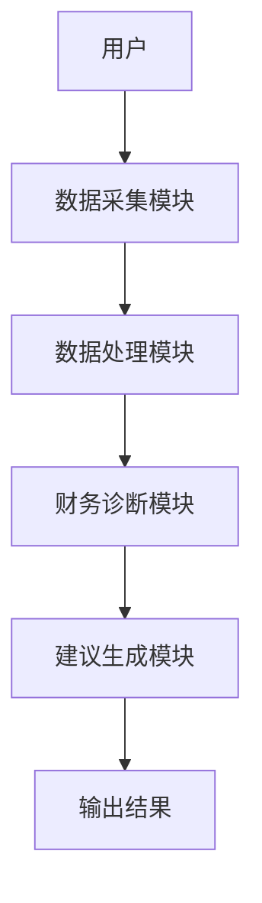
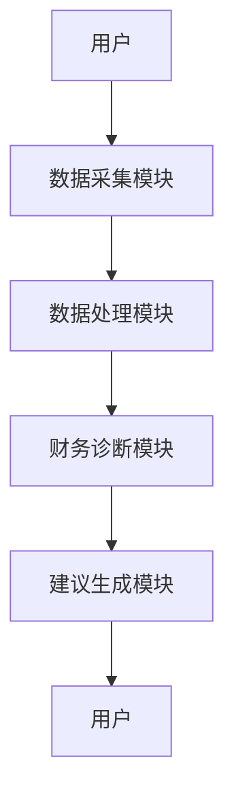
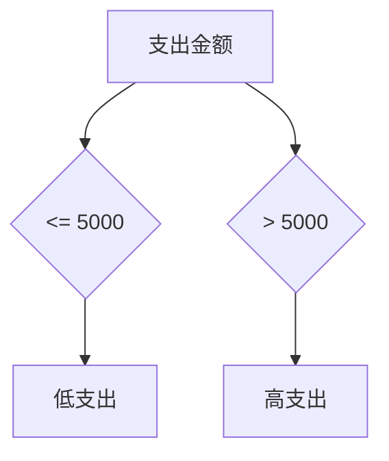
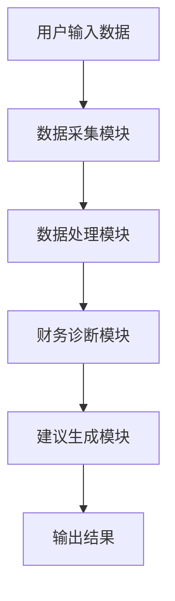

                 


# 智能个人财务状况诊断与建议系统

> 关键词：智能财务诊断，人工智能，财务分析，系统架构，机器学习

> 摘要：本文详细介绍了智能个人财务状况诊断与建议系统的开发与实现，包括系统背景、核心概念、算法原理、系统架构设计、项目实战以及最佳实践。文章通过详细分析，展示了如何利用人工智能技术，帮助个人有效管理和优化财务状况。

---

## 第1章: 个人财务状况诊断与建议的背景与需求

### 1.1 个人财务管理的重要性

#### 1.1.1 个人财务管理的核心问题

在现代社会，个人财务管理已成为一个不可忽视的重要课题。个人的财务状况直接影响生活质量、投资决策和未来规划。传统财务管理依赖人工记录和分析，效率低下且容易出错。随着人工智能技术的快速发展，智能化财务管理成为可能，能够帮助个人更高效、准确地管理财务。

#### 1.1.2 传统财务管理的局限性

传统财务管理主要依赖手工记录和简单工具，存在以下问题：

- 数据分散：财务数据可能分布在多个平台，难以集中管理。
- 分析效率低：人工分析财务数据耗时且容易出错。
- 缺乏智能化：无法根据市场变化和用户需求提供实时建议。

#### 1.1.3 智能化财务管理的必要性

人工智能技术的引入，为财务管理带来了革命性的变化。智能财务系统能够实时采集和分析数据，提供个性化建议，帮助用户优化支出、管理债务、规划投资等。

---

### 1.2 人工智能在财务管理中的应用

#### 1.2.1 AI技术在财务分析中的优势

人工智能技术在财务分析中的优势主要体现在以下几个方面：

- **自动化数据处理**：AI能够自动采集和整理财务数据，减少人工操作。
- **精准分析**：利用机器学习算法，AI能够发现数据中的隐藏规律，提供更精准的分析结果。
- **实时建议**：AI能够根据实时数据变化，为用户提供最优财务建议。

#### 1.2.2 智能财务系统的应用场景

智能财务系统可以在多种场景中应用，如：

- **个人支出管理**：帮助用户优化日常开支。
- **债务管理**：协助用户制定还款计划，降低债务风险。
- **投资建议**：根据市场动态和个人风险偏好，推荐投资方案。

#### 1.2.3 智能化财务管理的潜在价值

通过智能化财务管理，用户可以实现：

- 提高财务管理效率。
- 降低错误率。
- 获取个性化财务建议。
- 实现财务目标。

---

## 第2章: 智能财务诊断系统的概念与架构

### 2.1 系统核心概念

#### 2.1.1 系统输入与输出

- **输入**：系统的输入主要包括用户的财务数据，如收入、支出、资产、负债等。
- **输出**：系统的输出是财务诊断结果和优化建议，包括支出分析、债务优化、投资建议等。

#### 2.1.2 系统功能模块划分

智能财务诊断系统通常包含以下功能模块：

- **数据采集模块**：负责采集用户的财务数据。
- **数据处理模块**：对数据进行清洗和预处理。
- **财务诊断模块**：利用算法对数据进行分析，生成诊断结果。
- **建议生成模块**：根据诊断结果，生成个性化建议。

#### 2.1.3 系统核心算法与模型

系统的核心算法包括：

- **回归分析**：用于预测未来的财务状况。
- **决策树**：用于分类和决策，如支出类别识别。

---

### 2.2 系统架构设计

#### 2.2.1 数据流图

以下是系统的数据流图：



#### 2.2.2 系统模块划分

系统模块划分如下：

- 数据采集模块：负责从多个数据源采集用户的财务数据。
- 数据处理模块：对数据进行清洗、转换和标准化处理。
- 财务诊断模块：利用机器学习算法对数据进行分析，生成诊断结果。
- 建议生成模块：根据诊断结果，生成个性化财务建议。

#### 2.2.3 系统交互流程图

以下是系统的交互流程图：



---

## 第3章: 系统算法原理与实现

### 3.1 个人财务数据特征分析

#### 3.1.1 数据清洗与预处理

数据清洗的步骤包括：

1. **去除重复数据**：删除重复的记录。
2. **处理缺失值**：填补或删除缺失的数据。
3. **异常值处理**：识别并处理异常值。

#### 3.1.2 数据特征选择

选择重要的特征变量，如收入、支出、资产、负债等。

#### 3.1.3 数据特征分析

通过统计分析和可视化，了解各特征之间的关系。

---

### 3.2 机器学习算法实现

#### 3.2.1 回归分析

回归分析用于预测未来的财务状况。以下是一个简单的线性回归模型：

$$ y = \beta_0 + \beta_1x + \epsilon $$

其中，$y$ 是目标变量，$x$ 是自变量，$\beta_0$ 和 $\beta_1$ 是回归系数，$\epsilon$ 是误差项。

#### 3.2.2 决策树

决策树用于分类和决策。以下是一个决策树的简单示例：



---

## 第4章: 系统架构设计与实现

### 4.1 系统功能设计

#### 4.1.1 功能模块划分

系统功能模块包括：

- 数据采集模块：从银行、支付宝、微信等平台采集数据。
- 数据处理模块：清洗和预处理数据。
- 财务诊断模块：利用机器学习算法生成诊断结果。
- 建议生成模块：根据诊断结果生成个性化建议。

#### 4.1.2 功能流程图

以下是系统功能流程图：



---

## 第5章: 项目实战与优化

### 5.1 环境搭建

#### 5.1.1 开发工具安装

需要安装的工具包括：

- Python
- Pandas
- Scikit-learn
- Mermaid
- Jupyter Notebook

#### 5.1.2 数据库安装与配置

建议使用 SQLite 或 MySQL 数据库。

---

### 5.2 核心代码实现

#### 5.2.1 数据采集模块代码

```python
import pandas as pd

def collect_data():
    # 从银行API获取数据
    bank_data = pd.read_json('bank_api.json')
    # 从支付宝获取数据
    alipay_data = pd.read_json('alipay_api.json')
    # 合并数据
    data = pd.concat([bank_data, alipay_data])
    return data

if __name__ == "__main__":
    data = collect_data()
    print(data.head())
```

#### 5.2.2 数据处理模块代码

```python
def preprocess_data(data):
    # 去除重复数据
    data = data.drop_duplicates()
    # 处理缺失值
    data = data.dropna()
    return data

if __name__ == "__main__":
    data = collect_data()
    processed_data = preprocess_data(data)
    print(processed_data.head())
```

#### 5.2.3 财务诊断模块代码

```python
from sklearn.tree import DecisionTreeClassifier

def financial_diagnosis(data):
    # 特征选择
    features = data[['income', 'expenses', 'assets', ' liabilities']]
    target = data['status']
    # 训练模型
    model = DecisionTreeClassifier()
    model.fit(features, target)
    return model

if __name__ == "__main__":
    data = collect_data()
    processed_data = preprocess_data(data)
    model = financial_diagnosis(processed_data)
    print(model)
```

---

## 第6章: 最佳实践与总结

### 6.1 最佳实践

- **数据安全**：确保用户的财务数据安全，防止泄露。
- **模型优化**：定期更新模型，提高诊断准确性。
- **用户体验**：提供友好的用户界面，方便用户使用。

### 6.2 总结

智能个人财务状况诊断与建议系统通过人工智能技术，帮助个人高效、准确地管理财务。本文详细介绍了系统的开发与实现，包括背景、核心概念、算法原理、系统架构设计、项目实战以及最佳实践。

---

## 作者信息

作者：AI天才研究院 & 禅与计算机程序设计艺术

---

通过以上内容，您可以逐步理解并实现智能个人财务状况诊断与建议系统的开发。

