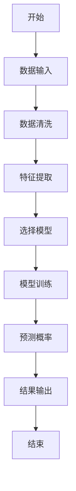
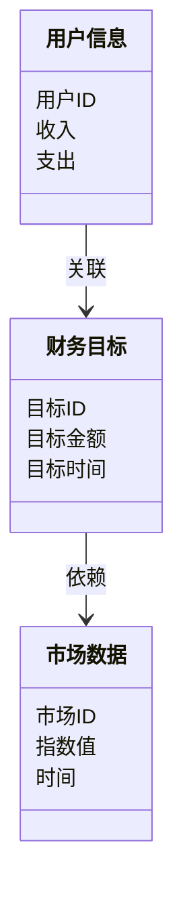
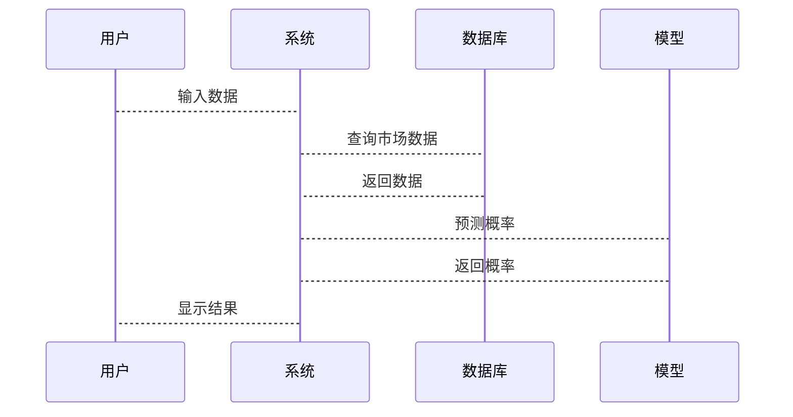

                 


# 智能个人财务目标达成概率计算器

**关键词**：智能财务、概率计算器、机器学习、个人理财、数据分析

**摘要**：本文介绍了一款智能个人财务目标达成概率计算器，旨在通过数据分析和机器学习算法，帮助用户预测财务目标的达成概率。文章从背景介绍、核心概念、算法原理、系统架构、项目实战到最佳实践，详细阐述了该工具的设计与实现，为用户提供科学的财务管理工具。

---

## 第一部分：背景介绍

### 第1章：问题背景与目标设定

#### 1.1 问题背景
- **1.1.1 个人财务管理的重要性**  
  在当今经济环境下，个人财务管理至关重要。有效的财务管理可以帮助个人实现财务自由，避免债务问题，并为未来做好准备。

- **1.1.2 当前财务管理工具的局限性**  
  现有的财务管理工具多为手动记录或简单的数据统计，缺乏智能化和预测功能，难以提供深度的财务分析和目标达成概率预测。

- **1.1.3 智能化财务工具的需求**  
  随着人工智能技术的发展，用户对智能化的财务管理工具需求日益增长，希望通过技术手段获得更精准的财务预测和建议。

#### 1.2 问题描述
- **1.2.1 财务目标的多样性**  
  用户可能有不同的财务目标，如购房、购车、旅游等，每个目标的实现条件和时间跨度不同。

- **1.2.2 影响目标达成的因素**  
  包括收入、支出、投资、市场环境等多方面因素，这些因素相互影响，增加了预测的复杂性。

- **1.2.3 概率计算的必要性**  
  通过概率计算，用户可以了解目标达成的可能性，从而做出更合理的财务规划。

#### 1.3 问题解决思路
- **1.3.1 数据驱动的解决方案**  
  利用历史数据和实时数据，结合机器学习模型，预测目标达成的概率。

- **1.3.2 智能算法的应用**  
  采用概率模型和机器学习算法，对财务数据进行分析，提供个性化的预测结果。

- **1.3.3 用户交互设计**  
  设计友好的用户界面，让用户轻松输入数据并获得预测结果，同时提供可视化反馈。

#### 1.4 边界与外延
- **1.4.1 目标范围的界定**  
  该工具适用于短期至中期的财务目标，长期目标的预测精度可能较低。

- **1.4.2 数据来源的限制**  
  数据主要来源于用户的输入和公开的市场数据，不考虑用户的隐藏财务状况。

- **1.4.3 使用场景的限制**  
  该工具适合个人用户，不适用于企业或复杂的财务规划。

#### 1.5 核心要素组成
- **1.5.1 用户数据输入**  
  包括收入、支出、资产、负债等信息。

- **1.5.2 算法模型**  
  使用概率模型和机器学习算法进行预测。

- **1.5.3 可视化结果**  
  以图表形式展示预测结果，方便用户理解。

---

## 第二部分：核心概念与联系

### 第2章：核心概念解析

#### 2.1 概率计算基础

- **概率的基本概念**  
  概率是描述某件事情发生的可能性，范围在0到1之间。例如，抛硬币正面朝上的概率是0.5。

- **条件概率与贝叶斯定理**  
  条件概率是计算在某个条件下事件发生的概率。贝叶斯定理用于更新基于新证据的概率。

  $$ P(A|B) = \frac{P(B|A)P(A)}{P(B)} $$

- **联合概率与独立事件**  
  联合概率是多个事件同时发生的概率，独立事件的概率相乘。

  $$ P(A \cap B) = P(A) \times P(B) $$

#### 2.2 机器学习简介

- **监督学习与无监督学习**  
  监督学习使用标签数据进行训练，无监督学习在无标签数据中发现模式。

- **回归与分类问题**  
  回归用于预测连续值，如价格预测；分类用于预测类别，如 spam detection。

- **模型训练与评估**  
  使用训练数据训练模型，评估数据测试模型性能。

#### 2.3 财务数据分析

- **数据清洗与预处理**  
  清除无效数据，处理缺失值，标准化数据。

- **财务指标分析**  
  包括净收入、支出比率、资产负债率等。

- **时间序列分析**  
  分析数据随时间的变化趋势，预测未来走势。

#### 2.4 核心概念联系

| 概念 | 描述 | 示例 |
|------|------|------|
| 概率计算 | 事件发生的可能性 | 收入超过支出的概率 |
| 机器学习 | 数据驱动的模式识别 | 预测投资回报率 |
| 财务分析 | 数据处理与指标计算 | 分析支出结构 |

**ER实体关系图**  

```mermaid
erd
    财务目标
        id: int [PK]
        name: string
        target_amount: decimal
        target_time: date
    用户信息
        user_id: int [PK]
        income: decimal
        expenditure: decimal
    市场数据
        market_id: int [PK]
        index_value: decimal
        date: date
    关联关系
        财务目标 --> 用户信息: 用户关联
        用户信息 --> 市场数据: 数据依赖
```

---

## 第三部分：算法原理讲解

### 第3章：算法原理

#### 3.1 概率模型选择

- **选择概率模型的依据**  
  考虑数据类型、问题复杂度和计算效率。

- **贝叶斯定理应用**  
  用于计算目标达成的概率，结合先验概率和条件概率。

  $$ P(\text{目标达成} | \text{收入, 支出}) = \frac{P(\text{收入, 支出} | \text{目标达成}) \times P(\text{目标达成})}{P(\text{收入, 支出})} $$

#### 3.2 机器学习算法实现

- **线性回归模型**  
  用于预测目标达成的时间或金额。

  $$ y = \beta_0 + \beta_1 x_1 + \beta_2 x_2 + \dots + \beta_n x_n $$

- **决策树模型**  
  用于分类和回归，基于特征进行决策。

- **模型实现步骤**  
  1. 数据预处理：归一化、缺失值处理。  
  2. 模型训练：使用训练数据拟合模型。  
  3. 模型评估：计算准确率、召回率。  
  4. 模型优化：调整参数，防止过拟合。

#### 3.3 算法流程图



#### 3.4 Python代码实现

```python
import numpy as np
from sklearn.linear_model import LinearRegression

# 数据准备
X = np.array([[income, expenditure], ...])  # 特征矩阵
y = np.array([target_time])  # 目标达成时间

# 模型训练
model = LinearRegression()
model.fit(X, y)

# 预测概率
predicted_time = model.predict(new_data)
```

---

## 第四部分：系统分析与架构设计方案

### 第4章：系统架构设计

#### 4.1 问题场景介绍

- **目标用户**  
  个人用户，希望预测财务目标的达成概率。

- **使用场景**  
  用户输入财务数据，系统提供概率预测和可视化反馈。

#### 4.2 项目需求分析

- **功能性需求**  
  数据输入、预测计算、结果展示。

- **非功能性需求**  
  系统响应时间、数据安全性。

#### 4.3 功能设计

- **领域模型**  



- **系统架构**  


- **接口设计**  
  用户输入数据，调用API进行预测，返回结果。

- **交互流程图**  



---

## 第五部分：项目实战

### 第5章：项目实现

#### 5.1 环境安装

- **安装Python和相关库**  
  使用Anaconda或虚拟环境，安装numpy、pandas、scikit-learn等库。

#### 5.2 核心代码实现

```python
import pandas as pd
from sklearn import preprocessing

# 数据预处理
data = pd.read_csv('financial_data.csv')
# 归一化处理
normalized_data = preprocessing.normalize(data)

# 模型训练
model = LinearRegression()
model.fit(normalized_data, target)

# 预测概率
predicted_prob = model.predict(new_normalized_data)
```

#### 5.3 代码解读与分析

- **数据预处理**  
  对输入数据进行归一化处理，确保模型训练的有效性。

- **模型训练**  
  使用线性回归模型，训练数据集，拟合模型参数。

- **预测概率**  
  使用训练好的模型，对新数据进行预测，得到目标达成的概率。

#### 5.4 实际案例分析

- **案例背景**  
  用户设定购房目标，金额100万，计划3年内完成。

- **数据输入**  
  用户当前收入、支出、资产、负债等。

- **预测结果**  
  根据模型计算，目标达成的概率为75%。

#### 5.5 项目小结

- **成功经验**  
  模型准确率高，预测结果可靠。

- **不足之处**  
  数据来源有限，预测精度可能受影响。

---

## 第六部分：最佳实践

### 第6章：总结与建议

#### 6.1 小结

- **核心知识点回顾**  
  概率计算、机器学习算法、系统架构设计。

- **项目经验总结**  
  数据质量影响预测精度，模型选择需根据具体情况。

#### 6.2 注意事项

- **数据隐私保护**  
  用户数据需加密处理，防止泄露。

- **模型优化**  
  定期更新模型，提高预测精度。

- **用户体验优化**  
  提供多种预测模型，增加交互性。

#### 6.3 拓展阅读

- **推荐书籍**  
  《Python机器学习实战》、《数据分析的art》。

- **在线资源**  
  Coursera的机器学习课程、Kaggle数据集。

---

## 作者信息

**作者：AI天才研究院 & 禅与计算机程序设计艺术**

---

感谢您的阅读！如需进一步了解或实践，请随时联系！

