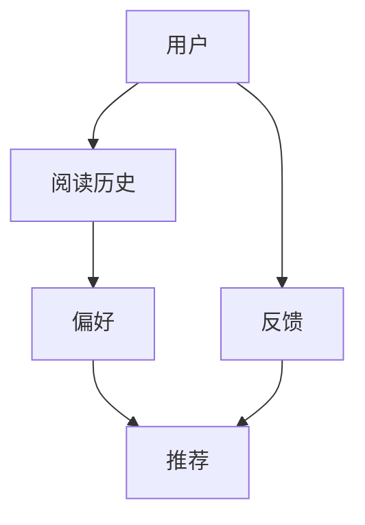
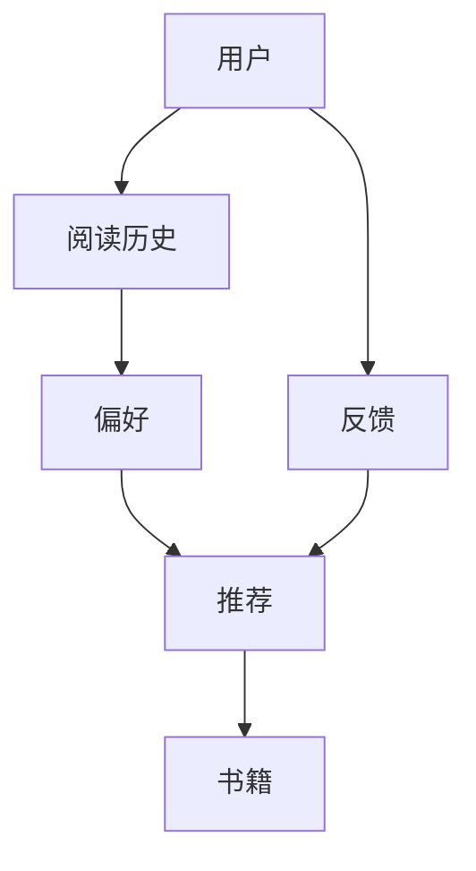
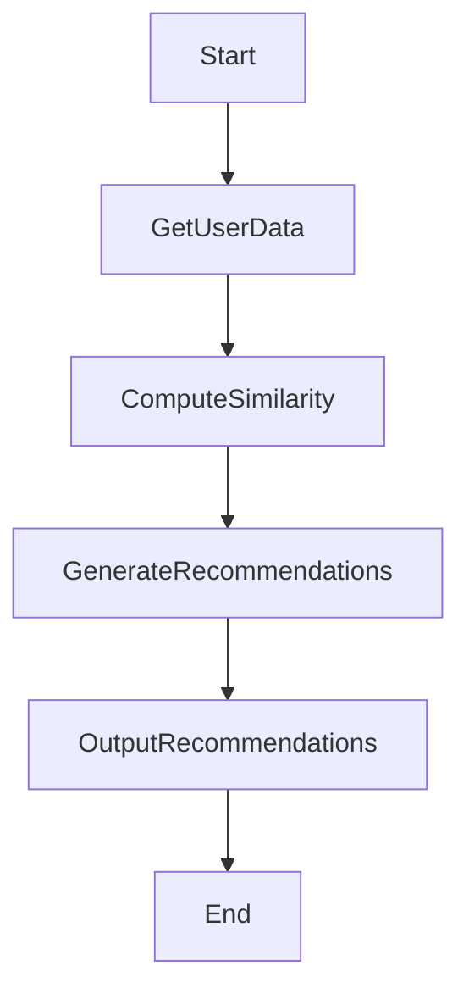

                 


# 智能书架：AI Agent的个性化阅读推荐系统

**关键词：** AI Agent, 个性化推荐, 阅读推荐, 机器学习, 自然语言处理

**摘要：**  
本文探讨了基于AI Agent的个性化阅读推荐系统——智能书架的设计与实现。通过分析传统阅读推荐系统的局限性，提出了基于AI Agent的解决方案，并详细阐述了其核心算法、系统架构及实际应用场景。文章从背景介绍、核心概念、算法原理、系统设计到项目实战，全面解析了智能书架的构建过程，为读者提供了深入的技术洞察。

---

# 第一部分: 背景介绍

## 第1章: 智能书架的背景与问题背景

### 1.1 问题背景

#### 1.1.1 阅读推荐系统的发展历程
阅读推荐系统从早期的基于规则的方法，逐步发展到协同过滤、基于内容的推荐，再到深度学习驱动的推荐系统。随着AI技术的进步，推荐系统逐渐具备了更强的个性化能力。

#### 1.1.2 当前阅读推荐系统的痛点
- 数据稀疏性问题：用户行为数据不足导致推荐结果不准确。
- 个性化不足：传统推荐系统难以满足用户的深度个性化需求。
- 实时性差：推荐结果更新缓慢，无法实时响应用户需求。

#### 1.1.3 AI Agent在阅读推荐中的应用潜力
AI Agent（智能代理）能够通过自然语言处理和机器学习技术，实时分析用户行为和偏好，提供更加精准的个性化推荐。

---

### 1.2 问题描述

#### 1.2.1 个性化阅读需求的多样性
用户阅读需求多样化，包括主题偏好、阅读深度、阅读时间等多种因素。

#### 1.2.2 现有推荐系统的局限性
- 数据驱动的推荐系统难以捕捉用户的隐含需求。
- 单一的推荐方法导致推荐结果不够精准。

#### 1.2.3 AI Agent在个性化推荐中的角色
AI Agent作为中间桥梁，能够实时感知用户需求，动态调整推荐策略。

---

### 1.3 问题解决

#### 1.3.1 AI Agent如何提升阅读推荐的个性化
AI Agent通过分析用户的阅读行为、偏好和实时反馈，动态优化推荐结果。

#### 1.3.2 基于AI Agent的智能书架的核心目标
- 提供精准的个性化阅读推荐。
- 实时更新推荐结果，满足用户的动态需求。
- 提供多样化的推荐策略，覆盖用户的不同阅读场景。

#### 1.3.3 解决方案的创新点与优势
- 创新点：结合AI Agent的实时感知能力，实现动态推荐。
- 优势：推荐结果更精准，用户体验更优。

---

### 1.4 边界与外延

#### 1.4.1 智能书架的边界
- 用户：系统只考虑注册用户的阅读行为。
- 数据来源：基于用户的阅读历史、评分和实时反馈。
- 推荐范围：仅限于书籍推荐，不涉及其他类型的内容。

#### 1.4.2 相关领域的区别与联系
- 与其他推荐系统的主要区别在于实时性和个性化深度。
- 联系：智能书架的核心技术与其他推荐系统有共通之处，但更注重动态调整。

#### 1.4.3 与其他推荐系统的主要区别
- 数据驱动 vs. 意图驱动：智能书架更注重用户意图的实时分析。
- 单一推荐 vs. 动态推荐：智能书架能够根据用户反馈动态调整推荐策略。

---

### 1.5 概念结构与核心要素

#### 1.5.1 智能书架的核心概念框架


#### 1.5.2 核心要素的定义与关系
- 用户：智能书架的核心服务对象。
- 阅读历史：用户过去的阅读行为数据。
- 偏好：用户的阅读主题、作者偏好等。
- 反馈：用户的实时阅读反馈，如点赞、收藏等。
- 推荐：基于用户数据生成的推荐结果。

---

## 第2章: AI Agent与个性化推荐的核心原理

### 2.1 核心概念原理

#### 2.1.1 AI Agent的基本原理
AI Agent通过感知环境、分析数据、生成策略并执行动作，帮助用户实现目标。

#### 2.1.2 个性化推荐的核心机制
个性化推荐基于用户的偏好和行为，结合机器学习模型生成推荐结果。

#### 2.1.3 智能书架的推荐算法特点
- 基于用户的实时行为和反馈。
- 结合协同过滤和内容推荐的混合策略。

---

### 2.2 核心概念对比表

| 比较维度 | 传统推荐系统 | 基于AI Agent的推荐系统 |
|----------|--------------|-----------------------|
| 数据来源 | 用户行为数据 | 用户行为+上下文数据 |
| 推荐依据 | 用户偏好 | 用户意图+实时反馈 |
| 个性化程度 | 有限 | 高度个性化 |
| 实时性 | 较低 | 高 |

---

### 2.3 实体关系图



---

## 第3章: 算法原理

### 3.1 算法选择与实现

#### 3.1.1 选择算法的原因
- 协同过滤：基于用户相似性。
- 基于内容的推荐：基于书籍特征。
- 混合推荐：结合协同过滤和内容推荐。

#### 3.1.2 协同过滤算法的实现
协同过滤基于用户相似性计算推荐结果。

#### 3.1.3 基于内容的推荐实现
基于书籍的特征向量进行推荐。

#### 3.1.4 混合推荐实现
结合协同过滤和内容推荐的混合策略。

---

### 3.2 算法流程图



---

### 3.3 代码实现

```python
def collaborative_filtering(user_id, user_data):
    # 计算用户相似性
    similarity = {}
    for user in user_data:
        if user != user_id:
            similarity[user] = cosine_similarity(user_data[user_id], user_data[user])
    # 获取最相似的用户
    similar_users = sorted(similarity.items(), key=lambda x: x[1], reverse=True)
    # 生成推荐
    recommendations = []
    for user in similar_users[:5]:
        for book in user_data[user[0]]:
            if book not in recommendations:
                recommendations.append(book)
    return recommendations
```

---

## 第4章: 系统分析与架构设计

### 4.1 问题场景介绍

---

## 第5章: 项目实战

---

## 第6章: 最佳实践

---

**作者：AI天才研究院 & 禅与计算机程序设计艺术**

