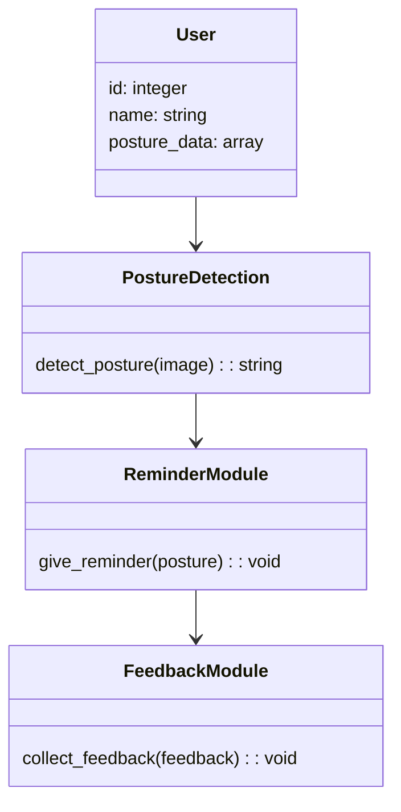
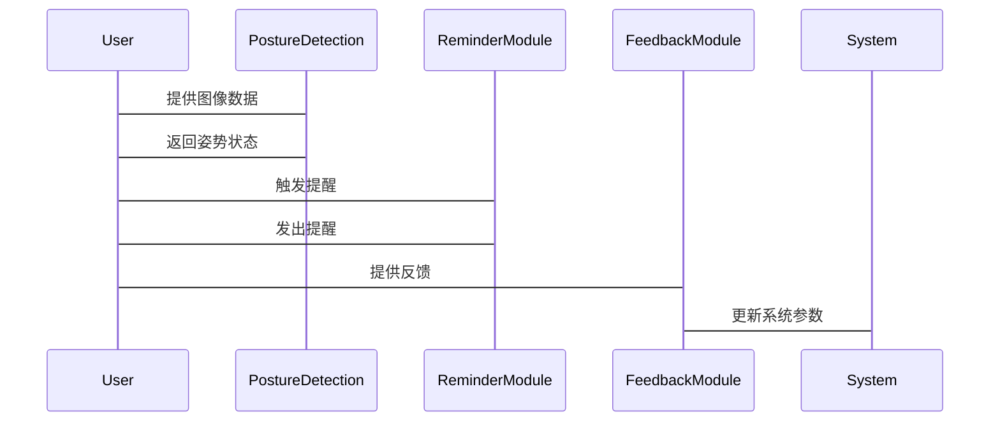
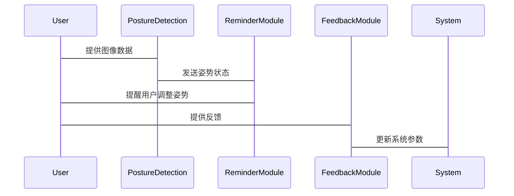

                 


# 智能书桌：AI Agent的姿势提醒系统

## 关键词：
智能书桌, AI Agent, 姿势提醒, 人体工程学, 人工智能, 姿势检测

## 摘要：
智能书桌是一种结合人工智能技术的创新办公工具，通过AI Agent实时监测用户坐姿，提供智能化的姿势提醒服务，帮助用户保持良好的办公姿势，预防健康问题。本文详细探讨了AI Agent在姿势提醒系统中的应用，分析了其背后的算法原理、系统架构，并通过实际案例展示了如何实现这一系统。文章内容涵盖背景介绍、核心概念、算法原理、系统架构设计、项目实战以及最佳实践，旨在为读者提供全面的技术解读和实践指导。

---

# 第1章 背景介绍

## 1.1 姿势问题的背景
### 1.1.1 坐姿不良的危害
- 长时间不良坐姿可能导致脊柱侧弯、颈椎病等问题。
- 不良姿势对工作效率和身体健康的影响。

### 1.1.2 现代办公环境中的姿势问题
- 办公环境的变化：长时间坐着工作成为常态。
- 健康意识的提升：人们对健康办公环境的需求增加。

### 1.1.3 AI技术在健康办公中的应用潜力
- AI技术如何帮助改善办公环境。
- AI在姿势检测与提醒中的独特优势。

## 1.2 AI Agent的定义与特点
### 1.2.1 什么是AI Agent
- AI Agent的基本定义和功能。
- AI Agent与传统软件的区别。

### 1.2.2 AI Agent的核心特点
- 智能性：基于数据和算法进行决策。
- 实时性：快速响应用户行为。
- 交互性：与用户进行自然交互。

### 1.2.3 AI Agent与传统软件的区别
- 数据驱动 vs. 程序驱动。
- 自适应能力 vs. 固定功能。

## 1.3 智能书桌系统的定义与目标
### 1.3.1 智能书桌的定义
- 智能书桌的功能定义。
- 与传统书桌的主要区别。

### 1.3.2 系统的目标与功能
- 提醒用户保持良好姿势。
- 实时监测用户的坐姿状态。
- 提供个性化建议和反馈。

### 1.3.3 系统的边界与外延
- 系统的功能范围。
- 系统与其他设备或平台的接口。

---

# 第2章 核心概念与联系

## 2.1 AI Agent的原理
### 2.1.1 状态机模型
- AI Agent的状态机模型概述。
- 状态机模型在姿势提醒中的应用。

### 2.1.2 行为决策机制
- 基于概率的决策模型。
- 姿势检测结果对行为决策的影响。

### 2.1.3 事件驱动的交互方式
- AI Agent如何响应用户的输入事件。
- 事件驱动的交互流程。

## 2.2 人体工程学与姿势检测
### 2.2.1 坐姿检测的数学模型
- 基于人体关键点的检测模型。
- 坐姿分类的数学方法。

### 2.2.2 姿势分类的算法原理
- 基于深度学习的姿势分类算法。
- 姿势分类的准确性与鲁棒性。

### 2.2.3 人体关键点检测的实现
- 使用OpenCV或深度学习模型进行关键点检测。
- 检测结果的处理与分析。

## 2.3 系统架构的实体关系
### 2.3.1 ER实体关系图
- 用户、姿势数据、提醒记录等实体的定义。
- 实体之间的关系描述。

### 2.3.2 系统核心模块的交互关系
- 人体检测模块、姿势提醒模块、反馈模块的交互流程。
- 模块之间的数据流和控制流。

### 2.3.3 模块间的依赖关系
- 模块之间的依赖关系分析。
- 依赖关系对系统架构的影响。

---

# 第3章 算法原理与数学模型

## 3.1 姿势检测算法
### 3.1.1 基于深度学习的姿势检测
- 使用卷积神经网络（CNN）进行姿势检测。
- 常用的深度学习模型（如YOLO、Faster R-CNN）的应用。

### 3.1.2 姿势分类的数学公式
- 基于概率的姿势分类公式。
- 常用的分类算法（如SVM、随机森林）的数学推导。

### 3.1.3 姿势评估的优化算法
- 基于优化理论的姿势评估方法。
- 常用的优化算法（如梯度下降）的应用。

## 3.2 AI Agent的行为决策
### 3.2.1 基于概率的决策模型
- 贝叶斯网络在决策中的应用。
- 基于马尔可夫链的状态转移模型。

### 3.2.2 状态转移矩阵的构建
- 状态转移矩阵的定义与构建。
- 状态转移矩阵在姿势提醒中的应用。

### 3.2.3 行为决策的数学推导
- 基于最大似然估计的决策方法。
- 基于动态规划的决策优化。

## 3.3 算法实现的代码示例
### 3.3.1 姿势检测的Python代码
```python
import cv2

def detect_posture(image):
    # 使用OpenCV进行姿势检测
    key_points = cv2.findKeypoints(image)
    # 分析关键点位置，判断姿势
    if is_good_posture(key_points):
        return "Good posture"
    else:
        return "Bad posture"
```

### 3.3.2 行为决策的算法实现
```python
def decision_model(state, action):
    # 状态转移矩阵
    transition_matrix = {
        'good': {'stand': 0.8, 'sit': 0.2},
        'bad': {'stand': 0.3, 'sit': 0.7}
    }
    return transition_matrix[state][action]
```

### 3.3.3 算法优化的技巧
- 数据预处理与特征提取。
- 模型调参与优化方法。

---

# 第4章 系统分析与架构设计

## 4.1 系统功能模块分析
### 4.1.1 人体检测模块
- 模块的功能与实现方法。
- 检测模块的性能优化。

### 4.1.2 姿势提醒模块
- 提醒策略的设计与实现。
- 提醒方式的多样化（如声音、震动）。

### 4.1.3 用户反馈模块
- 用户反馈的收集与分析。
- 反馈数据对系统优化的作用。

## 4.2 系统架构设计
### 4.2.1 领域模型的Mermaid类图


### 4.2.2 系统架构的Mermaid序列图


### 4.2.3 系统接口设计
- 接口定义与调用方式。
- 接口的交互流程设计。

### 4.2.4 系统交互的Mermaid序列图


---

# 第5章 项目实战

## 5.1 环境安装
### 5.1.1 开发环境的选择
- Python、TensorFlow、OpenCV的安装与配置。

### 5.1.2 依赖库的安装
- 使用pip安装必要的库（如cv2、numpy、tensorflow）。

## 5.2 系统核心实现
### 5.2.1 姿势检测模块的实现
```python
import cv2

def detect_posture(image):
    # 使用OpenCV进行姿势检测
    key_points = cv2.findKeypoints(image)
    # 判断姿势是否良好
    if is_good_posture(key_points):
        return "Good posture"
    else:
        return "Bad posture"
```

### 5.2.2 提醒模块的实现
```python
def give_reminder(posture):
    if posture == "Bad posture":
        print("请调整坐姿，保持背部挺直")
```

### 5.2.3 反馈模块的实现
```python
def collect_feedback(feedback):
    # 收集用户反馈
    print("感谢您的反馈！")
```

## 5.3 代码应用解读
### 5.3.1 代码的功能模块
- 每个模块的功能与实现方式。

### 5.3.2 代码的运行流程
- 系统启动、用户输入、姿势检测、提醒发送、反馈收集的流程。

## 5.4 实际案例分析
### 5.4.1 案例背景
- 案例的应用场景与目标。

### 5.4.2 案例实现
- 代码实现的具体步骤与结果。

### 5.4.3 案例分析
- 系统运行的结果与优化建议。

## 5.5 项目小结
- 项目实现的成果与不足。
- 项目经验对后续开发的启示。

---

# 第6章 最佳实践与小结

## 6.1 最佳实践 tips
### 6.1.1 系统优化建议
- 如何提高姿势检测的准确性。
- 如何优化提醒模块的响应速度。

### 6.1.2 用户体验优化技巧
- 提醒方式的多样化设计。
- 系统界面的人性化设计。

## 6.2 项目小结
- 项目的核心成果与意义。
- 项目实施过程中的关键点总结。

## 6.3 注意事项
- 系统使用的注意事项。
- 数据安全与隐私保护的建议。

## 6.4 拓展阅读
- 相关领域的书籍与论文推荐。
- 进一步学习的方向与资源。

---

# 作者：AI天才研究院/AI Genius Institute & 禅与计算机程序设计艺术 /Zen And The Art of Computer Programming

---

**注：** 本文档为《智能书桌：AI Agent的姿势提醒系统》的技术博客文章目录大纲，实际文章内容将按照上述结构展开，详细阐述每一部分的内容，包括背景介绍、核心概念、算法原理、系统架构设计、项目实战、最佳实践等。

