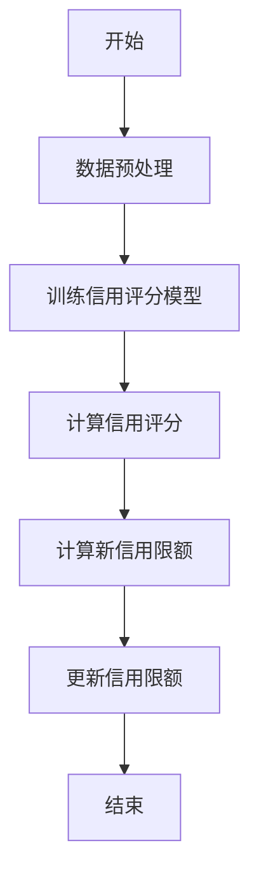
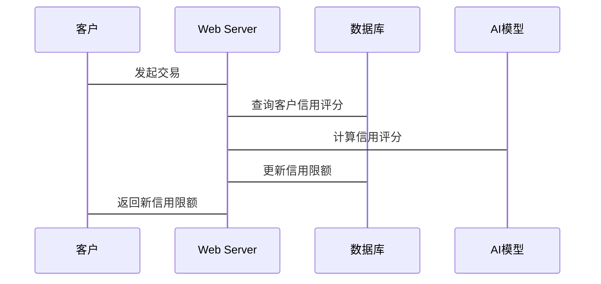

                 


# 智能企业信用限额动态调整系统

## 关键词：企业信用管理，智能系统，动态调整，机器学习，系统架构

## 摘要：本文详细探讨智能企业信用限额动态调整系统的构建与实现，结合背景分析、核心概念、算法原理、系统架构、项目实战及最佳实践，为读者提供全面的技术指南。

---

# 第一部分: 背景与挑战

## 第1章: 企业信用限额动态调整的背景与挑战

### 1.1 企业信用管理的现状与问题
- **传统信用管理的痛点**：企业面临信用评估复杂、调整周期长、人为错误多等问题。
- **信用限额调整的复杂性**：受市场变化、企业信用状况等多种因素影响，传统方法难以实时调整。
- **智能化调整的必要性**：通过AI和大数据技术实现自动化、精准化调整，提升管理效率。

### 1.2 智能化信用管理的背景
- **大数据与人工智能技术的发展**：提供了强大的数据处理和分析能力，支持智能信用管理。
- **企业信用管理的智能化趋势**：通过智能系统实时监控和调整信用限额，优化企业风险管理。

### 1.3 系统实现的目标
- 提供实时信用评估和动态调整。
- 优化企业信用管理流程，降低风险，提升客户满意度。

---

## 第2章: 智能企业信用限额动态调整系统的核心概念

### 2.1 系统核心概念解析
- **信用限额的定义与计算方法**：基于企业信用评分和历史交易数据计算信用限额。
- **动态调整的机制与触发条件**：根据实时数据变化自动调整信用限额，触发条件包括交易完成、信用评分变化等。
- **智能调整算法的实现原理**：利用机器学习模型预测信用风险，动态调整信用限额。

### 2.2 核心概念的属性对比
- **信用评分与信用限额的关系**：信用评分影响信用限额，评分越高，限额越高。
- **历史交易数据与信用调整的关联**：历史数据用于评估信用风险，影响信用限额调整。
- **实时数据与信用限额调整的影响**：实时数据如交易量变化直接影响信用限额调整。

### 2.3 系统的ER实体关系图
```mermaid
erDiagram
    customer[客户] {
        id : integer
        name : string
        credit_score : integer
    }
    transaction[交易] {
        id : integer
        customer_id : integer
        amount : integer
        date : date
    }
    credit_limit_adjustment[信用限额调整] {
        id : integer
        customer_id : integer
        new_limit : integer
        adjustment_date : date
    }
    customer --> transaction : 发起的交易
    customer --> credit_limit_adjustment : 导致的调整
    transaction --> credit_limit_adjustment : 可能触发的调整
```

---

## 第3章: 系统算法原理与数学模型

### 3.1 算法原理概述
- **基于机器学习的信用评分模型**：使用随机森林或逻辑回归模型预测客户信用风险。
- **动态调整算法的实现步骤**：
  1. 数据收集与预处理。
  2. 训练信用评分模型。
  3. 根据评分和规则计算新信用限额。
  4. 更新信用限额并记录调整日志。

### 3.2 算法流程图


### 3.3 数学模型与公式
- **信用评分公式**：
  $$\text{信用评分} = \alpha \times \text{信用历史} + \beta \times \text{财务状况} + \gamma \times \text{其他因素}$$

- **动态调整公式**：
  $$\text{新信用限额} = \text{旧信用限额} \times (1 + \delta \times \text{调整因子})$$

### 3.4 算法实现示例
- **Python代码实现**：
  ```python
  def calculate_credit_limit(old_limit, adjustment_factor):
      new_limit = old_limit * (1 + 0.05 * adjustment_factor)
      return new_limit

  # 示例
  old_limit = 10000
  adjustment_factor = 0.2
  new_limit = calculate_credit_limit(old_limit, adjustment_factor)
  print(f"新信用限额: {new_limit}")
  ```

---

## 第4章: 系统分析与架构设计

### 4.1 系统功能设计
- **领域模型**：客户、交易、信用限额调整等核心实体及其关系。
  ```mermaid
  classDiagram
      class 客户 {
          id
          name
          credit_score
      }
      class 交易 {
          id
          customer_id
          amount
          date
      }
      class 信用限额调整 {
          id
          customer_id
          new_limit
          adjustment_date
      }
      客户 --> 交易 : 发起的交易
      客户 --> 信用限额调整 : 导致的调整
      交易 --> 信用限额调整 : 可能触发的调整
  ```

### 4.2 系统架构设计
- **分层架构**：前端、后端、数据库。
  ```mermaid
  architecture
      Client
      Web Server
      Database
  ```

### 4.3 接口设计
- **API接口**：RESTful API，如`/api/credit-adjustment`用于触发信用限额调整。

### 4.4 系统交互流程


---

## 第5章: 项目实战

### 5.1 环境安装
- 安装Python、TensorFlow、Flask等工具。

### 5.2 系统核心实现
- 后端：使用Flask框架实现API接口。
- 前端：简单HTML页面展示结果。

### 5.3 实际案例分析
- 示例企业：信用评分从70提升到80，调整因子为0.2，计算新信用限额。

---

## 第6章: 最佳实践与总结

### 6.1 小结
- 本文详细介绍了智能企业信用限额动态调整系统的构建与实现。

### 6.2 注意事项
- 数据隐私保护，模型定期更新。

### 6.3 拓展阅读
- 推荐阅读《机器学习实战》和《企业架构设计》。

---

# 作者：AI天才研究院/AI Genius Institute & 禅与计算机程序设计艺术 /Zen And The Art of Computer Programming

---

以上是《智能企业信用限额动态调整系统》的详细目录大纲，涵盖了从背景分析到系统实现的全过程，确保每个部分都有深入的探讨和实际的应用示例。

