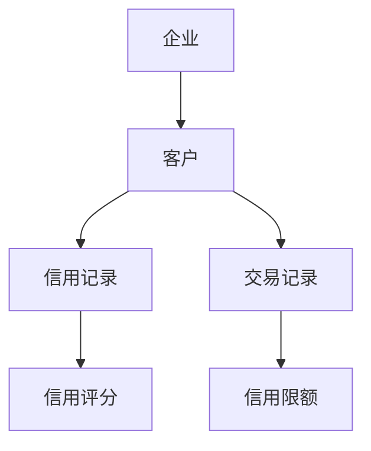
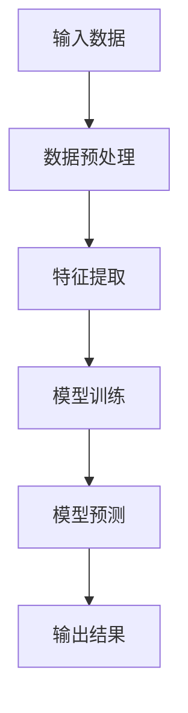
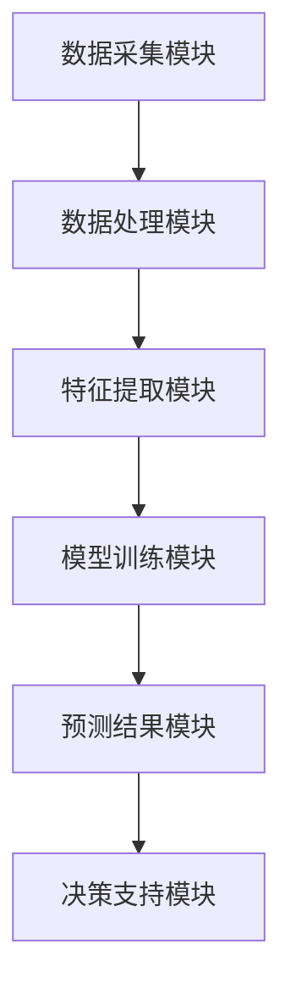
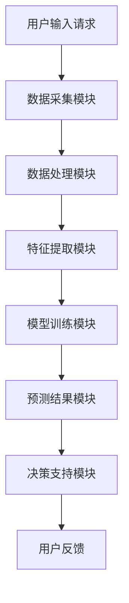

                 


# 智能企业信用限额管理系统

## 关键词
智能信用管理, 企业限额管理, 风险评估, 机器学习算法, 系统架构设计

## 摘要
智能企业信用限额管理系统是一种基于机器学习和大数据分析的创新解决方案，旨在帮助企业优化信用评估和限额管理流程，降低风险并提高决策效率。本文详细介绍了该系统的背景、核心概念、算法原理、系统架构设计、项目实战及最佳实践，为读者提供全面的技术指导。

---

# 第一部分: 智能企业信用限额管理系统的背景与核心概念

## 第1章: 企业信用限额管理的背景与问题

### 1.1 企业信用管理的重要性

#### 1.1.1 信用管理在企业经营中的作用
信用管理是企业经营中的核心环节，直接影响企业的资金周转、客户关系和市场拓展。通过有效的信用管理，企业可以降低坏账风险，优化资源配置。

#### 1.1.2 传统信用管理的局限性
传统信用管理主要依赖人工审核，存在效率低、主观性强、数据利用不足等问题，难以适应现代企业的快速决策需求。

#### 1.1.3 智能化信用管理的需求与趋势
随着大数据和人工智能技术的发展，企业对智能化信用管理的需求日益迫切。智能化信用管理能够提高决策效率，降低风险，为企业创造更大的价值。

### 1.2 信用限额管理的核心问题

#### 1.2.1 信用限额的定义与作用
信用限额是企业在一定时期内能够承受的最大信用风险，是信用管理中的核心指标。合理的信用限额能够平衡企业风险和收益。

#### 1.2.2 信用风险的来源与影响
信用风险主要来源于客户信用状况变化、市场波动和内部管理问题。信用风险会影响企业的财务健康和市场竞争力。

#### 1.2.3 企业信用限额管理的边界与外延
企业信用限额管理的边界包括客户信用评估、限额调整和风险监控。其外延涉及供应链金融、风险管理等多个领域。

### 1.3 智能企业信用限额管理系统的概念结构

#### 1.3.1 系统的核心要素组成
智能企业信用限额管理系统由数据采集、信用评估、限额计算、风险监控和决策支持五大模块组成。

#### 1.3.2 系统的功能模块划分
系统功能模块包括数据采集与处理、信用评分模型、限额计算模块、风险监控模块和决策支持模块。

#### 1.3.3 系统与相关业务的关联性
系统与企业的财务系统、客户管理系统和供应链管理系统密切相关，能够实现数据共享和业务协同。

## 第2章: 智能企业信用限额管理系统的核心概念与联系

### 2.1 核心概念的定义与属性对比

#### 2.1.1 信用评分与信用限额的对比
信用评分是客户信用状况的量化指标，信用限额是基于评分的信用授权。两者相辅相成，共同构成信用管理的核心。

#### 2.1.2 风险评估与信用决策的关系
风险评估是信用决策的基础，信用决策是风险评估的结果。两者共同决定了信用限额的合理性和有效性。

#### 2.1.3 数据驱动与模型驱动的差异
数据驱动依赖大量数据进行分析，模型驱动依赖数学模型进行预测。两者结合能够提高信用管理的准确性和效率。

### 2.2 实体关系图（ER图）分析



### 2.3 核心概念的数学模型与公式

#### 2.3.1 信用评分模型
$$ \text{信用评分} = \alpha \times \text{历史还款记录} + \beta \times \text{当前负债} + \gamma \times \text{收入水平} $$

#### 2.3.2 信用限额计算公式
$$ \text{信用限额} = \text{信用评分} \times \text{行业基准系数} $$

---

# 第二部分: 智能企业信用限额管理系统的算法原理

## 第3章: 智能企业信用限额管理系统的算法原理

### 3.1 算法原理概述

#### 3.1.1 信用评分算法的选择
选择合适的信用评分算法是系统设计的关键。常用算法包括线性回归、逻辑回归和支持向量机。

#### 3.1.2 基于机器学习的信用限额预测模型
机器学习模型能够通过历史数据训练，预测客户的信用限额。常用模型包括随机森林和神经网络。

#### 3.1.3 算法的优缺点分析
线性回归简单易懂，但对非线性关系的处理能力较弱。机器学习模型复杂度高，但预测精度更高。

### 3.2 算法流程图



### 3.3 算法实现代码示例

```python
import pandas as pd
from sklearn.linear_model import LinearRegression

# 数据加载
data = pd.read_csv('credit_data.csv')

# 数据预处理
data = data.dropna()

# 特征提取
X = data[['历史还款记录', '当前负债', '收入水平']]
y = data['信用评分']

# 模型训练
model = LinearRegression()
model.fit(X, y)

# 模型预测
predictions = model.predict(X)
```

---

## 第4章: 智能企业信用限额管理系统的系统架构设计

### 4.1 系统架构设计概述

#### 4.1.1 系统功能模块
系统功能模块包括数据采集、信用评分、限额计算、风险监控和决策支持。

#### 4.1.2 系统架构图



#### 4.1.3 系统接口设计
系统接口包括数据接口、模型接口和用户接口，确保各模块之间的数据交互和功能协同。

#### 4.1.4 系统交互流程图



---

## 第5章: 智能企业信用限额管理系统的项目实战

### 5.1 项目实战概述

#### 5.1.1 项目环境安装
需要安装Python、Scikit-learn、Pandas等工具。

#### 5.1.2 系统核心实现源代码

```python
import pandas as pd
from sklearn.linear_model import LinearRegression

# 数据加载
data = pd.read_csv('credit_data.csv')

# 数据预处理
data = data.dropna()

# 特征提取
X = data[['历史还款记录', '当前负债', '收入水平']]
y = data['信用评分']

# 模型训练
model = LinearRegression()
model.fit(X, y)

# 模型预测
predictions = model.predict(X)

# 输出结果
print('预测结果:', predictions)
```

#### 5.1.3 代码应用解读与分析
代码实现了信用评分模型的训练和预测，展示了如何利用机器学习算法进行信用评估。

#### 5.1.4 实际案例分析和详细讲解剖析
通过实际案例分析，展示了系统如何帮助企业在实际业务中优化信用管理。

### 5.2 项目小结

---

## 第6章: 智能企业信用限额管理系统的最佳实践

### 6.1 最佳实践 tips

#### 6.1.1 系统实施中的注意事项
在实施系统时，需要注意数据质量、模型选择和系统维护。

#### 6.1.2 系统优化建议
可以通过优化算法、增加数据维度和提升系统性能来进一步优化系统。

### 6.2 小结

#### 6.2.1 系统的核心价值
智能企业信用限额管理系统能够提高信用管理的效率和准确性，降低企业的信用风险。

#### 6.2.2 未来的发展方向
未来，随着人工智能技术的不断发展，系统将更加智能化和个性化，为企业提供更精准的信用管理服务。

### 6.3 注意事项

#### 6.3.1 数据隐私与安全
在处理企业数据时，需要注意数据隐私和安全，确保数据不会被泄露或滥用。

#### 6.3.2 系统维护与更新
系统需要定期维护和更新，以适应业务需求和技术发展。

### 6.4 拓展阅读

#### 6.4.1 推荐书籍
1. 《信用管理学》
2. 《机器学习实战》

#### 6.4.2 相关论文
1. 基于机器学习的信用评分模型研究
2. 智能信用管理系统的设计与实现

---

# 总结

智能企业信用限额管理系统是一种基于机器学习和大数据分析的创新解决方案，能够帮助企业优化信用管理流程，降低风险，提高决策效率。通过本文的详细讲解，读者可以全面了解系统的背景、核心概念、算法原理、系统架构设计、项目实战及最佳实践，为实际应用提供有力的技术支持。

---

# 作者：AI天才研究院/AI Genius Institute & 禅与计算机程序设计艺术 /Zen And The Art of Computer Programming

