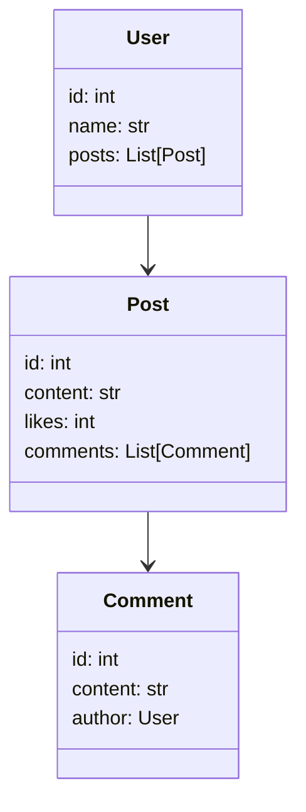

                 


# 智能体协作分析社交媒体数据：捕捉市场情绪变化

## 关键词
- 社交媒体数据
- 市场情绪
- 智能体协作
- 情感分析
- 数据挖掘
- 自然语言处理

## 摘要
社交媒体数据的爆炸式增长为市场情绪分析提供了丰富的信息源，而智能体协作技术为高效分析这些数据提供了新的可能性。本文将详细介绍智能体协作在社交媒体数据分析中的应用，探讨市场情绪分析的核心算法、系统架构设计以及实际项目实现。通过理论与实践相结合，本文为读者提供一套捕捉市场情绪变化的完整解决方案。

---

## 第一部分：背景与概述

### 第1章：智能体协作与社交媒体数据分析

#### 1.1 智能体协作的背景与意义
- **1.1.1 智能体协作的基本概念**
  - 智能体（Agent）是指具有感知环境、做出决策并采取行动的实体。
  - 智能体协作是指多个智能体通过合作完成复杂任务的过程。
  - 在社交媒体数据分析中，智能体协作可以分布式处理海量数据，提高分析效率。

- **1.1.2 社交媒体数据的特点与挑战**
  - 数据量大：每天产生的社交媒体数据超过数十亿条。
  - 数据类型多样：包括文本、图片、视频、用户行为数据等。
  - 数据实时性高：市场情绪的变化往往即时发生。

- **1.1.3 智能体协作在社交媒体分析中的优势**
  - 分布式计算：利用多智能体协同处理数据，避免单点故障。
  - 实时响应：通过智能体的实时协作，快速捕捉市场情绪变化。

#### 1.2 市场情绪分析的重要性
- **1.2.1 市场情绪的定义与分类**
  - 市场情绪是指市场参与者（如投资者、消费者）对某一事件、产品或市场的心理状态。
  - 常见分类：积极情绪、消极情绪、中性情绪。

- **1.2.2 社交媒体对市场情绪的影响**
  - 社交媒体已成为市场情绪的主要来源之一。
  - 情感传播速度快，影响范围广。

- **1.2.3 情绪分析在投资决策中的应用**
  - 帮助投资者识别市场趋势。
  - 通过分析社交媒体数据，提前捕捉市场波动。

---

## 第二部分：核心概念与联系

### 第2章：智能体协作的核心概念

#### 2.1 智能体协作的原理
- **2.1.1 智能体的定义与特征**
  - 智能体具有自主性、反应性、目标性和协作性。
  - 自主性：智能体能够独立决策。
  - 反应性：智能体能够感知环境并做出反应。
  - 目标性：智能体有明确的目标。
  - 协作性：智能体能够与其他智能体协作完成任务。

- **2.1.2 协作机制的类型**
  - 基于规则的协作：通过预定义的规则进行协作。
  - 基于意图的协作：通过共享意图和目标进行协作。
  - 基于学习的协作：通过机器学习模型动态调整协作策略。

- **2.1.3 智能体协作的数学模型**
  - 协作模型：$C = \sum_{i=1}^{n} \text{Agent}_i$
  - 通信模型：$M = \{ \text{Message}_1, \text{Message}_2, ..., \text{Message}_m \}$

#### 2.2 市场情绪分析的模型
- **2.2.1 基于文本的情感分析**
  - 使用自然语言处理技术分析文本情感。
  - 常见模型：词袋模型、词嵌入模型（如Word2Vec）。

- **2.2.2 基于网络的传播分析**
  - 分析情绪在社交网络中的传播路径。
  - 常见算法：广度优先搜索、情感传播网络模型。

- **2.2.3 综合分析模型**
  - 结合文本分析和网络传播的综合模型。
  - 例如：结合情感强度和传播速度进行综合评分。

### 第3章：核心概念的联系与对比

#### 3.1 智能体协作与市场情绪分析的关系
- **3.1.1 智能体协作如何影响情绪分析**
  - 多智能体协同处理数据，提高分析效率。
  - 智能体协作可以分布式分析社交媒体数据，避免单点计算压力。

- **3.1.2 情绪分析如何反哺协作过程**
  - 情绪分析结果可以作为智能体协作的反馈，优化协作策略。

#### 3.2 对比分析
- **3.2.1 不同协作机制的优缺点对比**
| 协作机制 | 优点 | 缺点 |
|----------|------|------|
| 基于规则 | 实现简单 | 灵活性差 |
| 基于意图 | 灵活性高 | 实现复杂 |
| 基于学习 | 自适应性强 | 需大量数据训练 |

- **3.2.2 不同情绪分析方法的适用场景**
| 分析方法 | 适用场景 | 示例 |
|----------|-----------|------|
| 基于规则 | 数据量小，规则明确 | 检测特定关键词的情绪 |
| 基于统计 | 数据量适中 | 适合小规模分析 |
| 基于深度学习 | 数据量大，复杂性高 | 实时情绪分析 |

---

## 第三部分：算法原理讲解

### 第4章：市场情绪分析算法

#### 4.1 情感分析算法
- **4.1.1 基于规则的情感分析**
  - 示例：通过预定义的关键词库进行情感分类。
  - 代码示例：
    ```python
    import nltk
    from nltk.sentiment import SentimentIntensityAnalyzer

    analyzer = SentimentIntensityAnalyzer()
    sentiment = analyzer.polarity_scores("This product is great!")
    print(sentiment)
    ```

- **4.1.2 统计学习方法**
  - 示例：使用朴素贝叶斯分类器进行情感分类。
  - 代码示例：
    ```python
    from sklearn.feature_extraction.text import TfidfVectorizer
    from sklearn.naive_bayes import MultinomialNB

    vectorizer = TfidfVectorizer()
    X = vectorizer.fit_transform(corpus)
    clf = MultinomialNB().fit(X, y)
    ```

- **4.1.3 深度学习模型（如LSTM、BERT）**
  - 示例：使用BERT进行情感分类。
  - 代码示例：
    ```python
    from transformers import BertTokenizer, BertForSequenceClassification
    from torch.utils.data import DataLoader, Dataset

    tokenizer = BertTokenizer.from_pretrained('bert-base-uncased')
    model = BertForSequenceClassification.from_pretrained('bert-base-uncased')
    ```

#### 4.2 情感传播算法
- **4.2.1 情感传播的基本原理**
  - 示例：使用广度优先搜索（BFS）进行情感传播。
  - 代码示例：
    ```python
    def bfs_spread(initial_users):
        visited = set()
        queue = deque(initial_users)
        while queue:
            user = queue.popleft()
            if user not in visited:
                visited.add(user)
                for neighbor in graph[user]:
                    if neighbor not in visited:
                        queue.append(neighbor)
        return visited
    ```

- **4.2.2 情感传播的优化**
  - 示例：基于权重的传播算法。
  - 代码示例：
    ```python
    def weighted_spread(graph, initial_users):
        import math
        import heapq

        heap = []
        visited = {}
        for user in initial_users:
            visited[user] = 1.0
            heapq.heappush(heap, (-1.0, user))
        while heap:
            current_score, current_user = heapq.heappop(heap)
            current_score = -current_score
            for neighbor in graph[current_user]:
                if neighbor not in visited or visited[neighbor] < current_score * 0.8:
                    new_score = current_score * 0.8
                    visited[neighbor] = new_score
                    heapq.heappush(heap, (-new_score, neighbor))
        return visited
    ```

---

## 第四部分：系统分析与架构设计方案

### 第5章：系统分析与架构设计

#### 5.1 问题场景介绍
- 系统目标：实时分析社交媒体数据，捕捉市场情绪变化。
- 使用场景：金融投资、市场营销、舆情监控。

#### 5.2 系统功能设计
- 数据采集模块：实时采集社交媒体数据。
- 数据预处理模块：清洗和转换数据。
- 情绪分析模块：基于智能体协作进行情感分析。
- 结果展示模块：可视化分析结果。

#### 5.3 系统架构设计
- **5.3.1 领域模型（Mermaid 类图）**


- **5.3.2 系统架构（Mermaid 架构图）**


---

## 第五部分：项目实战

### 第6章：项目实战与代码实现

#### 6.1 环境安装
- 安装Python和必要的库：
  ```bash
  pip install numpy pandas scikit-learn transformers
  ```

#### 6.2 核心代码实现
- 数据采集：
  ```python
  import tweepy
  from tweepy import OAuthHandler

  consumer_key = 'your_consumer_key'
  consumer_secret = 'your_consumer_secret'
  access_token = 'your_access_token'
  access_secret = 'your_access_secret'

  auth = OAuthHandler(consumer_key, consumer_secret)
  api = tweepy.API(auth)

  def get_tweets(query, max_tweets=100):
      tweets = []
      for tweet in tweepy.Cursor(api.search, query=query).items(max_tweets):
          tweets.append(tweet.text)
      return tweets
  ```

- 情感分析：
  ```python
  from transformers import pipeline

  classifier = pipeline("sentiment-analysis")
  print(classifier("This product is great!"))  # Output: {'label': 'POSITIVE', 'score': 0.999}
  ```

#### 6.3 实际案例分析
- 案例：分析某一品牌的社交媒体舆情。
  - 数据采集：获取品牌相关的推文和评论。
  - 数据分析：使用智能体协作进行情感分析。
  - 结果展示：生成舆情报告，可视化分析结果。

---

## 第六部分：最佳实践

### 第7章：总结与展望

#### 7.1 小结
- 智能体协作与社交媒体数据分析的结合为市场情绪分析提供了新思路。
- 通过分布式计算和情感传播模型，可以更高效地捕捉市场情绪变化。

#### 7.2 注意事项
- 数据隐私问题：确保数据采集和分析符合隐私保护法规。
- 情绪分析的准确性：需要不断优化算法，提高分析精度。
- 实时性问题：需要优化系统架构，提高处理效率。

#### 7.3 未来研究方向
- 深度学习与智能体协作的结合。
- 多模态数据的情感分析。
- 情绪传播的动态建模。

#### 7.4 扩展阅读
- 推荐书籍：《自然语言处理实战》、《分布式系统与智能协作》。
- 推荐工具：Hugging Face Transformers、Apache Spark。

---

## 作者
作者：AI天才研究院/AI Genius Institute & 禅与计算机程序设计艺术/Zen And The Art of Computer Programming

---

以上是《智能体协作分析社交媒体数据：捕捉市场情绪变化》的完整目录大纲和文章内容。希望这篇文章能够为读者提供一个清晰的思路，从理论到实践，全面掌握智能体协作分析社交媒体数据的方法。

