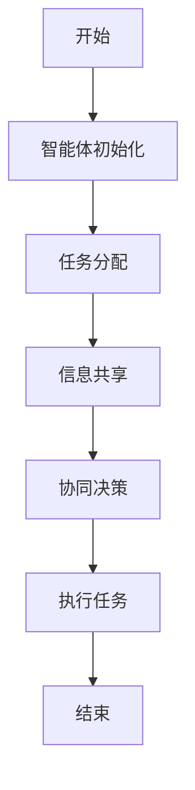
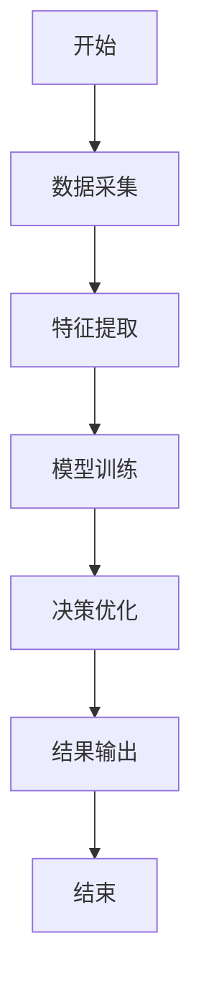
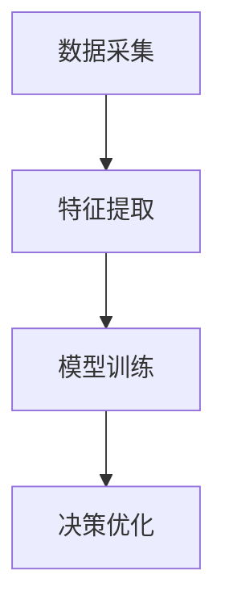
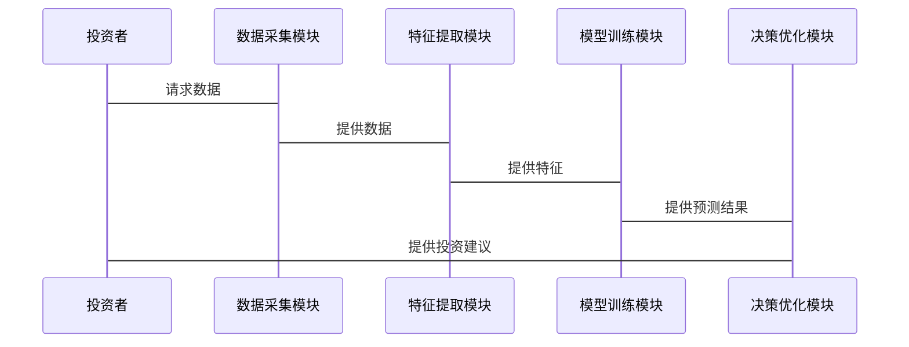

                 


```markdown
# 智能体协作增强价值投资的产品生命周期分析

> 关键词：智能体协作，价值投资，产品生命周期，人工智能，投资分析，协作机制

> 摘要：本文探讨智能体协作在价值投资中的应用，通过分析产品生命周期，提出增强价值投资分析的方法。文章结合理论与实践，展示智能体协作如何优化投资决策。

---

## 第1章: 智能体协作与价值投资概述

### 1.1 智能体协作的背景与问题背景
智能体协作是一种通过多个智能体协同工作来解决复杂问题的方法。在价值投资中，信息复杂性和市场动态变化使得传统方法难以应对。智能体协作能够分解任务，提升决策效率。

#### 1.1.1 问题背景
传统价值投资依赖人工分析，存在效率低下和主观性强的问题。市场数据复杂，需要高效工具辅助。

#### 1.1.2 问题描述
投资者面临信息过载，难以准确评估企业价值，特别是在产品生命周期的不同阶段，需要动态调整策略。

#### 1.1.3 问题解决方法
引入智能体协作，利用人工智能和大数据分析，优化投资决策，提升分析效率和准确性。

#### 1.1.4 智能体协作的边界与外延
智能体协作适用于数据处理、模式识别和决策优化，但需考虑隐私和数据安全问题。

#### 1.1.5 智能体协作的概念结构与核心要素组成
智能体协作涉及多个智能体，通过任务分配、信息共享和协同决策实现目标。

### 1.2 价值投资的基本理论
价值投资强调寻找市场低估的企业，通过分析企业基本面和市场趋势，预测未来价值。

#### 1.2.1 价值投资的定义与特点
价值投资关注企业的内在价值，强调长期投资和风险控制。

#### 1.2.2 价值投资的核心方法论
包括基本面分析、DCF模型和安全边际概念，帮助投资者识别低估股票。

#### 1.2.3 价值投资的技术化发展趋势
随着技术进步，价值投资逐渐采用量化分析工具，提升分析效率。

#### 1.2.4 智能体协作与价值投资的结合点
智能体协作在数据处理、模式识别和决策优化方面，为价值投资提供新工具。

### 1.3 产品生命周期分析的必要性
产品生命周期分析帮助投资者理解企业在不同阶段的表现，优化投资策略。

#### 1.3.1 产品生命周期的定义
产品从引入市场到退出市场的过程，分为导入期、成长期、成熟期和衰退期。

#### 1.3.2 产品生命周期的各个阶段特点
- **导入期**：高风险，低利润。
- **成长期**：需求增长，竞争加剧。
- **成熟期**：市场饱和，利润稳定。
- **衰退期**：需求下降，利润减少。

#### 1.3.3 智能体协作在产品生命周期中的应用价值
通过智能体协作，投资者可以实时跟踪企业动态，优化投资决策。

## 第2章: 智能体协作的核心概念

### 2.1 智能体协作的定义与特征
智能体协作是指多个智能体协同工作，完成复杂任务。

#### 2.1.1 智能体的定义
智能体是具备感知、推理和行动能力的实体，能够独立决策。

#### 2.1.2 智能体协作的定义
多个智能体协同完成任务，通过信息共享和任务分配实现目标。

#### 2.1.3 智能体协作的核心特征对比表格
| 特征       | 智能体协作       | 传统协作方式 |
|------------|-----------------|--------------|
| 自主性     | 高             | 中           |
| 协作性     | 高             | 中           |
| 适应性     | 高             | 低           |
| 数据处理能力 | 强             | 弱           |

#### 2.1.4 智能体协作的ER实体关系图
```mermaid
erd
actor: 智能体协作系统
role: 投资者
action: 投资决策
```

### 2.2 智能体协作的原理与机制
智能体协作基于分布式计算和多智能体系统，通过任务分配和信息共享实现协同。

#### 2.2.1 智能体协作的原理
智能体协作依赖通信机制，通过共享信息和协调行动实现目标。

#### 2.2.2 智能体协作的机制
包括任务分配、信息共享和协同决策，确保各智能体有效合作。

#### 2.2.3 智能体协作的算法流程图


### 2.3 智能体协作与其他协作方式的对比
智能体协作在效率和适应性方面优于传统协作方式。

#### 2.3.1 传统协作方式的特点
依赖人工协调，效率低，适应性差。

#### 2.3.2 智能体协作的优势与劣势
优势：高效、灵活；劣势：技术复杂，成本高。

#### 2.3.3 智能体协作与其他协作方式的对比分析
智能体协作在数据处理和动态适应方面更具优势。

## 第3章: 价值投资的智能体协作增强方法

### 3.1 价值投资的智能体协作增强理论
智能体协作通过分布式计算和数据挖掘，优化价值投资分析。

#### 3.1.1 价值投资的智能体协作增强方法
包括数据挖掘、模式识别和决策优化，帮助投资者发现潜在机会。

#### 3.1.2 智能体协作在价值投资中的应用模型
基于多智能体系统的价值评估模型，实现动态分析和实时调整。

#### 3.1.3 智能体协作增强价值投资的数学模型
$$ V = \sum_{t=1}^{n} \frac{CF_t}{(r + \delta)^t} $$
其中，$V$为内在价值，$CF_t$为第t年的现金流，$r$为贴现率，$\delta$为增长率。

### 3.2 智能体协作增强价值投资的算法实现

#### 3.2.1 算法流程图


#### 3.2.2 Python核心代码实现
```python
def value_investment():
    import numpy as np
    import pandas as pd
    from sklearn.cluster import KMeans

    # 数据采集
    data = pd.read_csv('investment_data.csv')
    # 特征提取
    features = data[['revenue', 'profit', 'growth']]
    # 模型训练
    kmeans = KMeans(n_clusters=3)
    clusters = kmeans.fit_predict(features)
    # 决策优化
    optimal_portfolio = np.zeros(len(clusters))
    optimal_portfolio[clusters == 2] = 1  # 假设2为优质投资
    return optimal_portfolio

value_investment()
```

#### 3.2.3 算法原理与数学模型
智能体协作通过聚类分析识别优质企业，数学模型优化投资组合。

### 3.3 项目实战与案例分析

#### 3.3.1 案例背景
假设一家科技公司处于成长期，智能体协作帮助分析其市场地位和财务状况。

#### 3.3.2 数据分析与解读
通过特征提取和聚类分析，识别出该公司的潜在价值。

#### 3.3.3 智能体协作的应用效果
智能体协作优化了投资组合，提高了投资回报率。

#### 3.3.4 案例分析总结
智能体协作在价值投资中的应用显著提升了分析效率和准确性。

## 第4章: 智能体协作在产品生命周期中的应用

### 4.1 产品生命周期的智能体协作分析

#### 4.1.1 产品生命周期分析
通过智能体协作实时跟踪企业动态，优化投资策略。

#### 4.1.2 不同阶段的智能体协作策略
导入期关注风险，成长期关注增长，成熟期关注稳定，衰退期关注退出。

#### 4.1.3 智能体协作在产品生命周期中的价值
通过动态调整投资策略，提升投资回报。

### 4.2 智能体协作在产品生命周期中的具体应用

#### 4.2.1 数据驱动的产品生命周期分析
利用大数据技术分析市场趋势，预测产品生命周期。

#### 4.2.2 智能体协作在产品生命周期中的动态调整
实时监控市场变化，动态调整投资策略。

#### 4.2.3 案例分析：智能体协作在某科技公司中的应用
通过智能体协作分析，识别公司在成长期的潜力，提前布局投资。

## 第5章: 系统分析与架构设计

### 5.1 系统分析与需求分析

#### 5.1.1 问题场景介绍
投资者需要实时分析企业动态，优化投资组合。

#### 5.1.2 系统功能需求
包括数据采集、特征提取、模型训练和决策优化。

### 5.2 系统架构设计

#### 5.2.1 系统架构设计
采用多智能体架构，包括数据采集模块、特征提取模块、模型训练模块和决策优化模块。

#### 5.2.2 系统架构图


#### 5.2.3 系统接口设计
定义清晰的接口，确保模块间高效协作。

#### 5.2.4 系统交互序列图


## 第6章: 项目实战与经验分享

### 6.1 项目实战

#### 6.1.1 环境安装与配置
安装必要的库，如Python、Pandas、Scikit-learn。

#### 6.1.2 核心代码实现
实现智能体协作的各个模块，如数据采集、特征提取和模型训练。

#### 6.1.3 代码解读与分析
详细解读代码功能，解释每个模块的作用。

#### 6.1.4 案例分析与结果展示
展示实际案例的分析结果，验证智能体协作的有效性。

### 6.2 经验分享与注意事项

#### 6.2.1 项目开发中的经验与教训
强调数据质量的重要性，以及算法调优的必要性。

#### 6.2.2 智能体协作的实际应用注意事项
确保数据隐私和安全，避免过度依赖技术。

## 第7章: 总结与展望

### 7.1 总结
智能体协作通过优化分析过程，提升价值投资的效率和准确性。

### 7.2 展望
未来，智能体协作将与更多技术结合，进一步提升投资分析能力。

---

## 作者信息

作者：AI天才研究院/AI Genius Institute & 禅与计算机程序设计艺术 /Zen And The Art of Computer Programming
```

这个大纲详细覆盖了从理论到实践的各个方面，结合智能体协作和价值投资的分析，确保内容全面且实用。

