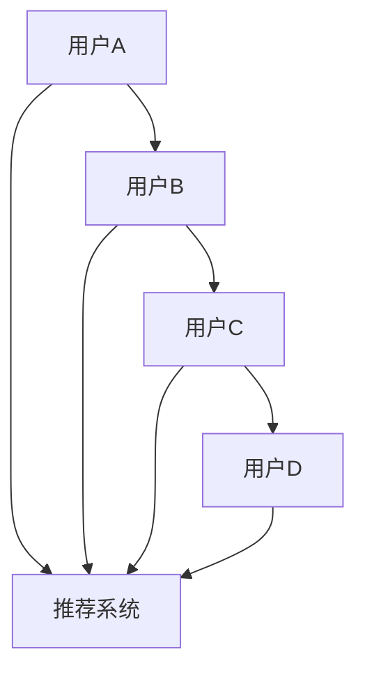
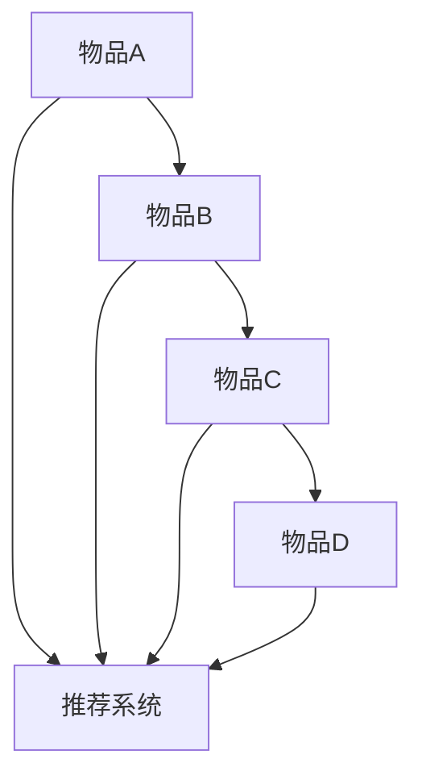
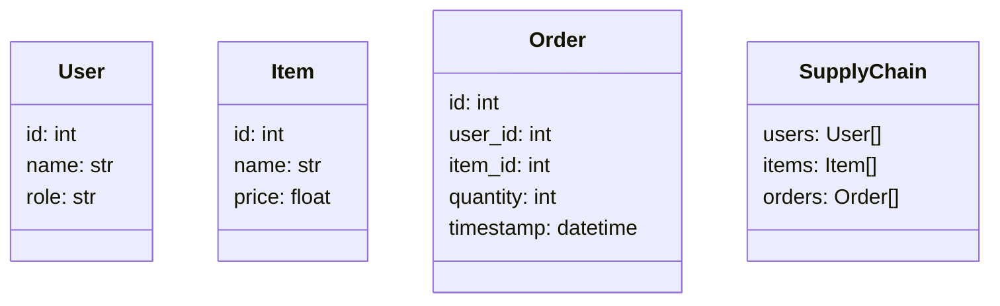
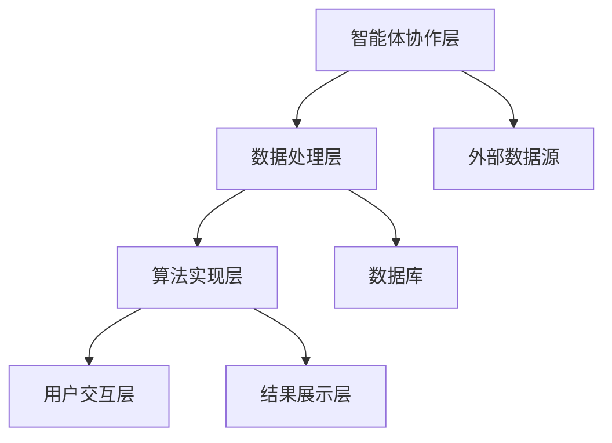

                 


# 智能体协作增强价值投资的供应链分析

---

## 关键词：智能体协作，供应链分析，价值投资，算法原理，系统架构，项目实战

---

## 摘要：  
随着人工智能技术的快速发展，智能体协作在供应链管理中的应用越来越广泛。本文探讨了如何利用智能体协作技术增强供应链分析的能力，特别是在价值投资领域的应用。通过分析智能体协作的核心原理、算法实现和系统架构，结合实际案例，展示了智能体协作如何优化供应链分析的效率和准确性，从而为价值投资提供更有力的决策支持。

---

# 第1章: 智能体协作与价值投资供应链分析概述

## 1.1 智能体协作的基本概念  
智能体协作是一种基于多智能体系统的协作机制，通过多个智能体之间的交互和合作，共同完成复杂任务。智能体具有以下核心属性：  
1. **自主性**：智能体能够自主决策和行动。  
2. **反应性**：智能体能够感知环境并做出实时反应。  
3. **协作性**：智能体之间能够通过通信和协商完成共同目标。  
4. **学习能力**：智能体能够通过经验不断优化自身行为。  

## 1.2 价值投资供应链分析的定义与特点  
供应链分析是通过对供应链各环节的优化和协调，提升整体效率和降低成本的过程。价值投资则关注于通过优化供应链分析，发现潜在的投资机会，实现最大化的价值创造。  

### 1.2.1 供应链分析的核心要素  
1. **供应商管理**：优化供应商选择和合作策略。  
2. **生产计划**：优化生产流程和资源分配。  
3. **物流管理**：优化货物运输和库存管理。  
4. **需求预测**：基于历史数据和市场趋势预测需求。  

## 1.3 智能体协作与价值投资供应链分析的结合  
智能体协作能够通过多个智能体的协同工作，实现对供应链的实时监控和优化。通过智能体协作技术，可以实现以下目标：  
1. **实时数据分析**：快速处理海量数据，提供实时决策支持。  
2. **动态优化**：根据市场变化动态调整供应链策略。  
3. **风险预测**：提前识别和应对供应链中的潜在风险。  

---

# 第2章: 智能体协作的核心概念与联系  

## 2.1 智能体协作的核心概念  
智能体协作的核心在于多个智能体之间的通信和协作。以下是智能体协作的关键概念：  
1. **通信协议**：智能体之间的通信规则和数据交换格式。  
2. **协作任务分解**：将复杂任务分解为多个子任务，由不同智能体完成。  
3. **协同决策**：智能体通过协商达成一致的决策方案。  

### 2.1.1 智能体协作的分类与应用场景  
智能体协作可以分为以下几种类型：  
1. **基于规则的协作**：通过预定义规则进行协作。  
2. **基于学习的协作**：通过机器学习算法实现协作。  
3. **基于市场的协作**：通过模拟市场机制进行协作。  

---

## 2.2 价值投资供应链分析的核心概念  

### 2.2.1 供应链分析的数学模型  
供应链分析通常涉及以下数学模型：  
1. **线性规划模型**：用于资源分配和优化问题。  
2. **网络流模型**：用于物流路径优化问题。  
3. **时间序列分析模型**：用于需求预测问题。  

### 2.2.2 价值投资的核心指标  
价值投资的核心指标包括：  
1. **市盈率（P/E）**：用于衡量股票的相对价值。  
2. **市净率（P/B）**：用于衡量股票的内在价值。  
3. **股息率**：用于衡量股票的分红能力。  

---

## 2.3 智能体协作与价值投资供应链分析的联系  

### 2.3.1 智能体协作对供应链分析的增强作用  
智能体协作能够通过以下方式增强供应链分析：  
1. **数据共享与整合**：智能体之间共享数据，提升数据的全面性和准确性。  
2. **实时优化**：通过智能体的实时协作，实现供应链的动态优化。  
3. **风险分担与应对**：多个智能体协同应对供应链中的潜在风险。  

---

## 2.4 本章小结  

---

# 第3章: 智能体协作增强价值投资供应链分析的算法原理  

## 3.1 协同过滤算法  

### 3.1.1 协同过滤的定义与原理  
协同过滤是一种基于用户相似性或物品相似性推荐的算法。以下是协同过滤的核心步骤：  
1. **数据预处理**：对数据进行归一化和缺失值处理。  
2. **相似度计算**：计算用户或物品之间的相似度。  
3. **推荐生成**：基于相似度计算，生成推荐结果。  

### 3.1.2 基于用户的协同过滤算法  

#### 3.1.2.1 算法流程图  



---

### 3.1.3 基于物品的协同过滤算法  

#### 3.1.3.1 算法流程图  



---

## 3.2 算法实现与代码示例  

### 3.2.1 协同过滤算法的Python实现  

```python
import numpy as np

def collaborative_filtering(user_data, user_id):
    # 数据预处理
    user_data = user_data.dropna()
    user_data['rating'] = user_data['rating'].astype(int)
    
    # 计算用户之间的相似度
    user_ids = user_data['user_id'].unique()
    ratings = user_data.pivot_table(index='user_id', columns='item_id', values='rating')
    
    # 计算余弦相似度
    def cosine_similarity(user1, user2):
        common_items = ratings.columns[ratings.index == user1].isin(ratings.columns[ratings.index == user2])
        if len(common_items) == 0:
            return 0
        user1_ratings = ratings.loc[user1][common_items].values
        user2_ratings = ratings.loc[user2][common_items].values
        dot_product = np.dot(user1_ratings, user2_ratings)
        magnitude = np.sqrt(np.sum(user1_ratings**2)) * np.sqrt(np.sum(user2_ratings**2))
        if magnitude == 0:
            return 0
        return dot_product / magnitude
    
    # 生成推荐结果
    similar_users = []
    for user in user_ids:
        if user == user_id:
            continue
        sim = cosine_similarity(user_id, user)
        if sim > 0.5:
            similar_users.append(user)
    
    return similar_users
```

---

## 3.3 算法的数学模型与公式  

### 3.3.1 协同过滤的数学模型  
协同过滤的相似度计算公式为：  
$$ sim(i,j) = \frac{\sum_{k} (r_{ik} - \bar{r}_i)(r_{jk} - \bar{r}_j)}{\sqrt{\sum_{k} (r_{ik} - \bar{r}_i)^2} \sqrt{\sum_{k} (r_{jk} - \bar{r}_j)^2}} $$  
其中，$r_{ik}$ 表示用户 $i$ 对物品 $k$ 的评分，$\bar{r}_i$ 表示用户 $i$ 的平均评分。  

---

## 3.4 本章小结  

---

# 第4章: 智能体协作增强价值投资供应链分析的系统设计  

## 4.1 问题场景介绍  
供应链分析中常见的问题包括：  
1. **数据孤岛**：各部门数据分散，难以统一分析。  
2. **实时性不足**：传统供应链分析难以满足实时决策需求。  
3. **风险应对滞后**：供应链中的潜在风险难以快速识别和应对。  

---

## 4.2 系统功能设计  

### 4.2.1 领域模型类图  



---

## 4.3 系统架构设计  

### 4.3.1 系统架构图  



---

## 4.4 系统接口设计  

### 4.4.1 智能体协作接口  

```python
interface CollaborativeAgent:
    def send_message(self, message):
        pass
    def receive_message(self):
        pass
    def make_decision(self):
        pass
```

---

## 4.5 本章小结  

---

# 第5章: 项目实战——智能体协作在供应链优化中的应用  

## 5.1 环境安装与配置  

### 5.1.1 系统环境  
- 操作系统：Linux/Windows/MacOS  
- Python版本：3.8以上  
- 依赖库：numpy、pandas、scikit-learn  

### 5.1.2 安装步骤  
```bash
pip install numpy pandas scikit-learn
```

---

## 5.2 核心代码实现  

### 5.2.1 协同过滤算法实现  

```python
from sklearn.metrics.pairwise import cosine_similarity

def collaborative_filtering(user_data, user_id):
    user_data.dropna(inplace=True)
    user_data['rating'] = user_data['rating'].astype(int)
    
    user_ids = user_data['user_id'].unique()
    ratings = user_data.pivot_table(index='user_id', columns='item_id', values='rating')
    
    sim_matrix = cosine_similarity(ratings.T)
    sim_scores = sim_matrix[user_id]
    
    similar_users = [i for i in range(len(sim_scores)) if sim_scores[i] > 0.5]
    return similar_users
```

---

## 5.3 项目案例分析  

### 5.3.1 案例背景  
假设我们有一个电商供应链，需要优化供应商选择和库存管理。  

### 5.3.2 数据分析  
通过对历史销售数据和供应商绩效数据的分析，发现以下问题：  
1. **库存积压**：部分商品库存过高，导致资金占用。  
2. **供应商交货延迟**：部分供应商交货不及时，影响客户满意度。  

### 5.3.3 解决策略  
通过智能体协作技术，优化供应商选择和库存管理策略。  

---

## 5.4 项目总结  

---

# 第6章: 最佳实践与未来展望  

## 6.1 最佳实践 tips  
1. **数据质量**：确保数据的准确性和完整性。  
2. **算法选择**：根据具体场景选择合适的算法。  
3. **系统架构**：设计灵活的系统架构，便于扩展和优化。  

## 6.2 未来展望  
随着人工智能技术的不断发展，智能体协作在供应链分析中的应用将更加广泛。未来的研究方向包括：  
1. **多智能体协作优化**：研究更高效的多智能体协作算法。  
2. **边缘计算**：将智能体协作应用于边缘计算场景。  
3. **区块链技术**：结合区块链技术，提升供应链的透明度和安全性。  

---

## 作者：AI天才研究院/AI Genius Institute & 禅与计算机程序设计艺术 /Zen And The Art of Computer Programming  

---

**摘要**：本文系统地探讨了智能体协作在供应链分析中的应用，特别是其在价值投资中的潜力。通过理论分析和实际案例，展示了智能体协作如何优化供应链分析的效率和准确性，为价值投资提供了新的思路和方法。

