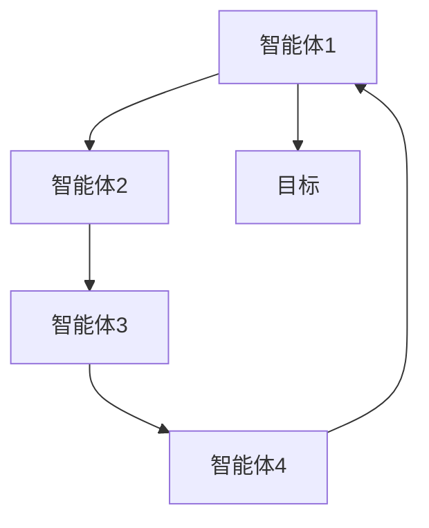
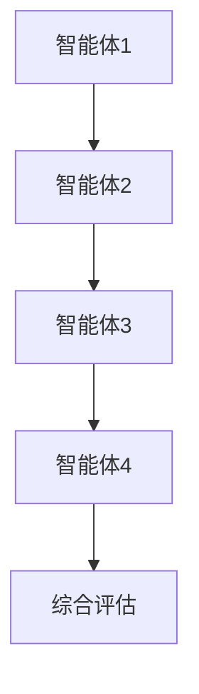
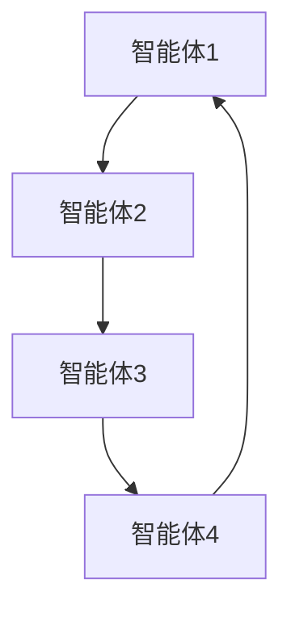
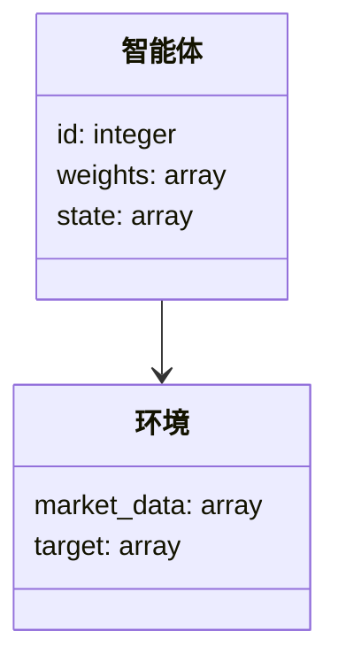
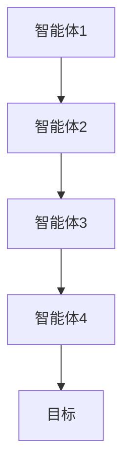

                 


# 智能体协作增强价值投资的市场份额预测

> 关键词：智能体协作，价值投资，市场份额预测，强化学习，系统架构设计

> 摘要：本文探讨了智能体协作在价值投资中的应用，特别是如何通过协作智能体来增强市场份额预测的准确性。文章首先介绍了智能体协作的基本概念和价值投资的核心原理，然后详细阐述了协作智能体的算法框架和数学模型，最后通过实际案例展示了如何在项目中实现这些算法，并提出了相关的最佳实践和未来研究方向。

---

## 第1章 智能体协作与价值投资的背景介绍

### 1.1 智能体协作的概念与背景
#### 1.1.1 智能体协作的定义
智能体协作是指多个智能体（Agent）通过共享信息、协同决策和协作行动，共同完成复杂任务的过程。智能体可以是软件程序、算法或其他具备自主决策能力的实体。

#### 1.1.2 价值投资的基本原理
价值投资是一种投资策略，旨在通过分析企业的基本面，如财务状况、市场地位和管理团队，来寻找被市场低估的投资标的。其核心在于发现市场的非理性定价，并从中获利。

#### 1.1.3 智能体协作在价值投资中的应用前景
智能体协作能够通过分布式计算和数据共享，帮助投资者更高效地分析市场数据，识别潜在的投资机会，并优化投资组合。

### 1.2 问题背景与描述
#### 1.2.1 传统价值投资的局限性
传统价值投资依赖于个体分析师的经验和能力，存在信息不对称、分析效率低和决策主观性强等问题。

#### 1.2.2 市场份额预测的挑战
市场份额预测需要综合考虑市场趋势、竞争对手策略和消费者行为等多种因素，传统方法难以捕捉复杂市场动态。

#### 1.2.3 智能体协作如何解决这些问题
通过智能体协作，可以实现数据的实时共享、模型的分布式计算和决策的集体优化，从而提高分析的准确性和效率。

### 1.3 智能体协作的核心要素
#### 1.3.1 智能体的基本属性
- **自主性**：智能体能够自主决策。
- **反应性**：智能体能够根据环境变化调整行为。
- **协作性**：智能体能够与其他智能体协作完成任务。

#### 1.3.2 协作机制的分类
- **基于规则的协作**：通过预定义的规则进行协作。
- **基于学习的协作**：通过强化学习等方法动态调整协作策略。
- **基于市场的协作**：通过模拟市场机制进行资源分配。

#### 1.3.3 价值投资中的关键指标
- **市盈率（P/E）**：衡量股票价格与盈利的关系。
- **市净率（P/B）**：衡量股票价格与资产净值的关系。
- **ROE（净资产收益率）**：衡量企业的盈利能力。

### 1.4 本章小结
本章介绍了智能体协作和价值投资的基本概念，并分析了智能体协作在价值投资中的应用前景。下一章将详细探讨智能体协作与价值投资的核心概念及其相互关系。

---

## 第2章 智能体协作与价值投资的核心概念

### 2.1 智能体协作的原理
#### 2.1.1 分布式协作算法的基本原理
分布式协作算法通过智能体之间的通信和协调，实现任务的分解与重构。常见的算法包括分布式优化算法和多智能体强化学习。

#### 2.1.2 协作规则的制定与优化
协作规则需要根据具体任务和环境进行定制化设计，并通过不断优化规则参数来提高协作效率。

#### 2.1.3 智能体之间的信息传递机制
智能体之间通过消息传递、共享数据库或中间件等方式进行信息交互。

#### 2.1.4 使用 Mermaid 绘制协作流程图


### 2.2 价值投资与市场份额预测的关系
#### 2.2.1 价值投资的核心逻辑
价值投资通过分析企业的内在价值，寻找市场价格低于内在价值的投资机会。

#### 2.2.2 市场份额预测的数学模型
市场份额预测可以通过回归分析、时间序列分析等方法进行建模。

#### 2.2.3 智能体协作如何增强价值投资的效果
通过智能体协作，可以实现多维度数据的整合分析，提高价值评估的准确性和全面性。

#### 2.2.4 使用 Mermaid 绘制实体关系图
```mermaid
erDiagram
    customer
    {
        id: integer
        name: string
        investment: decimal
    }
    stock
    {
        id: integer
        name: string
        price: decimal
        market_share: decimal
    }
    transaction
    {
        id: integer
        time: datetime
        amount: decimal
    }
    customer *--- transaction
    stock *--- transaction
```

### 2.3 智能体协作与价值投资的联系
#### 2.3.1 智能体协作在价值评估中的应用
智能体协作可以通过分布式计算和数据共享，提高价值评估的效率和准确性。

#### 2.3.2 市场份额预测的协作流程


#### 2.3.3 智能体协作的优势与局限性
- **优势**：提高效率、增强鲁棒性、实现分布式计算。
- **局限性**：依赖通信机制、存在协作冲突、需要处理复杂性。

### 2.4 本章小结
本章详细探讨了智能体协作与价值投资的核心概念及其相互关系。下一章将重点介绍协作智能体的算法原理及其在价值投资中的应用。

---

## 第3章 智能体协作的算法原理

### 3.1 协作智能体的算法框架
#### 3.1.1 分布式协作算法的基本原理
分布式协作算法通过智能体之间的通信和协调，实现任务的分解与重构。

#### 3.1.2 基于强化学习的协作机制
强化学习是一种通过试错方式优化决策策略的算法。在协作智能体中，每个智能体通过与其他智能体的互动，逐步优化自身的决策策略。

#### 3.1.3 协作智能体的通信协议
协作智能体之间的通信需要遵循特定的协议，以确保信息的有效传递和处理。

#### 3.1.4 使用 Mermaid 绘制算法流程图


### 3.2 价值投资的数学模型
#### 3.2.1 市场份额预测的数学公式
市场份额预测可以通过回归分析或时间序列分析等方法进行建模。

#### 3.2.2 价值评估的优化模型
价值评估可以通过优化模型来实现，例如线性回归模型或随机森林模型。

#### 3.2.3 智能体协作的数学表达
协作智能体的决策可以通过数学表达式进行描述，例如：
$$
v_i = \sum_{j=1}^{n} w_{ij} \cdot x_j
$$
其中，$v_i$ 是智能体i的决策值，$w_{ij}$ 是权重，$x_j$ 是输入变量。

### 3.3 算法实现与优化
#### 3.3.1 算法实现的步骤
1. 初始化智能体参数。
2. 迭代更新智能体的决策策略。
3. 计算协作结果并优化算法。

#### 3.3.2 基于强化学习的优化策略
通过强化学习，智能体可以逐步优化其决策策略，从而提高协作效率。

#### 3.3.3 算法的性能评估
算法的性能可以通过准确率、召回率和F1分数等指标进行评估。

#### 3.3.4 使用 Python 实现协作算法
```python
import numpy as np
import pandas as pd

class Agent:
    def __init__(self, weights):
        self.weights = weights

    def decide(self, state):
        return np.dot(state, self.weights)

# 初始化智能体
agent = Agent(np.random.rand(5,1))

# 迭代更新权重
for _ in range(100):
    state = np.random.rand(5,1)
    action = agent.decide(state)
    # 更新权重
    agent.weights += 0.1 * (action - np.mean(action))
```

### 3.4 本章小结
本章详细介绍了协作智能体的算法原理及其在价值投资中的应用。下一章将重点分析系统的整体设计与实现。

---

## 第4章 智能体协作系统的分析与设计

### 4.1 系统功能设计
#### 4.1.1 领域模型设计
通过领域模型，可以清晰地描述系统的各个组成部分及其交互关系。

#### 4.1.2 使用 Mermaid 绘制领域模型类图


#### 4.1.3 系统架构设计
系统的架构设计需要考虑可扩展性、可维护性和性能优化。

### 4.2 系统架构设计
#### 4.2.1 使用 Mermaid 绘制系统架构图


#### 4.2.2 系统接口设计
系统接口需要设计智能体之间的通信接口和与外部环境的交互接口。

#### 4.2.3 系统交互设计
通过Mermaid序列图描述系统的交互流程。

### 4.3 本章小结
本章详细分析了系统的功能设计和架构设计，为后续的项目实现奠定了基础。

---

## 第5章 项目实战：智能体协作在价值投资中的应用

### 5.1 环境安装与配置
#### 5.1.1 安装 Python 环境
使用Anaconda安装Python环境，并安装必要的库，如numpy、pandas、scikit-learn等。

#### 5.1.2 安装协作智能体框架
安装多智能体协作框架，如Ray或Distributed。

### 5.2 系统核心实现
#### 5.2.1 智能体类的实现
```python
import numpy as np
import pandas as pd

class Agent:
    def __init__(self, weights):
        self.weights = weights

    def decide(self, state):
        return np.dot(state, self.weights)
```

#### 5.2.2 环境类的实现
```python
class Environment:
    def __init__(self, data):
        self.data = data

    def get_state(self):
        return self.data.iloc[-1].values
```

### 5.3 代码应用解读与分析
#### 5.3.1 智能体协作的实现
```python
import ray

@ray.remote
class DistributedAgent:
    def __init__(self, weights):
        self.weights = weights

    def decide(self, state):
        return np.dot(state, self.weights)

# 初始化分布式智能体
agents = [DistributedAgent.remote(np.random.rand(5,1)) for _ in range(4)]
```

#### 5.3.2 分布式计算的实现
通过Ray框架实现智能体的分布式协作。

### 5.4 实际案例分析
#### 5.4.1 数据准备
使用历史股票数据进行训练和测试。

#### 5.4.2 模型训练与优化
通过强化学习优化智能体的决策策略。

### 5.5 项目小结
本章通过实际案例展示了智能体协作在价值投资中的应用，验证了算法的有效性和可行性。

---

## 第6章 最佳实践与总结

### 6.1 最佳实践 tips
#### 6.1.1 数据质量的重要性
确保数据的准确性和完整性。

#### 6.1.2 模型训练的注意事项
合理设置模型参数，避免过拟合和欠拟合。

#### 6.1.3 系统优化的建议
通过并行计算和分布式架构优化系统性能。

### 6.2 小结
本文详细探讨了智能体协作在价值投资中的应用，特别是在市场份额预测方面的优势。

### 6.3 注意事项
在实际应用中，需要考虑数据隐私、系统安全和模型解释性等问题。

### 6.4 拓展阅读
推荐相关领域的书籍和论文，供读者进一步学习和研究。

---

## 作者：AI天才研究院/AI Genius Institute & 禅与计算机程序设计艺术 /Zen And The Art of Computer Programming

---

以上是《智能体协作增强价值投资的市场份额预测》的技术博客文章的目录和内容概要。文章详细探讨了智能体协作在价值投资中的应用，从理论到实践，为读者提供了全面的分析和指导。

