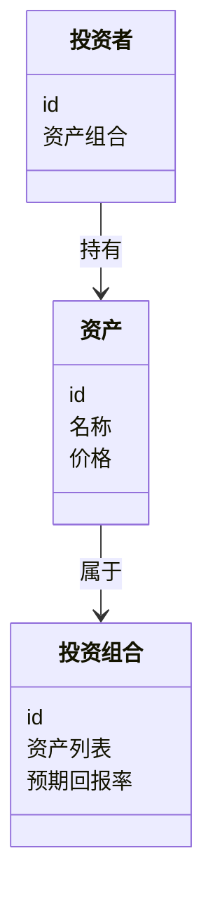
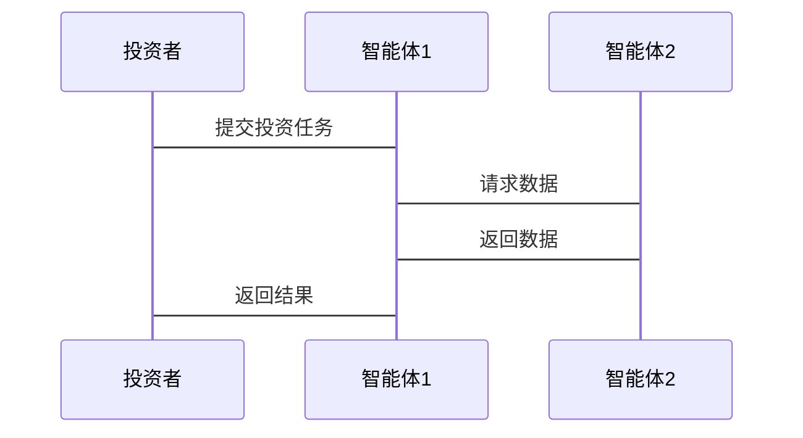

                 


# 智能体协作增强价值投资组合管理效率

> 关键词：智能体协作，价值投资，投资组合管理，分布式计算，多智能体系统，共识机制

> 摘要：智能体协作在价值投资组合管理中起到了关键作用，通过多智能体协作优化投资组合，提升效率和收益。本文详细分析了智能体协作的核心概念、算法原理、系统架构设计，并通过实战案例展示了如何应用智能体协作提升投资组合管理效率，最后给出了最佳实践建议。

---

## 第1章: 智能体协作与价值投资概述

### 1.1 智能体协作的基本概念

#### 1.1.1 智能体的定义与特征
智能体（Agent）是指具有感知环境、自主决策和执行任务能力的实体。其特征包括自主性、反应性、目标导向和社会能力。

#### 1.1.2 智能体协作的定义
智能体协作是指多个智能体为了共同目标而相互协作的过程，涉及任务分配、信息共享和协同决策。

#### 1.1.3 智能体协作的核心要素
- **目标一致性**：所有智能体共享相同的目标。
- **通信机制**：智能体之间通过某种方式共享信息。
- **协作规则**：明确的任务分配和决策规则。
- **协调机制**：确保协作过程中的同步与一致。

### 1.2 价值投资的基本原理

#### 1.2.1 价值投资的定义
价值投资是一种投资策略，通过分析资产的内在价值，寻找被市场低估的投资机会。

#### 1.2.2 价值投资的核心理念
- **长期视角**：关注企业的长期价值。
- **安全边际**：购买价格低于内在价值。
- **基本面分析**：基于财务数据和行业趋势做出决策。

#### 1.2.3 价值投资与传统投资的区别
- **传统投资**：基于短期市场波动进行交易。
- **价值投资**：基于长期基本面分析进行投资。

### 1.3 智能体协作在价值投资中的应用

#### 1.3.1 智能体协作如何提升投资效率
通过智能体协作，投资者可以更快速地分析大量数据，优化决策过程。

#### 1.3.2 智能体协作在投资组合管理中的作用
智能体协作可以帮助投资者更好地分散风险，优化资产配置。

#### 1.3.3 智能体协作的潜在优势与挑战
优势包括高效性、准确性和一致性，挑战则包括通信延迟和信息不对称。

---

## 第2章: 智能体协作的核心概念

### 2.1 智能体协作的机制

#### 2.1.1 协作目标的设定
明确智能体协作的具体目标，例如最大化投资收益。

#### 2.1.2 协作规则的制定
制定智能体之间的协作规则，例如信息共享和决策权限。

#### 2.1.3 协作过程的监控与调整
监控协作过程，及时调整协作策略以应对变化。

### 2.2 智能体协作的通信协议

#### 2.2.1 通信协议的基本概念
通信协议定义了智能体之间的信息交换规则。

#### 2.2.2 常见的通信协议类型
- **HTTP**：基于请求-响应的通信。
- **WebSocket**：实时双向通信。
- **RabbitMQ**：消息队列通信。

#### 2.2.3 通信协议在智能体协作中的应用
智能体通过通信协议共享市场数据和分析结果。

### 2.3 智能体协作的任务分配策略

#### 2.3.1 任务分配的基本原则
任务应根据智能体的能力和当前负载进行分配。

#### 2.3.2 常见的任务分配算法
- **轮询分配**：按顺序分配任务。
- **负载均衡**：根据负载情况动态分配。
- **基于优先级的分配**：优先处理高优先级任务。

#### 2.3.3 任务分配策略的优缺点对比

| 策略       | 优点                     | 缺点                     |
|------------|--------------------------|--------------------------|
| 轮询分配   | 简单，公平               | 可能导致负载不均衡       |
| 负载均衡   | 高效，负载均匀           | 实现复杂                 |
| 优先级分配 | 确保重要任务优先处理     | 可能忽略低优先级任务     |

---

## 第3章: 价值投资组合管理的数学模型

### 3.1 价值投资的基本数学模型

#### 3.1.1 资产定价模型（CAPM）

$$CAPM公式：R_i = R_f + β_i (R_m - R_f)$$

其中，$R_i$ 是资产的预期回报率，$R_f$ 是无风险利率，$β_i$ 是资产的贝塔系数，$R_m$ 是市场预期回报率。

#### 3.1.2 资本资产定价模型（APT）

$$APT公式：E(R_i) = α_i + β_i E(R_m - R_f)$$

其中，$E(R_i)$ 是资产的预期回报率，$α_i$ 是资产的特异风险溢价，$β_i$ 是资产的贝塔系数，$E(R_m - R_f)$ 是市场风险溢价。

#### 3.1.3 投资组合优化的数学公式

$$\text{目标函数：} \min \sigma^2 \quad \text{在满足约束条件下}$$

约束条件包括投资权重之和为1，以及预期回报率的要求。

### 3.2 投资组合优化的数学模型

#### 3.2.1 马科维茨有效组合模型

$$\text{目标函数：} \min \sigma^2 \quad \text{在满足} \sum w_i = 1 \text{和} \sum w_i r_i = \mu \text{的条件下}$$

其中，$w_i$ 是资产$i$的投资权重，$r_i$ 是资产$i$的预期回报率，$\mu$ 是预期回报率。

#### 3.2.2 投资组合优化的约束条件

- $\sum w_i = 1$：投资权重之和为1。
- $\sum w_i r_i = \mu$：预期回报率为$\mu$。

#### 3.2.3 数学模型的实现与应用

通过拉格朗日乘数法求解优化问题，得到最优投资组合。

---

## 第4章: 智能体协作的算法原理

### 4.1 分布式计算与智能体协作

#### 4.1.1 分布式计算的基本概念
分布式计算是指多个计算节点协作完成任务的过程。

#### 4.1.2 分布式计算在智能体协作中的应用
智能体协作可以看作是一种分布式计算形式，多个智能体协同完成复杂任务。

#### 4.1.3 分布式计算与智能体协作的区别
智能体协作更强调智能性和自主性，而分布式计算更强调资源分配和任务调度。

### 4.2 智能体协作的共识机制

#### 4.2.1 共识机制的基本概念
共识机制是指智能体之间达成一致意见的过程。

#### 4.2.2 常见的共识机制
- **拜占庭容错（Byzantine Fault Tolerance）**：确保系统在部分节点故障或被攻击的情况下仍能正常运行。
- **工作量证明（PoW）**：通过计算证明完成任务。
- **权益证明（PoS）**：基于持有的权益分配决策权。

#### 4.2.3 共识机制在智能体协作中的应用
智能体通过共识机制达成一致，确保协作过程的正确性。

### 4.3 智能体协作的算法实现

#### 4.3.1 分布式计算算法
使用Paxos或Raft算法实现分布式一致性。

#### 4.3.2 多智能体协作算法
基于多智能体系统（MAS）的协作算法，如基于状态的协作和基于规则的协作。

#### 4.3.3 多智能体协作算法的实现步骤

1. 初始化：智能体初始化状态和目标。
2. 通信：智能体之间通过通信协议共享信息。
3. 协作：根据协作规则分配任务并执行。
4. 监控：监控协作过程并调整策略。

---

## 第5章: 系统架构设计

### 5.1 问题场景介绍

#### 5.1.1 投资组合管理的挑战
- 数据量大。
- 信息更新快。
- 风险分散需求高。

#### 5.1.2 智能体协作的优势
- 提高计算效率。
- 实现复杂任务的协同。
- 降低人为错误。

### 5.2 系统功能设计

#### 5.2.1 领域模型
- 实体：投资者、资产、投资组合。
- 关系：投资者拥有资产，资产属于投资组合。



#### 5.2.2 功能模块
- 数据采集：获取市场数据。
- 数据分析：分析资产价值。
- 投资决策：生成投资策略。
- 监控调整：实时监控并调整投资组合。

### 5.3 系统架构设计


### 5.4 系统接口设计

#### 5.4.1 接口定义
- 数据采集接口：获取市场数据。
- 任务分配接口：分配投资任务。
- 通信接口：智能体之间通信。

#### 5.4.2 接口实现
使用RESTful API实现接口通信，例如：
- `POST /api/assets`：提交资产数据。
- `POST /api/tasks`：提交任务请求。

### 5.5 系统交互流程



---

## 第6章: 项目实战

### 6.1 环境安装

#### 6.1.1 安装Python
安装Python 3.8以上版本。

#### 6.1.2 安装依赖
安装必要的库，例如：
- `pip install numpy`
- `pip install pandas`
- `pip install matplotlib`

#### 6.1.3 安装智能体协作框架
安装如`python-socketio`用于通信。

### 6.2 系统核心实现源代码

#### 6.2.1 数据采集模块

```python
import numpy as np
import pandas as pd

def fetch_data(ticker):
    # 模拟数据获取
    return pd.DataFrame({'price': np.random.rand(100)})
```

#### 6.2.2 数据分析模块

```python
def analyze_asset(data):
    # 计算资产价值
    return data['price'].mean()
```

#### 6.2.3 投资决策模块

```python
def make_decision(asset_values):
    # 模拟决策逻辑
    return '买入' if asset_values > 50 else '卖出'
```

#### 6.2.4 智能体协作模块

```python
import socketio

sio = socketio.Server()

@sio.on('connect')
def connect(sid, environ):
    print(f'连接建立，sid={sid}')

@sio.on('request_data')
def request_data(sid, data):
    # 分配任务
    pass

@sio.on('response_data')
def response_data(sid, data):
    # 处理返回数据
    pass
```

#### 6.2.5 应用与解读
通过上述代码，智能体可以协作完成数据采集、分析和决策。

### 6.3 案例分析

#### 6.3.1 实际案例
假设我们有两个智能体，分别负责数据采集和分析。

#### 6.3.2 详细讲解
智能体1负责从市场获取数据，智能体2负责分析数据并做出投资决策。

### 6.4 项目小结
通过项目实战，我们验证了智能体协作在投资组合管理中的有效性。

---

## 第7章: 最佳实践与总结

### 7.1 小结

#### 7.1.1 核心概念总结
智能体协作通过分布式计算和共识机制提升投资组合管理效率。

#### 7.1.2 算法与系统设计总结
合理设计算法和系统架构是实现智能体协作的关键。

### 7.2 注意事项

#### 7.2.1 智能体协作的挑战
- 通信延迟。
- 信息不对称。
- 系统安全性。

#### 7.2.2 实际应用中的注意事项
- 确保数据安全。
- 定期监控系统性能。
- 及时调整协作策略。

### 7.3 未来趋势

#### 7.3.1 技术发展趋势
- 更智能的协作算法。
- 更高效的通信协议。
- 更强大的分布式计算能力。

#### 7.3.2 价值投资的未来
- 更加依赖数据驱动的决策。
- 更多的应用智能体协作优化投资组合。

### 7.4 拓展阅读

#### 7.4.1 推荐书籍
- 《智能体协作原理》
- 《投资组合管理实战》

#### 7.4.2 推荐博客与资源
- 维基百科：智能体协作
- arXiv：相关论文

---

## 作者：AI天才研究院 & 禅与计算机程序设计艺术

通过本文的详细分析与实践，我们展示了智能体协作在价值投资组合管理中的巨大潜力。希望读者能通过本文的内容，深入了解智能体协作的核心概念、算法原理和实际应用，为未来的投资管理提供新的思路和方法。

--- 

如需进一步了解，请随时关注我们的博客和相关资源。

