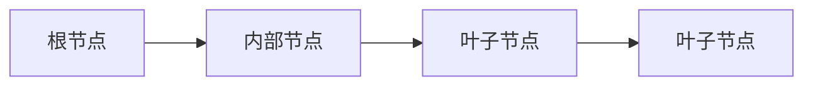
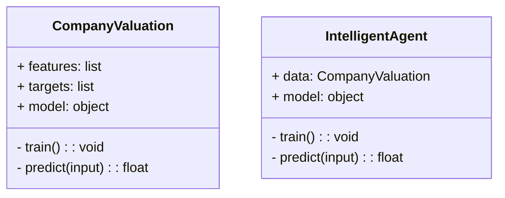
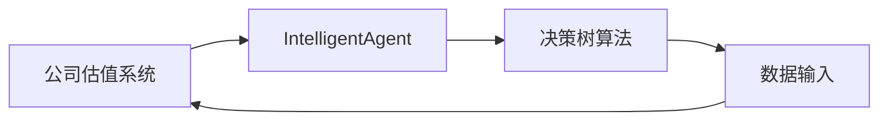
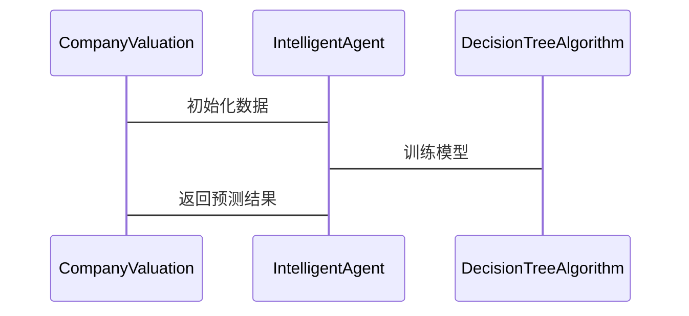

                 


# 智能体协作实现全面的公司估值

> 关键词：智能体协作、公司估值、多智能体系统、分布式计算、博弈论、决策树算法

> 摘要：本文深入探讨了智能体协作在公司估值中的应用，从基本概念、核心原理、算法设计到系统架构，详细阐述了如何通过智能体协作实现对公司价值的全面评估。文章结合实际案例，展示了如何利用分布式计算、博弈论模型和决策树算法等技术手段，构建高效的公司估值系统，为读者提供了理论支持和实践指导。

---

## 第一部分：智能体协作与公司估值基础

### 第1章：智能体协作与公司估值背景

#### 1.1 智能体协作的基本概念

##### 1.1.1 智能体的定义与特征
智能体（Intelligent Agent）是指能够感知环境、自主决策并采取行动的实体。智能体具有以下特征：
- **自主性**：无需外部干预，自主完成任务。
- **反应性**：能够根据环境变化调整行为。
- **目标导向性**：基于目标驱动决策。
- **协作性**：能够与其他智能体协同工作。

##### 1.1.2 智能体协作的背景与意义
智能体协作是多智能体系统（Multi-Agent System, MAS）的核心，通过多个智能体的协同工作，能够实现复杂任务的高效完成。在公司估值领域，智能体协作可以帮助我们从多个维度（财务、市场、技术等）综合评估公司价值，克服传统估值方法的局限性。

##### 1.1.3 智能体协作的核心要素
- **通信机制**：智能体之间的信息传递方式。
- **协调机制**：智能体之间的任务分配与协作。
- **决策机制**：智能体基于信息做出决策的方式。

#### 1.2 公司估值的背景与挑战

##### 1.2.1 公司估值的基本概念
公司估值是指通过对公司财务状况、市场表现、管理团队等因素的分析，确定其市场价值的过程。传统估值方法包括DCF模型、市盈率法等，但存在以下问题：
- 数据单一性：传统方法依赖财务数据，忽视非财务因素。
- 计算复杂性：难以考虑多维度因素的综合影响。
- 人为偏差：主观判断可能影响估值结果。

##### 1.2.2 传统公司估值方法的局限性
- **数据维度不足**：传统方法主要依赖财务数据，难以全面反映公司价值。
- **计算复杂性**：复杂模型需要大量计算资源，且难以实时更新。
- **人为偏差**：主观判断可能导致估值结果偏差。

##### 1.2.3 智能体协作在公司估值中的应用前景
通过智能体协作，可以整合多源数据（如财务数据、市场数据、舆情数据等），构建全面的估值模型。智能体协作能够实时更新数据，提高估值的准确性和及时性。

#### 1.3 智能体协作与公司估值的结合

##### 1.3.1 问题背景与问题描述
公司估值需要考虑多维度因素，传统方法难以全面覆盖。智能体协作通过分布式计算和多维度分析，能够有效解决这一问题。

##### 1.3.2 智能体协作如何解决公司估值问题
- **多维度数据整合**：智能体协作可以整合财务、市场、舆情等多种数据，提供全面的估值依据。
- **实时更新**：智能体协作能够实时更新数据，提高估值的及时性。
- **分布式计算**：通过分布式计算，智能体协作能够高效处理大量数据，提高估值的准确性。

##### 1.3.3 智能体协作在公司估值中的边界与外延
智能体协作在公司估值中的应用边界包括：
- **数据来源**：依赖于数据的完整性和准确性。
- **计算能力**：需要强大的计算能力支持。
- **协作机制**：依赖于智能体之间的有效协作。

---

### 第2章：智能体协作的核心概念与联系

#### 2.1 智能体协作的核心原理

##### 2.1.1 分布式智能与协作机制
分布式智能是指通过多个智能体的协作，实现复杂任务的完成。协作机制包括任务分配、信息共享和决策协调。

##### 2.1.2 智能体之间的通信与协调
智能体之间的通信方式包括直接通信和间接通信。协调机制包括一致性协议和冲突解决。

##### 2.1.3 协作智能体的决策模型
协作智能体的决策模型包括基于博弈论的决策模型和基于分布式计算的决策模型。

#### 2.2 公司估值的核心要素与模型

##### 2.2.1 财务指标与非财务指标
财务指标包括收入、利润、资产等；非财务指标包括市场地位、管理团队等。

##### 2.2.2 公司估值的多维度分析
多维度分析包括财务分析、市场分析、技术分析等。

##### 2.2.3 估值模型的选择与优化
选择合适的估值模型需要考虑数据的可用性、模型的复杂性和计算的效率。

#### 2.3 智能体协作与公司估值的关联性分析

##### 2.3.1 智能体协作的核心概念属性对比
通过对比智能体协作和公司估值的核心概念属性，可以发现它们在数据整合、计算能力和协作机制等方面的共同点。

##### 2.3.2 公司估值的关键要素特征
公司估值的关键要素包括财务数据、市场数据、管理团队等。

##### 2.3.3 智能体协作与公司估值的ER实体关系图

```mermaid
er
    company_valuation <-many-to-many-> intelligent_agents
    intelligent_agents <-one-to-many-> collaboration_models
    collaboration_models <-one-to-one-> valuation_metrics
```

---

## 第3章：智能体协作实现公司估值的算法原理

### 3.1 多智能体协作算法概述

#### 3.1.1 分布式计算与协作机制
分布式计算是通过多个计算节点协同工作，完成任务的计算。协作机制包括任务分配、信息共享和决策协调。

#### 3.1.2 智能体之间的博弈论模型
博弈论模型是通过模拟智能体之间的博弈关系，实现决策优化。

#### 3.1.3 协作智能体的决策树算法
决策树算法是一种基于树状结构的分类方法，适用于智能体的决策过程。

### 3.2 智能体协作的数学模型与公式

#### 3.2.1 协作智能体的决策树算法



#### 3.2.2 智能体协作的博弈论模型

$$ \text{收益} = \sum_{i=1}^{n} v_i $$

其中，$v_i$ 是第 $i$ 个智能体的收益。

### 3.3 智能体协作实现公司估值的核心代码实现

#### 3.3.1 智能体协作的环境安装
需要安装以下工具和库：
- Python 3.x
- NumPy
- Pandas
- Scikit-learn

#### 3.3.2 智能体协作的核心代码实现

```python
import numpy as np
from sklearn.tree import DecisionTreeClassifier

# 定义智能体协作类
class IntelligentAgent:
    def __init__(self, data):
        self.data = data
        self.model = None

    def train(self):
        # 训练决策树模型
        self.model = DecisionTreeClassifier()
        self.model.fit(self.data.features, self.data.targets)

    def predict(self, input):
        # 预测估值
        return self.model.predict(input)

# 定义公司估值数据类
class CompanyValuationData:
    def __init__(self):
        self.features = []
        self.targets = []

# 创建智能体实例
agent = IntelligentAgent(CompanyValuationData())
agent.train()
```

#### 3.3.3 代码解读与分析
上述代码实现了智能体协作的基本功能，包括数据训练和预测。通过决策树算法，智能体能够根据输入数据，预测公司的估值。

---

## 第4章：系统分析与架构设计

### 4.1 系统功能设计

#### 4.1.1 领域模型类图



### 4.2 系统架构设计

#### 4.2.1 系统架构图



### 4.3 系统交互序列图



---

## 第5章：项目实战

### 5.1 环境安装
需要安装以下工具和库：
- Python 3.x
- NumPy
- Pandas
- Scikit-learn

### 5.2 核心代码实现

#### 5.2.1 智能体协作的代码实现

```python
import numpy as np
from sklearn.tree import DecisionTreeClassifier

class CompanyValuationData:
    def __init__(self):
        self.features = []
        self.targets = []

class IntelligentAgent:
    def __init__(self, data):
        self.data = data
        self.model = None

    def train(self):
        self.model = DecisionTreeClassifier()
        self.model.fit(self.data.features, self.data.targets)

    def predict(self, input):
        return self.model.predict(input)

# 创建数据实例
data = CompanyValuationData()
data.features = np.array([[1, 2], [3, 4]])
data.targets = np.array([0, 1])

# 创建智能体实例
agent = IntelligentAgent(data)
agent.train()
print(agent.predict([[2, 3]]))
```

### 5.3 代码解读与分析
上述代码实现了智能体协作的基本功能，包括数据训练和预测。通过决策树算法，智能体能够根据输入数据，预测公司的估值。

### 5.4 实际案例分析
以某科技公司为例，利用智能体协作算法，整合财务数据、市场数据和舆情数据，预测其市场价值。

---

## 第6章：最佳实践

### 6.1 小结
智能体协作通过多维度数据整合和分布式计算，能够实现对公司价值的全面评估。

### 6.2 注意事项
- 数据来源的可靠性
- 算法的可解释性
- 系统的可扩展性

### 6.3 拓展阅读
- 《Multi-Agent Systems》
- 《Game Theory and Decision Making》

---

## 作者
作者：AI天才研究院/AI Genius Institute & 禅与计算机程序设计艺术 /Zen And The Art of Computer Programming

---

感谢您的阅读，希望本文能够为您提供关于智能体协作实现公司估值的深入理解！

