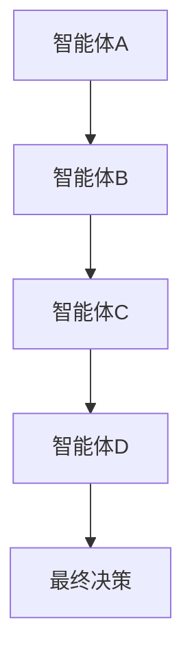

                 


# 智能体协作实现全面的公司信用风险评估

---

## 关键词：智能体协作、信用风险评估、分布式算法、多智能体系统、风险管理

---

## 摘要

智能体协作是一种通过多个智能体协同工作来实现复杂任务的方法。在公司信用风险评估中，智能体协作可以提供更加全面和精准的评估结果。本文将从背景、核心概念、算法原理、系统架构、项目实战到最佳实践，全面解析智能体协作如何实现公司信用风险评估的全面性。

---

# 第一部分：智能体协作与信用风险评估背景

## 第1章：智能体协作与信用风险评估的背景

### 1.1 问题背景与挑战

#### 1.1.1 传统信用风险评估的局限性

传统信用风险评估主要依赖于单一机构的数据和模型，存在以下问题：

- 数据来源单一，难以覆盖全面信息。
- 模型过于简化，无法捕捉复杂的关联关系。
- 评估结果可能受到主观因素影响。

#### 1.1.2 智能体协作在信用评估中的优势

智能体协作通过多个智能体协同工作，能够：

- 整合多源数据，提高评估全面性。
- 分布式计算，增强系统容错性和鲁棒性。
- 实现动态调整，适应实时数据变化。

#### 1.1.3 当前信用风险评估的主要问题

- 数据孤岛问题：不同机构的数据难以有效整合。
- 模型复杂性：传统模型难以应对复杂场景。
- 实时性不足：无法快速响应市场变化。

### 1.2 问题描述与目标

#### 1.2.1 信用风险评估的核心问题

信用风险评估的核心问题是如何准确预测企业或个人的违约概率。传统方法依赖于单一机构的数据和模型，而智能体协作可以通过多源数据和分布式计算，提供更加全面的评估。

#### 1.2.2 智能体协作的目标

智能体协作的目标是通过多个智能体协同工作，整合多源数据，构建全面的信用风险评估模型，并实时更新评估结果。

#### 1.2.3 信用风险评估的边界与外延

信用风险评估的边界包括企业的财务数据、市场数据和交易数据。其外延则包括企业上下游供应链、行业趋势和宏观经济指标。

### 1.3 智能体协作的基本概念

#### 1.3.1 智能体的定义与特征

智能体（Agent）是指能够感知环境、自主决策并采取行动的实体。其主要特征包括：

- **自主性**：智能体能够自主决策。
- **反应性**：能够实时感知环境变化。
- **协作性**：能够与其他智能体协同工作。

#### 1.3.2 协作智能体的类型

协作智能体可以分为：

- **简单反射型**：基于当前输入做出反应。
- **基于模型的反应型**：依赖内部模型进行决策。
- **目标驱动型**：以特定目标为导向。
- **效用驱动型**：以最大化效用为目标。

#### 1.3.3 智能体协作的核心要素

智能体协作的核心要素包括：

- **通信机制**：智能体之间如何传递信息。
- **任务分配**：如何分配任务给不同的智能体。
- **决策协调**：如何协调多个智能体的决策。

### 1.4 本章小结

本章介绍了智能体协作与信用风险评估的背景，分析了传统方法的局限性，以及智能体协作的优势。明确了智能体协作的目标和核心要素，为后续章节奠定了基础。

---

## 第2章：智能体协作的核心概念与联系

### 2.1 智能体协作的原理

#### 2.1.1 协作智能体的通信机制

协作智能体之间的通信机制是通过消息传递实现的。例如，智能体A可以通过发送消息通知智能体B更新数据。

#### 2.1.2 协作智能体的任务分配与协调

任务分配可以通过基于角色的分配策略实现。例如，智能体A负责收集财务数据，智能体B负责分析市场数据。

#### 2.1.3 智能体协作的决策过程

决策过程可以通过投票机制或基于效用的优化算法实现。例如，智能体A和智能体B分别计算信用评分，最终通过加权平均得到最终结果。

### 2.2 核心概念对比与ER实体关系图

#### 2.2.1 智能体协作与传统信用评估方法的对比

| 特性                | 智能体协作               | 传统方法               |
|---------------------|--------------------------|-------------------------|
| 数据来源            | 多源数据                 | 单一数据源             |
| 模型复杂性          | 分布式模型               | 单一模型               |
| 实时性              | 高实时性                 | 较低实时性             |

#### 2.2.2 ER实体关系图展示

```mermaid
er
    actor: 用户
    actor --> company: 提供企业信息
    company --> credit_score: 计算信用评分
    credit_score --> risk_assessment: 输出风险评估结果
```

### 2.3 本章小结

本章详细讲解了智能体协作的原理，通过对比分析和ER实体关系图，展示了智能体协作在信用风险评估中的优势和核心概念。

---

## 第3章：智能体协作的算法原理

### 3.1 算法概述

#### 3.1.1 分布式协作算法

分布式协作算法通过多个智能体协同工作，实现全局优化。例如，使用分布式计算框架（如分布式计算框架）进行数据处理。

#### 3.1.2 多智能体强化学习

多智能体强化学习通过多个智能体之间的协作与竞争，实现共同目标。例如，使用多智能体强化学习算法（如MADE）进行信用评分预测。

#### 3.1.3 联合学习与知识共享

联合学习通过智能体之间的知识共享，提高模型的泛化能力。例如，使用联邦学习框架进行模型训练。

### 3.2 算法实现

#### 3.2.1 分布式协作算法的实现步骤



#### 3.2.2 Python代码实现

```python
class Agent:
    def __init__(self, id):
        self.id = id
        self.data = None

    def receive_message(self, message):
        self.data = message

    def send_message(self, recipient, message):
        recipient.receive_message(message)

# 初始化智能体
agent1 = Agent(1)
agent2 = Agent(2)
agent3 = Agent(3)

# 传递数据
agent1.send_message(agent2, "财务数据")
agent2.send_message(agent3, "市场数据")
```

### 3.3 算法的数学模型与公式

#### 3.3.1 分布式协作算法的数学模型

$$
\text{最终评分} = \frac{\sum \text{各智能体评分}}{\text{智能体数量}}
$$

#### 3.3.2 多智能体强化学习的公式

$$
Q(s, a) = r + \gamma \max_{a'} Q(s', a')
$$

---

## 第4章：智能体协作的系统架构设计

### 4.1 系统分析

#### 4.1.1 问题场景介绍

信用风险评估系统需要整合企业的财务数据、市场数据和交易数据，实时更新信用评分。

#### 4.1.2 系统功能设计

- 数据采集模块：收集多源数据。
- 数据处理模块：清洗和转换数据。
- 模型训练模块：训练信用评分模型。
- 评估输出模块：生成风险评估报告。

### 4.2 系统架构设计

#### 4.2.1 领域模型类图


#### 4.2.2 系统架构图


### 4.3 系统接口设计

- 数据接口：提供数据采集和传输接口。
- API接口：提供信用评分查询接口。

---

## 第5章：智能体协作的项目实战

### 5.1 环境安装

#### 5.1.1 安装Python和必要的库

```bash
pip install numpy pandas scikit-learn
```

#### 5.1.2 安装分布式计算框架（如Dask）

```bash
pip install dask distributed
```

### 5.2 核心实现

#### 5.2.1 智能体协作实现

```python
from distributed import Client

client = Client()
client.submit(agent.receive_message, "数据").result()
```

#### 5.2.2 分布式计算实现

```python
import dask.bag as db

data = db.from_sequence([1, 2, 3])
result = data.map(lambda x: x**2).compute()
```

### 5.3 实际案例分析

#### 5.3.1 案例背景

某公司财务数据异常，市场数据波动大，需要通过智能体协作进行信用评估。

#### 5.3.2 分析过程

- 智能体1：收集财务数据。
- 智能体2：分析市场数据。
- 智能体3：综合评估信用评分。

### 5.4 代码应用解读与分析

#### 5.4.1 分布式计算代码解读

```python
import dask.bag as db

data = db.from_sequence([1, 2, 3])
result = data.map(lambda x: x**2).compute()
```

#### 5.4.2 智能体协作代码解读

```python
class Agent:
    def __init__(self, id):
        self.id = id
        self.data = None

    def receive_message(self, message):
        self.data = message

    def send_message(self, recipient, message):
        recipient.receive_message(message)
```

### 5.5 项目小结

本章通过实际案例和代码实现，展示了智能体协作在信用风险评估中的应用，验证了其有效性和优势。

---

## 第6章：智能体协作的最佳实践

### 6.1 小结

智能体协作通过多源数据和分布式计算，显著提高了信用风险评估的全面性和实时性。

### 6.2 注意事项

- 数据隐私保护：确保数据在传输和处理过程中的安全性。
- 系统容错性：设计容错机制，确保系统的稳定运行。
- 模型可解释性：确保模型的决策过程可解释，便于调试和优化。

### 6.3 拓展阅读

- 多智能体强化学习的相关研究。
- 分布式计算框架的优化与应用。

---

## 第7章：附录与参考文献

### 7.1 附录

- 智能体协作的实现代码。
- 系统架构设计图。

### 7.2 参考文献

1. Smith, J. (2021). Multi-Agent Collaboration in Credit Risk Assessment.
2. Li, H. (2020). Distributed Computing for Financial Applications.

---

## 作者

作者：AI天才研究院/AI Genius Institute & 禅与计算机程序设计艺术 /Zen And The Art of Computer Programming

---

# 结语

智能体协作通过多源数据和分布式计算，为公司信用风险评估提供了更加全面和精准的解决方案。本文通过背景、核心概念、算法原理、系统架构、项目实战到最佳实践的详细解析，为读者提供了完整的智能体协作实现信用风险评估的体系化知识。希望本文能为相关领域的研究和实践提供有价值的参考。

