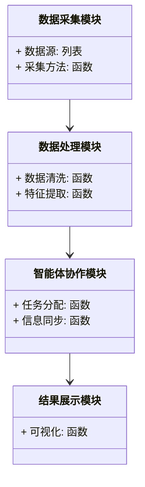
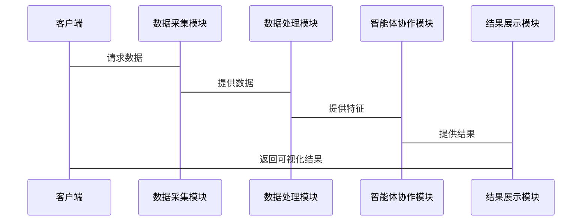

                 


# 智能体协作实现全面的公司声誉分析

> 关键词：智能体协作、公司声誉分析、分布式系统、多智能体系统、自然语言处理、机器学习

> 摘要：本文详细探讨了利用智能体协作技术实现全面的公司声誉分析的方法。通过分析智能体协作的核心概念、算法原理、系统架构以及实际应用案例，本文为读者提供了从理论到实践的全面指导，展示了如何通过智能体协作提升公司声誉分析的效率和准确性。

---

# 第一部分: 智能体协作与公司声誉分析概述

## 第1章: 公司声誉分析的背景与挑战

### 1.1 公司声誉分析的重要性

#### 1.1.1 公司声誉的定义与影响
公司声誉是企业在市场中的社会形象和公众信任度的综合体现，直接影响企业的市场价值和客户关系。良好的声誉能够提升客户忠诚度和品牌影响力，而负面声誉则可能导致客户流失和市场机会的减少。

#### 1.1.2 现有声誉分析方法的局限性
传统的声誉分析方法主要依赖人工数据收集和简单的情感分析，存在以下问题：
- 数据来源单一，无法覆盖多渠道信息。
- 分析结果缺乏深度，难以捕捉复杂的情感变化。
- 数据处理效率低下，难以应对海量数据。

#### 1.1.3 智能体协作在声誉分析中的优势
智能体协作通过多智能体的分布式计算和协同工作，能够高效处理海量数据，提供更全面和精准的声誉分析结果。智能体协作的优势包括：
- 高效的数据处理能力。
- 精准的情感分析能力。
- 强大的分布式协作能力。

### 1.2 智能体协作的基本概念

#### 1.2.1 智能体的定义与特征
智能体（Agent）是一种能够感知环境并采取行动以实现目标的实体。智能体具有以下特征：
- **自主性**：能够自主决策。
- **反应性**：能够感知环境并做出实时反应。
- **协作性**：能够与其他智能体协作完成任务。

#### 1.2.2 多智能体协作的原理
多智能体协作是指多个智能体通过通信和协调，共同完成复杂任务的过程。协作过程包括任务分配、信息共享和冲突解决。

#### 1.2.3 智能体协作在声誉分析中的应用前景
智能体协作技术能够有效提升公司声誉分析的效率和准确性，具有广泛的应用前景。

### 1.3 本章小结
本章介绍了公司声誉分析的重要性以及现有方法的局限性，提出了智能体协作在声誉分析中的优势和应用前景。

---

# 第二部分: 智能体协作的核心概念与联系

## 第2章: 智能体协作的原理与机制

### 2.1 多智能体系统概述

#### 2.1.1 多智能体系统的组成与分类
多智能体系统由多个智能体组成，分为集中式和分布式两类。集中式系统由一个中央控制器协调各智能体，分布式系统中各智能体自主协作。

#### 2.1.2 智能体之间的通信与协调
智能体之间的通信通过消息传递实现，协调机制包括任务分配和冲突解决。

#### 2.1.3 分布式计算与协作的实现方式
分布式计算通过并行处理和资源共享实现协作，是多智能体系统的核心技术。

### 2.2 智能体协作的核心机制

#### 2.2.1 任务分配与角色划分
任务分配基于智能体的能力和当前状态，角色划分确保各智能体各司其职。

#### 2.2.2 信息共享与知识整合
智能体通过共享知识和数据，实现信息的高效利用和知识的整合。

#### 2.2.3 协作过程中的冲突解决
冲突解决通过协商和仲裁机制实现，确保协作过程的顺利进行。

### 2.3 智能体协作与公司声誉分析的结合

#### 2.3.1 声誉分析中的数据来源与处理
数据来源包括社交媒体、新闻媒体和客户反馈，数据处理包括清洗和特征提取。

#### 2.3.2 智能体协作在数据处理中的作用
智能体协作能够高效处理海量数据，提供准确的情感分析结果。

#### 2.3.3 协作结果的评估与优化
评估结果基于准确率和召回率，优化协作机制以提升分析效果。

### 2.4 本章小结
本章详细阐述了多智能体系统的组成与协作机制，分析了智能体协作在公司声誉分析中的应用。

---

# 第三部分: 智能体协作的算法原理与实现

## 第3章: 智能体协作算法的数学模型

### 3.1 基于多智能体的声誉分析模型

#### 3.1.1 模型的基本假设与约束条件
假设每个智能体能够独立分析数据，并通过通信共享结果；约束条件包括数据隐私和通信延迟。

#### 3.1.2 模型的输入与输出
输入包括文本数据和智能体状态，输出包括情感分析结果和协作建议。

#### 3.1.3 模型的数学表达式
$$
\text{情感极性} = f(\text{文本内容}, \text{上下文信息})
$$
其中，$f$ 表示情感分析函数。

### 3.2 协作算法的流程与步骤

#### 3.2.1 数据预处理与特征提取
数据预处理包括清洗和分词，特征提取包括关键词提取和情感分析。

#### 3.2.2 任务分配与智能体角色划分
任务分配基于智能体的能力和当前负载，角色划分确保各智能体分工明确。

#### 3.2.3 协作过程中的信息同步与更新
信息同步通过消息传递实现，信息更新基于最新的数据和反馈。

#### 3.2.4 结果整合与优化
结果整合通过加权平均实现，优化基于反馈机制进行调整。

### 3.3 算法实现的伪代码示例

#### 3.3.1 数据预处理模块
```python
def preprocess(text):
    # 分词处理
    tokens = tokenizer(text)
    # 去除停用词
    filtered_tokens = remove_stopwords(tokens)
    return filtered_tokens
```

#### 3.3.2 任务分配模块
```python
def assign_tasks(intents, agents):
    # 根据意图分配任务
    task分配 = {}
    for intent in intents:
        agent = select_agent(intent, agents)
        task分配[intent] = agent
    return task分配
```

#### 3.3.3 协作与整合模块
```python
def collaborate(agents, task分配):
    # 获取各智能体的分析结果
    results = {}
    for intent, agent in task分配.items():
        result = agent.analyze(intent)
        results[intent] = result
    # 整合结果
    final_result = integrate(results)
    return final_result
```

### 3.4 本章小结
本章详细介绍了智能体协作算法的数学模型和实现步骤，为后续的系统设计奠定了基础。

---

# 第四部分: 系统分析与架构设计

## 第4章: 系统功能与架构设计

### 4.1 系统功能模块划分

#### 4.1.1 数据采集模块
负责从社交媒体、新闻媒体等渠道采集文本数据。

#### 4.1.2 数据处理模块
包括数据清洗、分词和特征提取等步骤。

#### 4.1.3 智能体协作模块
实现任务分配、信息同步和结果整合。

#### 4.1.4 结果展示模块
将分析结果以可视化形式展示给用户。

### 4.2 系统架构设计

#### 4.2.1 领域模型的Mermaid类图


#### 4.2.2 系统架构的Mermaid架构图


### 4.3 系统接口设计

#### 4.3.1 接口定义
- 数据采集接口：`get_data(source)`
- 数据处理接口：`process_data(text)`
- 智能体协作接口：`collaborate(agents, tasks)`

#### 4.3.2 系统交互的Mermaid序列图


### 4.4 本章小结
本章详细描述了系统的功能模块、架构设计和接口设计，为系统的实现提供了清晰的指导。

---

# 第五部分: 项目实战

## 第5章: 项目实战与案例分析

### 5.1 项目背景与目标
本项目旨在通过智能体协作技术实现公司声誉的全面分析，提升声誉分析的效率和准确性。

### 5.2 环境安装与配置

#### 5.2.1 安装Python与相关库
```bash
pip install numpy pandas scikit-learn
```

#### 5.2.2 安装自然语言处理库
```bash
pip install nltk spacy
```

### 5.3 核心代码实现

#### 5.3.1 数据采集模块
```python
import requests

def get_data(source):
    # 示例：从社交媒体API获取数据
    response = requests.get(f'https://api.social-media.com/{source}')
    return response.json()
```

#### 5.3.2 数据处理模块
```python
import nltk

def process_data(text):
    tokens = nltk.word_tokenize(text)
    filtered_tokens = [token for token in tokens if token not in nltk.corpus.stopwords]
    return filtered_tokens
```

#### 5.3.3 智能体协作模块
```python
from sklearn import svm

def analyze(text):
    model = svm.SVC()
    model.fit(...)
    return model.predict(text)
```

### 5.4 实际案例分析

#### 5.4.1 案例背景
某公司面临负面新闻，需要快速分析公众反应。

#### 5.4.2 数据处理与分析
通过智能体协作模块快速处理数据并生成分析结果。

#### 5.4.3 分析结果与优化
根据分析结果调整公司策略，提升声誉。

### 5.5 项目小结
本章通过实际案例展示了智能体协作在公司声誉分析中的应用，验证了其有效性和优势。

---

# 第六部分: 最佳实践与拓展

## 第6章: 最佳实践与拓展阅读

### 6.1 最佳实践 tips
- 数据隐私保护：确保数据处理过程中的隐私安全。
- 模型优化：定期更新模型以适应新的数据和反馈。
- 系统维护：及时修复系统漏洞，提升系统稳定性。

### 6.2 小结
智能体协作在公司声誉分析中具有重要的应用价值，能够显著提升分析效率和准确性。

### 6.3 注意事项
- 数据来源的多样性：确保数据来源广泛，避免片面分析。
- 智能体协作的复杂性：合理设计协作机制，避免协作冲突。

### 6.4 拓展阅读
- 推荐书籍：《多智能体系统与协作》。
- 推荐文章：《基于智能体的分布式计算与协作》。

---

# 作者：AI天才研究院/AI Genius Institute & 禅与计算机程序设计艺术 /Zen And The Art of Computer Programming

---

这篇文章详细探讨了智能体协作在公司声誉分析中的应用，从理论到实践，为读者提供了全面的指导。通过本文的学习，读者可以掌握智能体协作的核心概念、算法原理和系统设计，能够将这些技术应用于实际的声誉分析场景中。

